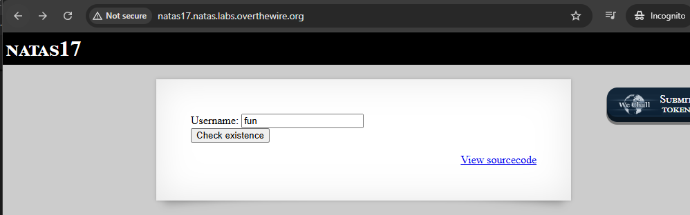
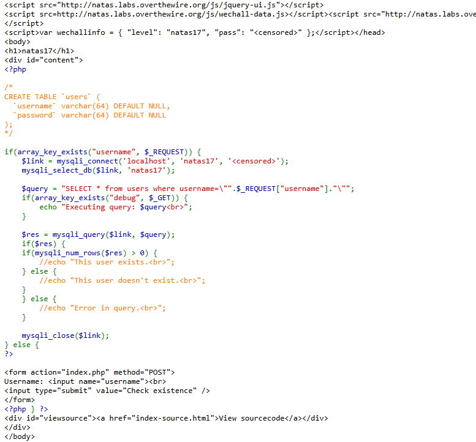

# Natas 16 - START HERE;

| natas16  | hPkjKYviLQctEW33QmuXL6eDVfMW4sGo |
 
tämä harjoitus muistuu level 9 ja 10:ltä, mutta muutama välissä on ollut muuta että joutuu palaa taakse päin. Kuitenkin tässä level 16:ssa jos syöttää jotakin se käy ihan kuin koko sanakirjan lävitse mitä se on nimennyt `dictionary.txt` sanat lävitse.

Aikaisemmassa noissa oli , että jotenkin estää erikoismerkin ja välissä syötettään linux terminaali sanoja mm. pwd, ls ja jne, mutta nyt ei.

estettyjä erikoismerkkejö on nämä ainakin mukaan lukien tässä php koodissa: ` if(preg_match('/[;|&`\'"]/',$key)) {} `` , ja voi olla tässä jouduttaan selvittää se hakemiston tiedoston polku eli `/etc/natas_webpass/natas17` ja tämä pätee yhdistelyn tai suorittamisen.


Haavoittuvuuden osalta on tämä osuus: `grep -i "$key" dictionary.txt` - tämä tarkoittaa, että käyttäjän syöte menee komentoriville sellaisenaan. Vaikka monet vaaralliset merkit on estetty, aina voi etsiä keinoja ohittaa suodatus ja vaikka ei sisällä estettyjä erityismerkkiä, mutta joka silti manipuloi komentoa.

kokeilin "bsana" niin siellä `dictionary.txt` - alta ei löydy sellaista ainakaan, mutta voisi kirjoittaa mikä ei täsmenny sen listan mukaan. 


kokeillaan tätä `$(grep b /pwd)Sana`- ainakin toisti alemmat jutut

sanatoria
sanatorium
sanatorium's
sanatoriums


## Level 16 - 1 harjoituksen ideana

Tässä harjoituksen ideana on syöttää joku sana täsmentyy sen sanakirjan tekstitiedostoon `dictionary.txt` ja tämä PHP-koodipätkä on se tausta ikään kuin se käyttäjän syöte `passthru("grep -i \"$key\" dictionary.txt");`

Se mitä käyttäjä syöttää lomakkeeseen `needle` - kenttään niin siihen tulee se ns. "_käyttäjänsyöte_"


Miten tämä **$(....)** toimii tässä?

Esim. syötettäisiin sinne selaimen formaatti kenttään kuin: `$(echo african)` - niin shell suorittaa ensin `echo african`, ja korvaa koko `$(...)` sen palauttamalla arvolla mutta kuitenkin tämä toimii kuin injektio, mutta kuitenkin komentiinjektio on mahdollinen.

**Grep-komento**
Siinä PHP-koodissa on mainittu greppi osuus: `passthru("grep -i \"$key\" dictionary.txt");`.
periaatteessa tämän komento: `grep -i "$(echo african)" dictionary.txt` - voisi toimia ja toisaalta joka toimii kuin shell-komento, mikäli jos injektio toimii.

vähä kuin muuttuu muotoon: `grep -i "african" dictionary.txt`  - ja toisaalta tämä toimii normaalisti, jos $(...) ei ole estetty.

Ymmärtävämpi teoria:
Eli käyttäen tämän `$(...)` + sisään lisättynä `grep` termistö, joka toimii brute-force-hyökkäyksenä tyylisenä muotona ja muotoiltua/kierretty toista tapaa.


`$(...)` on komentorivin ominaisuus, joka suorittaa sisällä olevan komennon ja korvaa sen tulosteella, ja piste piste sisään mitä käyttäjä syöttää se on sitten toimii kuin **komentoinjektio** joka on just se haavoittuvuus prosessi.

Vaikka lopullinen komento menee vain grep:iin ja dictionary.txt sisällä olevia komento suoritettaan joka tapauksessa.


## Level 16 - 2 ACTION START HERE

Aloitettaan jotenkin tehdä sitä toimintaa, että seurattuna ja katsottu erilaisia ohjeita ja tapoja, sekä on mahdollista kokeilla ja runnata Kali Linux erikseen.

Paljon ohjeissa löytyy, että käyttää Python koodi pätkää, että sillä runnaa ja samahan pätee siinä pitää olla funktio, josta sallii tämä natas16 level:in ja sen kirjauttumisen salasanan.

```
┌──(kali㉿kali)-[~/Desktop]
└─$ python3 pythonkoodi.py 
E
Eq
Eqj
EqjH
EqjHJ
EqjHJb
EqjHJbo
EqjHJbo7
EqjHJbo7L
EqjHJbo7LF
EqjHJbo7LFN
EqjHJbo7LFNb
EqjHJbo7LFNb8
EqjHJbo7LFNb8v
EqjHJbo7LFNb8vw
EqjHJbo7LFNb8vwh
EqjHJbo7LFNb8vwhH
EqjHJbo7LFNb8vwhHb
EqjHJbo7LFNb8vwhHb9
EqjHJbo7LFNb8vwhHb9s
EqjHJbo7LFNb8vwhHb9s7
EqjHJbo7LFNb8vwhHb9s75
EqjHJbo7LFNb8vwhHb9s75h
EqjHJbo7LFNb8vwhHb9s75ho                                                                                            
EqjHJbo7LFNb8vwhHb9s75hok                                                                                           
EqjHJbo7LFNb8vwhHb9s75hokh                                                                                          
EqjHJbo7LFNb8vwhHb9s75hokh5                                                                                         
EqjHJbo7LFNb8vwhHb9s75hokh5T                                                                                        
EqjHJbo7LFNb8vwhHb9s75hokh5TF                                                                                       
EqjHJbo7LFNb8vwhHb9s75hokh5TF0
EqjHJbo7LFNb8vwhHb9s75hokh5TF0O
EqjHJbo7LFNb8vwhHb9s75hokh5TF0OC
EqjHJbo7LFNb8vwhHb9s75hokh5TF0OC
```

Tämä (ylempi) on se natas 17 salasanansa


# Level 16 - 2.5 miniyhteenveto

**Python**:
Miksi vastauksena mentiin Python koodilla, koska voi olla sen käyttö on hyödyllistä ja silloin kun suorassa komennossa injektiossa on vaikeuksia sen suodattimien takia. Python voi toistaa syötteitä ja analysoida tuloksia automaattisesti, mikä tekee brute force -hyökkäyksestä tehokkaamman.

Tämä ikään kuin varmistaisi, että syötteet on muotoiltu oikein ja käyttää PHP-scriptiä hyödyntämällä oikeita merkkejä kuten just `$()`. Tämä python koodi ratkaisu on yksi joka voi toteuttaa hyökkäystä tehokkaamin. 

Tämän level johtuen on siitä haasteessa käytettävä ympäristö suodattaa tai estää tietyt komennon, että siksi saatoi joutua käyttämäään Python ohjelmointikielen scriptiä ja täät olisi voinut suorittaa hyökkäystä normaalisti selaimen ja/tai terminaalin kautta, tai muita Kali Linux hyökkäys työkaluja.

Python voi mahdollista HTTP-pyyntöä ohjelmallisen lähettämistä ja vastausen käsittelyn automaattisesti, kun halutiin toteuttaa **brute-force hyökkäyst**, jossa tapahtui erilaisia merkkejä tai sanoja jatkuvasti ja automaattisesti. Jos palvelimella on suodattimia, niin voivat estää Python suoritettavaa komennon samalla tavalla kuin suora komentoinjektioiden yrittämisen terminaalissa.


**Mites Kali linux terminaali ja selaimen kautta**?

Molemmissa kuitenkin on rajoiteitta että haasteena on mahdolliset suodattimet, jotka estävät monimutkaisempia komentoja ja sama pätee erikoismerkkejä, ja websovellus ei suodattaa syötteitä ennen niiden lähettämistä palvelimelle. Selain kuitenkin on etu siinä, että käyttäjä voi nopeasti kokeilla erilaisia syötteitä ja nähdä palautteen. Terminaalissa kuitenkin voi suorittaa injektiota, mutta jos suodatus on liian tiukka, niin komennot voivat estyä.


## Level 16 - 3 Natas ohjeita ja linkkejä:

https://www.abatchy.com/2016/11/natas-level-16

http://github.com/psmiraglia/ctf/blob/master/overthewire/natas/natas16.md

https://samxia99.medium.com/overthewire-updated-natas-walkthrough-level-16-d3cb5b3f6c2e

https://mcpa.github.io/natas/wargame/web/overthewire/2015/10/01/natas16/

https://learnhacking.io/overthewire-natas-level-16-walkthrough/

---

# Level 17 - START HERE

natas17 : EqjHJbo7LFNb8vwhHb9s75hokh5TF0OC

Etusivulla ainakin syötin jotakin satunnaista sanaa, mutta tuloksena antoi tyhjän sivuston eli "index.php" - Kun tarkastellaan sitä "index-source.tml" välilehden sivustoa ainakin näyttää siellä on vinkkinä annettu on luotu tietokanta taulukkona `users`.




Koodi pätkä muistuu kuitenkin aikaisempaa level 14 ja 15 SQL injektiota, mutta tämä on haasteellisempi ja se hakee sen kysellynsä




Tässä PHP-koodipätkässä, kertoo jos käyttäjä syöte ehto jos on olemassa, toisena käyttäjä ei ole olemassa ja viimeisenä tuntematon/virhe kysely ja huomioina ne on kommentoitu eli // kentät.

```
    if(mysqli_num_rows($res) > 0) {
        //echo "This user exists.<br>";
    } else {
        //echo "This user doesn't exist.<br>";
    }
    } else {
        //echo "Error in query.<br>";
    }
```

## Natas 17 - 1 - pikainen testaus

Kokeillaan aikaisempien perusteella mitä harjoiteltu mm. SQL injektiota ja jne, että kokeillaan saadaan selville mitään.

Username kenttään lomakkeelle ainakin kokeilin muutamia vaihtoehtoja, mutta niissäkin siirtyy "index.php" tyhjään välilehteen mm. näitä injektiota

- ' OR 1=1
- sdf' OR 1=1
- username=1 OR "1"
- http://natas17.natas.labs.overthewire.org/index.php?debug?username=%22admin%22


