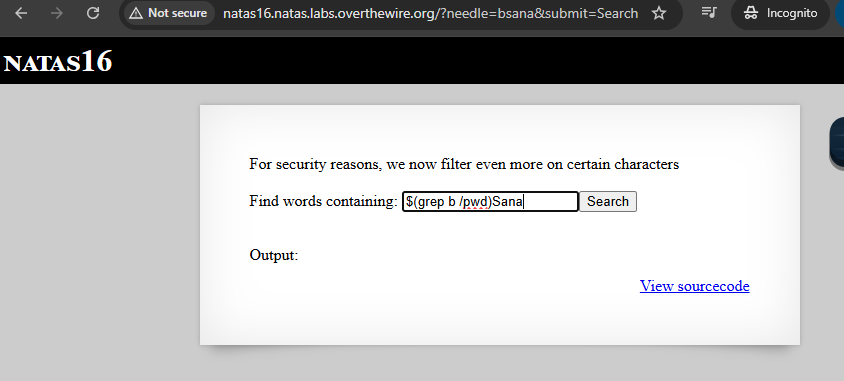

# Natas 16 - START HERE;

| natas16  | hPkjKYviLQctEW33QmuXL6eDVfMW4sGo |
 
tämä harjoitus muistuu level 9 ja 10:ltä, mutta muutama välissä on ollut muuta että joutuu palaa taakse päin. Kuitenkin tässä level 16:ssa jos syöttää jotakin se käy ihan kuin koko sanakirjan lävitse mitä se on nimennyt `dictionary.txt` sanat lävitse.

Aikaisemmassa noissa oli , että jotenkin estää erikoismerkin ja välissä syötettään linux terminaali sanoja mm. pwd, ls ja jne, mutta nyt ei.

estettyjä erikoismerkkejö on nämä ainakin mukaan lukien tässä php koodissa: ` if(preg_match('/[;|&`\'"]/',$key)) {} `` , ja voi olla tässä jouduttaan selvittää se hakemiston tiedoston polku eli `/etc/natas_webpass/natas17` ja tämä pätee yhdistelyn tai suorittamisen.

Haavoittuvuuden osalta on tämä osuus: `grep -i "$key" dictionary.txt` - tämä tarkoittaa, että käyttäjän syöte menee komentoriville sellaisenaan. Vaikka monet vaaralliset merkit on estetty, aina voi etsiä keinoja ohittaa suodatus ja vaikka ei sisällä estettyjä erityismerkkiä, mutta joka silti manipuloi komentoa.

kokeilin "bsana" niin siellä `dictionary.txt` - alta ei löydy sellaista ainakaan, mutta voisi kirjoittaa mikä ei täsmenny sen listan mukaan. 

kokeillaan tätä `$(grep b /pwd)Sana`- ainakin toisti alemmat jutut

sanatoria
sanatorium
sanatorium's
sanatoriums

