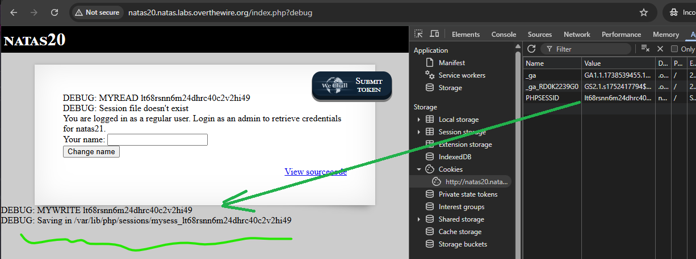

# natas 20 - START HERE;

Username: natas20  
Password: p5mCvP7GS2K6Bmt3gqhM2Fc1A5T8MVyw

Tässä levelissä tapahtuu **rivien injektointi**. Tämä tarkoittaa, jossa sessioiden käsittely on toteutettu omatekoisesti — ja juuri siinä piilee haavoittuvuus. Tämä taso on enemmänkin tekstin käsittelyn haavoittuvuus, ei varsinaista salausta tai bruteforcea.

**View-source.html** phpkoodissa on kirjoitettu oletusistunnon tallennusfunktioita, jossa lukee ja kirjoittaa session tiedoston, että muut funktiosta `myopen`, `myclose`, `mydestroy` ja `mygarbage` - ovat tyhjiä - että niitä ei tarvitse ottaa huomioon, mutta pieni hämäys.

`session_start();` - eli sivuston istunnon käynnisteässä ja odottaa käyttäjän syöttämisen - joka lukee tiedoston `mysess_<PHPSESID>`.

---

Tässä tarkistin ton eväste koodin, että mitä se tarkoittikaan ja ei antanut kauheasti mitään kuin pelkä "h" - kuitenkin hyvä tarkistus steppi aikaisempien harjoittelujen mukaankin.

Tässä lisäsin url perään `?debug` - jonka jälkeen toi uuden sivuston ja tämän kautta (sivun) mukaan saadaa se natas21 salasansa selvitettyä, mutta miten?

