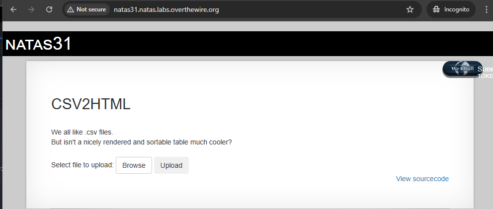
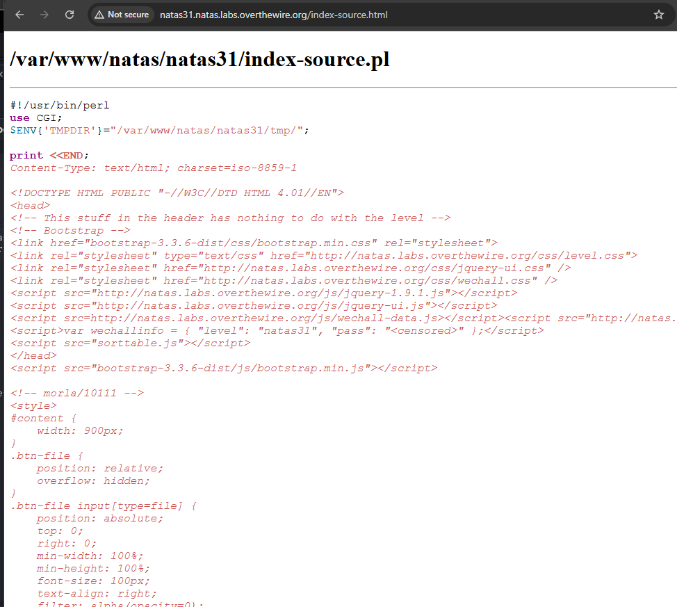
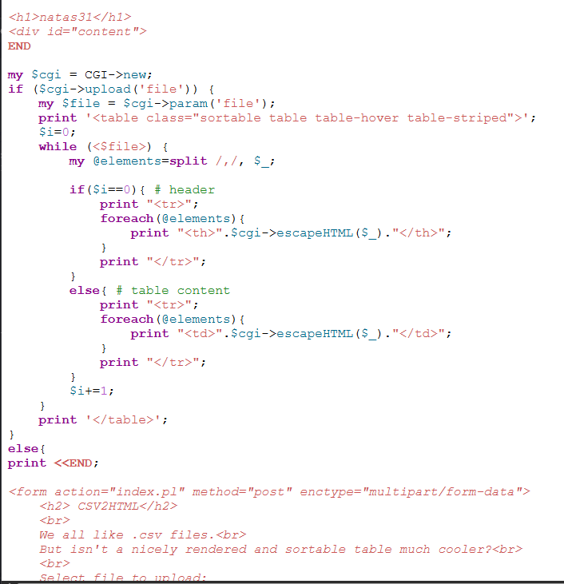
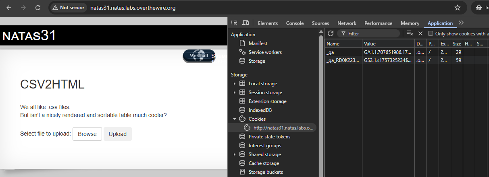
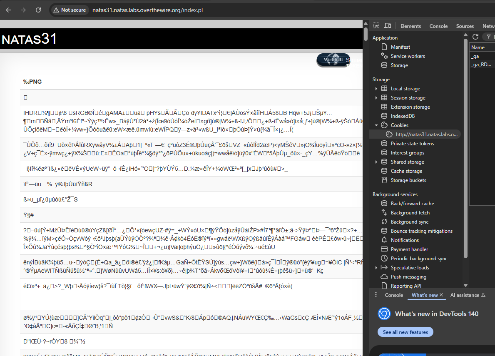
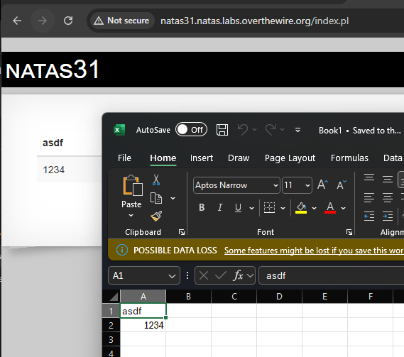

# natas 31 - START HERE;

aikaisemman natas 30 levelin mukaan piti runnata/suorittaa se python koodi (**pythonkoodi30.py**) niin sillä kautta sai sen natas 31 salasanansa.


natas31 ; m7bfjAHpJmSYgQWWeqRE2qVBuMiRNq0y








Evästeen tarkistaminen (alempi kuva)




Tässä ensimmäisenä etusivussa koskien on tiedostojen upottamista, että pari-muutama testauksena se toimii vian Excel (.csv) tiedontyyppisenä ja kuvasta toi pientä error:ia.




Nyt tässä upotin jonkun excel taulukon ja just etusivun mukaan piti/pitää olla .csv tiedostoyyppinen.




## kali linux testausta - START HERE;

```
┌──(kali㉿kali)-[~]
└─$ curl -u natas31:m7bfjAHpJmSYgQWWeqRE2qVBuMiRNq0y "http://natas7.natas.labs.overthewire.org" 
<!DOCTYPE HTML PUBLIC "-//IETF//DTD HTML 2.0//EN">
<html><head>
<title>401 Unauthorized</title>
</head><body>
<h1>Unauthorized</h1>
<p>This server could not verify that you
are authorized to access the document
requested.  Either you supplied the wrong
credentials (e.g., bad password), or your
browser doesn't understand how to supply
the credentials required.</p>
<hr>
<address>Apache/2.4.58 (Ubuntu) Server at natas7.natas.labs.overthewire.org Port 80</address>
</body></html>


┌──(kali㉿kali)-[~]
└─$ curl -H "Referer: http://natas31.natas.labs.overthewire.org/" -u "natas31:m7bfjAHpJmSYgQWWeqRE2qVBuMiRNq0y" http://natas31.natas.labs.overthewire.org/
<!DOCTYPE HTML PUBLIC "-//W3C//DTD HTML 4.01//EN">
<head>
<!-- This stuff in the header has nothing to do with the level -->
<!-- Bootstrap -->
<link href="bootstrap-3.3.6-dist/css/bootstrap.min.css" rel="stylesheet">
<link rel="stylesheet" type="text/css" href="http://natas.labs.overthewire.org/css/level.css">
<link rel="stylesheet" href="http://natas.labs.overthewire.org/css/jquery-ui.css" />
<link rel="stylesheet" href="http://natas.labs.overthewire.org/css/wechall.css" />
<script src="http://natas.labs.overthewire.org/js/jquery-1.9.1.js"></script>
<script src="http://natas.labs.overthewire.org/js/jquery-ui.js"></script>
<script src=http://natas.labs.overthewire.org/js/wechall-data.js></script><script src="http://natas.labs.overthewire.org/js/wechall.js"></script>
<script>var wechallinfo = { "level": "natas31", "pass": "<censored>" };</script>
<script src="sorttable.js"></script>
</head>
<script src="bootstrap-3.3.6-dist/js/bootstrap.min.js"></script>

<!-- morla/10111 -->
<style>
#content {
    width: 900px;
}
.btn-file {
    position: relative;
    overflow: hidden;
}
.btn-file input[type=file] {
    position: absolute;
    top: 0;
    right: 0;
    min-width: 100%;
    min-height: 100%;
    font-size: 100px;
    text-align: right;
    filter: alpha(opacity=0);
    opacity: 0;
    outline: none;
    background: white;
    cursor: inherit;
    display: block;
}

</style>


<h1>natas31</h1>
<div id="content">

<form action="index.pl" method="post" enctype="multipart/form-data">
    <h2> CSV2HTML</h2>
    <br>
    We all like .csv files.<br>
    But isn't a nicely rendered and sortable table much cooler?<br>
    <br>
    Select file to upload:
    <span class="btn btn-default btn-file">
        Browse <input type="file" name="file">
    </span>    
    <input type="submit" value="Upload" name="submit" class="btn">
</form> 
<div id="viewsource"><a href="index-source.html">View sourcecode</a></div>
</div>
</body>
</html>

```


