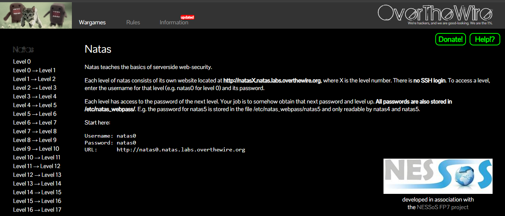

# Basics of serverside web-security

Contents

[Basics of serverside web-security 1](#_Toc182038957)

- [HTTP Header 1](#_Toc182038958)
- [2\. Palvelimen vastaus (Response) 3](#_Toc182038959)
- [3\. Curl ja HTTP Headerit 4](#_Toc182038960)
- [4\. HTTP-pyyntöjen hyödyntäminen penetraatiotestauksessa 4](#_Toc182038961)


Periaatteessa tämän sivuston ideana on toimia kuin web-sivuston hyökkäystä jos esim. sivuston alla löytää **käyttäjänimi:salasanaa**. Tässä käytetään ilman SSH-kirjautumista eli ei päästä kijautumaan sinne palvelimelle ja jne. Ihan normaali sivuston ponnahdus ilmoitus syötä käyttäjänimi ja salasana, niin se hakee palvelimen tietokannasta kyseisen käyttäjännimen ja salasanan.

Tässä on muutama tasoa eli kohti vaikeammaksi mennään n. 34 level asti. Alkuun tapahtuu valmiina nolla level niin siinä on valmiina pohja.

Linkin sivusto: <https://overthewire.org/wargames/natas/>

Menemällä vaan niiden URL seuraavaan välilehteen ja siitä pääse aloittamaan.

Tässä hyvässä harjoituksessa on hyvä harjoitella mm. PowerShell ja Linux komentoa, ja työkaluna on toi ”**cURL**” joka tarjoaa komentorivityökalujen tietojen siirtämistä eri verkkoprotokollaan just mm. http headerit.



## HTTP Header

Tässä käytetään http protokollaa eli sen headeriä. HTTP-pyyntö (esimerkiksi GET-pyyntö) on tapa, jolla selain (tai muu HTTP-asiakas) pyytää tietoja verkkopalvelimelta. Tämä prosessi voi sisältää paljon enemmän kuin vain verkkosivun HTML-koodin hakemisen. Se voi kattaa myös muun muassa kuvat, CSS-tyylit, JavaScript-tiedostot, ja mahdollisesti jopa palvelimella ajettavan koodin, kuten Node.js-sovelluksen, joka voi palvella sisältöä dynaamisesti.

HTTP Header - Käsittely ja Meta-informaation hakeminen

Kun selaimella tai muulla HTTP-asiakkaalla (esim. curl tai Postman) tehdään HTTP-pyyntö verkkosivulle, pyydetään palvelinta lähettämään takaisin sivuston tarvitsema sisältö. HTTP Header on osa tätä pyyntöä, joka sisältää metatietoja pyynnöstä ja vastauksesta.

HTTP-pyyntö (Request): Se, mitä selain tai HTTP-asiakas lähettää palvelimelle.

HTTP-vastaus (Response): Se, mitä palvelin lähettää takaisin.


bash/powershell komento:
```

curl -I <https://example.com>
Esimerkki HTTP-pyynnöstä:
makefile
Copy code
GET / HTTP/1.1
Host: example.com
User-Agent: curl/7.68.0
Accept: \*/\*

```

GET / HTTP/1.1: Tämä on GET-pyyntö, joka pyytää juurisivua (/) palvelimelta.

Host: example.com: Palvelimen nimi, johon pyyntö menee.

User-Agent: curl/7.68.0: Tietoja pyynnön lähettävästä ohjelmasta (tässä tapauksessa curl).

Accept: \*/\*: Tiedottaa palvelimelle, että kaikki tyyppiset vastaukset hyväksytään.

### 2\. Palvelimen vastaus (Response)

Kun palvelin vastaanottaa pyynnön, se lähettää takaisin vastauksen, joka voi sisältää HTTP-Headerit (metatiedot) ja itse sivuston sisällön (HTML, kuvat, tyylit, jne.). Palvelimen vastaus voi näyttää esimerkiksi tältä:

```
yaml
Copy code
HTTP/1.1 200 OK
Date: Thu, 07 Nov 2024 12:00:00 GMT
Server: Apache/2.4.29 (Ubuntu)
Content-Type: text/html; charset=UTF-8
Content-Length: 1234
Connection: keep-alive
```


HTTP/1.1 200 OK: Tämä kertoo, että pyyntö onnistui (statuskoodi 200).

Server: Apache/2.4.29 (Ubuntu): Tämä kertoo, minkälaista web-palvelinta käytetään (tässä Apache).

Content-Type: text/html; charset=UTF-8: Tämä kertoo, että palvellun sisällön tyyppi on HTML.

Content-Length: 1234: Tämä kertoo, kuinka monta tavua sisältö vie.

Tässä vaiheessa palvelin voi palauttaa HTML-sivun, joka voi sisältää linkkejä muihin resursseihin, kuten CSS, JavaScript, kuvia, fontteja jne. Nämä resurssit voivat olla omilla erillisillä tiedostoillaan, ja selaimen täytyy tehdä erillisiä pyyntöjä palvelimelle noutaakseen nämä tiedostot.


### 3\. Curl ja HTTP Headerit

Kun käytät curlia tarkastelemaan HTTP-headerit tai tehdä pyyntöjä, voit myös analysoida vastauksessa olevia tietoja. Esimerkiksi voit käyttää seuraavia curl-komentoja:

HTTP-pyynnön tekeminen ja vain headerin tarkastelu:

bash

Copy code

`curl -I <https://example.com\`

Tämä näyttää vain palvelimen paluupäätökset (metatiedot).

Koko sisällön hakeminen ja headerien tarkastelu samanaikaisesti:

bash

Copy code

`curl -i <https://example.com\`

HTTP POST-pyyntö (jos esimerkiksi testaat, miten palvelin reagoi lomakkeen lähettämiseen):

bash

Copy code

`curl -X POST -d "name=test&email=<test@example.com>" <https://example.com/submit-form\`


### 4\. HTTP-pyyntöjen hyödyntäminen penetraatiotestauksessa

Penetraatiotestauksessa HTTP-pyyntöjä ja niiden header-tietoja voidaan hyödyntää monin tavoin, kuten:

HTTP-Headerin manipulointi (esim. User-Agent-kenttä, Referer-kenttä).

Web-sovellusten haavoittuvuudet kuten SQL-injektio ja XSS (joissa huono syötteen validointi voi aiheuttaa ongelmia).

Tietoturvahaavoittuvuudet palvelimella, kuten HTTP Response Splitting, Cookie-tietoturva ja muita.

Autentikointi ja istunnonhallinta: Hyödyntämällä Authorization headeria, kuten Basic Auth tai Bearer Token.
